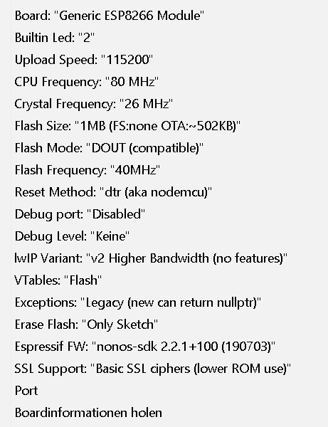

## Download Arduino IDE
Download Arduino IDE from https://www.arduino.cc/en/main/software  

It is recommended to use a *dedicated standalone version* of the IDE allowing easy ESP8266 file manipulation and library management. This can be achieved by downloading the Arduino IDE ZIP file for non admin install.  

## Install Arduino IDE
- Windows: Unzip the installation file to a known folder.
- Mac: Move the .app file into your Applications folder. 

IMPORTANT: For Windows users, before executing *arduino.exe* add an empty folder called *portable* in the known folder.

### Install ESP8266 Board Definitions
- Open Arduino IDE and select ``File`` → ``Preferences`` (``Arduino`` → ``Preferences`` on Mac) and use the following text for field *Additional Boards Manager URLs:* 
``https://github.com/esp8266/Arduino/releases/download/2.6.1/package_esp8266com_index.json`` and select *OK*.
- Open ``Tools`` → ``Boards...`` → ``Boards Manager...`` and scroll down and click on *esp8266 by ESP8266 Community*. Click the *Install* button to download and install the latest ESP8266 board software. Select *Close*.

### Copy Files
- Remove default compile options for floating point ``printf`` and ``scanf`` which are not being used by Tasmota and save 15k code space.
- Replace in Arduino IDE folder ``portable\packages\esp8266\hardware\esp8266\2.6.1`` file *platform.txt* with the Tasmota Source code file ``arduino\version 2.6.1\platform.txt``.

## Download Tasmota
- Download the latest Tasmota release Source code from `https://github.com/arendst/Tasmota` and unzip to another known folder. 
- Copy all files from the Tasmota release Source code folder *lib* into your *sketchbook\libraries* folder.
- About the issue of missing header files and/or libraries while compiling that users had, it is possible that the library folder is in the wrong place. That issue can be happen if you installed your Arduino IDE in a virtual environment. This came up after some tests (6) of an installation in `VM-Ware Workstation 14 Pro - 14.1.1 build-7528167` with not all current updates from VM-Ware. The library folder was placed in **/portable/libraries** and not in **/portable/sketchbook/libraries**. We can't say why that happens but there is the possibilty. So please check it when you get compile errors with missing header files and/or libaries. After updating VM-Ware and a new installation of Arduino IDE 1.8.8 the issue was gone. The installation of Arduino IDE 1.8.8 on windows 7 pro were 100% ok without any issue. Right now the newer version of Arduino IDE is available. Version 1.8.9
- Copy the Tasmota release Source code folder *tasmota* to your *sketchbook*.
- Note: your *sketchbook* location can be found in the Arduino IDE preferences, default on the Mac is ``~/Documents/Arduino``.

## Configure Arduino IDE
Select ``Tools`` and verify the following settings for **All Tasmota devices**.

#### ESP8266 Board version 2.6.1:

</img>

## Compile Tasmota
Open Arduino IDE and select file *tasmota.ino* from your *sketchbook\tasmota* folder.

- Compile Tasmota with ``Sketch`` - ``Verify/Compile``.

## Upload Tasmota to Device
Arduino IDE uses the serial interface to upload the firmware to your device. On Windows these interfaces are named COM1, COM2 etc. On Linux these interfaces are called /dev/ttyUSB0, /dev/ttyUSB1 etc.

In the following commands I use COM5 as an example.

Before using Arduino IDE upload make sure you know to which serial interface name your device is connected to. 

### Put device in Firmware Upload Mode
When performing a firmware upload do **not connect the device to AC** but use the power supply provided by your (FTDI type) serial interface.

- Put the device in firmware upload mode by grounding pin GPIO00 while applying power.

Grounding pin GPIO00 can often be achieved by pressing button 1 on the Sonoff device or using a wire between GPIO00 and Gnd if the button is not available. Deviations may apply.

- Connect the serial interface of your PC to the device while GPIO00 to Gnd.

### Perform Serial Upload
- Make the correct serial interface selection in the Arduino IDE via ``Tools`` - ``Port: "COM5"``.
- Upload the compiled firmware with ``Sketch`` - ``Upload``.

NOTE: For a proper device initialization after first firmware upload power down and power up the device.

