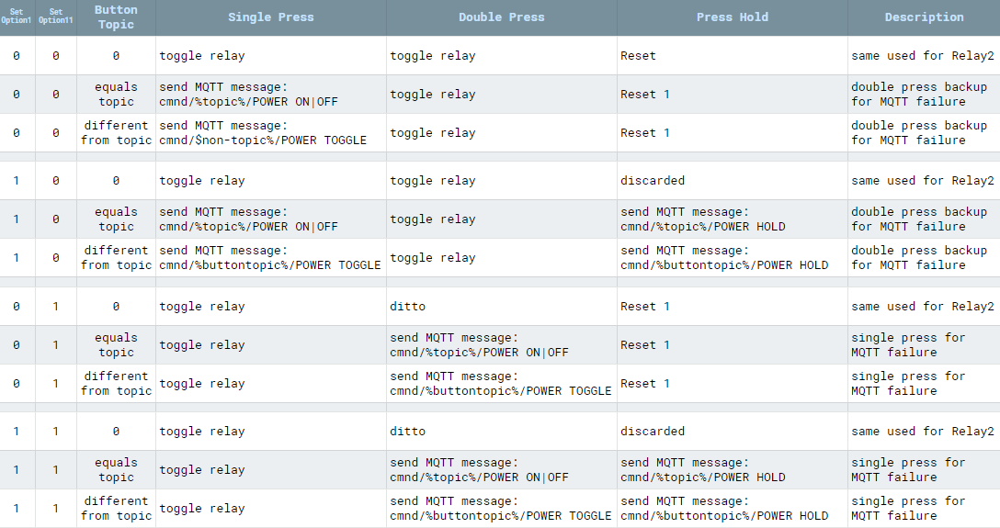

?> Buttons and switches are primarily used to toggle (turn ON or OFF) relays or lights. 

A typical device usually has at least one button (exception being bulbs and some lights) to control the power state(s). Additional buttons and switches can be [wired](Expanding-Tasmota#connect-switch) to a free GPIO and configured in Module or Template settings.

> [!NOTE]
> Other than relays/lights, Tasmota does not publish the state of components (switches, buttons, sensors, etc.) in real-time. State of components is transmitted automatically each [TelePeriod](Commands#teleperiod) via the `SENSORS` message.

# Button vs. Switch
A button (also called a push-button) is a momentary or non-latching switch which causes a temporary change in the state of an electrical circuit only while the switch is pressed. An automatic mechanism (i.e. a spring) returns the switch to its default position immediately afterwards, restoring the initial circuit condition.

A switch (more precisely a latching or toggle switch), when activated by the user, remains in that state until activated again.  

Learn more about buttons and switches in [this video](https://www.youtube.com/watch?v=jNvCQVrEpDQ).

Both have a similar function, but Tasmota distinguishes between a "Button" and a "Switch" in other ways. 

# Switch
 </img>

In Tasmota a `Switch` is any switch or push-button additionally connected to a free GPIO. Some possibilities include:

- [mechanical toggle switch](https://en.wikipedia.org/wiki/Switch#Toggle_switch) - also called a rocker switch
- [capacitive touch switch](https://en.wikipedia.org/wiki/Touch_switch)  
- [reed switch](https://en.wikipedia.org/wiki/Reed_switch) 
- [PIR](https://en.wikipedia.org/wiki/Passive_infrared_sensor) - even though it's technically a  sensor it is [configured as a switch in Tasmota](peripherals/PIR-Motion-Sensors)
- [mechanical push-button](https://en.wikipedia.org/wiki/Push-button) 

By default a switch toggles the corresponding power state (f.e. `Switch1` controls `Power1`). Every time the switch gets flipped the power state changes (ON or OFF). Instead of the default toggling of the power state, switches can be configured to send messages to different MQTT topics or send commands to other Tasmota devices. To ignore the default behaviour define a rule which triggers on `Switch<x>#State` or use [`Switchtopic`](#Switchtopic). Take note: If the rule matches only certain states, default switch behaviour is supressed only for those states.


> [!EXAMPLE]
> Make Switch1 publish its value to `cmnd/custom-topic/SWITCH` and not control Power1
```console
Backlog SwitchMode1; SwitchTopic 0
```
```console
Rule1 on Switch1#state do Publish cmnd/custom-topic/SWITCH %value% endon
Rule1 1
```

> [!ATTENTION] If you define a switch with a number higher than available power outputs it will default to controlling `Power1`. Example: Switch4 on a device with Power1 and Power2 will control `Power1`.

And now, to make everything completely confusing:  
A push-button can be configured as a `Switch` and a toggle switch can be configured as a `Button`. Configuring a toggle switch as a `Button` is not recommended!  

## SwitchMode

To change the behavior of a physical input peripheral configured as a Tasmota `Switch<x>` component, whether a toggle switch or a [momentary switch](https://en.wikipedia.org/wiki/Switch#Biased_switches) (i.e., a push-button), use the `SwitchMode` command. If there is more than one `Switch<x>` component, use `SwitchMode<x>` where `<x>` is the number of your switch from the Tasmota GPIO configuration.

SwitchMode, as the name implies, applies _**ONLY**_ to GPIO configured in Tasmota as a `Switch<x>` [component](Components) (9-16 & 82-89). SwitchMode has _**NO**_ impact on the behavior of GPIO configured as `Button<x>` [components](Components) (17-20, 90-93, & 112-129). SwitchMode sets the desired behavior of a `Switch<x>` component based on whether it's a switch or a push-button (i.e., a momentary switch) that is physically connected to the GPIO.

**`SwitchMode 0`**    
_Default mode_

Set switch to toggle mode (`0 = TOGGLE`, `1 = TOGGLE`).

Tasmota sends `TOGGLE` command each time the state of the circuit changes (closing or opening). In case of a push button attached Tasmota will send a `TOGGLE` command when pressed and another `TOGGLE` command when released.

> [!EXAMPLE]
> When the button is pressed, toggle the power to ring the doorbell; when the button is released, ring the doorbell again.  

**`SwitchMode 1`**   
Set switch to follow mode (`0 = OFF`, `1 = ON`)

At the time when the circuit is closed, Tasmota will send `ON` and opening the circuit sends `OFF`.  

> [!TIP] You want to use `SwitchMode 1` when connecting a [toggle switch](https://en.wikipedia.org/wiki/Switch#Toggle_switch) (e.g. a classic light switch) to your  device. This way the "software switch" will mirror the state of the "hardware switch". If the real switch is in the "ON" position, the state in Tasmota  is `ON` as well.

**`SwitchMode 2`**   
Set switch to inverted follow mode (`0 = ON`, `1 = OFF`)

At the time when the circuit is closed, Tasmota will send `OFF` and opening the circuit sends `ON`.  

> [!TIP] When connecting a momentary switch (i.e., a push-button) you will want to use `SwitchMode 3..7`.  

**`SwitchMode 3`**   
Set push-button mode (`0 = TOGGLE`, `1 = ON` (_default_))

Tasmota will send a `TOGGLE` command when the button is released (opening the circuit). When pressing the button (closing the circuit) nothing will happen. Default state is ON and when pressed it's OFF. (This trigger is known as [falling-edge](https://en.wikipedia.org/wiki/Signal_edge))

**`SwitchMode 4`**   
Set inverted push-button mode (`0 = OFF` (_default_), `1 = TOGGLE`)

Tasmota will send a `TOGGLE` command when the button is pressed (closing the circuit). When the button is released (opening the circuit) nothing will happen. Default state is OFF and when pressed it's ON. (This trigger is known as [rising-edge](https://en.wikipedia.org/wiki/Signal_edge))

**`SwitchMode 5`**   
Set push-button with long press mode (`0 = TOGGLE`, `1 = ON` (_default_), `long press = HOLD`)

Tasmota will send a `TOGGLE` command when the button is released (opening the circuit). When pressing the button (closing the circuit) nothing will happen. Default state is ON and when pressed it's OFF. When held for the time set in `SetOption32` (_default = 4s_), Tasmota sends `HOLD` (use `Switch<x>#state=3` in rules).

**`SwitchMode 6`**   
Set inverted push-button with long press mode (`0 = OFF` (_default_), `1 = TOGGLE`, `long press = HOLD`)

Tasmota will send a `TOGGLE` command when the button pressed (closing the circuit). When the button is released (opening the circuit) nothing will happen. Default state is OFF and when pressed it's ON. When held for the time set in `SetOption32` (_default = 4s_), Tasmota sends `HOLD` (use `Switch<x>#state=3` in rules).

> [!TIP] Long press or hold can be used in [conjunction with rules](Rule-Cookbook#use-long-press-action-on-a-switch) to create additional features or to control another Tasmota device.

**`SwitchMode 7`**   
Set toggle push-button mode. Same as `SwitchMode 0`.

**`SwitchMode 8`**    
Set switch to multi change toggle mode (`0 = TOGGLE`, `1 = TOGGLE`, `2x change = HOLD`).

Same as `SwitchMode 0` but when the state of the circuit changes within 0.5s twice no `TOGGLE` commands are send but Tasmota sends `HOLD` (use `Switch<x>#state=3` in rules).

> [!EXAMPLE]
> When you change switch fast within 0.5 s some extra action can be triggered using rules. On/Off power state is only changed when there is no 2nd switch change within 0.5 s. 

**`SwitchMode 9`**   
Set switch to multi change follow mode (`0 = OFF`, `1 = ON`, `2x change = HOLD`)

Same as `SwitchMode 1` but when the state of the circuit changes within 0.5s twice no `OFF/ON` commands are send but Tasmota sends `HOLD` (use `Switch<x>#state=3` in rules).

> [!EXAMPLE]
> When you change switch fast within 0.5 s some extra action can be triggered using rules. On/Off power state is only changed when there is no 2nd switch change within 0.5 s. 

**`SwitchMode 10`**   
Set switch to multi change inverted follow mode (`0 = ON`, `1 = OFF`, `2x change = HOLD`)

Same as `SwitchMode 2` but when the state of the circuit changes within 0.5s twice no `ON/OFF` commands are send but Tasmota sends `HOLD` (use `Switch<x>#state=3` in rules).

> [!EXAMPLE]
> When you change switch fast within 0.5 s some extra action can be triggered using rules. On/Off power state is only changed when there is no 2nd switch change within 0.5 s. 

**`SwitchMode 11`**   
Set push-button with dimmer mode

Tasmota will send a `TOGGLE` command (use Switch<x>#state=2 in rules) when the button is pressed for a short time and is then released. When pressing the button (closing the circuit) for a long time (set in `SetOption32`) Tasmota sends repeated `INC_DEC` (increment or decrement the dimmer) commands (use Switch<x>#state=4 in rules) as long as the button is pressed. Releasing the button starts a internal timer, the time is set in `SetOption32`. When released for the time set in `SetOption32` Tasmota sends a `CLEAR` command (use Switch<x>#state=6 in rules). If the button is pressed again before the timeout Tasmota sends a `INV` command (use Switch<x>#state=5 in rules). The `INV` command is for the controlling sortware (home assistant) to switch between incrementing and decrementing the dimmer.

> [!TIP] The dimmer mode can be used in [conjunction with rules](Rule-Cookbook#Control-a-dimmer-with-one-switch) to create additional features or to control another Tasmota device.

> [!TIP] The dimmer mode can be used to turn a media player on and off and to control the volume of a media player with one switch.


**`SwitchMode 12`**   
Set inverted push-button with dimmer mode. The same as `Switchmode 11` with inverted Input

## SwitchTopic

> [!WARNING]
>When using `SwitchTopic 1` or `2` (or `ButtonTopic 1` or `2`)  and your MQTT broker becomes unavailable, Tasmota falls back to default `SwitchTopic 0` (or `ButtonTopic 0`), which is not optimal.<br>To avoid this, we recommend using [rules](Rules). They simply always work!

If you still need to use SwitchTopic read on!

**`SwitchTopic 0`**

 _Default mode_

By default a switch controls the corresponding power state and doesn't send any MQTT messages itself.

No MQTT message will be published on account of the new switch state. The message you see in console is the new power state that is controlled and not the switch state.

**`SwitchTopic 1`**

_Sets MQTT switch topic to device %topic%_

When changing the state of the switch an MQTT message is sent to the device topic with the payload according to `SwitchMode` set.  

>[!EXAMPLE] 
> Device topic _tasmota_ with `SwitchMode 3` yields the following message: `MQT: cmnd/tasmota/POWER = TOGGLE`
>
>Notice the _cmnd_ instead of the _stat_ at the beginning.

This is the same as sending an MQTT commands to this device, the device power state will be set to the defined state.

**`SwitchTopic <value>`**

_Set switch topic to a custom topic (32 characters max)_

This will send an MQTT message to a custom defined topic similarly to option 1.

In the following example, we set the topic to `tasmota02` with `SwitchTopic tasmota02`. 

> [!EXAMPLE]
> Device topic _tasmota_ with `SwitchMode 1` and custom topic _tasmota02_ yields the following message: `MQT: cmnd/tasmota02/POWER = ON`
>
>If you have another device with the topic _tasmota02_ this action will turn on its power while not affecting anything on the _tasmota_ device.

#### SwitchTopic Summary

`SwitchTopic 0` controls the power state directly.  
`SwitchTopic 1` sends an MQTT message to the device topic. This sets the state of the devices power accordingly.  
`SwitchTopic <value>` sends an MQTT message command to the custom topic. This does not change the state of the devices power.

# Button
 </img> 

For Tasmota, a `Button` is typically a momentary push-button (or a capacitive touch button in some light switches). By default a button toggles the corresponding power state. Every time the button gets pressed a relay or light changes its `Power` state (ON or OFF). Besides toggling  the `Power` state, a button is also used to activate [multi press button functions](#multi-press-functions), to do long press (HOLD) actions, or send messages to different MQTT topics.

A push-to-make button should use a `Button<x>` component while a push-to-break button should use `Button<x>i` (i.e., inverted).

To ignore default button behaviour define a rule which triggers on `Button<x>#State` or use [`ButtonTopic`](#ButtonTopic). Take note: If the rule matches only certain states, default button behaviour is supressed only for those states.


> [!EXAMPLE]
> Make Button1 publish its value to `cmnd/custom-topic/BUTTON` and not control Power1
```console
Backlog ButtonTopic 0
```
```console
Rule1 on Button1#state do Publish cmnd/custom-topic/BUTTON %value% endon
Rule1 1
```

## Multi-Press Functions

Multipress functions for 2 and more presses cannot be changed using SetOptions or rules.

> [!DANGER]
>If you [have changed](#Changing-default-functionality) [ButtonTopic](Commands#buttontopic), [SetOption1](Commands#setoption1), [SetOption11](Commands#setoption11) or [SetOption13](Commands#setoption13) some of the listed functionality will be changed or removed.

### 1 short press
Toggles the power state. This will blink the LED twice and send an MQTT status message like `stat/tasmota/POWER1 ON`. If `cmnd/tasmota/ButtonRetain on` has been used the MQTT message will also contain the MQTT retain flag.

### 2 short presses
Toggles the second power state (if available on the device). This will blink the LED twice and send an MQTT status message like `stat/tasmota/POWER2 on`.

Any device with more than one power output can be configured to act on a double press to switch the second power state (or for Blitzwolf SHP5 the USB power). To be sure not to activate accidental three button press it is wise to set `SetOption1 1`.

### 3 short presses
Start Wi-Fi smart config allowing for SSID and password configuration using an Android mobile phone with the [ESP8266 SmartConfig](https://play.google.com/store/apps/details?id=com.cmmakerclub.iot.esptouch) app. The LED will blink during the config period. A single button press during this period will abort and restart the device. **Only in tasmota-classic.bin** **OBSOLETED**

### 4 short presses
Start Wi-Fi manager providing an Access Point with IP address 192.168.4.1 and a web server allowing the configuration of Wi-Fi. The LED will blink during the config period. A single button press during this period will abort and restart the device.

### 5 short presses
Start Wi-Fi Protected Setup (WPS) allowing for SSID and password configuration using the router's WPS button or web page. The LED will blink during the config period. A single button press during this period will abort and restart the device. **Only in tasmota-classic.bin** **OBSOLETED**

### 6 short presses
Restarts the device.

### 7 short presses
Start OTA update of firmware using [OtaUrl](Commands#otaurl). The green LED is lit during the update.

### **Long press**
There are two separate functions associated with a button long press based on how long it is held:
1. When held continuously for 40 seconds (Configurable with [SetOption32](Commands#setoption32), value is 10x the configured hold time) Tasmota will reset to firmware defaults and restart.
2. If enabled, button pressed for 4 seconds (Configurable with [SetOption32](Commands#setoption32)) creates a HOLD action. Check [table below](#changing-default-functionality) on how to enable this function.

  > [!DANGER]
  >When a button is configured with a [Switchmode](Commands#switchmode) that keeps it as ON while depressed it activates the reset to firmware defaults function. Change that button to switch or change switchmode to avoid repeated resets to defaults.

## ButtonTopic

**`ButtonTopic 0`**

_Default option_

By default a button controls the corresponding power state and doesn't send any MQTT messages itself.

No MQTT message will be published on account of the new button state. The message you see in console is the new power state that is controlled and not the button state.

**`ButtonTopic 1`**

Sets MQTT button topic to device %topic%.

When changing the state of the button an MQTT message is sent to the device topic with the payload according to `SwitchMode` set.  

> [!EXAMPLE]
> Device topic _tasmota_ with `SwitchMode 3` yields the following message: `MQT: cmnd/tasmota/POWER = ON`
>
>Notice the _cmnd_ instead of the _stat_ at the beginning.
>
> This is the same as sending an MQTT command to this device, the device power state will be set to the defined state.

**`ButtonTopic <value>`**

Set button topic to a custom topic (32 characters max).

This will send an MQTT message to a custom defined topic similarly to option 1.


> [!EXAMPLE]
> For example, we set the topic to _tasmota02_ with `ButtonTopic tasmota02`.   
>With `SwitchMode 1` the device yields the following message: `MQT: cmnd/tasmota02/POWER = TOGGLE`
>
> If you have another device with the topic _tasmota02_ this action will toggle its power state while not affecting anything on the _tasmota_ device.

#### ButtonTopic Summary

`ButtonTopic 0` controls the power state directly.  
`ButtonTopic 1` sends an MQTT message to the device topic. This sets the state of the devices power state accordingly.  
`ButtonTopic <value>` sends an MQTT message command to the custom topic. This does not change the state of the devices power state.

### Changing Default Functionality

If a [`ButtonTopic`](Commands#buttontopic) (and if [`SetOption1 1`](Commands#SetOption1)) or [`SwitchTopic 1`](Commands#SwitchTopic) is defined (and [`SwitchMode`](Commands#switchmode) is set to `5` or `6`) and a button is pressed longer than defined Key Hold Time ([`SetOption32`](Commands#setoption32) default 4 seconds) an MQTT message like `cmnd/%topic%/POWER HOLD` will be sent. `HOLD` can be changed with [`StateText4`](Commands#StateText4).

Command [`SetOption11`](Commands#setoption11) allows for swapping the functionality of the push button.

These changes result in the following:



#### Example

You can control a ceiling fan from a Sonoff Touch:   
If your standard topic of Sonoff Touch is `light` and the ceiling fan topic is `ceilingfan` issue these commands on the Sonoff Touch to activate the double press feature.
```console
ButtonTopic ceilingfan
SetOption11 1
```
All of the above is easier accomplished using [Rules](Rules)!

[Example using Rules](Rule-Cookbook#button-with-single-press-double-press-and-hold)

---
For a practical application of everything mentioned in this article read about this excellent [LEGO nightstand switch project](https://jeff.noxon.cc/2018/11/21/lego-nightstand-light-switch/).
