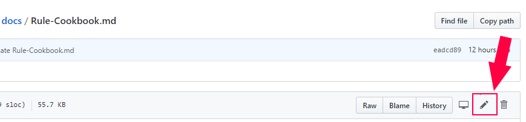
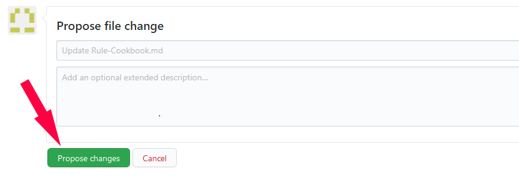
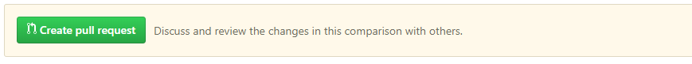
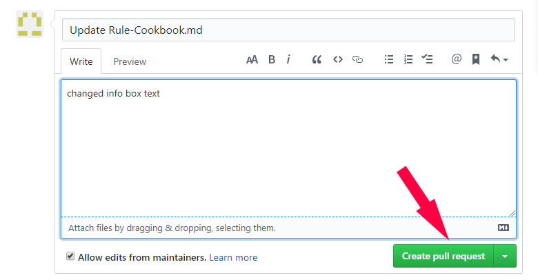

***Any contribution helps our team and makes Tasmota better for the entire community!***

We need:
- tutorials on using Tasmota features that aren't covered yet
- guides on wiring and using sensors supported by Tasmota
- your DIY projects featuring Tasmota
- new device templates 
- fixing spelling mistakes, broken links and other errors in the Wiki

The information available is still needed for devices in the field (like Shelly 2) and loss of information makes them unusable in case of debugging or fault analysis.

### Writing guides
Whenever you feel is a good guide or an article that would help other users just click the New Page icon and write.

### Adding devices to the documentation
All new devices should be submitted through the [Templates Repository](http://blakadder.github.io/templates). If you're adding a device with a comprehensive flashing or configuration tutorial you can create a new page in the Wiki and link to it in your template submission.

## Editing articles
> [!WARNING]
> You need a GitHub user account to be able to edit!

If you spot an error in an article use the *Improve this article* link at the top of the page to correct it. 

You'll be taken to the GitHub repository page of that file.

Click on the **edit** button (pencil icon). Edit/Add the text you wanted. When finished find the **Propose file change** button at the bottom and click it.

Next you need to click **Create pull request** which is GitHub speak for propose changes.

In the PR window add a small description of what you did and click **Create pull request**

Now you wait for one of the Tasmota admins to approve your PR. 

_**Congratulations**_! 

You've made a contribution to the Tasmota project making it a better experience for all future users. Thank you!

## Rendering Alert tags

Blockquotes `>` can now look even fancier:

?> =`?>`

!> = `!>`

> [!TIP]
> `> [!TIP]`

> [!NOTE]
> `> [!NOTE]`

> [!EXAMPLE]
> `> [!EXAMPLE]`

> [!WARNING]
> `> [!WARNING]`

> [!DANGER]
> `> [!DANGER]`

> [!DANGER|style:flat]
> `> [!DANGER|style:flat]`

