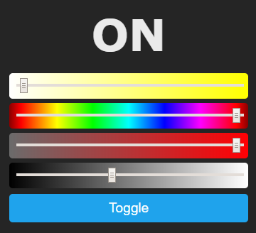

?> Lights... You know what lights do.... Right?

Lights come in various shapes (bulb, strips, ceiling lights, ...) but in Tasmota they are separated in 3 categories:
 - Channel Controlled LEDs
 - Addressable LEDs
 - Status LEDs 

## Lights in WebUI
Tasmotas webUI displays **Brightness**, **CT**, **White**, **Color Picker**, **Color Saturation** or **PWM** level sliders depending on the light component, the number of PWM channels configured and SetOptions used. 

RGBCCT or 5 channel LED light strip presented in web UI:

  

Tasmota uses a HSB color model, which besides other more subtile differences compared to HSL means, that the color must be desaturated to reach complete black or white.  

See [**light commands**](Commands#light) for how to control lights.

## Channel Controlled LEDs
Lights controlled using up to 5 channels (red, green, blue, cold white, warm white). Channels are controlled using PWM or APDM.

### PWM
PWM (Pulse Width Modulation) is the most common method of controlling LED lights. 

These lights are configured by assigning `PWM1(i)` through `PWM5(i)` components to their GPIOs. Depending on the number of used PWMs Tasmota will recognize the light as

|Channels|PWM1|PWM2|PWM3|PWM4|PWM5|
|---|---|---|---|---|---|
|1|Brightness|||||
|2|Cold White|Warm White||||
|3|Red|Green|Blue|||
|4|Red|Green|Blue|White||
|5|Red|Green|Blue|Cold White|Warm White|

If you require individual channel control (f.e. when connecting multiple single channel light strips to a multichannel LED controller) use [`SetOption68 1`](Commands#setoption68) to control each PWM individually with sliders in webUI and  [`Channel<x>`](Commands#channel) commands.

For better color mixing of RGB and white channels read about [White Blend Mode](White-Blend-Mode).

### MY92xx
MY92xx [family](http://www.my-semi.com/content/products/product_list.aspx?id=2) of drivers uses Adaptive Pulse Density Modulation. 

Configured in Tasmota by assigning `MY92x1 DI` and `MY92x DCKI` components to their GPIOs (some devices might have more than one  MY92xx controller)

Channel mapping for such devices is dependent on the controllers but is easily [remapped](SetOption37) using [`SetOption37`](Commands#setoption37).

### SM16716
SM16716 LEDs, sometimes mislabelled as WS2801.

Configured in Tasmota by assigning `SM16716 CLK`, `SM16716 DAT` and `SM16716 PWR` component to their GPIOs. 

Some SM16716 bulbs have BGR order and need [`SetOption37 54`](Commands#setoption57) to work properly.

## Addressable LEDs
Lights where each LED is individually controlled. In these lights it is possible to adjust each LEDs power, color and brightness, all just with the use of a single GPIO pin.

WebUI shows only the brightness slider and power toggle for these lights, all other controls are available with [commands](Commands#light).

### WS2812
Any light using WS2811, WS2812b, WS2813 or SK6812 LEDs falls into this component. They're also commonly called Neopixel lights.

Configured in Tasmota by assigning `WS2812 (7)` component to its GPIO. 

For wiring, see instructions for [LED strip](/peripherals/WS2812B-and-WS2813) or [Wemos RGB shield](/peripherals/WS2812B-RGB-Shield).

## Status LEDs
Special subset of lights used to convey device status such as Wi-Fi and power. [Read more...](Status-LED)
