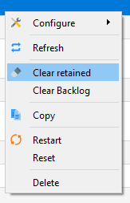

MQTT is the recommended protocol for controlling your devices. If you have no previous knowledge of it you can learn more from [MQTT Essentials](http://www.hivemq.com/mqtt-essentials/) article series. After you have a working [MQTT broker](https://www.google.com/search?q=setting+up+an+mqtt+broker) you need to configure Tasmota to communicate with it. 

## Configure MQTT 
If you flashed a precompiled .bin or didn't enter MQTT info in `user_config_override.h` before compiling you have to configure it on your device first.

### Configure MQTT using WebUI
Go to **Configuration -> Configure Other** and make sure **"MQTT Enable"** box is checked.<BR> 
Once MQTT is enabled you need to set it up using **Configuration -> Configure MQTT**. 

> [!TIP]
>While here, you might as well change the Friendly Name into something more descriptive than generic "Tasmota".<br>*This is a must for Home Assistant autodiscovery feature.*


For a basic setup you only need to set **Host**, **User** and **Password** but it is recommended to change **Topic** to avoid issues. Each device should have a unique **Topic**.

- **Host** = your MQTT broker address or IP (**mDNS is not available in the official Tasmota builds**, means no `.local` domain!) 
- **Port** = your MQTT broker port (default port is set to 1883)
- **Client** = device's unique identifier. In 99% of cases it's okay to leave it as is, however some Cloud-based MQTT brokers require a ClientID connected to your account.
- **User** = username for authenticating on your MQTT broker
- **Password** = password for authenticating on your MQTT broker
- **Topic** = unique identifying topic for your device (e.g. `hallswitch`, `kitchen-light`). `%topic%` in wiki references to this. **It is recommended to use a single word for the topic.**
- **FullTopic** = [full topic definition](#mqtt-topic-definition). Modify it if you want to use multi-level topics for your devices, for example `lights/%prefix%/%topic%/` or `%prefix%/top_floor/bathroom/%topic%/` etc.

### Configure MQTT using Backlog

Using a serial connection or the WebUI Console you can issue (or even better, paste a premade) Backlog command for quick and easy MQTT setup.

```console
Backlog mqtthost <mqtt_broker_address>; mqttport <mqtt_broker_port>; mqttuser <username>; mqttpassword <password>; topic <device_topic>
```

After a reboot all necessary MQTT settings are configured. Don't forget, you can use Backlog for all commands!

## Commands over MQTT
To send commands and view responses you'll need an [MQTT client](http://www.hivemq.com/blog/seven-best-mqtt-client-tools).

Commands over MQTT are issued to Tasmota by using `cmnd/%topic%/<command> <parameter>`. If there is no `<parameter>` (an empty MQTT message/payload), a query is sent for current status of the `<command>`.

> [!TIP]
> If you are using *mosquitto_pub*, you can issue an empty payload using the `-n` command line option. 
> If your MQTT client cannot issue an empty payload, you can use the single character `?` instead.

### Command flow

The following example will go in depth on what happens when you send an MQTT command.

A device was flashed and configured with the **FullTopic** as default `%prefix%/%topic%/` and the **Topic** set to `tasmota_switch`. We want to see the current status of the switch and change it.

By looking at the commands table we can learn about the [`POWER`](Commands#power) command and options associated with it. 

**Ask the device for status**
  ```js
  cmnd/tasmota_switch/Power ← 	// an empty message/payload sends a status query
     ↳ stat/tasmota_switch/RESULT → {"POWER":"OFF"}  
     ↳ stat/tasmota_switch/POWER → OFF
  ```
  We can see that the switch (device's relay) is turned off.

**Send a command to toggle the relay**
  ```js
  cmnd/tasmota_switch/Power ← "TOGGLE"
     ↳ // Power for relay 1 is toggled
     ↳ stat/tasmota_switch/RESULT → {"POWER":"ON"}  
     ↳ stat/tasmota_switch/POWER → ON
  ```
  We've sent the toggle command and received confirmation that the switch is turned on.

> [!TIP]
> By default, Tasmota replies to all commands through `.../RESULT`.
> This behavior can be changed using [SetOption4](Commands#SetOption4), which makes the commands reply on the endpoint matching the command name, ex. `cmnd/tasmota/PowerOnState` will send a response on `cmnd/tasmota/POWERONSTATE`.

### Examples
In the following examples `%topic%` is `tasmota`, FullTopic is `%prefix%/%topic%/`, and prefixes are default `cmnd/stat/tele`:

- The relay can be controlled with `cmnd/tasmota/POWER on`, `cmnd/tasmota/POWER off` or `cmnd/tasmota/POWER toggle`. Tasmota will send a MQTT status message like `stat/tasmota/POWER ON`.

- The power state message can be sent with the retain flag set. Enable this with `cmnd/tasmota/PowerRetain on`.

- The telemetry messages can also be sent with the retain flag, but this is a compile option. See [#1071](https://github.com/arendst/Tasmota/issues/1071).

- For Sonoff Dual or Sonoff 4CH the relays need to be addressed with `cmnd/tasmota/POWER<x>`, where {x} is the relay number from 1 to 2 (Sonoff Dual) or from 1 to 4 (Sonoff 4CH). `cmnd/tasmota/POWER4 off` turns off the 4th relay on a Sonoff 4CH.

- MQTT topic can be changed with `cmnd/tasmota/Topic tasmota1` which reboots Tasmota and changes the `%topic%` to `tasmota1`. From that point on MQTT commands should look like `cmnd/tasmota1/POWER on`.

- The OTA firmware location can be made known to tasmota with `cmnd/tasmota/OtaUrl http://thehackbox.org/tasmota/release/tasmota.bin`. Reset to default with `cmnd/tasmota/OtaUrl 1`.

- Upgrade OTA firmware from the OtaUrl server with `cmnd/tasmota/Upgrade 1`.

- Show all status information with `cmnd/tasmota/Status 0`.

- The button can send a MQTT message to the broker that in turn will switch the relay. To configure this you need to perform `cmnd/tasmota/ButtonTopic tasmota` where tasmota equals to Topic. The message can also be provided with the retain flag by `cmnd/tasmota/ButtonRetain on`.

- Sonoff Pow (and any device with sensors) status can be requested manually with `cmnd/tasmota/status 8`. Additionally, Tasmota periodically sends telemetry every [TelePeriod](Commands#Teleperiod), which defaults to 300 seconds (5 minutes).

- When a Sonoff Pow (and any device with power metering sensors) threshold like PowerLow has been met a message `tele/tasmota/POWER_LOW ON` will be sent. When the error is corrected a message `tele/tasmota/POWER_LOW OFF` will be sent.

While most MQTT commands will result in a message in JSON format the power status feedback will always be returned like `stat/tasmota/POWER ON` as well.

Telemetry data will be sent by prefix `tele` like `tele/tasmota/SENSOR {"Time":"2017-02-16T10:13:52", "DS18B20":{"Temperature":20.6}}`

## MQTT Topic Definition

### FullTopic
This is the MQTT topic used to communicate with Tasmota over MQTT. It is created using tokens placed within a user definable string (100 character limit). The tokens are substituted dynamically at run-time. Available substitution tokens are:
- `%prefix%` = one of three prefixes as defined by commands `Prefix1` *(default = `cmnd`)*, `Prefix2` *(default = `stat`)* and `Prefix3` *(default = `tele`)*.
- `%topic%` = one of five topics as defined by commands [`Topic`](Commands#topic), [`GroupTopic`](Commands#grouptopic), [`ButtonTopic`](Commands#buttontopic), [`SwitchTopic`](Commands#switchtopic) and [`MqttClient`](Commands#mqttclient).
- `%hostname%` = the hostname of the device as defined through the web UI *(default = `%s-%04d`)* or via [`Hostname`](Commands#hostname) command.
- `%id%` =  MAC address of the device.

> [!TIP]
> These substitution tokens will be used in examples across the documentation

If `FullTopic` does not contain the `%topic%` token, the device will not subscribe to `GroupTopic` and `FallbackTopic`.

> [!TIP]
> The order of _%prefix%_ and _%topic%_ doesn't matter, unless you have enabled Auto-discovery for Home Assistant ([`SetOption19`](Commands#setoption19)). Enabling this option re-formats the FullTopic to required order.

Using the tokens the following example topics can be made:
- `FullTopic %prefix%/%topic%/` _default_
- `FullTopic tasmota/%topic%/%prefix%/`
- `FullTopic tasmota/bedroom/%topic%/%prefix%/`
- `FullTopic penthouse/bedroom1/bathroom2/%topic%/%prefix%/`
- `FullTopic %prefix%/home/cellar/%topic%/`

#### %prefix%
Tasmota uses 3 prefixes for forming a FullTopic:

- `cmnd` - prefix to issue commands; ask for status
- `stat` - reports back status or configuration message
- `tele` - reports telemetry info at specified intervals

> [!TIP] 
> To solve possible MQTT topic loops it is strongly suggested that you use the `%prefix%` token in all of your FullTopics. Status and telemetry do not need a prefix.

### %topic%
All MQTT status messages will be sent using the configurable `%topic%` which must be made unique by the user. It can be called `bedroom` but it could also be called `XP-TS_10` as long as the user knows what it is and where to find it.

?> Default Topic is `tasmota`

The use of the `%topic%` token is mandatory in case you want to use [`ButtonTopic`](Commands#buttontopic) and/or [`SwitchTopic`](Commands#switchtopic). It also provides for GroupTopic and Fallback Topic functionality.

> [!TIP]
> Use `%prefix%` and `%topic%` tokens at all time within your FullTopic definition!

### GroupTopic
Having two devices with the same topic allowed for MQTT commands to be sent once to make the devices act in conjunction. That inspired a third topic called GroupTopic.  Devices with the same GroupTopic will all listen to that GroupTopic and react to the same MQTT command sent to it. You can use this to take global actions like updating firmware on all devices or split up devices into different groups using a unique GroupTopic for each group.

?> Default GroupTopic is `tasmotas`

### FallBack Topic
Initially Tasmota had one MQTT configurable topic planned called Topic. It soon became apparent that when two devices come online with the same topic this would be a challenge, to say the least!

Tasmota then introduced a unique, non-configurable "FallBack Topic" that allows MQTT communication regardless of the configurable topic. This fallback topic is just what it is meant to be: **a fallback topic** in case of emergency!

By default the Fallback Topic is `DVES_XXXXXX_fb` where xxxxxx is derived from the last 6 charactes of the device's MAC address (excluding `:`). It might look something like this: `DVES_3D5E26_fb`. You can find out the DVES code by looking at **Information** page in the webUI or issuing `Status 6`:
```json
12:36:17 MQT: stat/tasmota/STATUS6 = {"StatusMQT":{"MqttHost":"1.1.1.1","MqttPort":1883,"MqttClientMask":"DVES_%06X","MqttClient":"DVES_3D5E26","MqttUser":"tasmota","MqttCount":1,"MAX_PACKET_SIZE":1000,"KEEPALIVE":30}}
```

## Retained MQTT Messages

If MQTT is defined and [`PowerRetain`](Commands#powerretain) is used the last state will be stored permanently in MQTT database.

|Command | Description |
|-|-|
[`PowerRetain`](Commands#powerretain)	| Show current MQTT power retain state.<BR> `0` / `off` = disable MQTT power retain on status update *(default)* <BR> `1` / `on` = enable MQTT power retain on status update

**BUT**, a message in your MQTT broker flagged as 'retained' will **_always_ override the `PowerOnState`**. 

This is usually the main cause for "ghost switching". Learn more in [MQTT retained messages explained](http://www.steves-internet-guide.com/mqtt-retained-messages-example/). Check out [this tutorial](https://www.youtube.com/watch?v=31IyfM1gygo) for troubleshooting switch ghosting.

### Clearing Retained Messages
To check, if there is a retain flag set for the switch's power topic, monitor `cmnd/+/power` in a MQTT client (recommended [MQTT.fx](https://mqttfx.jensd.de/) for Windows or [Eclipse Mosquitto](https://mosquitto.org/) in linux).

You can use [Tasmota Device Manager](https://github.com/jziolkowski/tdm) to clear all retained messages for selected device with a single click.



or use the following tutorials/forum threads:
* [Clearing retained messages with mosquitto](https://community.openhab.org/t/clearing-mqtt-retained-messages/58221)
* [Remove retained messages in Home Assistant](https://community.home-assistant.io/t/mqtt-how-to-remove-retained-messages/79029)
* [Remove retained messages in hass.io MQTT addon](https://community.home-assistant.io/t/clear-hass-io-mosquitto-broker-add-on-retain-messages/57250/3)
