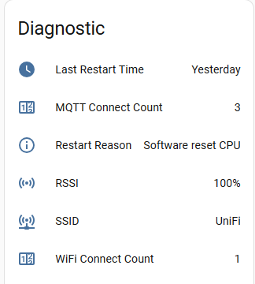

# Tasmota Documentation
This is the repo for documentation of the Tasmota open source alternative firmware for ESP8266 available from https://github.com/arendst/Tasmota 

## Editing Files

Use normal markdown syntax with some enhancements

## Enhancements


### Disable click on zoom for an image
Images support click on zoom function. If you don't want to use it:
```

```
### Image resizing
Due to click on zoom you can directly link to a big image but make it render smaller on the page:

```


<!-- Supports percentage -->


```

### Rendering Alert Tags

Blockquotes `>` can now look even fancier:

?> =`?>`

!> = `!>`

> [!TIP]
> `> [!TIP]`

> [!DANGER]
> `> [!DANGER]`

> [!NOTE]
> `> [!NOTE]`

> [!EXAMPLE]
> `> [!EXAMPLE]`

> [!DANGER|style:flat]
> `> [!DANGER|style:flat]`

### Creating Tabs
Tabs inside tabs are not supported.

```
<!-- tabs:start -->

#### ** First Tab Title **

Hello!

#### ** Second Tab Title **

Bonjour!

#### ** Third Tab Title **

Ciao!

<!-- tabs:end -->
```

## Shields color codes
### Connection

I2C:

GPIO:
 
ADC:
 
Serial:
 
Serial:
 
Tuya:
 


