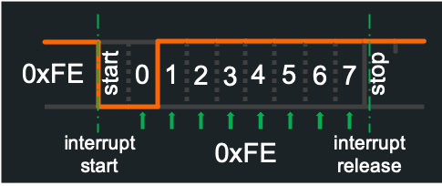
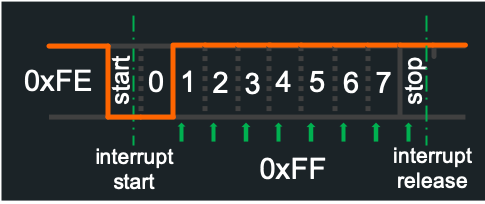
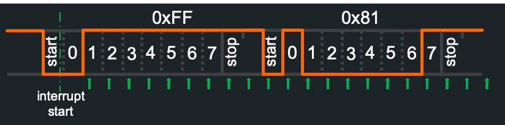

# Zigbee internals
[Back to Zigbee](Zigbee)

This page is for developers who want to understand how Zigbee2Tasmota (Z2T) works and its implementation details.

## CC2530 ZNP protocol
The CC2530 is flashed with Texas Instrument ZNP Software version 1.2. The protocol is build on a serial communication between the main cpu and the CC2530.

Serial communication is configured as 8N1, 115200 bauds. We suggest to use GPIO13/15 because they have hardware serial support. Please note that there is only one usable hardware serial, either on GPIO1/3 or GPIO13/15.

To enable hardware serial on GPIO13/15 for Tasmota, set `Serial 0` and restart. Otherwise Z2T will use Software serial provided by TasmotaSerial.

Receiving 115200 bauds in software is a timing challenge. Here is the anatomy of a byte transmitted in serial mode. Each bit is 8.7µs, or ~700 CPU cycles at 80MHz (1400 cycles at 160MHz).

It all starts with a LOW "start bit" that generates an interrupt transferred to TasmotaSerial. Then TasmotaSerial enters a tightly controlled loop to read each bit (least sifnificant first). The frame stops with a HIGH stop bit.

What can go wrong? Tasmota may be already handling an interrupt when the start bit arrives, potentially causing a shift by 1 bit and a wrong message.

Here is a 0xFE byte correctly received:

Same frame with a delay in the interrupt handler, and mistakenly read 0xFF:

TasmotaSerial has been improved to allow receiving a train of bytes withtout any disruption.

CC2530 generally sends all the bytes one after the other for a single ZNP message (up to 250 bytes). Instead of giving back control after the first byte, the TasmotaSerial interrupt handler continues to monitor the serial RX line for the next 4 bits and checks whether a new start bit arrived. It avoids any error after the first byte was received.

Still the first byte in the message could have been wrong. Fortunately, the first byte sent by ZNP is always 0xFE (see below). This means that if the interrupt arrives too late, Tasmota will read 0xFF instead of 0xFE. Z2T software does automatic error correction in this case, i.e. if the first byte received is 0xFF, it is automatically assumed to be 0xFE and the rest of the message is read normally.

With these two schemes, software serial for Zigbee proved to be extremely reliable, even at 80MHz. It is highly recommended though to run at 160MHz.

