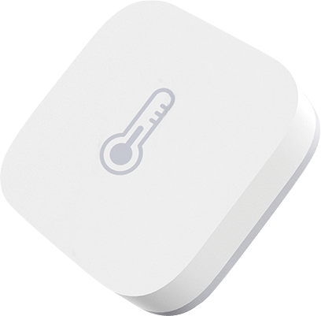

?> Zigbee2Tasmota serves as a gateway for devices connected to a Zigbee wireless network to bridge their communications over to Wi-Fi. 

Zigbee2Tasmota is a lightweight Zigbee solution running on an ESP82xx Wi-Fi chip. Hence it is easier to deploy in your living room or around your home. It is largely inspired from [Zigbee2mqtt](https://www.zigbee2mqtt.io/) but it's a complete rewrite to make it fit on an ESP82xx with 80kB of RAM and only 1MB of flash memory.

A list of compatible devices is maintained in the [Zigbee Device Compatibility Repository](https://zigbee.blakadder.com/zigbee2tasmota.html). 

## Zigbee Introduction
Before using Zigbee to Tasmota, you need to understand a few concepts. Here is a simplified comparison to the Wi-Fi equivalent (sort of).

|Zigbee concept|Wi-Fi equivalent|
|---|---|
|**Zigbee coordinator**<BR>The coordinator is responsible for selecting the channel, PanID, security policy, and stack profile for a network. Zigbee2Tasmota will act as a coordinator.<BR>You can have multiple coordinators as long as they have different PanIDs.|Wi-Fi Access Point|
|**PanID**<BR>(Personal Area Network IDentifier)<BR>This parameter is unique in a Zigbee network (16-bit integer, 0x0000–0x3FFF).<BR>*Default: 0x1A63*|SSID (the Wi-Fi network name)|
|**ShortAddr**<BR>Address of the device on the Zigbee network. This address is randomly assigned when the device first connects to the coordinator (16 bits integer, 0x0000–0xFFF7). The coordinator has address 0x0000.<BR>You need to track which device has which address or assing a "Friendly Name" to each new discovered device.|IP address|
|**GroupAddr**<BR>Group address of a collection of devices, it allows a single message to address multiple devices at once (16 bits integer, 0x0000–0xFFFF). For example a remote can turn on/off a group of lights. GroupAddr 0x0000 is not assigned.|Multicast|
|**Endpoint**<BR>The endpoint on the coordinator or on the Zigbee device the message is sent from/to. You can see endpoints as logical device providing distinct features (8 bits integer, 1–240).|IP Port|
|**IEEEAddr**<BR>Device hardware address (64 bits). This is unique per device and factory assigned.|MAC address|
|**Channel** 11-26<BR>*Default: 11* (See [Zigbee-Wifi coexistence](https://www.metageek.com/training/resources/zigbee-wifi-coexistence.html))|Wi-Fi Channel|
|**Encryption Key**<BR>128-bit encryption key.<BR>*default: 0x0D0C0A08060402000F0D0B0907050301*|Wi-Fi password|
|**Pairing**<BR>By default the coordinator does not accept new devices unless put in pairing mode. When in pairing mode, it will accept pairing requests from any device within range.<BR>*Default: pairing disabled*|WPS|

## Hardware
### Zigbee Adapter
**You cannot use any CC2531 based device with Tasmota!** CC2531 supports USB communication and not serial communication required by Zigbee2Tasmota.

<table style="text-align:center; width: 80%;">
    <col style="width:30%">
    <col style="width:30%">
    <col style="width:30%">
  <tr>
    <th><a href="https://www.aliexpress.com/item/32904763478.html"> CC2530 with PCB antenna, DL-20</a></th>
    <th><a href="https://www.aliexpress.com/item/33007098493.html">CC2530 with external antenna</a></th>
    <th><a href="https://www.aliexpress.com/item/4000118023903.html">CC2530 with external antenna and CC2591 RF front end</a></th>
  </tr>
  <tr>
    <td>
      </img>
    </td>
    <td>
      </img>
    </td>
    <td>
      </img>
    </td>
</tr>
</table>

### Wi-Fi Adapter
Using an ESP82xx device such as a Wemos D1 Mini or a NodeMCU to flash the CC2530 (described below) is a lower cost alternative than using a single purpose [CC_DEBUGGER](https://www.aliexpress.com/item/32869263224.html). When in normal operation, this ESP82xx device can then also serve as the Wi-Fi adapter for the Zigbee2Tasmota messaging.

In normal operation, only two free GPIO are needed for the serial communications with the CC2530. You can use the ESP82xx device above to flash the CC2530 adapter(s) and then use any other ESP82xx device flashed with Zigbee2Tasmota as the gateway between Zigbee and Wi-Fi.  

## Connecting to Tasmota
### 1. Flash the CC2530 module
Zigbee2Tasmota requires a TI CC2530 based module flashed with [Z-Stack-firmware](https://github.com/Koenkk/Z-Stack-firmware) from [Koen Kanters](https://github.com/Koenkk). To simplify this procedure, a ready to use [fork of the needed firmware files](https://github.com/s-hadinger/CCLib) is available.

Due to memory constraints of the CC2530, you can only pair 16 devices to a coordinator ([See details](https://github.com/Koenkk/Z-Stack-firmware/tree/master/coordinator)). 

> There is an alternative firmware allowing for Zigbee routers to create a mesh network and go beyond 16 devices. This is currently not tested nor supported by Zigbee2Tasmota. It may be added later.

**A. Flash CCLib on an ESP82xx Device**    
Flashing the CC2530 normally requires a [CC_DEBUGGER](https://www.aliexpress.com/item/32869263224.html). Using an ESP82xx device like a [Wemos D1 Mini](https://www.aliexpress.com/item/32681374223.html) is a lower cost alternative.  

If you are using a Wemos D1 Mini or NodeMCU, just plug the microUSB port. Vcc (3.3V), GND, Tx (GPIO1), and Rx (GPIO3) are connected via the microUSB port. Be sure that you are using a USB **_data_** cable.  

For ESP devices that do not have a microUSB connector, make the following connections:  

<BR>ESP<BR>Device|Serial<BR>Programming<BR>Adapter
:--:|:--:
Vcc|Vcc
GND|GND
GPIO0|GND
GPIO1|Rx
GPIO3|Tx

Follow the usual ESP82xx [flashing process](installation/Flashing) - you are just using [`CCLib_proxy.ino.bin`](https://github.com/s-hadinger/CCLib/blob/master/Bin/CCLib_proxy.ino.bin) instead of Tasmota.

Once the firmware upload completes, retain the serial interface connections (3.3V, GND, Tx, Rx). These will be used later for flashing the CC2530.


**B. Ready-made PCB**  
   These PCB make all the connections required to flash the CC2530 and to run Z2T.  
   
   - SuperHouse.tv  
     Jon Oxer created a [custom PCB](https://github.com/SuperHouse/Z2T) to connect a Wemos D1 Mini and a CC2530 board (with or without CC2591).  

     **Complete module**  
       
       

   - H4NC
     User _**h4nc**_ created a [custom PCB](https://github.com/h4nc/Zigbee2Tasmota_PCB) to connect a NodeMCU and a CC2530 board.  
     
     You can also get a complete Z2T module with case, pre-flashed and ready to configure and deploy.  
       
     
**Prototype**  


**C. Flash a DL-20 Zigbee module**
The DL-20 Zigbee module has a 5-pin 1.27mm pitch unpopulated header with 0.6mm througholes. For flashing any of the Zigbee modules, you need the following connections:  

ESP<BR>Pin|D1 Mini<BR>NodeMCU|CC2530<BR>Pin|[DL-20 J2<BR>Pin Location](https://user-images.githubusercontent.com/34340210/67676080-29301a00-f957-11e9-8799-c819241e0b4c.png "CC2530 DL-20 Pin-outs")
:--:|:--:|:--:|:--:
GPIO12|D6|CC_DD<BR>(A.K.A. P2_1 ('P21') or Debug Data)|5
GPIO4|D2|CC_DC<BR>(A.K.A. P2_2 ('P22') or Debug Clock)|4
Vcc|3.3v|Vcc|3
GPIO5|D1|CC_RST|2
GND|GND|GND|1

**DL-20 Flashing Jumpers**  
Insert alternating male Dupont jumpers; one jumper on one side, the next one on other side. This  allows the pins to provide the friction themselves to maintain contact and remain firmly in place. You only need DD, DC, and RST (a fourth jumper is shown which is used to keep the RST jumper in place). Vcc and GND are available on the main serial interface pins.  
  

**D. Upload the firmware to the CC2530**    
The CC2530 requires `Z-Stack_Home_1.2`, of type `Default` (not `Source Routing`). For convenience, ready to use [firmware files](https://github.com/s-hadinger/CCLib/tree/master/Bin) are provided. Select the right one for your hardware: `CC2530`, `CC2530 + CC2591` or `CC2530 + CC2592`.

_**These Python scripts require Python 2.7.**_  
1. Ensure that you have Python 2.7 installed
2. Install pyserial 3.0.1:  
   `pip install pyserial==3.0.1`
3. Check for connectivity before flashing:  
   `python Python/cc_info.py -p <serial_port>`  

   where \<serial_port> is the serial port for the ESP82xx device. e.g. `/dev/cu.usbserial-xxxx` or `COM7`

   Example of result:
   ```
   INFO: Found a CC2530 chip on /dev/cu.usbserial-xxxx
   
   Chip information:
         Chip ID : 0xa524
      Flash size : 16 Kb
       Page size : 2 Kb
       SRAM size : 1 Kb
             USB : No
   
   Device information:
    IEEE Address : 000000000000
              PC : 0000
   
   Debug status:
    [ ] CHIP_ERASE_BUSY
    [ ] PCON_IDLE
    [X] CPU_HALTED
    [ ] PM_ACTIVE
    [ ] HALT_STATUS
    [X] DEBUG_LOCKED
    [X] OSCILLATOR_STABLE
    [ ] STACK_OVERFLOW
   
   Debug config:
    [ ] SOFT_POWER_MODE
    [ ] TIMERS_OFF
    [ ] DMA_PAUSE
    [ ] TIMER_SUSPEND
   ```
   
   If your CC2530 is DEBUG_LOCKED, then the flash size will be incorrectly _reported_ as 16kB. Dont worry flashing the Z-Stack firmware will work and reset the DEBUG_LOCKED bit. 
   
   In some situation flashing fails with a error message `flash have not enough space`. If this happens do the following:   

   ```
   python Python/cc_read_flash.py -p <serial_port> -o x.hex
   python Python/cc_write_flash.py --erase -p <serial_port> -i x.hex
   ```
   Recheck for connectivity and the correct flash size by repeating step #3.


4. Flash the Z-Stack firmware using the following command:  
   _Flashing the CC2530 **takes about 20 minutes**_  
   ```
   python Python/cc_write_flash.py -e -p <serial_port> -i Bin/CC2530_DEFAULT_20190608_CC2530ZNP-Prod.hex
   ```  
   
   ```
   INFO: Found a CC2530 chip on /dev/cu.usbserial-xxxx
   
   Chip information:
         Chip ID : 0xa524
      Flash size : 256 Kb
       Page size : 2 Kb
       SRAM size : 8 Kb
             USB : No
   Sections in Bin/CC2530_DEFAULT_20190608_CC2530ZNP-Prod.hex:
   
    Addr.    Size
   -------- -------------
    0x0000   8176 B 
    0x1ff6   10 B 
    0x3fff0   1 B 
    0x2000   239616 B 
   
   This is going to ERASE and REPROGRAM the chip. Are you sure? <y/N>:  y
   
   Flashing:
    - Chip erase...
    - Flashing 4 memory blocks...
    -> 0x0000 : 8176 bytes 
       Progress 100%... OK
    -> 0x1ff6 : 10 bytes 
       Progress 100%... OK
    -> 0x3fff0 : 1 bytes 
       Progress 100%... OK
    -> 0x2000 : 239616 bytes 
       Progress 100%... OK
   
   Completed
   ```

   _If you don't see any on screen activity that flashing has begun (i.e., progress percentages increasing) within a couple minutes, then abort the command, cycle power on the ESP82xx, and start this step over._

Additional References:
- Flashing with a Wemos D1 Mini or equivalent and `CCLib` is described in greater detail in [this blog post](https://www.zigbee2mqtt.io/information/alternative_flashing_methods.html).
- [Koen Kanters](https://github.com/Koenkk) [Z-Stack CC2530 firmware files](https://github.com/Koenkk/Z-Stack-firmware/tree/master/coordinator/Z-Stack_Home_1.2/bin/default).
- There are many tutorials online on how to flash a CC2530 with a dedicated [CC_DEBUGGER](https://www.aliexpress.com/item/32869263224.html).  

### 2. Flash an ESP82xx Device with Zigbee2Tasmota Tasmota
Once the CC2530 flashing process completes, you can re-use that ESP82xx device by flashing it with the Zigbee2Tasmota firmware. Otherwise, you can use any ESP82xx device.  
- [Compile Tasmota](installation/Flashing?id=compiling-from-source)
  - `#define USE_ZIGBEE` in `user_config_override.h`.
  - _optional_ Run the ESP at 160MHz instead of 80MHz, this ensures higher reliability in serial communication with CC2530.  
    In `platformio_override.ini`
    - Uncomment: `board_build.f_cpu         = 160000000L`
  
>[!WARNING] If you find that your Zigbee2Tasmota operation is unstable, you may have an ESP82xx device that cannot operate reliably at the higher frequency. If you are using hardware serial (see below) and you still have unreliability, try compiling for 80MHz (reverse the options above) and flash the ESP82xx device again to see if operating at a lower frequency improves stability. Running at 80MHz will impact software serial communications so hardware serial is highly recommended if running the ESP82xx at 80MHz.
    
- Follow the usual [Tasmota flashing process](installation/Flashing)

### 3. Connect the CC2530 to the Tasmota Device
The connection uses a 115200 baud serial connection. Hence you need to configure two GPIOs: `Zigbee TX` and `Zigbee RX`.

If you are using your ESP82xx device to flash the Zigbee adapter as described in the flashing section, GPIO4, GPIO5, and GPIO12 are already in use. You may want to leave these connections in place in case you need to update the CC2530 firmware in the future. Otherwise, any of these GPIO can also be used.

The interface between the ESP82xx Wi-Fi device and the CC2530 Zigbee module uses high speed serial. **It is recommended that hardware serial pins be used (GPIO1/GPIO3 or GPIO13\[Rx]/GPIO15\[Tx])**. Due to ESP82xx GPIO pin constraints, GPIO15 can only be used as serial Tx.  

Tasmota also provides serial communications emulation through software (i.e., software serial). This allows any GPIO to be used. TasmotaSerial version 2.4.x (PR [#6377](https://github.com/arendst/Tasmota/pull/6377)) has improved the reliability of software serial making it feasible for use in this application. However, if you have an option to use hardware serial, choose that.

?> Z2T uses software serial by default to allow for serial logging on GPIO1/GPIO3. Use `SerialLog 0` to enable **hardware serial on GPIO13\[Rx]/GPIO15\[Tx]**.

Recommended connections:  

ESP<BR>Device|Tasmota<BR>Component|<BR>CC2530
:--:|:--:|:--:
GPIO13|Zigbee RX (166)|CC_TXD<BR>(A.K.A. P0_3)
GPIO15|Zigbee TX (165)|CC_RXD<BR>(A.K.A. P0_2)

Configure the Tasmota device using a custom template. Assign **`Zigbee Tx (165)`** and **`Zigbee Rx (166)`** to the corresponding GPIOs to be used for serial communication with the CC2530. For example:

```json
{"NAME":"Zigbee","GPIO":[0,0,0,0,0,0,0,0,0,166,0,165,0],"FLAG":0,"BASE":18}
```


### 4. First run

When the Tasmota device boots, Zigbee2Tasmota will wait for 15 seconds before initializing the CC2530. This time allows for Wi-Fi and MQTT connection (hopefully).

When you first run your CC2530, you will see additional steps to configure the device:
```
MQT: tele/<topic>/RESULT = {"ZbState":{"Status":1,"Message":"CC2530 booted","RestartReason":"Watchdog","MajorRel":2,"MinorRel":6}}
MQT: tele/<topic>/RESULT = {"ZbState":{"Status":50,"MajorRel":2,"MinorRel":6,"MaintRel":3,"Revision":20190608}}
MQT: tele/<topic>/RESULT = {"ZbState":{"Status":2,"Message":"Reseting configuration"}}
MQT: tele/<topic>/RESULT = {"ZbState":{"Status":3,"Message":"Configured, starting coordinator"}}
MQT: tele/<topic>/RESULT = {"ZbState":{"Status":51,"IEEEAddr":"0x00124B00199DF06F","ShortAddr":"0x0000","DeviceType":7,"DeviceState":9,"NumAssocDevices":0}}
MQT: tele/tasmota/Zigbee_home/RESULT = {"ZbState":{"Status":0,"Message":"Started"}}
ZIG: Zigbee started
ZIG: No zigbee devices data in Flash
```

Normal boot looks like:  
```
MQT: tele/<topic>/RESULT = {"ZbState":{"Status":1,"Message":"CC2530 booted","RestartReason":"Watchdog","MajorRel":2,"MinorRel":6}}
MQT: tele/<topic>/RESULT = {"ZbState":{"Status":50,"MajorRel":2,"MinorRel":6,"MaintRel":3,"Revision":20190608}}
MQT: tele/<topic>/RESULT = {"ZbState":{"Status":3,"Message":"Configured, starting coordinator"}}
MQT: tele/<topic>/RESULT = {"ZbState":{"Status":51,"IEEEAddr":"0x00124B00199DF06F","ShortAddr":"0x0000","DeviceType":7,"DeviceState":9,"NumAssocDevices":0}}
MQT: tele/<topic>/RESULT = {"ZbState":{"Status":0,"Message":"Started"}}
ZIG: Zigbee started
ZIG: Zigbee devices data in Flash (516 bytes)
```

You can also force a factory reset of your CC2530 with the following command, and reboot:  
`ZigbeeReset 1`

## Using Zigbee2Tasmota

For a list of available command see [Zigbee Commands](Commands#zigbee).  

> [!NOTE]
> Zigbee will automatically boot the CC2530 device, configure the device and wait for Zigbee messages.  

### Pairing Zigbee Devices
When you first create a Zigbee network, it contains no device except the coordinator. The first step is to add devices to the network, which is called **pairing**.

By default, and for security reasons, the Zigbee coordinator does not automatically accept new devices. To pair new devices, use [`ZbPermitJoin 1`](Commands#zbpermitjoin). Once Zigbee2Tasmota is in pairing mode, put the Zigbee device into pairing mode. This is usually accomplished by pressing the button on the device for 5 seconds or more. To stop pairing, use [`ZbPermitJoin 0`](Commands#zbpermitjoin).

```yaml
ZbPermitJoin 1
xx:xx:xx CMD: ZbPermitJoin 1
xx:xx:xx MQT: stat/<topic>/RESULT = {"ZbPermitJoin":"Done"}
xx:xx:xx MQT: tele/<topic>/RESULT = {"ZbState":{"Status":21,"Message":"Enable Pairing mode for 60 seconds"}}
```

60 seconds later:

```yaml
xx:xx:xx MQT: tele/<topic>/RESULT = {"ZbState":{"Status":20,"Message":"Disable Pairing mode"}}
```

Although this is highly discouraged, you can permanently enable Zigbee pairing, until the next reboot, with `ZbPermitJoin 99`.

```
ZbPermitJoin 99

xx:xx:xx MQT: tele/<topic>/RESULT = {"ZbState":{"Status":22,"Message":"Enable Pairing mode until next boot"}}

ZbPermitJoin 0
xx:xx:xx MQT: tele/<topic>/RESULT = {"ZbState":{"Status":20,"Message":"Disable Pairing mode"}}
```


### Reading Sensors
Sensor messages are published via MQTT when they are received from the Zigbee device. Similar to Zigbee2MQTT, Z2T tries to group and debounce sensor values when they are received within a 300ms window.

#### Example for [Aqara Temperature & Humidity Sensor](https://www.aqara.com/us/temperature_humidity_sensor.html)


This sensor monitors humidity, temperature, and air pressure.  Its Zigbee model ID is `lumi.weather`.

1. Put Zigbee2Tasmota into pairing mode using the `ZigbeePermitJoin` command as described above
2. Press the Xiaomi Aqara sensor's button for 5 seconds to pair the devices. You will see a message as follows:  
   ```yaml
   MQT: tele/<topic>/SENSOR = {"ZbState":{"Status":30,"IEEEAddr":"0x00158D00036B50AE","ShortAddr":"0x8F20","PowerSource":false,"ReceiveWhenIdle":false,"Security":false}}
   ```

|Field name|Value|
|---|---|
|`Status`|`30` indicates a device connect or reconnect. This is the opportunity to match IEEEAddress and short address|
|`IEEEAddr`|Long unique address (64 bits) of the device - factory set|
|`ShortAddr`|Short address (16 bits) randomly assigned to the device on this Zigbee network|
|`PowerSource`|`true` = the device is connected to a power source<BR>`false` = the device runs on battery|
|`ReceiveWhenIdle`|`true` = the device can receive commands when idle<BR>`false` = the device is not listening. Commands should be sent when the device reconnects and is idle|
|`Security`|Security capability (meaning unknown, to be determined)|

This device publishes sensor values roughly every hour or when a change occurs. You can also force an update pressing the device's button. It sends two kinds of messages, either 3x standard Zigbee messages, or a single proprietary message containing all sensor values.  

Examples:
```yaml
MQT: tele/<topic>/SENSOR = {"ZbReceived":{"0x7C71":{"Humidity":55.57,"LinkQuality":42}}}
MQT: tele/<topic>/SENSOR = {"ZbReceived":{"0x7C71":{"Temperature":20.26,"LinkQuality":44}}}
MQT: tele/<topic>/SENSOR = {"ZbReceived":{"0x7C71":{"PressureUnit":"hPa","Pressure":983,"Scale":-1,"ScaledValue":9831,"LinkQuality":44}}}
MQT: tele/<topic>/SENSOR = {"ZbReceived":{"0x7C71":{"Voltage":3.035,"Battery":100,"Temperature":19.91,"Humidity":82.16,"Pressure":983.25,"PressureUnit":"hPa","LinkQuality":47}}}
MQT: tele/<topic>/SENSOR = {"ZbReceived":{"0x7C71":{"Manufacturer":"LUMI","ModelId":"lumi.weather","LinkQuality":49}}}
```
`0x8F20` is the ShortAddress of the sensor.  

Supported values:  

|Field name|Value|
|---|---|
|`LinkQuality`|Stength of the Zigbee signal, between 1 and 254 (integer). See this [ZigBee and WiFi Coexistence](https://www.metageek.com/training/resources/zigbee-wifi-coexistence.html)|
|`Humidity`|Humidity in percentage (float)|
|`Pressure` and `PressureUnit`|Atmospheric pressure (float) and unit (string)<BR>Currently only `hPa` (A.K.A. mbar) is supported|
|`Temperature`|Temperature in Celsius (float)|
|`Voltage`|Battery voltage (float)|
|`Battery`|Battery charge in percentage (integer)|
|`ModelId`|Model name of the Zigbee device (string)<BR>Ex: `lumi.weather`|
|`ScaledValue` and `Scale`|Give the raw measure and the scale correction as 10^scale|

### Device Information
You can dump the internal information gathered about connected Zigbee devices with the command [`ZigbeeStatus`](Commands#zigbeestatus).

You can use `ZbStatus2` to display all information and endpoints. If probing was successful (at pairing time or using `ZbProbe`), Tasmota will automatically find the right endpoint.

Depending on the number of device you have, `ZbStatus2` output can exceed tha maximum MQTT message size. You can request the status of each individual device using `ZbStatus2 1`, `ZbStatus2 2`, `ZbStatus2 3`...

`ZbStatus1` - List all connected devices  
```yaml
{"ZbStatus1":[{"Device":"0x6B58"},{"Device":"0xE9C3"},{"Device":"0x3D82"}]}
```

`ZbStatus2` - Display detailed information for each device, including long address, model and manufacturer:  
```json
{"ZbStatus2":[{"Device":"0x4773","IEEEAddr":"0x7CB03EAA0A0292DD","ModelId":"Plug 01","Manufacturer":"OSRAM","Endpoints":["0x03"]},{"Device":"0x135D","Name":"Temp_sensor","IEEEAddr":"0x00158D00036B50AE","ModelId":"lumi.weather","Manufacturer":"LUMI","Endpoints":["0x01"]}]}
```

_(formatted for readability)_  
```json
{
	"ZbStatus2": [{
		"Device": "0x4773",
		"IEEEAddr": "0x7CB03EAA0A0292DD",
		"ModelId": "Plug 01",
		"Manufacturer": "OSRAM",
		"Endpoints": ["0x03"]
	}, {
		"Device": "0x135D",
		"Name": "Temp_sensor",
		"IEEEAddr": "0x00158D00036B50AE",
		"ModelId": "lumi.weather",
		"Manufacturer": "LUMI",
		"Endpoints": ["0x01"]
	}]
}
```

#### Understanding endpoints

Z2T will automatically take the first endpoint in the list; this works most of the time. You normally don't need to specify the endpoint number. In rare case, you can still force a specific endpoint.

##### Example Endpoints

Device|Endpoint
-|-
OSRAM Plug|`0x03`
Philips Hue Bulb|`0x0B`

#### Zigbee Friendly Names

Since version 8.1.0.4, Z2T supports friendly names for devices. Instead of a short address like `"0x4773"` you can assign a friendly name like `"Room_Plug"`.

See `ZbName` command to set names.

Example with a Xiaomi Aqara Cube with address `0x128F`:
```yaml
xx:xx:xx MQT: tele/<topic>/RESULT = {"ZbReceived":{"0x128F":{"AqaraVibrationMode":"tilt","AqaraVibrationsOrAngle":162,"AqaraAccelerometer":[-690,2,138],"AqaraAngles":[-78,0,11],"LinkQuality":158}}}
```

Setting its name to `Vibration_sensor`:
```yaml
ZigbeeName 0x128F,Vibration_sensor
xx:xx:xx CMD: ZbName 0x128F,Vibration_sensor
xx:xx:xx MQT: stat/<topic>/RESULT = {"0x128F":{"Name":"Vibration_sensor"}}

(10 seconds later)
xx:xx:xx ZIG: Zigbee Devices Data store in Flash (0x402FF800 - 270 bytes)
```

Now the sensor readings include the friendly name:
```yaml
xx:xx:xx MQT: tele/<topic>/RESULT = {"ZbReceived":{"0x128F":{"Name":"Vibration_sensor","AqaraVibrationMode":"tilt","AqaraVibrationsOrAngle":171,"AqaraAccelerometer":[-691,12,130],"AqaraAngles":[-78,1,11],"LinkQuality":153}}}
```

If you set `SetOption83 1` sensor readings will use the friendly name as KSON key, short address is added as `Device`:
```yaml
xx:xx:xx MQT: tele/<topic>/RESULT = {"ZbReceived":{"Vibration_sensor":{"Device":"0x128F","AqaraVibrationMode":"tilt","AqaraVibrationsOrAngle":171,"AqaraAccelerometer":[-691,8,136],"AqaraAngles":[-78,1,11],"LinkQuality":153}}}
```

### Zigbee Device Commands

Command|Parameters|Cluster
-|-|-
Power|`1\|true\|"true"\|"on"`: On<BR>`0\|false\|"false"\|"off"`: Off<BR>`2\|"Toggle"`: Toggle|0x0006
Dimmer|`0..254`: Dimmer value<BR>255 is normally considered as invalid, and may be converted to 254|0x0008
DimmerUp|`null`: no parameter. Increases dimmer by 10%|0x0008
DimmerDown|`null`: no parameter. Decreases dimmer by 10%|0x0008
DimmerStop|`null`: no parameter. Stops any running increase of decrease of dimmer.|0x0008
ResetAlarm|`<alarmcode>,<clusterid>`: (to be documented later)|0x0009
ResetAllAlarms|`null`: no parameter, (to be documented later)|0x0009
Hue|`0..254`: change Hue value|0x0300
Sat|`0..254`: change Sat value|0x0300
HueSat|`0..254,0..254`: change both Hue and Sat values|0x0300
Color|`0..65534,0..65534`: change the color using [x,y] coordinates|0x0300
CT|`0..65534`: change the white color-temperature in Mireds|0x0300
Shutter|`0..254`: send any Shutter command (prefer the commands below)|0x0102
ShutterOpen|`null`: no parameter, open shutter|0x0102
ShutterClose|`null`: no parameter, close shutter|0x0102
ShutterStop|`null`: no parameter, stop shutter movement|0x0102
ShutterLift|`0..100`: move shutter to a specific position in percent<BR>`0`%=open, `100`%=closed|0x0102
ShutterTilt|`0..100`: move the shutter to the specific tilt position in percent|0x0102

Examples:

#### OSRAM Plug

```json
ZbSend { "device":"0x4773", "send":{"Power":"On"} }
ZbSend { "device":"0x4773", "send":{"Power":1} }
ZbSend { "device":"0x4773", "send":{"Power":false} }
ZbSend { "device":"0x4773", "send":{"Power":"Toggle"} }
```

Read the On/Off status: (all three commands below are synonyms)

```json
ZbRead { "device":"0x4773", "endpoint":"0x03", "cluster":"0x0006", "read":"0x0000" }
ZbRead { "device":"0x4773", "endpoint":"0x03", "cluster":"0x0006", "read":["0x0000"] }
ZbRead { "device":"0x4773", "endpoint":3, "cluster":6, "read":0 }
```

```json
xx:xx:xx MQT: tele/tasmota/SENSOR = {"ZbReceived":{"0x4773":{"Power":true,"LinkQuality":52}}}
```

#### Philips Hue bulb

```json
ZbSend { "device":"0x3D82", "send":{"Power":"Off"} }
ZbSend { "device":"0x3D82", "send":{"Dimmer":128} }
ZbSend { "device":"0x3D82", "send":{"Dimmer":254} }
ZbSend { "device":"0x3D82", "endpoint":"0x0B", "send":{"Dimmer":0} }
```

### Zigbee2Tasmota Status
You can inspect the log output to determine whether Zigbee2Tasmota started correctly. Zigbee2Tasmota sends several status messages to inform the MQTT host about initialization.  

Ex: ```{"ZbState":{"Status":1,"Message":"CC2530 booted","RestartReason":"Watchdog","MajorRel":2,"MinorRel":6}}```  
- `Status` contains a numeric code about the status message
  - `0`: initialization complete, **Zigbee2Tasmota is running normally**
  - `1`: booting
  - `2`: resetting CC2530 configuration
  - `3`: starting Zigbee coordinator
  - `20`: disabling Permit Join
  - `21`: allowing Permit Join for 60 seconds
  - `22`: allowing Permit Join until next boot
  - `30`: Zigbee device connects or reconnects
  - `31`: Received Node Descriptor information for a Zigbee device
  - `32`: Received the list of active endpoints for a Zigbee device
  - `33`: Received the simple Descriptor with active ZCL clusters for a Zigbee device
  - `50`: reporting CC2530 firmware version
  - `51`: reporting CC2530 device information and associated devices
  - `98`: error, unsupported CC2530 firmware
  - `99`: general error, **Zigbee2Tasmota was unable to start**
- `Message` (optional) a human-readable message
- other fields depending on the message (e.g., Status=`50` or Status=`51`)

## Device Configuration

If your device pairs successfully with Zigbee2Tasmota but doesn't report on standardized endpoint you will see messages like these:   
`{"ZbReceived":{"0x099F":{"0500!00":"010000FF0000","LinkQuality":70}}}`   
`{"ZbReceived":{"0x7596":{"0006!01":"","LinkQuality":65}}}`

In this case you will have to use rules or an external home automation solution to parse the ZbReceived messages. The following section will focus only on rules to utilize the device inside Tasmota ecosystem.

### Ikea ON/OFF Switch (E1743)
`"ModelId":"TRADFRI on/off switch","Manufacturer":"IKEA of Sweden"`

- Short press `O` - `0006!00`
- Short press `I` - `0006!01`
- Long press `O` - `0008!01`
- Long press `I` - `0008!05`
- Long press release `O` or `I` - `0008!07`

In this example Tradfri switch reports on `0x7596` and is used to control another Tasmota light device:

```console
Rule
  on ZbReceived#0x7596#0006!00= do publish cmnd/%topic%/POWER OFF endon 
  on ZbReceived#0x7596#0006!01= do publish cmnd/%topic%/POWER OFF endon 
  on ZbReceived#0x7596#0008!01= do publish cmnd/%topic%/Dimmer - endon 
  on ZbReceived#0x7596#0008!05= do publish cmnd/%topic%/Dimmer + endon
```

### Aqara Water Leak Sensor (SJCGQ11LM)
`"ModelId":"lumi.sensor_wleak.aq1","Manufacturer":"LUMI"`

In this example sensor reports on `0x099F` and sends an mqtt message to topic `stat/leak_sensor/LEAK`:

```console
Rule
  on ZbReceived#0x099F#0500!00=010000FF0000 do publish stat/leak_sensor/LEAK ON endon 
  on ZbReceived#0x099F#0500!00=000000FF0000 do publish stat/leak_sensor/LEAK OFF endon 
```
