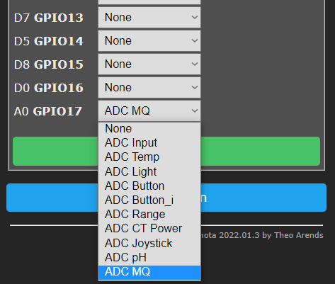

The ESP8266 has a single ADC pin available. It may be used to read voltage at the ADC pin or to read a module supply voltage (VCC). 

!!! note
    When referring to the ADC pin these terms are used interchangeably: ADC (Analog-to-digital Converter), TOUT, Pin6, A0 or Analog0.  

!!! warning
     Check your Wi-Fi module! The ESP8266 A0 pin supports a maximum voltage of 1.0V. Many newer Wi-Fi modules have an on-board voltage divider to support a higher A0 input voltage range (typically in the range between 0 and 3.3 volts). You may need to use an external voltage divider to ensure your input voltage is in the right range.

By default Tasmota uses the ADC pin to read voltage. The signal comes from an analog peripheral, or sometimes from the device itself (see [Shelly 2.5](devices/Shelly-2.5.md)). 

After wiring a peripheral to GPIO17 (A0) pin you have to configure it in **Configure Module**:



The ESP32 board has eight ADC GPIO pins available (gpio32, gpio33, gpio34, gpio35, gpio36, gpio37, gpio38, gpio39 which are ADC1 channel in ESP32 platform, see [Tasmota ESP32 features](https://tasmota.github.io/docs/ESP32/). Usually only 6 available in ESP32 board: 32, 33, 34, 35, 36 and 39) which can be used for analog inputs. These can be used to read voltage at the ADC pin or to read the module supply voltage (VCC). 
All analog input pins support 3.3V. 

!!! warning: gpio 34, 35, 36 and 39 are input only pins. These pins do NOT have internal pull-up or pull-down resistors.

After wiring a peripheral to the specified Analog Input GPIO pin, it can be configured in **Configure Module**:


#|Option|WebUI display|MQTT message
-|-|-|-
0|None| none | none
1|Analog | Analog0 _%value%_ | `{"A0":%value%}`
2|Temperature | Temperature _%value%_ °C (°F) | `{"Temperature":%value%},"TempUnit":"C"}`
3|Light | Illuminance _%value%_ lux | `{"Illuminance":%value%}`
4|Button | none | none
5|Buttoni | none | none
6|Range| Range _%value%_ | `{"Range":%value%}`
7|CT Power| Voltage 230 V<br>Current _%value_ A<br>Power _%value_ W<br>Energy Total _%value_ kWh| `{"Energy":%value,"Power":%value,"Voltage":230,"Current":%value}`
9|pH| ph _%value_| `{"pH":%value}`
10|MQ-X| MQ-X _%value_ ppm| `{"MQX":%value}`

The reading will show in the web UI's sensor section as "_%option% %value%_" depending on the selected option. Tasmota calculates the values for temperature and light, analog values can be `1` to `1024`.

!!! note
     When using Temperature (2) or light (3) calibration may be required. [`AdcParam`](Commands.md#adcparam) can be used to calibrate the output to adjust for any shifted values.

Example: ADC as `Analog (1)`    


A message will be published in `tele/%topic%/SENSOR` JSON response as `"ANALOG": ` depending on the selected option.

Example: ADC as `Light (3)`   
```json
18:55:09 MQT: tele/tasmota/SENSOR = {"Time":"2019-10-31T18:55:09","ANALOG":{"Illuminance":8}}
```

!!! warning
     Be careful when setting ADC as a 'Button', if there is a constant voltage to the pin it might register as a [long press](Buttons-and-Switches#long-press) and reset the device to firmware defaults.

### Commands

Command|Parameters
:---|:---
AdcParam<x\><a class="cmnd" id="adcparam"></a>|[ADC](ADC) analog input tuning parameters. On ESP32 x is channel `1..8`, and the input max is 4095 instead of 1023 as used below.<br>`<sensor>, <param1>, <param2>, <param3>,  <param4>`<BR>`<sensor>` values:<br>&emsp; `2` = Temperature [Steinhart-Hart thermistor equation](https://en.wikipedia.org/wiki/Steinhart%E2%80%93Hart_equation) parameters:</li><ul>`<param1>` = NTC Voltage bridge resistor in Ohms *(default = `32000`)*<br>`<param2>` = NTC Resistance in Ohms *(default = `10000`)*<BR>`<param3>` = NTC Beta Coefficient *(default = `3350`)*</li></ul><br>&emsp; `3` = Light [Lux equation](https://www.allaboutcircuits.com/projects/design-a-luxmeter-using-a-light-dependent-resistor/) parameters:</li><ul>`<param1>` = LDR Voltage bridge resistor in Ohms *(default = `10000`)*<BR>`<param2>` = LDR Lux Scalar *(default = `12518931`)*<BR>`<param3>` = LDR Lux Exponent *(default = `-1.4050`)*</li></ul><br>&emsp; `6` = ADC linear range remapping parameters:</li><ul>`<param1>` = input range low value `adcLow` *(default = `0`)*<BR>`<param2>` = input range high value `adcHigh` *(default = `1023`)*<BR>`<param3>` = output range low value `rangeLow` *(default = `0`)*<BR>`<param4>` = output range high value `rangeHigh` *(default = `100`)*<BR>The range remapping perform the following calculation on the ADC value *[0..1023]*:<BR>`Range = ((adcHigh - ADC) / (adcHigh - adcLow)) * (rangeLow - rangeHigh) + rangeHigh`<br>*The calculation is performed in double resolution floating point, but the output is a signed integer. All 4 input parameters are unsigned 16 bit integers.*<BR>Example to convert the ADC value on a D1-mini into millivolts (using the default resistor bridge of 220k/100k):<BR>`AdcParam 6, 0, 1023, 0, 3200`</li></ul><br>&emsp; `7` = CT POWER parameter adjustments:</li><ul>`<param1>` = ANALOG_CT_FLAGS (default 0 for a non-invasive current sensor). When value is `>0` it sets the `adcLow` value as base for the measurement via OpAmp differential amplifier.<BR>`<param2>` = ANALOG_CT_MULTIPLIER ( 2146 = Default settings for a (AC) 20A/1V Current Transformer.) multiplier\*100000 to convert raw ADC peak to peak range 0..1023 to RMS current in Amps. Value of 100000 corresponds to 1<BR>`<param3>` = ANALOG_CT_VOLTAGE (default 2300) to convert current in Amps to apparent power in Watts using voltage in Volts/1000. Use value 0.220 for AC220V or 0.012 for 12VDC.<BR>`<param4>` minimum current threshold (AC only, optional, default 0). Current measured below this value will be forced to 0.0. Used to void measurment noise when load is null.<BR>Exemple for DC: `AdcParam 7,406,3282,0.012`<BR>Exemple for AC: `AdcParam 7,0,2146,0.230,0.060`<BR>See circuit diagram [below](#adc_ct-circuit)</li></ul><BR>&emsp; `9` = ANALOG_PH parameter adjustments:</li><ul>`<param1>` = ANALOG_PH_CALSOLUTION_LOW_PH (default 4.0).<BR>`<param2>` = ANALOG_PH_CALSOLUTION_LOW_ANALOG_VALUE ( default 282 )<BR>`<param3>` = ANALOG_PH_CALSOLUTION_HIGH_PH (default 9.18).<BR>`<param4>` = ANALOG_PH_CALSOLUTION_HIGH_ANALOG_VALUE (default 435).<BR><BR>To calibrate the probe, two reference solutions with known pH are required. Calibration procedure: <ol><li>Put probe in solution with lower pH value. pH value of the solution is ANALOG_PH_CALSOLUTION_LOW_PH.</li><li>Wait until analog value / RAW value stabilizes (~3 minutes)</li><li>The analog reading is ANALOG_PH_CALSOLUTION_LOW_ANALOG_VALUE</li><li>Clean probe and put in solution with higher pH value. pH value of the solution is ANALOG_PH_CALSOLUTION_HIGH_PH.</li><li>Wait until analog value / RAW value stabilizes (~3 minutes)</li><li>The analog reading is ANALOG_PH_CALSOLUTION_HIGH_ANALOG_VALUE</li></ol>Analog readings can be read by either changing the analog port configuration to "Analog Input" while calibrating, or by enabling debug logs in the console and having a look at the `RAW Value`reading instead.</li></ul><BR>&emsp; `10` = MQ-X sensors parameter adjustments:</li><ul>`<param1>` = ANALOG_MQ_TYPE (default 2) It used to specify sensor type. At the moment exists: 2, 3, 4, 5, 6, 7, 8, 9, 131, 135 (means MQ-02, MQ-03, MQ-04 ecc.).<BR>`<param2>` = ANALOG_MQ_A (default 574.25 a params for MQ-02) It is exponential regression a params<BR>`<param3>` = ANALOG_MQ_B (default -2.222 b params for MQ-02) It is exponential regression b params, generally negative<BR>`<param4>` = ANALOG_MQ_RatioMQCleanAir (default 15.0 RatioMQCleanAir params for MQ-02) NOT USED YET. It is threshold for good air in ppm for future alams arming<BR>Usage example for MQ-02, MQ-04, MQ-07 and MQ-131<BR> `AdcParam 10, 2.00, 574.25, -2.22, 9.83`<BR> `AdcParam 10, 4.00, 1012.70, -2.79, 4.40 `<BR> `AdcParam 10, 7.00, 99.04, -1.52, 27.50 `<BR> `AdcParam 10, 131.00, 23.94, -1.11, 15.00 `</li></ul><BR>

### Rule triggers
Use these triggers in rules:    

`on ANALOG#A0div10 do ...` - when the ADC input changes by more than 1% it provides a value between 0 and 100    

`on Tele-ANALOG#A0 do ...` - triggers on tele messages with Analog object
> `MQT: tele/tasmota/SENSOR = {"Time":"2019-01-14T19:36:51","ANALOG":{"A0":1024}}`

Rule example: [using a potentiometer on analog pin](Rules#use-a-potentiometer).

## ADC_CT circuit

You should use a current transformer with voltage output such as a 20A/1V or 50/1V. Do not use a CT with current output.

The below circuit shows how to connect the CT. The exact values for the capacitors or the resitors is not very critical 
(values that are double or half will work the same but the 2 resitors should be the same value).

In order to avoid noise, build as compact as possible using short wires and insulating where possible.


!!! note
     The section on the right represents the voltage divider that is present on the NodeMCU or mini-D1 to 
     provide a [0.0 - 3.3V] input range (the native range of ESP8266 ADC pin is 0.0-1.0V). If you are using 
     a bare ESP8266 module without that divider, you need to add it.

!!! note
     ESP32 natively has a [0.0 - 3.3V] input range and doesn't need the divider on the right.


## ADC_VCC
Instead of an input, the ADC pin can be used to measure the supply voltage of the ESP module (*this reading is not 100% accurate*). To enable the ADC_VCC feature; [compile your own build](Compile-your-build):

**If you enable ADC_VCC you cannot use the pin as analog input anymore.**

user_config_override.h flag:
```
// -- Internal Analog input -----------------------
#define USE_ADC_VCC                              // Display Vcc in Power status
```

Supply voltage is published in `tele/%topic%/STATE` under `"Vcc":` in mV:
```
11:14:59 MQT: tele/tasmota/STATE = {"Time":"2019-10-31T11:14:59","Uptime":"0T18:36:12","UptimeSec":66972,"Vcc":3.423,"Heap":28,"SleepMode":"Dynamic","Sleep":50,"LoadAvg":19,"MqttCount":6,"POWER":"OFF","Wifi":{"AP":1,"SSId":"Tasmota","BSSId":"00:00:00:00:00:00","Channel":13,"RSSI":100,"LinkCount":1,"Downtime":"0T00:00:06"}}
```
