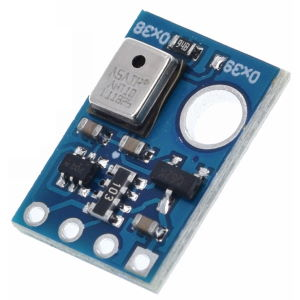
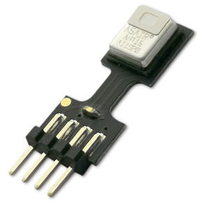

# AHT1x/AHT2x and compatible temperature and humidity sensor
!!! failure "This feature is not included in precompiled binaries"  

To use it you must [compile your build](Compile-your-build). Add the following to `user_config_override.h` to add support for AHT10 or AHT15:
```
#ifndef USE_AHT1x
#define USE_AHT1x       // [I2cDriver43] Enable AHT10/15 humidity and temperature sensor (I2C address 0x38 or 0x39)
#endif
```
or those lines for AHT20 or AM2301B:
```
#ifndef USE_AHT2x
#define USE_AHT2x       Enable AHT20 instead of AHT1x humidity and temperature sensor (I2C address 0x38)
#endif
```

----

AHT10 or AH15 are an I<sup>2</sup>C temperature and humidity sensor.
AHT20 or AM2301B are upgraded versions.

## Configuration

!!! failure "This sensor is incompatible with other I^2^C devices on I^2^C bus"
    Sensor datasheet implicitly says:
    **Only a single** AHT10 can be connected to the I^2^C bus and no other I^2^C devices can be connected.
    The AHT20/AM2301B do not suffer from this problem.

### Wiring
| AHT1x   | ESP8266 |
|---|---|
|VCC   |3.3V
|GND   |GND   
|SDA   | GPIOx
|SCL   | GPIOy


### Tasmota Settings 
In the **_Configuration -> Configure Module_** page assign:

1. GPIOx to `I2C SDA (6)`
2. GPIOy to `I2C SCL (5)`

After a reboot the driver will detect AHT1x automatically and display sensor readings.


and in MQTT topic (according to TelePeriod):    
```
{"Time":"2020-01-01T00:00:00","AHT1X-0x38":{"Temperature":24.7,"Humidity":61.9,"DewPoint":16.8},"TempUnit":"C"}
```


### Breakout Boards



**Note**: The pins on the smaller breakout board with the AHT15 are in a different order: VDD - SDA - GND - SCL
See also the datasheet.

[AHT10 Datasheet](https://server4.eca.ir/eshop/AHT10/Aosong_AHT10_en_draft_0c.pdf)    
[AHT15 Datasheet](https://wiki.liutyi.info/download/attachments/35291280/Aosong_AHT15_en_draft_0.pdf?version=1&modificationDate=1563622682730&api=v2)
