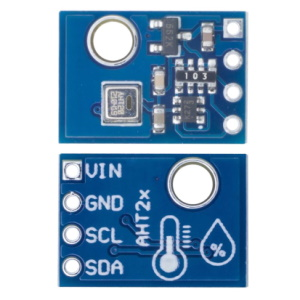
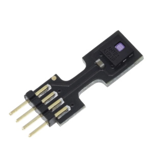
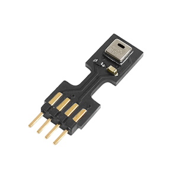
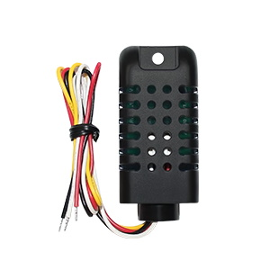

# AHT2x/AM2301B temperature and humidity sensor

??? failure "This feature is not included in precompiled binaries"  

    When [compiling your build](Compile-your-build) add the following to `user_config_override.h`:
    ```
    #ifndef USE_AHT2x
    #define USE_AHT2x       // [I2cDriver43] Enable AHT20/AM2301B instead of AHT1x humidity and temperature sensor (I2C address 0x38) (+0k8 code)
    #endif
    ```

## Configuration

### Wiring
| AHT   | ESP |
|---|---|
|VCC   |3.3V
|GND   |GND   
|SDA   | GPIOx
|SCL   | GPIOy


### Tasmota Settings 
In the **_Configuration -> Configure Module_** page assign:

1. GPIOx to `I2C SDA`
2. GPIOy to `I2C SCL`

After a reboot the driver should detect the sensor and display sensor readings.

### Troubleshooting
On some I2C sensors, like the AHT25, Tasmota might mistake the sensor for another one using the same address.
This can be resolved by disabling the unneeded drivers.

For our example AHT25, the address might get confused with the VEML6070 UV sensor. You can tell Tasmota to use the other driver by issuing the following commands in the console:

- `I2CDriver12 0` to disable the VEML driver
- `I2CDriver43 1` to enable the AHT driver

An overview of all [I2C drivers](https://tasmota.github.io/docs/I2CDEVICES/#supported-i2c-devices) is available in the docs.

### Breakout Boards



[AHT20 Datasheet](http://www.aosong.com/userfiles/files/media/Data%20Sheet%20AHT20.pdf)    
[AHT21 Datasheet](http://www.aosong.com/userfiles/files/media/Data%20Sheet%20AHT21.pdf)
[AHT25 Datasheet](http://www.aosong.com/userfiles/files/media/Data%20Sheet%20AHT25%20A2.pdf)
