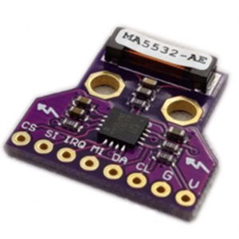
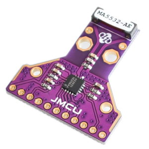

# AS3935 Franklin Lightning sensor 

!!! info "This feature is included only in tasmota-sensors.bin"  

The AS3935 is a programmable fully integrated Lightning
Sensor IC that detects the presence and approach of potentially
hazardous lightning activity in the vicinity and provides an
estimation on the distance to the head of the storm. The
embedded lightning algorithm checks the incoming signal
pattern to reject the potential man-made disturbers.

Tasmota driver includes:

- support for all AS3935 Parameters
- support of all related commands for configuration
- support of NF-Auto Function to auto Threshold the Noise Reduction
- support of Auto Disturber
- support of calibrating the internal OSC with switchable Caps

## Configuration

### Wiring
| AS3935   | ESP8266 |
|---|---|
|GND   |GND   
|VCC   |3.3V
|SDA   | GPIOx
|SCL   | GPIOy
|IRQ   | GPIOz

!!! warning     
    Sensor uses a software interrupt. Make sure that the connection with the IRQ pin is stable to prevent flicker.

### Tasmota Settings 
In the **_Configuration -> Configure Module_** page assign:

1. GPIOx to `I2C SDA (6)`
2. GPIOy to `I2C SCL (5)`
3. GPIOz to `AS3935 (202)`

After a reboot the driver will detect AS3935 automatically.

## Commands and Use

 Console Commands    | Description                                  | values                                        |Bitlength 
---------------------|----------------------------------------------|-----------------------------------------------|----------
 AS3935setnf         | Noise Floor Level                            |                value from 0-7                 | (3 Bit)  
 AS3935setml         | Minimum number of lightning                  |                1, 5, 9, 16                    | (2 bit)  
 AS3935default       | load default for Sensor and Settings         |                no argument                    |          
 AS3935setgain       | Set Indoor/Outdoor                           |              Indoors/Outdoors                 | (Ascii)  
 AS3935settunecaps   | Internal Tuning Cap.                         |              value from 0-15                  | (4 Bits) 
 AS3935setrej        | Spike rejection                              |              value from 0-15                  | (4 Bits) 
 AS3935setwdth       | Watchdog threshold                           |              value from 0-15                  | (4 Bits) 
 AS3935setminstage   | min stage that could be come with NFautotune |  value from 0-15: 0-7 Indoors, 8-15 Outdoors  | (4 Bits) 
 AS3935disturber     | Set Disturber                                |                   0/1                         | (1 Bit)  
 AS3935autonf        | Set Auto Tune for Noise Level                |                   0/1                         | (1 Bit)  
 AS3935autodisturber | Set Auto-Disturber                           |                   0/1                         | (1 Bit)  
 AS3935autonfmax     | Auto Tune with INDOOR and OUTDOOR            |                   0/1                         | (1 Bit)  
 AS3935mqttevent     | mqtt messages only for lightning events      |                   0/1                         | (1 Bit)  
 AS3935settings      | show all settings                            |                no argument                    |          
 AS3935calibrate     | auto calibrate the internal Capacitors       |                no argument                    |          
 AS3935disttime      | time for reset Disturber in auto-mode        |                 0-15 min.                     | (4 Bit)  
 AS3935nftime        | time for auto-Nf treshhold                   |                 0-15 min                      | (4 Bit)  

!!! note "Note for `AS3935Calibrate`"
    Normally you don't need the calibrate function. If you buy the AS3935, the module has a sticker on it with the calibrated cap.
    Use `AS3935Settunecaps` for setting up this value.

Mqtt Events:

No.| Description                          |Suppress with   AS3935mqttevent
:-:|--------------------------------------|:-------------------:
 0 | no event                             |                    
 1 | Lightning with Distance detected     |                   
 2 | Lightning out of Distance            |                   
 3 | Distance cannot be determined        |                    
 4 | Storm is Overhead                    |                   
 5 | Noise level too high                 |*          
 6 | Disturber detected                   |*         
 7 | Irq with no Event detected           |                    

Setting table of the NF-noise sensitivity and stages:

 Stages   | NF-LEV |   AFE-GB   | uVrms |   Sensitivity
-----------|--------|------------|-------|-------------------
  Stage 0  |   000  |  Indoors   |    28 | highly sensitive
  Stage 1  |   001  |  Indoors   |    45 |    
  Stage 2  |   010  |  Indoors   |    62 |        
  Stage 3  |   011  |  Indoors   |    78 |        
  Stage 4  |   100  |  Indoors   |    95 |        
  Stage 5  |   101  |  Indoors   |   112 |     
  Stage 6  |   110  |  Indoors   |   130 |      
  Stage 7  |   111  |  Indoors   |   146 |        
  Stage 8  |   000  |  Outdoors  |   390 |        
  Stage 9  |   001  |  Outdoors  |   630 |      
  Stage 10 |   010  |  Outdoors  |   860 |       
  Stage 11 |   011  |  Outdoors  |  1100 |        
  Stage 12 |   100  |  Outdoors  |  1140 |       
  Stage 13 |   101  |  Outdoors  |  1570 |        
  Stage 14 |   110  |  Outdoors  |  1800 |       
  Stage 15 |   111  |  Outdoors  |  2000 | less sensitive

## Breakout Boards

[Datasheet](https://www.mouser.com/datasheet/2/588/ams_AS3935_Datasheet_EN_v5-1214568.pdf)
