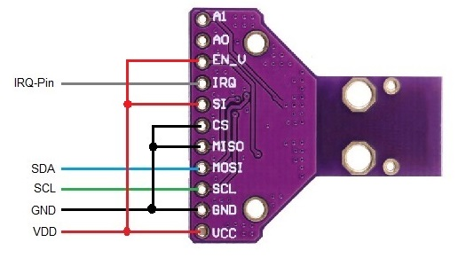

# AS3935 Franklin Lightning sensor

!!! info "This feature is included only in tasmota-sensors.bin"


The AS3935 is a programmable fully integrated Lightning
Sensor IC that detects the presence and approach of potentially
hazardous lightning activity in the vicinity and provides an
estimation on the distance to the head of the storm. The
embedded lightning algorithm checks the incoming signal
pattern to reject the potential man-made disturbers.

Tasmota driver includes:

- support for all AS3935 Parameters
- support of all related commands for configuration
- support of NF-Auto Function to auto Threshold the Noise Reduction
- support of Auto Disturber
- support of calibrating the internal OSC with switchable Caps

## Configuration

### Wiring
| AS3935   | ESP8266 |
|---|---|
|GND   |GND
|VCC   |3.3V
|SDA   | GPIOx
|SCL   | GPIOy
|IRQ   | GPIOz

!!! warning
    "Sensor uses a software interrupt. Make sure that the connection with the IRQ pin is stable to prevent flicker."

### Tasmota Settings
In the **_Configuration -> Configure Module_** page assign:

1. GPIOx to `I2C SDA (6)`
2. GPIOy to `I2C SCL (5)`
3. GPIOz to `AS3935 (202)`

!!! tip "Note for I2C Use"
You will need to wire up all of the associated pins for the different boards.<br>
- Always connect CS and MISO to GND.<br>
- If "SI" is present, you need to connect to VCC.<br>
See some wiring on the Board pictures below. [I2C wiring](#breakout-boards-and-wiring-for-i2c-use)


After a reboot the driver will detect AS3935 automatically.


and in MQTT topic when an Event occurs:
```
{"Time":"2020-01-01T17:07:07","AS3935":{"Event":4,"Distance":12,"Energy":58622,"Stage":1}}
```

## Commands and Use

 Console Commands    | Description                                  | values                                        |Bitlength
---------------------|----------------------------------------------|-----------------------------------------------|----------
 AS3935power         | Power On/Off the Device                      |                 0/1 (On/Off)                  | (1 Bit)
 AS3935setnf         | Noise Floor Level                            |                value from 0-7                 | (3 Bit)
 AS3935setml         | Minimum number of lightning                  |                1, 5, 9, 16                    | (2 bit)
 AS3935default       | load default for Sensor and Settings         |                no argument                    |
 AS3935setgain       | Set Indoor/Outdoor                           |              Indoors/Outdoors                 | (Ascii)
 AS3935settunecaps   | Internal Tuning Cap.                         |              value from 0-15                  | (4 Bits)
 AS3935setrej        | Spike rejection                              |              value from 0-15                  | (4 Bits)
 AS3935setwdth       | Watchdog threshold                           |              value from 0-15                  | (4 Bits)
 AS3935setminstage   | min stage that could be come with NFautotune |  value from 0-15: 0-7 Indoors, 8-15 Outdoors  | (4 Bits)
 AS3935disturber     | Set Disturber                                |                 0/1 (On/Off)                  | (1 Bit)
 AS3935autonf        | Set Auto Tune for Noise Level                |                 0/1 (On/Off)                  | (1 Bit)
 AS3935autodisturber | Set Auto-Disturber                           |                 0/1 (On/Off)                  | (1 Bit)
 AS3935autonfmax     | Auto Tune with INDOOR and OUTDOOR            |                 0/1 (On/Off)                  | (1 Bit)
 AS3935lightevent    | mqtt messages only for lightning events      |                 0/1 (On/Off)                  | (1 Bit)
 AS3935noirqevent    | suppress mqtt "IRQ with no Event" Messages   |                 0/1 (On/Off)                  | (1 Bit)
 AS3935settings      | show all settings                            |                no argument                    |
 AS3935calibrate     | auto calibrate the internal Capacitors       |                no argument                    |
 AS3935disttime      | time for reset Disturber in auto-mode        |                 0-15 min.                     | (4 Bit)
 AS3935nftime        | time for auto-Nf treshhold                   |                 0-15 min                      | (4 Bit)


!!! note "Note for `AS3935Calibrate`"
    Normally you don't need the calibrate function. If you buy the AS3935, the module has a sticker on it with the calibrated cap.
    Use `AS3935Settunecaps` for setting up this value.<br>
    if the calibration fails, it is possible that you have a board with the wrong caps on it! (some CJMCU-Boards)


## Mqtt Events:

No.| Description                          | Suppress with <br> Command<br>```AS3935lightevent``` | Suppress with <br>Command<br>```AS3935noirqevent```
:-:|--------------------------------------|:-----------------------------------:|:-----------------------------------:
 0 | no event                             |                                     |
 1 | Lightning with Distance detected     |                                     |
 2 | Lightning out of Distance            |                                     |
 3 | Distance cannot be determined        |                                     |
 4 | Storm is Overhead                    |                                     |
 5 | Noise level too high                 |*                                    |
 6 | Disturber detected                   |*                                    |
 7 | Irq with no Event detected           |                                     |*
 8 | Irq Pin flicker detected             |                                     |
 9 | Device is Powerd Off                 |                                     |


## NF setting table:

Setting table of the NF-noise sensitivity and stages:

 Stages    | NF-LEV |   AFE-GB   | uVrms | Sensitivity
-----------|--------|------------|-------|-------------------
  Stage 0  |   000  |  Indoors   |    28 | highly sensitive
  Stage 1  |   001  |  Indoors   |    45 |
  Stage 2  |   010  |  Indoors   |    62 |
  Stage 3  |   011  |  Indoors   |    78 |
  Stage 4  |   100  |  Indoors   |    95 |
  Stage 5  |   101  |  Indoors   |   112 |
  Stage 6  |   110  |  Indoors   |   130 |
  Stage 7  |   111  |  Indoors   |   146 |
  Stage 8  |   000  |  Outdoors  |   390 |
  Stage 9  |   001  |  Outdoors  |   630 |
  Stage 10 |   010  |  Outdoors  |   860 |
  Stage 11 |   011  |  Outdoors  |  1100 |
  Stage 12 |   100  |  Outdoors  |  1330 |
  Stage 13 |   101  |  Outdoors  |  1570 |
  Stage 14 |   110  |  Outdoors  |  1800 |
  Stage 15 |   111  |  Outdoors  |  2000 | less sensitive


!!! tips "Hint and Tips"
- take a stabilized power supply.
- keep a distance of at least 200 mm from the ESP and the AS3395
- be careful with "ready to Use" devices like Sonoff, etc. they don't have a good power supply inside.
- use a Ferrit clamp filter on the sensor cable.
- wire all related Pins for I2C use.

You can find some troubleshooting tips in the [Tasmota GitHub discussion](https://github.com/arendst/Tasmota/pull/8130).

## Breakout Boards and Wiring for I2C use:

#### PlayingwithFusion Board:<br>
<br>
#### Sparkfun Board V2.0:<br>
<br>
#### Embedded Adventures Board:<br>
<br>
#### CJMCU Board:<br>
<br>
#### GY-AS3935 Board:<br>
<br>
<br>
<br>

## Breakout Boards Issues:
!!! warning
"Some type of this sensor have wrong capacitors (100pF and 1000pF) installed and the calibration fails.
The correct caps are 680pF and 270pF." <br>

<br><br>

## Datasheet:
[Datasheet from Mouser Web Site](https://www.mouser.com/datasheet/2/588/ams_AS3935_Datasheet_EN_v5-1214568.pdf)
