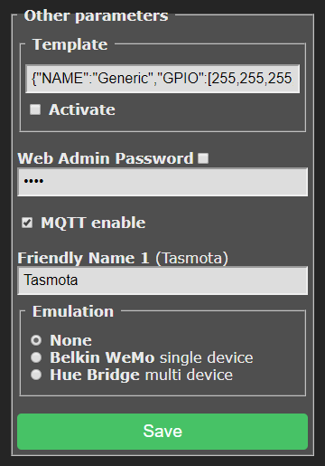

??? tip "This feature is included only in `tasmota`, `tasmota32`, `tasmota-lite` and `tasmota-sensors` binaries" 

    When [compiling your build](Compile-your-build) add the following to `user_config_override.h`:
    ```c++
     #define USE_EMULATION              // Enable Wemo or Hue emulation
     #define USE_EMULATION_HUE          // Enable Hue Bridge emulation for Alexa (+14k code, +2k mem common)
     #define USE_EMULATION_WEMO         // Enable Belkin WeMo emulation for Alexa (+6k code, +2k mem common)
     ```

## Connecting to Alexa

You can interact with Tasmota using Amazon Alexa through its Echo devices . 

In **Configuration - Configure Other** page in the webUI select emulation type.



!!! warning
     Alexa Hue integration requires a physical Alexa device. The app alone is not enough.

!!! info "Check your router settings. You have to enable **IGMP**"

#### Belkin WeMo Emulation
Use Belkin WeMo for devices with a single relay or Hue Bridge for devices with one or more relays or for lights. Tasmota devices will be discovered by the Alexa app.

You do not need to install the Wemo app or enable the Wemo skill in Alexa. Just tell Alexa to discover devices of the appropriate type (plug, switch, etc.) and when it asks what brand device, scroll to the end and choose "Other".

#### Hue Bridge Emulation
For control of lights, color control (introduced in version 6.5.0.9), on/off, and dimming is supported. Enable `Hue Bridge` emulation and perform a device discovery in the Alexa app. No skill needs to be added to Alexa. Select Hue Bridge V1 as the device type.

Relays and lights with friendly names beginning with a dollar sign (`$`) will cause Tasmota to not "announce" them (i.e., be hidden) to Alexa. If they were previously discovered, they will still continue to work. As there are only four friendly names provided in Tasmota, if `FriendlyName4` begins with `$`, component 4 and all higher numbered discoverable components will not be discovered by Alexa.  

!!! note "Hue Bridge emulation does not support sensors."  

