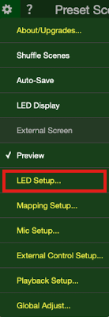
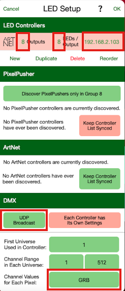
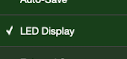

??? tip "This feature included in Tasmota32 precompiled binary but not in ESP8266 builds" 

    When [compiling your build](Compile-your-build) add the following to `user_config_override.h`:
    ```c++
    #define USE_LIGHT_ARTNET                         // Add support for DMX/ArtNet via UDP on port 6454 (+3.5k code) 
    ```

ArtNet is a royalty-free UDP based protocol to transport DMX lighting control.It allows to control either a Light, or a WS2812 Matrix/Strip with a remote software with real-time animations.

This feature is experimental, it has been tested with LED Lab (Mac and iOS) and QLC (linux)

When enabling ArtNet mode, Tasmota listens to UDP port 6454 on local address and on multicast address `239.255.25.54`. Incoming DMX/ArtNet packets drive the display and light.


Important: DMX/ArtNet payload must be sent in `GBR` format, i.e. 3 bytes in Green/Red/Blue order.

While in ArtNet mode, you can control the brightness with `Dimmer` and turn off light/display with `Power`; or with the Web UI. Changing the color has no effect until you stop ArtNet mode.

## Quickstart Tutorial

Step 1. Flash Tasmota32 to ESP32 based device, or compile your own firmware with `#define USE_LIGHT_ARTNET` for ESP8266 based devices

Step 2. Configure and launche ArtNet.

For [M5Stack Atom Matrix](https://shop.m5stack.com/products/atom-matrix-esp32-development-kit) or [ESP32C3 01Space RGB](https://github.com/01Space/ESP32-C3FH4-RGB), the matrix is 5x5 no alternate:

`ArtNetConfig {"Rows":5, "Cols":5, "Offset":0, "Alternate":false, "Universe":0}`
`ArtNet Start`

For BTF Lighting 8x8 or 16x16 matrix, with alternate lines:

`ArtNetConfig {"Rows":8, "Cols":8, "Offset":0, "Alternate":true, "Universe":0}`
`ArtNet Start`

Step 3. Download [LED Lab](http://appstore.com/ledlab) from [Christopher Schardt](http://schardt.org) for MacOS or iOS

Step 4. Launch `LED Lab`, click on the `Settings` icon (wheel), select `LED Setup...`



In the LED Setup:
- Enter the number of rows in `Outputs`
- Enter the number of columns in `LEDS/Output`
- Enter the IP Address of the Tasmota device
- Make sure that `UDP Broadcast` is selected (green background)
- Make sure `First Universe` is 1 and `Channel Range` starts with `1`
- Set `Channel Values for Each Pixel` to `GRB`
- Click `OK` in upper right corner



Step 5. Back to the Settings, click on `LED Display` to start streaming. Your device should start to show LED animations.




## Operating modes

### LED matrix

When setting `"Rows":<x>` with `<x>` greater than `1`, the display is considered as a LED matrix. The first row matches the Univers number, and following rows are matched to increasing Universe numbers.

Example for M5Stack Atom Matrix or ESP32C3 RGB:
```
ArtNetConfig {"Rows":5, "Cols":5, "Offset":0, "Alternate":false, "Universe":0}
ArtNet Start
```

The following are done with [Athom LED strip controller](https://templates.blakadder.com/athom_LS2812B-TAS.html) (ESP8266), using an external level shifter, and 8x8 Adafruit matrix.

Fast animation:


### Linear Strip

When setting `"Rows":1` ArtNet uses the WS2812 as a linear strip, and converts the paylaod to strip values.

Example for M5Stack Atom Matrix or ESP32C3 RGB:
```
ArtNetConfig {"Rows":1, "Cols":30, "Offset":0, "Universe":0}
ArtNet Start
```

### Single Light

When setting `"Cols":0` (zero columns) ArtNet uses the first GBRWW payload to control the global light (ex PWM) or the entire WS2812 strip. Multiple single lights (eg. bulbs) can be used on the same universe by setting the offset value.

Example:
```
ArtNetConfig {"Cols":0, "Universe":0, "Offset":0}
ArtNet Start
```

The calibration values set by the RGBWWTable command will be applied to any DMX inputs.
For example to disable the white channels:
```
RGBWWTable 255,255,255,0,0
```

## Commands

Command|Description
:---|:---
ArtNetConfig &lt;json&gt;<a class="cmnd" id="artnetconfig"></a>|Example `ArtNetConfig {"Rows":5, "Cols":5, "Offset":0, "Alternate":false, "Universe":0}`<BR>There are two modes for ArtNet configuration: simple light or adressable leds.<BR>In simple Light mode, `"cols"` is zero. Only `"Universe"` needs to be specified.<BR>Example: `ArtNetConfig {"Cols":0, "Universe":0}`<BR>In Adressable Light mode, all parameters can be specified.<BR><BR>`Rows`: number of rows of display, `1` for light mode or single strip<BR>`Cols`: number of columns of the display, or length of the strip, or `0` for single light<BR>`"Offset"`: number of adressable leds to skip<BR>`Alternate`: (true/false) indicates that every other line is reversed (common in large matrix)<BR>`Universe`: starting DMX Universe number for the first line (0 based so you may need to substract 1 from software)
ArtNet<a class="cmnd" id="artnet"></a>|`Start`, `On`>`, or `1`: Start ArtNet mode, listen to UDP port 6454 and force `SetOption148 1` for autorun at restart<BR>`Stop`, `Off` or `0`: Stop ArtNet mode, close UDP port and force `SetOption148 0` to disable ArtNet mode at restart
SetOption148|Enables or disables autorun of ArtNet mode at start. If for any reason listening to UDP port fails, this mode is disabled

## Troubleshooting

Note: ArtNet mode is not compatible with `Fade` or `Scheme`.

When ArtNet mode is enabled, packet metrics are added to Teleperiod or can be shown with `Status 10`.

```
16:47:42.981 RSL: SENSOR = {"Time":"2022-11-12T16:47:42","ArtNet":{"PacketsReceived":40149,"PacketsAccepted":40149,"Frames":8272,"PacketsPerRow":[8030,8030,8030,8030,8029]}}
```

ArtNet metric|Description
:---|:---
PacketsReceived|Number of UDP packet received on port 6454
PacketsAccepted|Number of packets that are valid ArtNet packets (signature is ok)
Frames|Number of complete frames displayed (i.e. several packets were aggregated to a single frame)
PacketsPerRow|Array of number of packets processed for each row; this can indicate packet loss

`ArtNetConfig` parameters are pesisted in the following Settings:

ArtNet parameter|Stored in
:---|:---
Cols|Stored in `StepPixels`
Rows|Stored in `Pixels` containing Rows*Cols
Offset|Stored in `Rotation`
Atl|Stored in `SetOption16` (counter/clock-wise)
Universe|Stored in a new Settings parameter

## Limitations

The display size is currently limite to 30x30 leds due to RAM and size constraints. It should be possible to go beyond this size with custom builds.

The display was only tested with [LED Lab](http://appstore.com/ledlab) from [Christopher Schardt](http://schardt.org)

LED payload must be formed by a series of 3-bytes for WS2812 or 4-bytes for SK6812 in the following format: GRB for WS2812 and RGBW for SK6812.

Multicast is currently untested.
