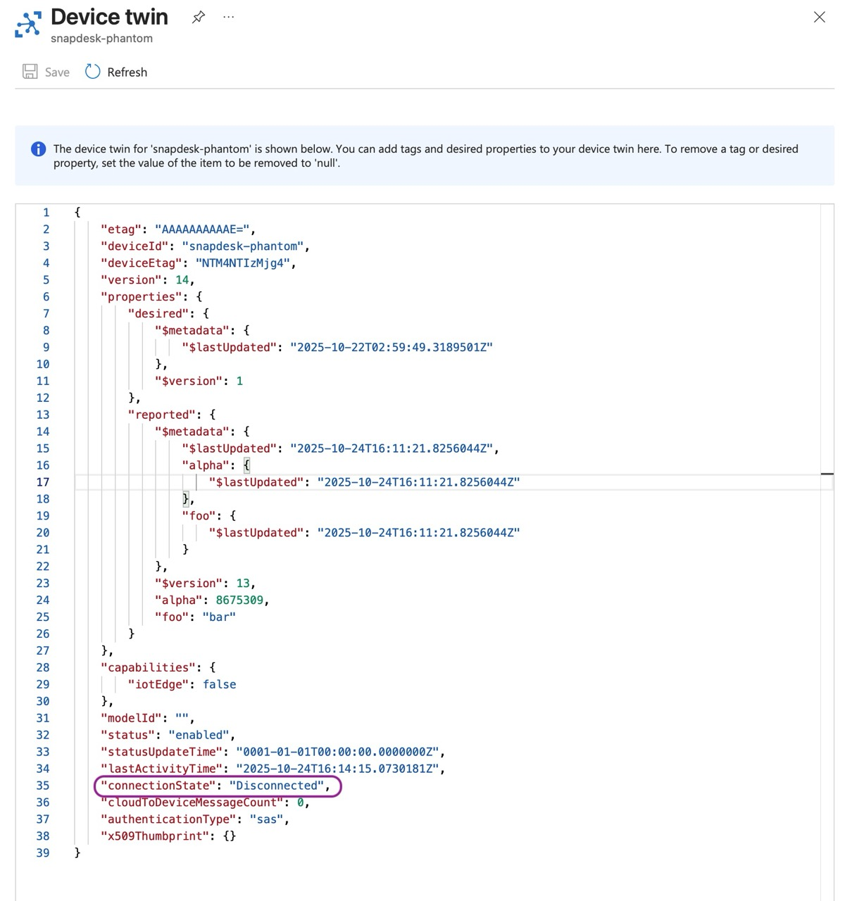
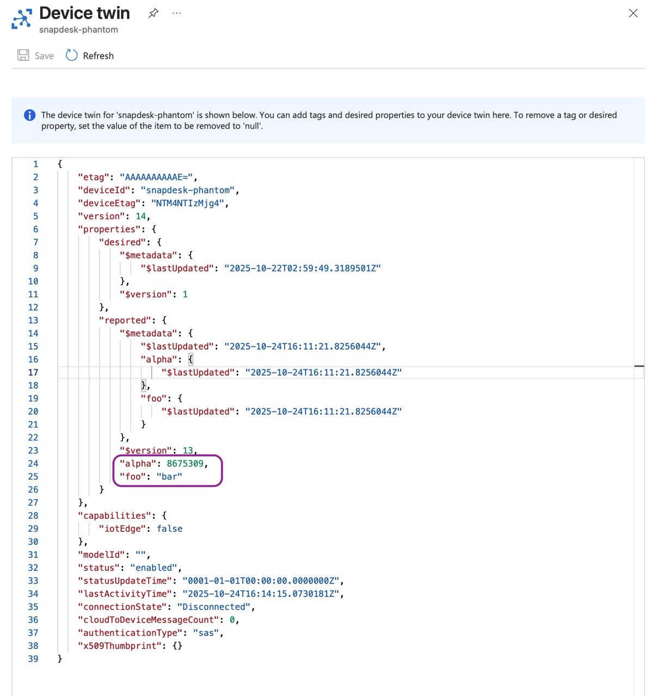

!!! failure "This feature is not included in precompiled binaries, To use it you must compile your build.

Add the following to `user_config_override.h`:

```
#ifndef USE_MQTT_TLS
#define USE_MQTT_TLS
#endif
#define USE_MQTT_AZURE_IOT
```

As of Tasmota version 9.2.4, Tasmota now supports TLS 1.2 connections to [Azure IoT Hub](http://aka.ms/iothub) using time bound token authentication based on a unique key.  Tasmota can be used with or without [Azure Device Provisioning Service](https://docs.microsoft.com/en-us/azure/iot-dps/) which is used for simplified deployment at scale.

## Benefits

Azure IoT Hub supports bi-directional communication between the could and both IoT Devices and/or Intelligent Edge devices base on [Azure IoT Edge](http://aka.ms/iotedge).  Azure IoT Hub supports REST, AMQP and the MQTT 3.1.1 protocol as [discussed here](https://docs.microsoft.com/en-us/azure/iot-hub/iot-hub-mqtt-support).  IoT Hub supports Trusted Platform Module (when used with Device Provisioning Service), x509 Certificates and Preshared Keys authentication [discussed here](https://docs.microsoft.com/en-us/azure/iot-hub/iot-hub-devguide-security).

### Authentication

This version of Tasmota leverages the Preshared Key authentication, which will create a time bound (one hour by default) SHA256 signature based on a unique key.  Only this signed text is sent across the network over a TLS 1.2 channel ensuring mutual authentication.  Because of this time bound nature, Tasmota must (by default) be configured to synchronize time with public Network Time Protocol Servers.  Developer level information provided here [discussed here](https://docs.microsoft.com/en-us/azure/iot-hub/iot-hub-devguide-security#security-tokens).

## Cost

Azure IoT Hub provides a [free tier](https://azure.microsoft.com/en-us/pricing/details/iot-hub/) that allows for up to 8,000 message a day.

### IoT Central

In addition to Azure IoT Hub which is a Platform as a Service (PaaS), Tasmota also works with [IoT Central](http://aka.ms/iotcentral) which is a more complete Software as a Service (SaaS).

## How to configure (without Device Provisioning Service)

### 0. Open an Azure Subscription

If you don't already have an Azure Subscription (one is included with most MSDN subscriptions), you can get started here: [https://azure.microsoft.com/account/free](https://azure.microsoft.com/account/free)

### 1. Create an Azure IoT Hub and a Device

The following steps will walk you through creating an IoT Hub and your first device using a web browser: [https://docs.microsoft.com/en-us/azure/iot-hub/iot-hub-create-through-portal](https://docs.microsoft.com/en-us/azure/iot-hub/iot-hub-create-through-portal)

You will need 3 pieces of information from this step:

Information| Your Setting | <i>Example Value</i>
----|-----|----
IoT Hub Full Name|  | <i>myiothub.azure-devices.net</i>
Device Id|  | <i>myfirstTasmotaDevice</i>
Primary Key|  | <i>i2B6TVRnpWGS5i5aZaRddaGTc+tIte1gg4PUkh0t+30=</i>

### 2. Compile your binary including support for Azure IoT

Following the directions here: [https://tasmota.github.io/docs/Compile-your-build/](https://tasmota.github.io/docs/Compile-your-build/) compile your binary adding the following settings to your [my_user_config.h](https://github.com/arendst/Tasmota/blob/development/tasmota/my_user_config.h).
```
#ifndef USE_MQTT_TLS
#define USE_MQTT_TLS
#endif
#define USE_MQTT_AZURE_IOT
```

### 3. Flash your device and configure for WiFi

Flash your device as [discussed here](https://tasmota.github.io/docs/Getting-Started/#flashing) and then configure the WiFi as [discussed here](https://tasmota.github.io/docs/Getting-Started/#using-web-ui).

### 4. Configure your device for you Azure IoT Hub

In the web portal, click the configuration button and then the configure MQTT button.

Following the diagram below, set the: <b>Host</b> (IoT Hub Full Name), <b>Port</b> of 8883, select <b>MQTT TLS</b>, type in the <b>Client</b> and <b>User</b> (your Device Id) and the <b>Password</b> (your Primary Key) and click `Save`.  Your device will reboot and connect.


### 5. Verify the connection

In the Console of Tasmota, you will see it was authenticated with a token, connected and it will start sending state:


Using a tool like the [Azure IoT Explorer](https://github.com/Azure/azure-iot-explorer/releases/), you can see message received in IoT Hub.  Note the topic property.


### 6. Send a message to your Tasmota

Using a tool like the [Azure IoT Explorer](https://github.com/Azure/azure-iot-explorer/releases/), select Cloud-to-device message set a property of `Topic` to `/power`, add `toggle` to the message body and click `Send message to device` button.  All of the Tasmota Commands are discussed here [https://tasmota.github.io/docs/Commands/](https://tasmota.github.io/docs/Commands/).


## How to configure (with Device Provisioning Service)

Azure Device Provisioning Services (DPS) allows for automatic deployment at scale.  Simular to Tasmota authenticating to IoT Hub without DPS, authenticating to DPS uses a time bound SHA256 signature to authenticate over TLS 1.2.

For this setup, we configure the following settings when building our binary.  For full automation, you will want to add `STA_SSID1` and `STA_PASS1` to your `user_config_override.h`.

Add the following to `user_config_override.h`:

```
#ifndef USE_MQTT_TLS
#define USE_MQTT_TLS
#endif
#define USE_MQTT_AZURE_IOT
#define USE_MQTT_AZURE_DPS_SCOPEID        "YOURSCOPEIDHERE"
#define USE_MQTT_AZURE_DPS_PRESHAREDKEY   "YOURPRESHAREDKEYHERE=="
```

### 0. Open an Azure Subscription

If you don't already have an Azure Subscription (one is included with most MSDN subscriptions), you can get started here: [https://azure.microsoft.com/account/free](https://azure.microsoft.com/account/free)

### 1. Create a Device Provisioning Service, IoT Hub and link them together

Following: [https://docs.microsoft.com/en-us/azure/iot-dps/tutorial-set-up-cloud](https://docs.microsoft.com/en-us/azure/iot-dps/tutorial-set-up-cloud) to create your DPS and IoT Hub.  Note your Scope Id for later use as shown below:


### 2. Create a Group Enrollment with a Symmetrical Key

In your Device Provisiniong Service, click `Manage enrollments` and then click `Add enrollment group`.

As shown below, name your group, select <b>Symmetric Key</b>, select your linked IoT Hub and then click `Save`.


Once created you can select the enrollment group to retrieve the <b>Primary Key</b>, as shown below:


### 3. Compile your binary including support for Azure IoT Device Provisioning Service

Following the directions here: [https://tasmota.github.io/docs/Compile-your-build/](https://tasmota.github.io/docs/Compile-your-build/) compile your binary adding the following settings to your [my_user_config.h](https://github.com/arendst/Tasmota/blob/development/tasmota/my_user_config.h) adding your Scope Id and your Primary Key.

!!! tip Don't forget your WiFi settings for complete automation.

```
#ifndef USE_MQTT_TLS
#define USE_MQTT_TLS
#endif
#define USE_MQTT_AZURE_IOT
#define USE_MQTT_AZURE_DPS_SCOPEID        "0ne00223A39"
#define USE_MQTT_AZURE_DPS_PRESHAREDKEY   "mVVdX8MPUFUoYaG7Wq6HyMcsz0kZNfwVwiafChvFDxrs0s8pa5gVV6myMbqOBCqGraVFZFupD3RiIgx0B4ZACA=="
```

### 4. Flash your device and configure for WiFi

!!! tip If you configured the WiFi in the config file, no WiFi configuration needed.

Flash your device as [discussed here](https://tasmota.github.io/docs/Getting-Started/#flashing) and then configure the WiFi as [discussed here](https://tasmota.github.io/docs/Getting-Started/#using-web-ui).

### 5. Verify your automatic (DPS) configuration

In the Console of Tasmota, you will see it was registered with Device Provisioning Service (which created the IoT Hub device) and authenticated with a token, connected and it will start sending state:


If you look at the Information, you will see it automatically defined: <b>Host</b>, <b>Port</b>, <b>TLS</b> and <b>MQTT Client</b> (device Id) -- which defaulted to the MAC address which is unique:


Using a tool like the [Azure IoT Explorer](https://github.com/Azure/azure-iot-explorer/releases/), you can see message received in IoT Hub.  Note the topic property.


### 6. Send a message to your Tasmota

Using a tool like the [Azure IoT Explorer](https://github.com/Azure/azure-iot-explorer/releases/), select Cloud-to-device message set a property of Topic to `/power`, add `toggle` to the message body and click the `Send message to device` button.


## How to update a Device Twin's "Reported Properties" using Rules

The following content assumes you have successfully connected your Tasmota device to Azure IoT Hub. See the above section for instructions.

### Overview
Azure IoT Hub supports a cloud-stored representation of an IoT device, known as a Device Twin, inside of Azure IoT Hub. A main benefit of the Device Twin is that critical state properties of the actual IoT device can be "reported" to IoT hub and stored.

The device twin, in practice, is no more than a JSON document. Certain properties are updated automatically by the IoT Hub service, such as the "connectionState" parameter that indicates if the MQTT connection is active. See the Azure documentation for more details on the standard properties and reported/desired property collections.

This capabilites enables an easily queriable data-source that can be efficiently queried for devices that match certain conditions. 

 

### Azure Documentation Resources
See: [Understand and use device twins in IoT Hub](https://learn.microsoft.com/en-us/azure/iot-hub/iot-hub-devguide-device-twins)

### Conceptual Explanation of Device Twins

Imagine a deployment where you have 1000 IoT Power Outlets – you want to identify wall devices where the "Power" state is "On".

Without Device Twinning, a service would have to individually message each device, asynchronously collect the responses, then report back the result.

With Device Twinning the service just needs to query a single centrally accessible data store (managed by IoT Hub). 

```
SELECT * FROM devices WHERE properties.reported.powerState = '0'
```

It should be noted that property-value disconnects can occur, as well as eventual consistency of state, but the trade off provides for a high-value query feature that would otherwise be unpracticle for large deployments.

### Updating a Reported Property on a Device Twin using Rules

Tasmota Rules can be used to trigger the update of a Device Twin's reported properties. Rules can be triggered off many conditions. It is up to you to decide what trigger to use, as well as the name of the property you'd like to set. See [Tasmota Rules](Rules.md) for details on what's available. Reported properties are just Key/Value pairs and you decide each key name – multiple properties can be set in a single publish command.

#### Set the Rule using the Console

1. Open the Tasmota device configuration via a web browser (by entering the device's IP address)

2. Navigate to the "Console"

3. Enter a Rule definition into the command prompt and hit enter, command takes the following format:

Rule<#> ON \<Trigger Property Name\> DO publish $iothub/twin/PATCH/properties/reported/?$rid=1 \<JSON Object Key/Value Pairs\> ENDON

#### Example 1 - Trigger on Power state change: 
```
Rule1 ON Power1#State DO publish $iothub/twin/PATCH/properties/reported/?$rid=1 {"powerState": "%value%"} ENDON
```
This rule would create a "powerState" property on the device twin. It would be updated to either 0 or 1 each time the device's (in this case a wall outlet) power setting changes.

4. Be sure to enable the rule with the following command template: *Rule<#> 1*. 

For example, to activate "Rule 1" use the following command. Rules are not active by default.

```
Rule1 1
```

#### Example 2 - Manual Publish

While testing and experimenting, you can directly publish MQTT commands to the Device twin though Tasmota Console commands.

The following command sets a property called "foo" as a string, and "alpha" as an integer.

```
publish $iothub/twin/PATCH/properties/reported/?$rid=1 {"foo": "bar", "alpha": 8675309}
```

Notice how IoT Hub also records last updated metadata for each property.

 

### The Fixed Topic Name for Device Twin Reported Properties

IoT Hub uses prescribed MQTT topic names to enable certain behaviors. 

For Device Twin updates, the topic must be: **$iothub/twin/PATCH/properties/reported/?$rid={#}**.
The "rid" property must be set to something, but what excactly it is doesn't matter for basic usage.

When a MQTT topic name with a prefix of $iothub is detected, Tasmota will not publish data to the telemetry topic. This means that the message will NOT show up in the Telemetry viewer if you are using Azure IoT Explorer.