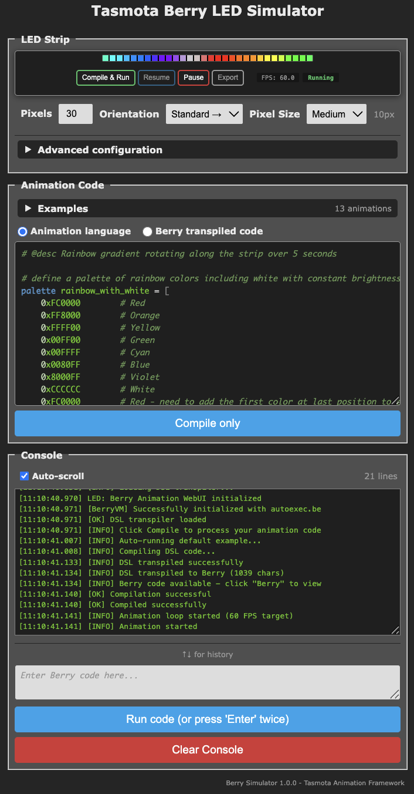

# Berry Animation Framework

!!! note "Requires `#define USE_BERRY_ANIMATION`, included in Tasmota32"

A lightweight animation framework for controlling addressable LED strips (WS2812, SK6812, etc.) on Tasmota-based ESP32 devices.

## Why a DSL?

Writing LED animations in pure Berry code requires understanding the animation engine internals, managing timing loops, and handling frame buffers manually. Animations are inherently asynchronous - they run over time while other code executes - making them difficult to manage with traditional state machines. The Animation DSL (Domain-Specific Language) simplifies this dramatically:

- **Declarative, not imperative** - Just specify *what* you want and *how long* it should take; the framework handles all intermediate states and timing
- **No state machines** - Forget about tracking animation phases, transitions, and timing manually
- **Readable syntax** - Write `animation pulse = breathe(color=red, period=2s)` instead of dozens of lines of Berry code
- **Automatic engine management** - No need to create engines, manage frame buffers, or handle timing
- **Built-in effects** - Access to pulse, breathe, comet, twinkle, beacon, and many more effects
- **Dynamic parameters** - Oscillating values (sine, triangle, smooth) without manual math
- **Sequences and templates** - Orchestrate complex shows with simple syntax

The DSL **transpiles to standard Berry code**, so you get the best of both worlds: easy authoring and full Berry compatibility. You can inspect the generated code, learn from it, or use it directly on devices without DSL support.

## Online Emulator

Test and create animations without a Tasmota device using the online emulator:

[{width=353}](https://tasmota.github.io/docs/Tasmota-Berry-emulator/index.html){target=_blank}

**[https://tasmota.github.io/docs/Tasmota-Berry-emulator/](https://tasmota.github.io/docs/Tasmota-Berry-emulator/index.html){target=_blank}**

The emulator runs **entirely in your browser** with no server required. It includes:

- A complete Berry interpreter compiled to WebAssembly
- Minimal Tasmota device emulation (LED strips, GPIO, timing)
- Real-time LED strip visualization
- DSL editor with syntax highlighting

Once your animation works in the emulator, copy the transpiled Berry code to your Tasmota device - it runs identically.

## Firmware Options

Option|Description
:---|:---
`#define USE_BERRY_ANIMATION`|Core animation framework (required)
`#define USE_BERRY_ANIMATION_DSL`|Optional: DSL compiler with simplified Web UI for on-device animation editing

Without `USE_BERRY_ANIMATION_DSL`, use the online emulator to create animations and deploy the compiled Berry code.

## Quick Start

### Simple Breathing Animation

```berry
animation pulse = breathe(color=red, period=2s)
run pulse
```

### Rainbow Smooth Color Cycling

```berry
animation rainbow = rich_palette(colors=PALETTE_RAINBOW)
run rainbow
```

### Animation Sequence

```berry
animation red_pulse = breathe(color=red, period=2s)
animation blue_pulse = breathe(color=blue, period=1.5s)

sequence show repeat forever {
  play red_pulse for 4s
  wait 200ms
  play blue_pulse for 3s
  wait 300ms
}
run show
```

## DSL Syntax Overview

### Numbers

#### Time Values

Time values require a unit suffix and are converted to milliseconds:

```berry
500ms       # Milliseconds (stays 500)
2s          # Seconds (converted to 2000ms)
1m          # Minutes (converted to 60000ms)
```

#### Percentages

Percentages are converted to 0-255 range:

```berry
0%          # Converted to 0
50%         # Converted to 128
100%        # Converted to 255
```

### Colors and Palettes

```berry
# Hex colors
color my_red = 0xFF0000

# Predefined: red, green, blue, white, yellow, orange, purple, cyan...

# Palettes for gradients
palette sunset = [
  (0, navy), (128, purple), (255, orange)
]

# Built-in palettes: PALETTE_RAINBOW, PALETTE_FIRE...
```

### Value Providers (Oscillators)

Create dynamic values that change over time:

```berry
set breathing = smooth(min_value=50, max_value=255, duration=3s)
animation pulse = solid(color=red)
pulse.opacity = breathing
```

Available: `smooth`, `triangle`, `sine_osc`, `linear`, `square`, `ease_in`, `ease_out`, `elastic`, `bounce`

### Template Animations

Create reusable, parameterized animation patterns:

```berry
template animation pulse_effect {
  param pulse_color type color
  param speed
  
  animation pulse = breathe(color=pulse_color, period=speed)
  run pulse
}

animation red_pulse = pulse_effect(color=red, speed=2s)
animation blue_pulse = pulse_effect(color=blue, speed=1s)

sequence show repeat forever {
  play red_pulse for 5s
  play blue_pulse for 5s
}
run show
```

## Animation Reference

Animation|Description
:---|:---
`solid`|Solid color fill
`breathe`|Natural breathing effect with customizable curve
`beacon`|Pulse/highlight at specific position with optional slew
`crenel`|Crenel/square wave pattern
`comet`|Moving comet with fading tail
`twinkle`|Twinkling stars effect
`rich_palette_color`|Smooth palette color transitions
`gradient`|Linear or radial color gradients
`palette_gradient`|Gradient patterns with palette colors
`palette_meter`|VU meter with gradient and peak hold

**Supplementary animations** (in `src/animations_future/`): `fire`, `wave`, `plasma`, `sparkle`, etc.

## Documentation

- **[Quick Start Guide](animation_docs/Quick_Start.md)** - Get running in 5 minutes
- **[DSL Reference](animation_docs/Dsl_Reference.md)** - Complete syntax reference
- **[Examples](animation_docs/Examples.md)** - Comprehensive examples
- **[Animation Classes](animation_docs/Animation_Class_Hierarchy.md)** - All animations and parameters
- **[Oscillation Patterns](animation_docs/Oscillation_Patterns.md)** - Dynamic value waveforms
- **[User Functions](animation_docs/User_Functions.md)** - Extend with custom Berry functions
- **[Troubleshooting](animation_docs/Troubleshooting.md)** - Common issues and solutions
