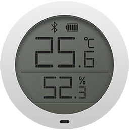

!!! info "Presence detection with iBeacons or BLE sensor gateway using HM-1x or nRF24L01(+) peripherals"

## iBeacon  

!!! info "This feature is included only in tasmota-sensors.bin"
Otherwise you must [compile your build](Compile-your-build). Add the following to `user_config_override.h`:

```
#ifndef USE_IBEACON
#define USE_IBEACON          // Add support for bluetooth LE passive scan of ibeacon devices 
#endif
```
----
  
Tasmota uses a BLE 4.x module to scan for [iBeacon](https://en.wikipedia.org/wiki/IBeacon) devices. This driver is working with [HM-10 and clones](HM-10) and [HM16/HM17](HM-17) Bluetooth modules and potentially with other HM-1x modules depending on firmware capabilities.

### Features
For a list of all available commands see [Sensor52](Commands.md#sensor52) command.  

This driver reports all beacons found during a scan with its ID (derived from beacon's MAC address) prefixed with `IBEACON_` and RSSI value.

Every beacon report is published as an MQTT tele/%topic%/SENSOR in a separate message:

```json
tele/ibeacon/SENSOR = {"Time":"2020-03-24T20:09:40","IBEACON_FF34C21G2174":{"RSSI":-81}}
tele/ibeacon/SENSOR = {"Time":"2020-03-24T20:09:42","IBEACON_DEAABC788BC1":{"RSSI":-60}}
```

If the beacon can no longer be found during a scan and the timeout interval has passed the beacon's RSSI is set to zero (0) and it is no longer displayed in the webUI

```json
tele/ibeacon/SENSOR = {"Time":"2020-03-24T20:05:00","IBEACON_DEAABC788BC1":{"RSSI":-0}}
```

!!! tip
    When first connected some modules will be in peripheral mode. You have to change it to central mode using commands `Sensor52 1` and `Sensor52 2`.

### Supported Devices


All Apple compatible iBeacon devices should be discoverable. 

Various nRF51822 beacons should be fully Apple compatible, programmable and their battery lasts about a year.

- [Amazon.com](https://www.amazon.com/s?k=nRF51822+4.0)
- [Aliexpress](https://www.aliexpress.com/af/NRF51822-beacon.html)


Cheap "iTag" beacons with a beeper. The battery on these lasts only about a month.

- [Aliexpress](https://www.aliexpress.com/af/itag.html?trafficChannel=af&SearchText=itag&ltype=affiliate&SortType=default&g=y&CatId=0)
- [eBay](https://www.ebay.de/sch/i.html?_from=R40&_trksid=m570.l1313&_nkw=Smart-Tag-GPS-Tracker-Bluetooth-Anti-verlorene-Alarm-Key-Finder-Haustier-Kind&_sacat=0)
- [Amazon.com](https://www.amazon.com/s?k=itag+tracker+4.0)


!!! tip
    You can activate a beacon with a beeper using command `IBEACON_%BEACONID%_RSSI 99` (ID is visible in webUI and SENSOR reports). This command can freeze the Bluetooth module and beacon scanning will stop. After a reboot of Tasmota the beacon will start beeping and scanning will resume.

## BLE Sensors using HM-1x

!!! info "This feature is included only in tasmota-sensors.bin"
Otherwise you must [compile your build](Compile-your-build). Add the following to `user_config_override.h`:

```
#ifndef USE_HM10
#define USE_HM10          // Add support for HM-10 as a BLE-bridge (+9k3 code)
#endif
```

### Features
Supported sensors will be connected to at a set interval (default interval equals TelePeriod). A subscription is established for 5 seconds and data (e.g. temperature, humidity and battery) is read and reported to an mqtt topic (Dew point is calculated):

```json
tele/%topic%/SENSOR = {"Time":"2020-03-24T12:47:51","LYWSD03-52680f":{"Temperature":21.1,"Humidity":58.0,"DewPoint":12.5,"Battery":100},"LYWSD02-a2fd09":{"Temperature":21.4,"Humidity":57.0,"DewPoint":12.5,"Battery":2},"MJ_HT_V1-d8799d":{"Temperature":21.4,"Humidity":54.6,"DewPoint":11.9},"TempUnit":"C"}
```

After a completed discovery scan, the driver will report the number of found sensors. As Tasmota can not know how many sensors are meant to be discovered you have to force a re-scan until the desired number of devices is found.
```haskell
Rule1 ON HM10#Found<6 DO Add1 1 ENDON ON Var1#State<=3 DO HM10Scan ENDON 
```
This will re-scan up to 3 times if less than 6 sensors are found.

#### Commands

Command|Parameters
:---|:---
HM10Scan<a id="hm10scan"></a>|Start a new device discovery scan
HM10Period<a id="hm10period"></a>|Show interval in seconds between sensor read cycles. Set to TelePeriod value at boot.<BR>|`<value>` = set interval in seconds
HM10Baud<a id="hm10baud"></a>|Show ESP8266 serial interface baudrate (***Not HM-10 baudrate***)<BR>`<value>` = set baudrate
HM10AT<a id="hm10at"></a>|`<command>` = send AT commands to HM-10. See [list](http://www.martyncurrey.com/hm-10-bluetooth-4ble-modules/#HM-10%20-%20AT%20commands)
HM10Time <a id="hm10time"></a>|`<n>` = set time time of a **LYWSD02 only** sensor to Tasmota UTC time and timezone. `<n>` is the sensor number in order of discovery starting with 0 (topmost sensor in the webUI list).
HM10Auto <a id="hm10auto"></a>|`<value>` = start an automatic discovery scan with an interval of  `<value>` seconds to receive data in BLE advertisements periodically.<BR>This is an active scan and it should be used **only if necessary**. This can change if a future HM-10 firmware starts supporting passive scan.
HM10Page<a id="hm10page"></a>|Show the maximum number of sensors shown per page in the webUI list.<BR>`<value>` = set number of sensors _(default = 4)_

### Supported Devices

<table>
  <tr>
    <th class="th-lboi">MJ_HT_V1</th>
    <th class="th-lboi">LYWSD02</th>
    <th class="th-lboi">LYWSD03MMC</th>
    <th class="th-lboi">CGD1</th>
    <th class="th-lboi">MiFlora</th>
  </tr>
  <tr>
    <td class="tg-lboi"></td>
    <td class="tg-lboi"></td>
    <td class="tg-lboi"></td>
    <td class="tg-lboi"></td>
    <td class="tg-lboi"></td>
  </tr>
  <tr>
    <td class="tg-lboi">temperature, humidity, battery</td>
    <td class="tg-lboi">temperature, humidity, battery</td>
    <td class="tg-lboi">temperature, humidity, battery</td>
    <td class="tg-lboi">temperature, humidity, battery</td>
    <td class="tg-lboi">temperature, illuminance, soil humidity, soil fertility, battery</td>
  </tr>
  <tr>
    <td class="tg-lboi"></td>
    <td class="tg-lboi">set time using "HM10Time"</td>
    <td class="tg-lboi"></td>
    <td class="tg-lboi">unsupported time or alarm</td>
    <td class="tg-lboi"></td>
  </tr>
</table>

   
#### Unconfirmed Devices  
CGG1 ClearGrass Temperature and Humidity Monitor should be found and may give readings via MiBeacons, but is untested.  

## BLE Sensors using nRF24L01(+)

### Configuration
  
You must [compile your build](Compile-your-build). Change the following in `my_user_config.h`:

```
// -- SPI sensors ---------------------------------
#define USE_SPI                                  // Hardware SPI using GPIO12(MISO), GPIO13(MOSI) and GPIO14(CLK) in addition to two user selectable GPIOs(CS and DC)
#ifdef USE_SPI
  #define USE_NRF24                              // Add SPI support for NRF24L01(+) (+2k6 code)
  #ifdef USE_NRF24
    #define USE_MIBLE                            // BLE-bridge for some Mijia-BLE-sensors (+4k7 code)
```    
    
Sensors will be discriminated by using the Product-ID of the MiBeacon. A human readable short product name will be shown instead of the company-assigned ID of the BLE Public Device Address (= the "lower" 24 bits). 

A TELE message could like look this:  
  
```
10:13:38 RSL: stat/tasmota/STATUS8 = {"StatusSNS":{"Time":"2019-12-18T10:13:38","Flora-6ab577":{"Temperature":21.7,"Illuminance":21,"Humidity":0,"Fertility":0},"MJ_HT_V1-3108be":{"Temperature":22.3,"Humidity":56.1},"TempUnit":"C"}}
```
  
As the NRF24L01 can only read BLE-advertisements, only the data in these advertisements is accessible.  
All sensors have an additional GATT-interface with more data in it, but it can not be read with a NRF24l01. 
  
As we can not use a checksum to test data integrity of the packet, only data of sensors whose adresses showed up more than once (default = 3 times) will be published. 
Internally from time to time "fake" sensors will be created, when there was data corruption in the address bytes.  These will be removed automatically.  
  
  
#### Commands

Command|Parameters
:---|:---
NRFPage<a id="nrfpage"></a>|Show the maximum number of sensors shown per page in the webUI list.<BR>`<value>` = set number of sensors _(default = 4)_
NRFIgnore<a id="nrfignore"></a>|`0` = all known sensor types active_(default)_<BR>`<value>` =  ignore certain sensor type (`1` = Flora, `2` = MJ_HT_V1, `3` = LYWSD02, `4` = LYWSD03, `5` = CGG1, `6` = CGD1, `7` = NLIGHT,`8` = MJYD2S,`9` = YEERC (DEPRECATED, please switch to NRFUSE)
NRFUse<a id="nrfuse"></a>|`0` = all known sensor types inactive<BR>`<value>` =  ignore certain sensor type (`1` = Flora, `2` = MJ_HT_V1, `3` = LYWSD02, `4` = LYWSD03, `5` = CGG1, `6` = CGD1, `7` = NLIGHT,`8` = MJYD2S,`9` = YEERC
NRFScan<a id="nrfscan"></a>| Scan for regular BLE-advertisements and show a list in the console<BR>`0` = start a new scan list<BR>`1` = append to the scan list<BR>`2` = stop running scan
NRFBeacon<a id="nrfbeacon"></a>| Set a BLE device as a beacon using the (fixed) MAC-address<BR>`<value>` (1-3 digits) = use beacon from scan list<BR>`<value>` (12 characters) = use beacon given the MAC interpreted as an uppercase string `AABBCCDDEEFF`
NRFKey<a id="nrfkey"></a>| Set a "bind_key" for a MAC-address to decrypt sensor data of the LYWSD03MMC. The argument is a 44 characters long string, which is the concatenation of the bind_key and the corresponding MAC.<BR>`<00112233445566778899AABBCCDDEEFF>` (32 characters) = bind_key<BR>`<112233445566>` (12 characters) = MAC of the sensor<BR>`<00112233445566778899AABBCCDDEEFF112233445566>` (44 characters)= final string
NRFMjyd2s<a id="nrfmjyd2s"></a>| Set a "bind_key" for a MAC-address to decrypt sensor data of the MJYD2S. The argument is a 44 characters long string, which is the concatenation of the bind_key and the corresponding MAC.<BR>`<00112233445566778899AABBCCDDEEFF>` (32 characters) = bind_key<BR>`<112233445566>` (12 characters) = MAC of the sensor<BR>`<00112233445566778899AABBCCDDEEFF112233445566>` (44 characters)= final string
NRFNlight<a id="nrfnlight"></a>| Set the MAC of an NLIGHT<BR>`<value>` (12 characters) =  MAC interpreted as an uppercase string `AABBCCDDEEFF`
  
### Supported Devices

!!! note "It can not be ruled out, that changes in the device firmware may break the functionality of this driver completely!"  

The naming conventions in the product range of bluetooth sensors in XIAOMI-universe can be a bit confusing. The exact same sensor can be advertised under slightly different names depending on the seller (Mijia, Xiaomi, Cleargrass, ...).

 <table>
  <tr>
    <th class="th-lboi">MJ_HT_V1</th>
    <th class="th-lboi">LYWSD02</th>
    <th class="th-lboi">CGG1</th>
    <th class="th-lboi">CGD1</th>
    <th class="th-lboi">MiFlora</th>
    <th class="th-lboi">LYWSD03MMC</th>
  </tr>
  <tr>
    <td class="tg-lboi"></td>
    <td class="tg-lboi"></td>
    <td class="tg-lboi"></td>
    <td class="tg-lboi"></td>
    <td class="tg-lboi"></td>
    <td class="tg-lboi"></td>
  </tr>
  <tr>
    <td class="tg-lboi">temperature, humidity, battery</td>
    <td class="tg-lboi">temperature, humidity</td>
    <td class="tg-lboi">temperature, humidity, battery</td>
    <td class="tg-lboi">temperature, humidity</td>
    <td class="tg-lboi">temperature, illuminance, soil humidity, soil fertility</td>
    <td class="tg-lboi">temperature, humidity</td>
  </tr>
</table>  
  
 <table>
  <tr>
    <th class="th-lboi">NLIGHT</th>
    <th class="th-lboi">MJYD2S</th>
    <th class="th-lboi">YEE RC</th>
  </tr>
  <tr>
    <td class="tg-lboi"></td>
    <td class="tg-lboi"></td>
    <td class="tg-lboi"></td>
  </tr>
  <tr>
    <td class="tg-lboi">motion</td>
    <td class="tg-lboi">motion, illuminance, battery, no-motion-time</td>
    <td class="tg-lboi">button press (single and long)</td>
  </tr>
</table>
   
#### Devices with payload encryption  
  
The LYWSD03MMC and the MJYD2S will start to send advertisements with encrypted sensor data after pairing it with the official Xiaomi app. Out-of-the-box the sensors do only publish a static advertisement.  
It is possible to get the necessary decryption key ("bind_key") with the help of 3rd-party-apps on a smart phone.  
(iOS-example: https://community.home-assistant.io/t/xiaomi-passive-ble-monitor-sensor-platform/177352/101?u=magalex)  
This key and the corresponding MAC of the sensor can be injected with the NRFKEY-command (or NRFMJYD2S). It is probably a good idea to save the whole config as RULE like that:  
  
```rule1 on System#Init do backlog NRFkey 00112233445566778899AABBCCDDEEFF112233445566; NRFkey 00112233445566778899AABBCCDDEEFF112233445566; NRFPage 6; NRFUse 0; NRFUse 4 endon```  
(key for two sensors, 6 sensors per page in the WebUI, turn off all sensors, turn on LYWS03)  
  
LYWSD03MMC sends encrypted sensor data every 10 minutes. As there are no confirmed reports about correct battery presentation of the sensor (always shows 99%), this function is currently not supported.  
MJYD2S sends motion detection events and 2 discrete illuminance levels (1 lux or 100 lux for a dark or bright environment). Additionally battery level and contiguous time without motion in discrete growing steps (no motion time = NMT).  

### Beacon  
  
A simplified presence dection will scan for regular BLE advertisements of a given BT-device defined by its MAC-address. It is important to know, that many new devices (nearly every Apple-device) will change its MAC every few minutes to prevent tracking.  
If the driver receives a packet from the "beacon" a counter will be (re-)started with an increment every second. This timer is published in the TELE-message, presented in the webUI and processed as a RULE.
The stability of regular readings will be strongly influenced by the local environment (many BLE-devices nearby or general noise in the 2.4-GHz-band). 

## BLE Sensors using built-in Bluetooth on the ESP32

You must [compile your build](Compile-your-build) for the ESP32. Change the following to `my_user_config.h`:

```
#ifdef ESP32
  #define USE_MI_ESP32                          // Add support for ESP32 as a BLE-bridge (+9k2 mem, +292k flash)
#endif // ESP8266
```
  
To turn on/off support for decyrption, change the following in the driver code:  
```
#define USE_MI_DECRYPTION
```  
Without encryption support the driver will read data from found LYWSD03MMC via connection. This will increase power consumption of the sensor, but no "bind_key" is needed.  

The driver will start to scan for known sensors automatically using a hybrid approach, when encryption support is deactivated. In the first place MiBeacons are passively received and only found LYWSD03MMC-sensors will be connected at the given period to read data in order to be as energy efficient as possible.
Battery data is in general of questionable value for the LYWSD0x, CGD1 and (maybe) Flora (some are even hard coded on the device to 99%). That's why only MJ_HT_V1, CGG1 (untested) and LYWSD03 (calculated battery level) will automatically update battery data. The other battery levels can be read by command. 
  
#### Commands

Command|Parameters
:---|:---
MI32Period<a id="mi32period"></a>|Show interval in seconds between sensor read cycles for the LYWSD03. Set to TelePeriod value at boot.<BR>|`<value>` = set interval in seconds
MI32Time <a id="mi32time"></a>|`<n>` = set time time of a **LYWSD02 only** sensor to Tasmota UTC time and timezone. `<n>` is the sensor number in order of discovery starting with 0 (topmost sensor in the webUI list).
MI32Unit <a id="mi32unit"></a>|`<n>` = toggle the displayed temperature units of a **LYWSD02 only** sensor. `<n>` is the sensor number in order of discovery starting with 0 (topmost sensor in the webUI list).  Reporting of the temperature is always in Celcius, this only changes the value shown on the device.
MI32Page<a id="mi32page"></a>|Show the maximum number of sensors shown per page in the webUI list.<BR>`<value>` = set number of sensors _(default = 4)_
MI32Battery<a id="mi32battery"></a>|Reads missing battery data for LYWSD02, Flora and CGD1.
MI32Key<a id="mi32key"></a>| Set a "bind_key" for a MAC-address to decrypt sensor data (LYWSD03MMC, MJYD2S). The argument is a 44 characters long string, which is the concatenation of the bind_key and the corresponding MAC.<BR>`<00112233445566778899AABBCCDDEEFF>` (32 characters) = bind_key<BR>`<112233445566>` (12 characters) = MAC of the sensor<BR>`<00112233445566778899AABBCCDDEEFF112233445566>` (44 characters)= final string  
  
!!! tip 
If you really want to read battery for LYWSD02, Flora and CGD1, consider doing it once a day with a RULE:
`RULE1 on Time#Minute=30 do MI32Battery endon`
This will update every day at 00:30 AM.  

  
### Supported Devices

<table>
  <tr>
    <th class="th-lboi">MJ_HT_V1</th>
    <th class="th-lboi">LYWSD02</th>
    <th class="th-lboi">LYWSD03MMC</th>
    <th class="th-lboi">CGD1</th>
    <th class="th-lboi">MiFlora</th>
  </tr>
  <tr>
    <td class="tg-lboi"></td>
    <td class="tg-lboi"></td>
    <td class="tg-lboi"></td>
    <td class="tg-lboi"></td>
    <td class="tg-lboi"></td>
  </tr>
  <tr>
    <td class="tg-lboi">temperature, humidity, battery</td>
    <td class="tg-lboi">temperature, humidity, battery</td>
    <td class="tg-lboi">temperature, humidity, battery</td>
    <td class="tg-lboi">temperature, humidity, battery</td>
    <td class="tg-lboi">temperature, illuminance, soil humidity, soil fertility, battery</td>
  </tr>
  <tr>
    <td class="tg-lboi"></td>
    <td class="tg-lboi">set time using "MI32Time"<p>toggle temperature units with "MI32Unit"</td>
    <td class="tg-lboi"></td>
    <td class="tg-lboi">unsupported time or alarm</td>
    <td class="tg-lboi"></td>
  </tr>
</table>  
  
 <table>
  <tr>
    <th class="th-lboi">NLIGHT</th>
    <th class="th-lboi">MJYD2S</th>
    <th class="th-lboi">YEE RC</th>
  </tr>
  <tr>
    <td class="tg-lboi"></td>
    <td class="tg-lboi"></td>
    <td class="tg-lboi"></td>
  </tr>
  <tr>
    <td class="tg-lboi">motion, no-motion-time (computed by the driver)</td>
    <td class="tg-lboi">motion, illuminance, battery, no-motion-time</td>
    <td class="tg-lboi">button press (single and long)</td>
  </tr>
</table>

   
#### Unconfirmed Devices  
CGG1 ClearGrass Temperature and Humidity Monitor should be found and may give readings via MiBeacons, but is untested.  


## Getting data from BT Xiaomi Devices

Different vendors offer BT-solutions with different accessibilities under the MIJIA-brand. A common solution is the use of so-called „MiBeacons“ which are BLE advertisement packets with a certain data structure, which are broadcasted by the devices automatically. These packets already contain the sensor data and can be passively received by other devices. 

Most of the „older“ BT-sensor-devices use unencrypted messages, which can be read by all kinds of BLE-devices or even a NRF24L01. The big advantage is the power efficiency as no active bi-directional connection has to be established. This is therefore the preferred option, if technically possible (= for the supported sensors).

With the arrival of "newer" sensors came the problem of encrypted data in MiBeacons, which can be decrypted in Tasmota in a quite complicated way (getting the 16-byte-key with 3rd-party-software while pairing the device with the original Xiaomi Apps).
At least the LYWSD03 allows the use of a simple BLE connection without any encrypted authentication and the reading of the sensor data using normal subscription methods to GATT-services. This is more power hungry than the passive reading of BLE advertisements.  
Other sensors like the MJYD2S are not usable without the "bind_key".
  
#### Working principle of both Tasmota drivers (>8.2.0.1)
  
The idea is to provide drivers with as many automatic functions as possible. Besides the hardware setup, there are zero or very few things to configure.  
The sensor namings are based on the original sensor names and shortened if appropriate (Flower care -> Flora). A part of the MAC will be added to the name as a suffix.  
All sensors are treated as if they are physically connected to the ESP8266 device. For motion and remote control sensors MQTT-messages will be published in (nearly) real time.
