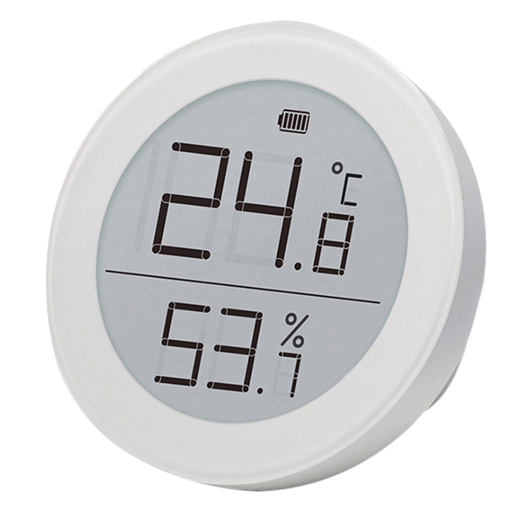
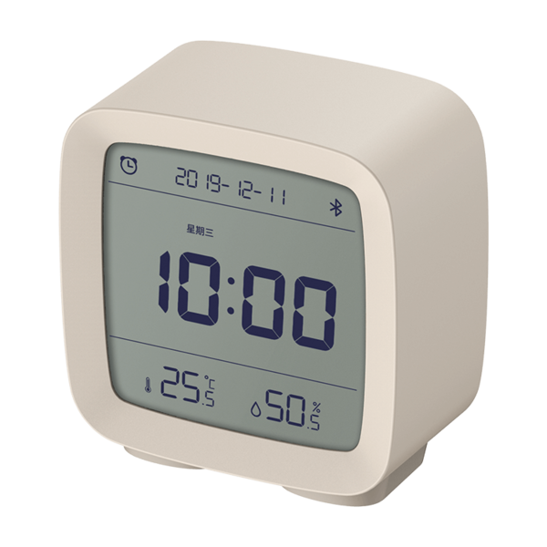
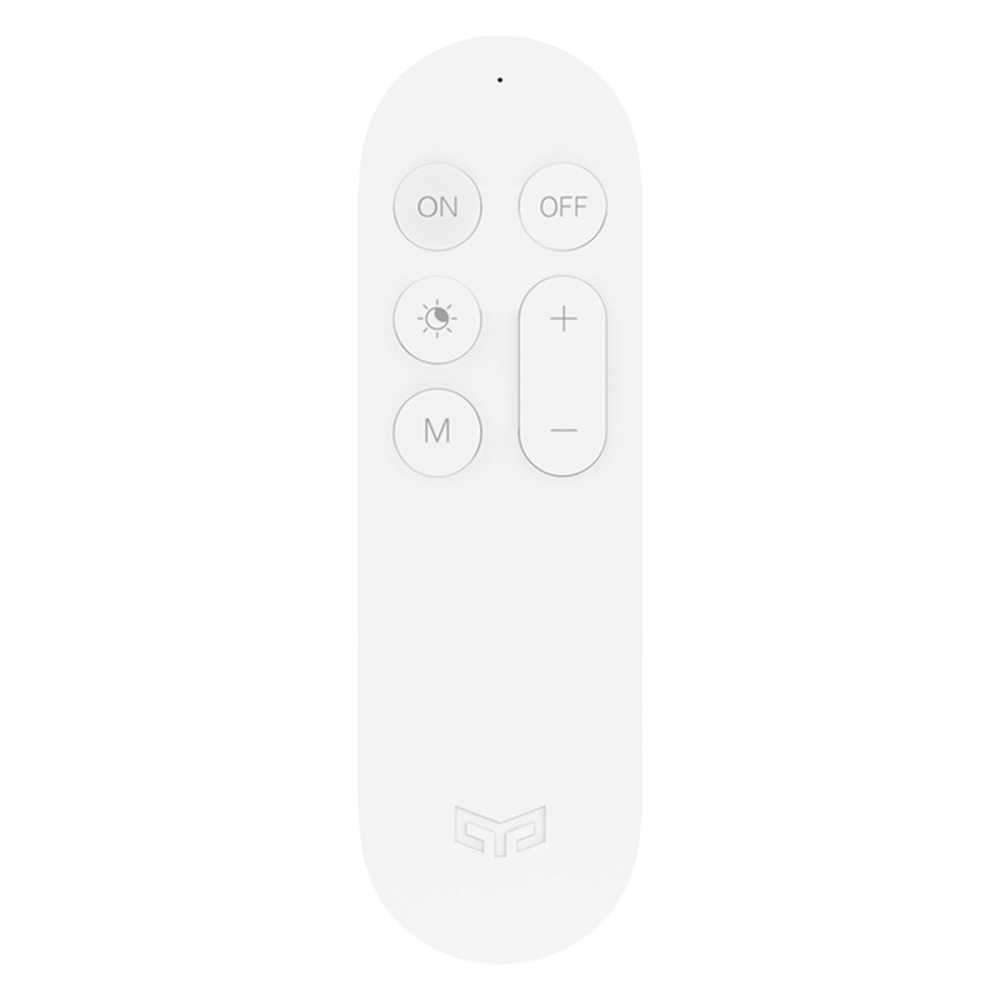
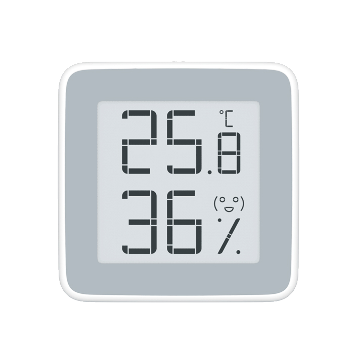
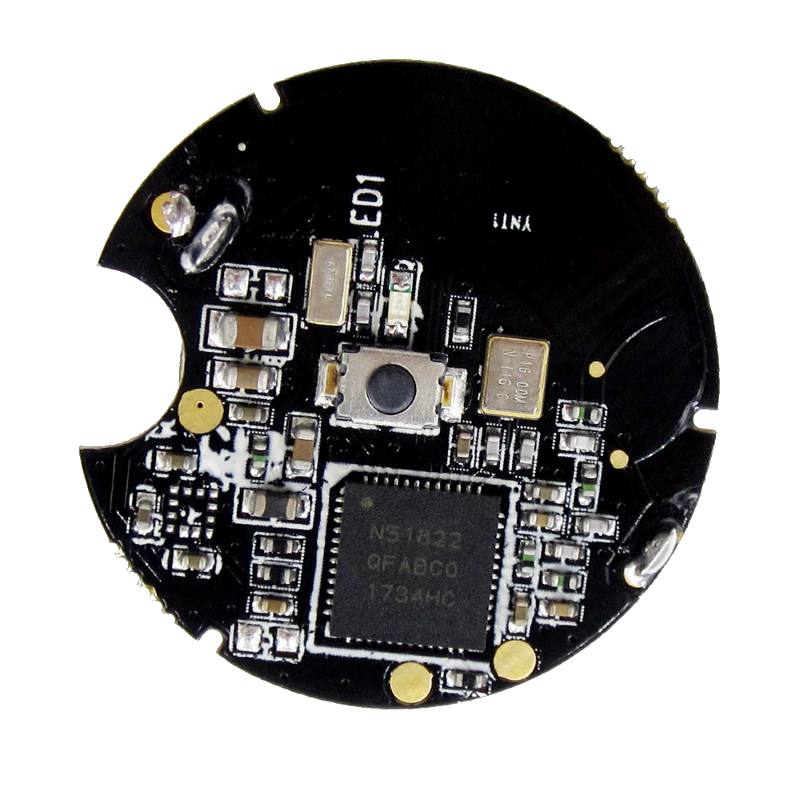

## MI32 Sensors

!!! failure "This feature is included only in tasmota32-bluetooth.bin"
    
Otherwise you must [compile your build](Compile-your-build). Add the following to `user_config_override.h`:

```c++
#define USE_MI_ESP32       // (ESP32 only) Add support for ESP32 as a BLE-bridge (+9k2 mem, +292k flash)
<<<<<<< HEAD
```

Different vendors offer Bluetooth solutions, mostly as part of the Xiaomi brand, often under the Mijia label. The sensors supported by Tasmota use BLE (Bluetooth Low Energy) to transmit the sensor data, but they differ in their accessibilities quite substantially.  
  
Basically all of them use the so-called "MiBeacons" which are BLE advertisement packets with a certain data structure, which are broadcasted by the devices automatically while the device is not in an active Bluetooth connection.       
The frequency of these messages is set by the vendor and ranges from one per 3 seconds to one per hour (f.e. for the battery status of the LYWSD03MMC). Motion sensors and BLE remote controls start to send when an event is triggered.     
These packets already contain the sensor data and can be passively received by other devices and will be published regardless if a user decides to read out the sensors via connections or not. Thus the battery life of a BLE sensor is not influenced by reading these advertisements and the big advantage is the power efficiency as no active bi-directional connection has to be established. The other advantage is, that scanning for BLE advertisements can happen nearly parallel (very quickly one after the other), while a direct connection must be established for at least a few seconds and will then block both involved devices for that time.  

This is therefore the preferred option, if supported by the sensor.
  
### Supported Devices

!!! note "It can not be ruled out, that changes in the device firmware may break the functionality of this driver completely!"  

The naming conventions in the product range of Bluetooth sensors in Xiaomi universe can be a bit confusing. The exact same sensor can be advertised under slightly different names depending on the seller (Mijia, Xiaomi, Cleargrass, ...).

 <table>
  <tr>
    <th class="th-lboi">MJ_HT_V1</th>
    <th class="th-lboi">LYWSD02</th>
    <th class="th-lboi">CGG1</th>
    <th class="th-lboi">CGD1</th>
  </tr>
  <tr>
    <td class="tg-lboi"></td>
    <td class="tg-lboi"></td>
    <td class="tg-lboi"></td>
    <td class="tg-lboi"></td>
  </tr>
  <tr>
    <td class="tg-lboi">temperature, humidity, battery</td>
    <td class="tg-lboi">temperature, humidity, battery</td>
    <td class="tg-lboi">temperature, humidity, battery</td>
    <td class="tg-lboi">temperature, humidity, battery</td>
  </tr>
    <tr>
    <td class="tg-lboi">passive for all entities, reliable battery value</td>
    <td class="tg-lboi">battery only active, thus not on the NRF24L01, set clock and unit, very frequent data sending</td>
    <td class="tg-lboi">passive for all entities, reliable battery value</td>
    <td class="tg-lboi">battery only active, thus not on the NRF24L01, no reliable battery value, no clock functions</td>
  </tr>
</table>  
  
 <table>
  <tr>
    <th class="th-lboi">MiFlora</th>
    <th class="th-lboi">LYWSD03MMC / ATC</th>
    <th class="th-lboi">NLIGHT</th>
    <th class="th-lboi">MJYD2S</th>
  </tr>
  <tr>
    <td class="tg-lboi"></td>
    <td class="tg-lboi"></td>
    <td class="tg-lboi"></td>
    <td class="tg-lboi"></td>
  </tr>
  <tr>
    <td class="tg-lboi">temperature, illuminance, soil humidity, soil fertility, battery, firmware version</td>
    <td class="tg-lboi">temperature, humidity, battery</td>
    <td class="tg-lboi">motion</td>
    <td class="tg-lboi">motion, illuminance, battery, no-motion-time</td>
  </tr>
  <tr>
    <td class="tg-lboi">passive only with newer firmware (>3.0?), battery only active, thus not on the NRF24L01</td>
    <td class="tg-lboi">passive only with decryption or using custom ATC-firmware, no reliable battery value with stock firmware</td>
    <td class="tg-lboi">NRF24L01, ESP32</td>
    <td class="tg-lboi">passive only with decryption, thus only NRF24L01, ESP32</td>
  </tr>
</table>  
  
 <table>
  <tr>
    <th class="th-lboi">YEE RC</th>
    <th class="th-lboi">MHO-C401</th>
    <th class="th-lboi">MHO-C303</th>
    <th class="th-lboi">MCCGQ02HL</th>
  </tr>
  <tr>
    <td class="tg-lboi"></td>
    <td class="tg-lboi"></td>
    <td class="tg-lboi"></td>
    <td class="tg-lboi"></td>
  </tr>
  <tr>
    <td class="tg-lboi">button press (single and long)</td>
    <td class="tg-lboi">temperature, humidity, battery</td>
    <td class="tg-lboi">temperature, humidity, battery</td>
    <td class="tg-lboi">door opening/closing, light present</td>
  </tr>
     <tr>
    <td class="tg-lboi">passive</td>
    <td class="tg-lboi">equal to the LYWS03MMC, but no custom firmware yet</td>
    <td class="tg-lboi">passive for all entities,  set clock and unit, no alarm functions, very frequent data sending</td>
    <td class="tg-lboi">passive, difficult to get key (must be close, press button)</td>
  </tr>
</table> 

*passive* means data is received via BLE advertisements while *active* means data is received via a bidirectional connection to the sensor.

**LYWSD03MMC** sends encrypted sensor data every 10 minutes. As there are no confirmed reports about correct battery presentation of the sensor (always shows 99%), this function is currently not supported.  

**MJYD2S** sends motion detection events and 2 discrete illuminance levels (1 lux or 100 lux for a dark or bright environment). Additionally battery level and contiguous time without motion in discrete growing steps (no motion time = NMT).    

### Encryption and bind_key 

Most of the older sensors use unencrypted messages, which can be read by all kinds of BLE devices or even a NRF24L01. With the arrival of newer sensors, such as LYWSD03MMC, MHO-C401 or MJYD2S, came the problem of encrypted data in MiBeacons, which can be decrypted in Tasmota.

Some sensor still allow an unencrypted connection the reading of the sensor data using normal subscription methods to GATT-services. This is more power hungry than the passive reading of BLE advertisements. 

Some other sensors like the MJYD2S are not usable without the "bind_key". 

It is recommended to obtain the bind_key in any case to reduce the battery drain.  

#### Obtain bind_key

To get the necessary decryption key ("bind_key") use:

- [Xiaomi Cloud Tokens Extractor](https://github.com/PiotrMachowski/Xiaomi-cloud-tokens-extractor) (Windows executable or Python) - works on any device in the Mi Home app
- [pvvx Telink Flasher](https://pvvx.github.io/ATC_MiThermometer/TelinkMiFlasher.html) (Webpage) - LYWSD03MMC, MHO-C401 and CGG1 only
- [ATC Telink Flasher](https://atc1441.github.io/TelinkFlasher.html) (Webpage) - LYWSD03MMC only

Telink Flashers allow the generation of a bind_key by faking a pairing with the Xiaomi cloud.

#### Use bind_key

Use the bind_key and MAC address of the sensor to use with commands `Mi32Keys` or `Mi32Key`. Tasmota will receive the sensor data roughly every 10 minutes (in two chunks for humidity and temperature with about a minute in between) and decode the data. This is the most energy efficient way. 

The current way of storing these keys on the ESP32 is to use [`Mi32Key`](Commands.md#mi32key) command:  

`MI32Keys <mac or blealias>=<bind_key> <mac or blealias>=<key>`

The Key is the 32 character (16 byte) key retrieved by above methods.  

Older way of using `MI32Key` is retained for backward compatibility. Mi32Key needs a 44 character combination of bind_key and MAC:

`MI32Keys <bind_keymac>`

To retain the data use a rule on startup:
```haskell
rule1 on System#Boot do backlog MI32key 00112233445566778899AABBCCDDEEFF112233445566; MI32key 00112233445566778899AABBCCDDEEFFAABBCCDDEEFF endon
```  

### Commands

Full list of available [Mi Sensors commands](Commands.md#ble-mi-sensors).

!!! tip 
If you really want to read battery for LYWSD02, Flora and CGD1, consider doing it once a day with a rule:

```haskell
Backlog Rule1 on Time#Minute=30 do MI32Battery endon; Rule1 1
```

This will update every day at 00:30 AM.  

## BLE ESP32 
This allows for the receiving of BLE advertisements from BLE devices, including "iBeacons" and BLE sensors, but also for the control of simple BLE devices, providing for reading, writing and receiving notifications. 

!!! failure "This feature is included only in tasmota32-bluetooth.bin"
    
Otherwise you must [compile your build](Compile-your-build). Add the following to `user_config_override.h`:

```c++
#define USE_BLE_ESP32                // Add support for ESP32 as a BLE-bridge (+9k2? mem, +292k? flash)
```

Be aware, enabling of the native BLE on ESP32 has an impact on Wi-Fi performance.  Although later SDK helped a bit, expect more lag on the web interface and on MQTT.
If only controlling BLE devices, then scanning can be disabled, which will minimize Wi-Fi impact.
BLE can be enabled from the web UI menus. 

This is compiled by default in the Bluetooth firmware, but you need to enable it using the webUI **Configure BLE** button or [`SetOption115 1`](Commands.md#setoption115) command.

Note that the only configuration stored is the [`SetOption115`](Commands.md#setoption115) to turn BLE on and off.  All other configurations can be set at boot if necessary using Rules.

## iBeacon  

Hear adverts from BLE devices, and produce MQTT messages containing RSSI and other information about them.  Break out iBeacon specific data if present. 

!!! failure "This feature is not included in precompiled binaries"     

```
#define USE_IBEACON_ESP32                // Add support for Bluetooth LE passive scan of iBeacon devices
```

This driver reports all beacons found during a scan with its ID (derived from beacon's MAC address) prefixed with `IBEACON_` and RSSI value.

Every beacon report is published as an MQTT tele/%topic%/SENSOR in a separate message:

```json
tele/ibeacon/SENSOR = {"Time":"2021-01-02T12:08:40","IBEACON":{"MAC":"A4C1387FC1E1","RSSI":-56,"STATE":"ON"}}
```

If the beacon can no longer be found during a scan and the timeout interval has passed the beacon's RSSI is set to zero (0) and it is no longer displayed in the webUI

```json
tele/ibeacon/SENSOR = {"Time":"2021-01-02T12:08:40","IBEACON":{"MAC":"A4C1387FC1E1","RSSI":-56,"STATE":"OFF"}}
```

Additional fields will be present depending upon the beacon, e.g. NAME, UID, MAJOR, MINOR.

### iBeacon MQTT Fields

#### Always present
json|meaning
:---|:---
Time|time of MQTT send
IBEACON.MAC|mac addr
IBEACON.RSSI|signal strength
IBEACON.STATE|ON - present, OFF - last MQTT you will get for now (device removed)

#### Optional
json|meaning
:---|:---
IBEACON.NAME|name if in scan, or BLEAlias if set - only present if NAME present
IBEACON.PERSEC|count of adverts per sec.  Useful for detecting button press
IBEACON.MAJOR|some iBeacon related term? - only present for some
IBEACON.MINOR|some iBeacon related term? - only present for some

### Examples

#### Setup a rule to set some aliases at boot time, and only allow those starting `iB`

```console
Rule1 ON System#Boot DO backlog iBeacon 1; BLEAlias A4C1386A1E24=iBfred A4C1387FC1E1=iBjames; iBeaconOnlyAliased 2 endon
Rule1 1
```

### Supported Devices


All Apple compatible iBeacon devices should be discoverable. 

Various nRF51822 beacons should be fully Apple compatible, programmable and their battery lasts about a year.

- [Amazon.com](https://www.amazon.com/s?k=nRF51822+4.0)
- [Aliexpress](https://www.aliexpress.com/af/NRF51822-beacon.html)

Cheap "iTag" beacons with a beeper. The battery on these lasts only about a month.

- [Aliexpress](https://www.aliexpress.com/af/itag.html?trafficChannel=af&SearchText=itag&ltype=affiliate&SortType=default&g=y&CatId=0)
- [eBay](https://www.ebay.de/sch/i.html?_from=R40&_trksid=m570.l1313&_nkw=Smart-Tag-GPS-Tracker-Bluetooth-Anti-verlorene-Alarm-Key-Finder-Haustier-Kind&_sacat=0)
- [Amazon.com](https://www.amazon.com/s?k=itag+tracker+4.0)


!!! tip
    You can activate a beacon with a beeper using command `IBEACON_%BEACONID%_RSSI 99` (ID is visible in webUI and SENSOR reports). This command can freeze the Bluetooth module and beacon scanning will stop. After a reboot of Tasmota the beacon will start beeping and scanning will resume. (untested on ESP32 native BLE)  

### MI32 MQTT Messages

Because we can have many sensors reporting, tele messages are chunked to have a maximum of four sensors per message.

If you enable MQTT discovery ([`SetOption19 1`](Commands.md#setoption19)), additional MQTT messages are send.

Primarily, at teleperiod or MI32period, discovery messages are sent.  These inform Home Assistant about the devices.  Device names can be dependent upon BLEAlias, so set `BLEAlias` at boot.

Additional actual data messages are sent on topics including the device name: `tele/tasmota_ble/<name>`

Each message for **one** sensor.

These messages can be used without Home Assistant if it is a preferred format.

!!! note 
    The topic would be the **same** from all Tasmotas if they have the same BLEAlias or no BLEAlias.  So if you wish to 'hear' the same device separately from different Tasmotas, use different BLEAlias names. 


### EQ3 TRV
=======
```

Different vendors offer Bluetooth solutions, mostly as part of the Xiaomi brand, often under the Mijia label. The sensors supported by Tasmota use BLE (Bluetooth Low Energy) to transmit the sensor data, but they differ in their accessibilities quite substantially.  
  
Basically all of them use the so-called "MiBeacons" which are BLE advertisement packets with a certain data structure, which are broadcasted by the devices automatically while the device is not in an active Bluetooth connection.       
The frequency of these messages is set by the vendor and ranges from one per 3 seconds to one per hour (f.e. for the battery status of the LYWSD03MMC). Motion sensors and BLE remote controls start to send when an event is triggered.     
These packets already contain the sensor data and can be passively received by other devices and will be published regardless if a user decides to read out the sensors via connections or not. Thus the battery life of a BLE sensor is not influenced by reading these advertisements and the big advantage is the power efficiency as no active bi-directional connection has to be established. The other advantage is, that scanning for BLE advertisements can happen nearly parallel (very quickly one after the other), while a direct connection must be established for at least a few seconds and will then block both involved devices for that time.  

This is therefore the preferred option, if supported by the sensor.
  
### Supported Devices

!!! note "It can not be ruled out, that changes in the device firmware may break the functionality of this driver completely!"  

The naming conventions in the product range of Bluetooth sensors in Xiaomi universe can be a bit confusing. The exact same sensor can be advertised under slightly different names depending on the seller (Mijia, Xiaomi, Cleargrass, ...).

 <table>
  <tr>
    <th class="th-lboi">MJ_HT_V1</th>
    <th class="th-lboi">LYWSD02</th>
    <th class="th-lboi">CGG1</th>
    <th class="th-lboi">CGD1</th>
  </tr>
  <tr>
    <td class="tg-lboi"></td>
    <td class="tg-lboi"></td>
    <td class="tg-lboi"></td>
    <td class="tg-lboi"></td>
  </tr>
  <tr>
    <td class="tg-lboi">temperature, humidity, battery</td>
    <td class="tg-lboi">temperature, humidity, battery</td>
    <td class="tg-lboi">temperature, humidity, battery</td>
    <td class="tg-lboi">temperature, humidity, battery</td>
  </tr>
    <tr>
    <td class="tg-lboi">passive for all entities, reliable battery value</td>
    <td class="tg-lboi">battery only active, thus not on the NRF24L01, set clock and unit, very frequent data sending</td>
    <td class="tg-lboi">passive for all entities, reliable battery value</td>
    <td class="tg-lboi">battery only active, thus not on the NRF24L01, no reliable battery value, no clock functions</td>
  </tr>
</table>  
  
 <table>
  <tr>
    <th class="th-lboi">MiFlora</th>
    <th class="th-lboi">LYWSD03MMC / ATC</th>
    <th class="th-lboi">NLIGHT</th>
    <th class="th-lboi">MJYD2S</th>
  </tr>
  <tr>
    <td class="tg-lboi"></td>
    <td class="tg-lboi"></td>
    <td class="tg-lboi"></td>
    <td class="tg-lboi"></td>
  </tr>
  <tr>
    <td class="tg-lboi">temperature, illuminance, soil humidity, soil fertility, battery, firmware version</td>
    <td class="tg-lboi">temperature, humidity, battery</td>
    <td class="tg-lboi">motion</td>
    <td class="tg-lboi">motion, illuminance, battery, no-motion-time</td>
  </tr>
  <tr>
    <td class="tg-lboi">passive only with newer firmware (>3.0?), battery only active, thus not on the NRF24L01</td>
    <td class="tg-lboi">passive only with decryption or using custom ATC-firmware, no reliable battery value with stock firmware</td>
    <td class="tg-lboi">NRF24L01, ESP32</td>
    <td class="tg-lboi">passive only with decryption, thus only NRF24L01, ESP32</td>
  </tr>
</table>  
  
 <table>
  <tr>
    <th class="th-lboi">YEE RC</th>
    <th class="th-lboi">MHO-C401</th>
    <th class="th-lboi">MHO-C303</th>
  </tr>
  <tr>
    <td class="tg-lboi"></td>
    <td class="tg-lboi"></td>
    <td class="tg-lboi"></td>
  </tr>
  <tr>
    <td class="tg-lboi">button press (single and long)</td>
    <td class="tg-lboi">temperature, humidity, battery</td>
    <td class="tg-lboi">temperature, humidity, battery</td>
  </tr>
     <tr>
    <td class="tg-lboi">passive</td>
    <td class="tg-lboi">equal to the LYWS03MMC, but no custom firmware yet</td>
    <td class="tg-lboi">passive for all entities,  set clock and unit, no alarm functions, very frequent data sending</td>
  </tr>
</table> 

*passive* means data is received via BLE advertisements while *active* means data is received via a bidirectional connection to the sensor.

**LYWSD03MMC** sends encrypted sensor data every 10 minutes. As there are no confirmed reports about correct battery presentation of the sensor (always shows 99%), this function is currently not supported.  

**MJYD2S** sends motion detection events and 2 discrete illuminance levels (1 lux or 100 lux for a dark or bright environment). Additionally battery level and contiguous time without motion in discrete growing steps (no motion time = NMT).    

### Encryption and bind_key 

Most of the older sensors use unencrypted messages, which can be read by all kinds of BLE devices or even a NRF24L01. With the arrival of newer sensors, such as LYWSD03MMC, MHO-C401 or MJYD2S, came the problem of encrypted data in MiBeacons, which can be decrypted in Tasmota.

Some sensor still allow an unencrypted connection the reading of the sensor data using normal subscription methods to GATT-services. This is more power hungry than the passive reading of BLE advertisements. 

Some other sensors like the MJYD2S are not usable without the "bind_key". 

It is recommended to obtain the bind_key in any case to reduce the battery drain.  

#### Obtain bind_key

To get the necessary decryption key ("bind_key") use:

- [Xiaomi Cloud Tokens Extractor](https://github.com/PiotrMachowski/Xiaomi-cloud-tokens-extractor) (Windows executable or Python) - works on any device in the Mi Home app
- [pvvx Telink Flasher](https://pvvx.github.io/ATC_MiThermometer/TelinkMiFlasher.html) (Webpage) - LYWSD03MMC, MHO-C401 and CGG1 only
- [ATC Telink Flasher](https://atc1441.github.io/TelinkFlasher.html) (Webpage) - LYWSD03MMC only

Telink Flashers allow the generation of a bind_key by faking a pairing with the Xiaomi cloud.

#### Use bind_key

Use the bind_key and MAC address of the sensor to use with commands `Mi32Keys` or `Mi32Key`. Tasmota will receive the sensor data roughly every 10 minutes (in two chunks for humidity and temperature with about a minute in between) and decode the data. This is the most energy efficient way. 

The current way of storing these keys on the ESP32 is to use [`Mi32Key`](Commands.md#mi32key) command:  

`MI32Keys <mac or blealias>=<bind_key> <mac or blealias>=<key>`

The Key is the 32 character (16 byte) key retrieved by above methods.  

Older way of using `MI32Key` is retained for backward compatibility. Mi32Key needs a 44 character combination of bind_key and MAC:

`MI32Keys <bind_keymac>`

To retain the data use a rule on startup:
```haskell
rule1 on System#Boot do backlog MI32key 00112233445566778899AABBCCDDEEFF112233445566; MI32key 00112233445566778899AABBCCDDEEFFAABBCCDDEEFF endon
```  

### Commands

Full list of available [Mi Sensors commands](Commands.md#ble-mi-sensors).

!!! tip 
If you really want to read battery for LYWSD02, Flora and CGD1, consider doing it once a day with a rule:

```haskell
Backlog Rule1 on Time#Minute=30 do MI32Battery endon; Rule1 1
```

This will update every day at 00:30 AM.  

## BLE ESP32 
This allows for the receiving of BLE advertisements from BLE devices, including "iBeacons" and BLE sensors, but also for the control of simple BLE devices, providing for reading, writing and receiving notifications. 

!!! failure "This feature is included only in tasmota32-bluetooth.bin"
    
Otherwise you must [compile your build](Compile-your-build). Add the following to `user_config_override.h`:

```c++
#define USE_BLE_ESP32                // Add support for ESP32 as a BLE-bridge (+9k2? mem, +292k? flash)
```

Be aware, enabling of the native BLE on ESP32 has an impact on Wi-Fi performance.  Although later SDK helped a bit, expect more lag on the web interface and on MQTT.
If only controlling BLE devices, then scanning can be disabled, which will minimize Wi-Fi impact.
BLE can be enabled from the web UI menus. 

This is compiled by default in the Bluetooth firmware, but you need to enable it using the webUI **Configure BLE** button or [`SetOption115 1`](Commands.md#setoption115) command.

Note that the only configuration stored is the [`SetOption115`](Commands.md#setoption115) to turn BLE on and off.  All other configurations can be set at boot if necessary using Rules.

## iBeacon  

Hear adverts from BLE devices, and produce MQTT messages containing RSSI and other information about them.  Break out iBeacon specific data if present. 

!!! failure "This feature is not included in precompiled binaries"     

```
#define USE_IBEACON_ESP32                // Add support for Bluetooth LE passive scan of iBeacon devices
```

This driver reports all beacons found during a scan with its ID (derived from beacon's MAC address) prefixed with `IBEACON_` and RSSI value.

Every beacon report is published as an MQTT tele/%topic%/SENSOR in a separate message:

```json
tele/ibeacon/SENSOR = {"Time":"2021-01-02T12:08:40","IBEACON":{"MAC":"A4C1387FC1E1","RSSI":-56,"STATE":"ON"}}
```

If the beacon can no longer be found during a scan and the timeout interval has passed the beacon's RSSI is set to zero (0) and it is no longer displayed in the webUI

```json
tele/ibeacon/SENSOR = {"Time":"2021-01-02T12:08:40","IBEACON":{"MAC":"A4C1387FC1E1","RSSI":-56,"STATE":"OFF"}}
```

Additional fields will be present depending upon the beacon, e.g. NAME, UID, MAJOR, MINOR.

### iBeacon MQTT Fields

#### Always present
json|meaning
:---|:---
Time|time of MQTT send
IBEACON.MAC|mac addr
IBEACON.RSSI|signal strength
IBEACON.STATE|ON - present, OFF - last MQTT you will get for now (device removed)

#### Optional
json|meaning
:---|:---
IBEACON.NAME|name if in scan, or BLEAlias if set - only present if NAME present
IBEACON.PERSEC|count of adverts per sec.  Useful for detecting button press
IBEACON.MAJOR|some iBeacon related term? - only present for some
IBEACON.MINOR|some iBeacon related term? - only present for some

### Examples

#### Setup a rule to set some aliases at boot time, and only allow those starting `iB`

```console
Rule1 ON System#Boot DO backlog iBeacon 1; BLEAlias A4C1386A1E24=iBfred A4C1387FC1E1=iBjames; iBeaconOnlyAliased 2 endon
Rule1 1
```

### Supported Devices


All Apple compatible iBeacon devices should be discoverable. 

Various nRF51822 beacons should be fully Apple compatible, programmable and their battery lasts about a year.

- [Amazon.com](https://www.amazon.com/s?k=nRF51822+4.0)
- [Aliexpress](https://www.aliexpress.com/af/NRF51822-beacon.html)

Cheap "iTag" beacons with a beeper. The battery on these lasts only about a month.

- [Aliexpress](https://www.aliexpress.com/af/itag.html?trafficChannel=af&SearchText=itag&ltype=affiliate&SortType=default&g=y&CatId=0)
- [eBay](https://www.ebay.de/sch/i.html?_from=R40&_trksid=m570.l1313&_nkw=Smart-Tag-GPS-Tracker-Bluetooth-Anti-verlorene-Alarm-Key-Finder-Haustier-Kind&_sacat=0)
- [Amazon.com](https://www.amazon.com/s?k=itag+tracker+4.0)


!!! tip
    You can activate a beacon with a beeper using command `IBEACON_%BEACONID%_RSSI 99` (ID is visible in webUI and SENSOR reports). This command can freeze the Bluetooth module and beacon scanning will stop. After a reboot of Tasmota the beacon will start beeping and scanning will resume. (untested on ESP32 native BLE)  
>>>>>>> development

A preliminary EQ3 driver is in production. [Documentation](EQ3-TRV.md). 

### Commands

<<<<<<< HEAD
Full list of available [BLE ESP32 commands](Commands.md#ble-esp32).

#### Setup a rule to set some aliases at boot time
=======
If you enable MQTT discovery ([`SetOption19 1`](Commands.md#setoption19)), additional MQTT messages are send.

Primarily, at teleperiod or MI32period, discovery messages are sent.  These inform Home Assistant about the devices.  Device names can be dependent upon BLEAlias, so set `BLEAlias` at boot.
>>>>>>> development

```haskell
Backlog Rule1 ON System#Boot DO BLEAlias A4C1386A1E24=fred A4C1387FC1E1=james endon; Rule1 1
```

#### Enable static random mac addresses in addition to public mac addresses

If you have a device which does not appear, it may be advertising on a 'static random' address.  Using this command may make it appear, but will also make other devices appear that you may not wish to see... For example phones advertising Covid messages.  To know more, google 'BLE static random'. Be aware you can set 2 or 3....

<<<<<<< HEAD
`BLEAddrFilter 1`
=======
!!! note 
    The topic would be the **same** from all Tasmotas if they have the same BLEAlias or no BLEAlias.  So if you wish to 'hear' the same device separately from different Tasmotas, use different BLEAlias names. 
>>>>>>> development

#### Check the interval between BLE tele messages

<<<<<<< HEAD
`BLEPeriod`

=======
### EQ3 TRV

A preliminary EQ3 driver is in production. [Documentation](EQ3-TRV.md). 

### Commands

Full list of available [BLE ESP32 commands](Commands.md#ble-esp32).

#### Setup a rule to set some aliases at boot time

```haskell
Backlog Rule1 ON System#Boot DO BLEAlias A4C1386A1E24=fred A4C1387FC1E1=james endon; Rule1 1
```

#### Enable static random mac addresses in addition to public mac addresses

`BLEAddrFilter 1`

#### Check the interval between BLE tele messages

`BLEPeriod`

>>>>>>> development
Set it to 40s: `BLEPeriod 40`
