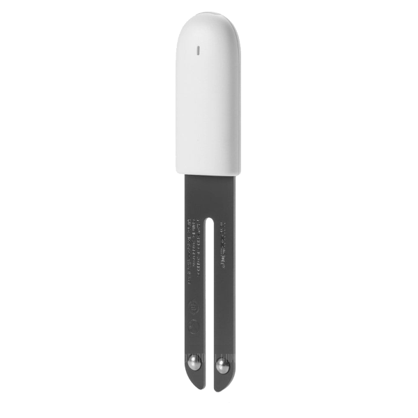
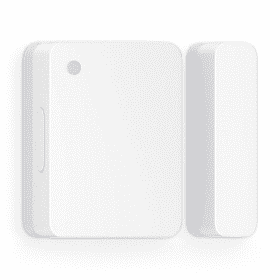

# MI32 legacy 
  
The MI32-driver focuses on the passive observation of BLE sensors of the Xiaomi/Mijia universe, thus only needing a small memory footprint. This allows to additionally run a dedicated software bridge to Apples HomeKit with very few additional configuration steps. Berry can be used to create generic applications.  
Currently supported are the original ESP32, the ESP32-C3 and the ESP32-S3.

## Usage
  
This driver is not part of any standard build. To self compile it is recommended to add build environments to `platformio_tasmota_cenv.ini`. This file needs to be created first.  
Add these sections:  
```
[env:tasmota32-mi32-homebridge]
extends                 = env:tasmota32_base
build_flags             = ${env:tasmota32_base.build_flags}
                          -DUSE_MI_ESP32
                          -DUSE_MI_EXT_GUI
                          -DUSE_MI_HOMEKIT=1    ; 1 to enable; 0 to disable
lib_extra_dirs          = lib/libesp32, lib/libesp32_div, lib/lib_basic, lib/lib_i2c, lib/lib_div, lib/lib_ssl
lib_ignore              = ESP8266Audio
                          ESP8266SAM
                          TTGO TWatch Library
                          Micro-RTSP
                          epdiy
                          esp32-camera

[env:tasmota32c3-mi32-homebridge]
extends                 = env:tasmota32c3
build_flags             = ${env:tasmota32_base.build_flags}
                          -DUSE_MI_ESP32
                          -DUSE_MI_EXT_GUI
                          -DUSE_MI_HOMEKIT=1    ; 1 to enable; 0 to disable
lib_extra_dirs          = lib/libesp32, lib/libesp32_div, lib/lib_basic, lib/lib_i2c, lib/lib_div, lib/lib_ssl
lib_ignore              = ESP8266Audio
                          ESP8266SAM
                          TTGO TWatch Library
                          Micro-RTSP
                          epdiy
                          esp32-camera
```
  
It is probably necessary to restart your IDE (i.e. Visual Studio Code) to see the option to build these environments.

## Tasmota and BLE-sensors

Different vendors offer Bluetooth solutions as part of the XIAOMI family often under the MIJIA-brand (while AQUARA is the typical name for a ZigBee sensor).  
The sensors supported by Tasmota use BLE (Bluetooth Low Energy) to transmit the sensor data, but they differ in their accessibilities quite substantially.  
  
Basically all of them use of so-called „MiBeacons“ which are BLE advertisement packets with a certain data structure, which are broadcasted by the devices automatically while the device is not in an active bluetooth connection.  
The frequency of these messages is set by the vendor and ranges from one per 3 seconds to one per hour (for the battery status of the LYWSD03MMC). Motion sensors and BLE remote controls start to send when an event is triggered.  
These packets already contain the sensor data and can be passively received by other devices and will be published regardless if a user decides to read out the sensors via connections or not. Thus the battery life of a BLE sensor is not influenced by reading these advertisements and the big advantage is the power efficiency as no active bi-directional connection has to be established. The other advantage is, that scanning for BLE advertisements can happen nearly parallel (= very quick one after the other), while a direct connection must be established for at least a few seconds and will then block both involved devices for that time.  
This is therefore the preferred option, if technically possible (= for the supported sensors).
  
Most of the „older“ BLE-sensor-devices use unencrypted messages, which can be read by all kinds of BLE-devices or even a NRF24L01. With the arrival of "newer" sensors came the problem of encrypted data in MiBeacons, which can be decrypted in Tasmota.  
Meanwhile it is possible to get the needed "bind_key" without the need to use Xiaomis apps and server infrastructure.  
At least the LYWSD03 allows the use of a simple BLE connection without any encrypted authentication and the reading of the sensor data using normal subscription methods to GATT-services (currently used on the HM-1x). This is more power hungry than the passive reading of BLE advertisements. It is not directly supported by the driver anymore, but can be realized in Berry, i.e. to read the correct battery status.   
Other sensors like the MJYD2S and nearly every newer device are not usable without the "bind_key".  
  
The idea is to provide as many automatic functions as possible. Besides the hardware setup, there are zero or very few things to configure.  
The sensor namings are based on the original sensor names and shortened if appropriate (Flower care -> Flora). A part of the MAC will be added to the name as a suffix.  
All sensors are treated as if they are physically connected to the ESP32 device. For motion and remote control sensors MQTT-messages will be published in (nearly) real time.
  
### Supported Devices

!!! note "It can not be ruled out, that changes in the device firmware may break the functionality of this driver completely!"  

The naming conventions in the product range of bluetooth sensors in XIAOMI-universe can be a bit confusing. The exact same sensor can be advertised under slightly different names depending on the seller (Mijia, Xiaomi, Cleargrass, ...).

 <table>
  <tr>
    <th class="th-lboi">MJ_HT_V1</th>
    <th class="th-lboi">LYWSD02</th>
    <th class="th-lboi">CGG1</th>
    <th class="th-lboi">CGD1</th>
  </tr>
  <tr>
    <td class="tg-lboi"></td>
    <td class="tg-lboi"></td>
    <td class="tg-lboi"></td>
    <td class="tg-lboi"></td>
  </tr>
  <tr>
    <td class="tg-lboi">temperature, humidity, battery</td>
    <td class="tg-lboi">temperature, humidity, battery</td>
    <td class="tg-lboi">temperature, humidity, battery</td>
    <td class="tg-lboi">temperature, humidity, battery</td>
  </tr>
    <tr>
    <td class="tg-lboi">passive for all entities, reliable battery value</td>
    <td class="tg-lboi">battery only active, set clock and unit, very frequent data sending</td>
    <td class="tg-lboi">passive for all entities, reliable battery value</td>
    <td class="tg-lboi">battery only active, no reliable battery value, no clock functions</td>
  </tr>
</table>  
  
 <table>
  <tr>
    <th class="th-lboi">MiFlora</th>
    <th class="th-lboi">LYWSD03MMC / ATC</th>
    <th class="th-lboi">NLIGHT</th>
    <th class="th-lboi">MJYD2S</th>
  </tr>
  <tr>
    <td class="tg-lboi"></td>
    <td class="tg-lboi"></td>
    <td class="tg-lboi"></td>
    <td class="tg-lboi"></td>
  </tr>
  <tr>
    <td class="tg-lboi">temperature, illuminance, soil humidity, soil fertility, battery, firmware version</td>
    <td class="tg-lboi">temperature, humidity, battery</td>
    <td class="tg-lboi">motion</td>
    <td class="tg-lboi">motion, illuminance, battery, no-motion-time</td>
  </tr>
  <tr>
    <td class="tg-lboi">passive only with newer firmware (>3.0?), battery only active</td>
    <td class="tg-lboi">passive only with decryption or using custom ATC-firmware, no reliable battery value with stock firmware</td>
    <td class="tg-lboi">passive</td>
    <td class="tg-lboi">passive only with decryption</td>
  </tr>
</table>  
  
 <table>
  <tr>
    <th class="th-lboi">YLYK01</th>
    <th class="th-lboi">MHO-C401</th>
    <th class="th-lboi">MHO-C303</th>
    <th class="th-lboi">MCCGQ02HL</th>
  </tr>
  <tr>
    <td class="tg-lboi"></td>
    <td class="tg-lboi"></td>
    <td class="tg-lboi"></td>
    <td class="tg-lboi"></td>
  </tr>
  <tr>
    <td class="tg-lboi">button press (single and long)</td>
    <td class="tg-lboi">temperature, humidity, battery</td>
    <td class="tg-lboi">temperature, humidity, battery</td>
    <td class="tg-lboi">contact opening/closing, battery</td>
  </tr>
     <tr>
    <td class="tg-lboi">passive</td>
    <td class="tg-lboi">equal to the LYWS03MMC</td>
    <td class="tg-lboi">passive for all entities,  set clock and unit, no alarm functions, very frequent data sending</td>
    <td class="tg-lboi">passive only with decryption</td>
  </tr>
</table>

 <table>
  <tr>
    <th class="th-lboi">SJWS01L</th>
    <th class="th-lboi">YLKG07/08</th>
  </tr>
  <tr>
    <td class="tg-lboi"></td>
    <td class="tg-lboi"></td>
  </tr>
  <tr>
    <td class="tg-lboi">button press (single and long), leak alarm, battery</td>
    <td class="tg-lboi">button press (single and double), hold,<br> incremental rotary encoder w/o press</td>
  </tr>
    <td class="tg-lboi">passive only with decryption</td>
    <td class="tg-lboi">passive only with decryption (legacy decryption)<br>both versions reported as YLKG08</td>
  </tr>
</table> 
passive: data is received via BLE advertisements
active: data is received via bidrectional connection to the sensor  
  
#### Devices with payload encryption  
  
The encrypting devices will start to send advertisements with encrypted sensor data after pairing it with the official Xiaomi app. Out-of-the-box the sensors do only publish a static advertisement.  
It is possible to do a pairing and get the necessary decryption key ("bind_key") right here in the Wiki. This method uses the same code base as the first published working example: <https://atc1441.github.io/TelinkFlasher.html>.
This project also provides a custom firmware for the LYWSD03MMC, which then becomes an ATC and is supported by Tasmota too. Default ATC-setting will drain the battery more than stock firmware, because of very frequent data sending.  
This key and the corresponding MAC of the sensor can be injected with the MI32key-command (or NRFMJYD2S), but the new and recommended option is to use a **mi32cfg** file.

It is still possible to save the whole config as RULE like that:  (not recommended anymore!)
  
```haskell
rule1 on System#Boot do backlog MI32key 00112233445566778899AABBCCDDEEFF112233445566; MI32key 00112233445566778899AABBCCDDEEFF112233445566 endon
```  
(key for two sensors)  
   
  
## MI32 Configuration
  
There are several ways to manage and save your configuration. 

1. Do it on the device  
Starting after a fresh install the driver will not find a configuration file and begins to search for every BLE device, that it can unterstand. Thus after a while all BLE sensors in sight should have been added to the non-persistent internal memory.  
You can save them with command `MI32CFG`, which will create a JSON-file named 'mi32cfg' in the root folder of the internal flash of the ESP32. After the next reboot, the driver will read this configuration into memory and does not add more devices to this list.  
  
2. Create the mi32cfg file manually  
After a fresh install you can simply create a file in the root folder of the flash file system with the name 'mi32cfg' and paste the JSON into it. Save it and reboot.

3. Adding sensors including the keys directly on this page  
It is recommended to paste the data of 'mi32cfg' into the next textfield, if you already have one. After that press IMPORT MI32CFG. The config will get parsed and presented in a table.  
  
### MI32CFG Importer - Web App

<script src="../extra_javascript/mi32/bindkey_loader.js"></script>
<p>MI32CFG <span id='importedDev'>- nothing imported yet</span></p>
<input size="56" type="text" id="result_config" value="" placeholder="paste your mi32cfg here"><br>
<button type="button" class="md-button md-button--primary" onclick="importCfg();">Import MI32Cfg</button>

<span id="mi32cfg_tab">
=== "Table"

    empty config

=== "JSON"

    ``` haskell
    []
    ```


  
After that you can add more sensors with the following Bind Key Generator, which will also add sensors, that do not need a key. This will only work, if your browser supports this and **should work with Opera, Chrome and Edge**. Safari and Firefox are not able to do this.  
After successful pairing a sensor in the next step or simply connecting to a non-encrypting sensor, the JSON in the textfield above will be updated with the added new sensor at the bottom.
You can copy-paste the new JSON via the Web-GUI to the mi32cfg file on the ESP32 or save it elsewhere. For adding more sensors, repeat the whole procedure after refreshing the site (after saving your data!!).  

### Bind Key Generator - Web App  

<div id='bind_key_section'>
99% of the work was done by: https://atc1441.github.io/TelinkFlasher.html !!  
<div class="admonition danger"> <p class="admonition-title">Will disable device in MiHome</p><p>When doing an activation here the device is needed to be activated in the Mi app again when wanted to use there.</p> </div>
<button type="button" class="md-button md-button--primary" onclick="connect();">Connect</button>
<label for="instantPair"> Pair instantly</label>
<input type="checkbox" id="instantPair"><br>
<label for="namePrefix">BLE device name prefix filter(s)</label>
<input type="text" id="namePrefix" value="" placeholder="MHO-C401,LYWSD03"><br>
<div id="MI32_status"></div>
<div id="MI32_warning"></div>

<button type="button" class="md-button md-button--primary connected" onclick="reConnect();">Reconnect</button>
<button type="button" class="md-button md-button--primary connected" onclick="reload_page();">Reset Page</button>
<button type="button" class="md-button md-button--primary connected" onclick="disconnect();">Disconnect</button>

<label id="device_tip"></label>

<h3 id="device_name"></h3>  
<!-- <div id="tempHumiData" class="connected"></div><hr> -->

<div class="connected">
<div id='connected_device'></div>
Device id:
<input size="34" type="text" id="known_id" value="">
&emsp;Mi Token:
<input size="34" type="text" id="mi_token" value=""><br>
Mi Bind Key:
<input size="34" type="text" id="mi_bind_key" value="">
MAC:
<input size="34" type="text" id="MAC" value=""><br>
<button type="button" class="md-button md-button--primary" id="DoActivation" onclick="sendRegister();">Do Activation</button><br>
</div>

<button type="button" class="md-button md-button--primary"onclick="clearLog();">Clear Log</button><br>
<div id="result"></div>
</div>

??? summary "BLE-Log:"
  
     .

  
## Commands

Command|Parameters
:---|:---
MI32Cfg<a id="mi32cfg"></a>|Saves current sensor list as **mi32cfg** file to the flash of the ESP32. After reboot only the saved drivers will be observed, no unknown drivers will be added. A valid config file is mandatory for HomeKit in this driver.
MI32Key<a id="mi32key"></a>| Set a "bind_key" for a MAC-address to decrypt sensor data (LYWSD03MMC, MJYD2S). The argument is a 44 uppercase characters long string, which is the concatenation of the bind_key and the corresponding MAC.<BR>`<00112233445566778899AABBCCDDEEFF>` (32 characters) = bind_key<BR>`<112233445566>` (12 characters) = MAC of the sensor<BR>`<00112233445566778899AABBCCDDEEFF112233445566>` (44 characters)= final string
MI32Option0<a id="mi32option"></a>|`0` = sends only recently received sensor data<br>`1` = aggregates all recent sensors data types
MI32Option1|`0` = shows full sensor data at Teleperiod<br>`1` = shows no sensor data at Teleperiod
MI32Option2|`0` = sensor data only at Teleperiod (_default_)<br>`1` = direct bridging of BLE data to MQTT messages
MI32Option3|`0` = do not add new sensors, which is set after a valid **mi32cfg** file is parsed after boot (_default_)<br>`1` = turn on auto-adding of new sensors again
MI32Option4|`0` = use passive scanning (default)<br>`1` = use active scanning, needed for a few sensors (can have negative side effects!)

!!! tip

    If you really want to read battery for LYWSD02, Flora and CGD1, consider doing it in Berry.


!!! tip

    If you want to add a new BLE sensor to your config on the device, use `MI32option3 1` to add the new sensor by catching a BLE packet. Then use `MI32Cfg` to save the new config on flash.
  
  
## Mi Dashboard
  
The driver provides an extended web GUI to show the observed Xiaomi sensors in a widget style, that features a responsive design to use the screen area as effective as possible. The other advantage is, that only the widget with new data gets redrawn (indicated by a fading circle) and no unnecessary refresh operations will happen. A simple graph shows if valid data for every hour was received in the last 24h, where only one gap for the coming hour is not a sign of an error. Configured sensors with no received packet since boot or key/decryption errors are dimmed.
  
## HomeKit Bridge
  
If activated at compile time the driver will start the HAP core (= the main task of the HomeKit framework) after successfully reading a valid **mi32cfg** file after the start. It will create a 'bridge accessory' presenting all configured BLE devices to HomeKit. You can add the ESP32 as such a **Mi-Home-Bridge** to HomeKit in the native way, like you would add a commercial product to you local HomeKit network. The setup key is derived from the Wifi MAC of your ESP32 to easily allow many ESP32 to be used as a HomeKit bridge in your local network.
Besides the driver will also manage up to four relays and sync them with HomeKit.  
There is nothing more to configure, the driver will automatically translate the data packets back and forth.  
It just works ... except, when it does not.

!!! danger "Known issues"

    The underlying HAP framework will expose incompatible network configurations, which will likely be related to mDNS and IGMP settings. There is nothing, that the Tasmota side can fix here.

!!! danger "If it is not broken, do not upgrade"

    Although the driver does not write to the NVS section and the usage of a modified HAP framework (using a NVS wrapper) the behavior of Tasmota firmware upgrades is undefined with regards to a working HomeKit installation. Similar things can also happen using much bigger projects like "Homebridge". So it might be necessary to completely erase the Mi-Bridge from your "Home" in Homekit and doing a flash erase of the ESP32 after a firmware upgrade of the ESP32. It is recommend to first create a final mi32cfg file before you add the Mi-Home-Bridge to your "Home".
  
### HomeKit QR-Code-Generator  - Web App
  
This will generate a QR-Code based on the MAC address of the ESP32 which runs Tasmotas Homekit-Bridge. Use the camera of your iPhone or iPad to easily start the setup procedure.  

<script src="../extra_javascript/mi32/qrcode.js"></script>
<input size="40" type="text" id="Wifi-MAC" value="" placeholder="Input WiFi MAC of the ESP32" style="font-size:1.5em;"><br>

<object data="../extra_javascript/mi32/hk_qrcode.svg" id="hk_qrcode" type="image/svg+xml" height="0"></object>
  
##  Homeassistant and Tasmota - BLE sensors
  
After creating a valid configuration with a `mi32cfg` file in the local file system, it is possible to announce all sensors to Homeassistant via MQTT discovery by using a Berry script. This will parse the `mi32cfg` file and create all needed entities for Homassistant by publishing specific messages to Homeassistant.  
It will not generate duplicated sensors, but instead allows to use multiple ESP's as data sources for the same BLE sensor.
The best way is to not fiddle around with the default Tasmota configuration, especially not to change the default topic name, because this will lose the ability to automatically configure everything.
  
One way to use it, is to save the following script [disco.be](https://raw.githubusercontent.com/Staars/berry-examples/main/disco.be) to the filesystem of the ESP and the launch it at the startup.  
Create `autoexec.bat` if not already present and add the following line:  
`br load("disco")`  
This will create and/or init entities for every sensor and group them as a single device for every BLE device in Homeassistants MQTT integration. 

In the diagnostic panel of every sensor you will see the signal strength of the BLE sensor in relation to the observing ESP, so the value will very likely differ between multiple of these BLE-ESP32-combinations.
A virtual Tasmota BLE Hub device is created, that shows all contributing ESP32 nodes for a better overview.  
  
For sensors like humidity or temperature it should not matter, how many ESP's do contribute data. For buttons of a remote control or binary sensors like motion, this could have side effects, as multiple events will be generated (in a very short time frame). The dimmer of the YLKG08 is special case, as the data of the BLE sensor are relative steps, that are combined to a so called `number`entity with a range of  0 - 100. That way multiple messages from many ESP's will add up and "accelerate" the dimmer knob.
!!! tip

    Use the embedded [MI32CFG Importer](#mi32cfg-importer-web-app) on this site to delete unwanted sensors and then save the result to the ESP32 of your choice.


## Berry support  

The driver provides two Berry modules to allow extensions and interactions with the sensors. It is also possible to write generic BLE functions unrelated to Xiaomi sensors.  
  
### MI32 module
This module allows access and modifification of the internal data backend of the MI32 driver for the observed Xiaomi sensors.  
First we need to import the module:  
`import MI32` 
  
We have the following methods, which are chosen to be able to replace the old commands MI32Battery, MI32Unit and MI32Time:  

- `MI32.devices()`: returns the number of monitored Xiaomi devices
- `MI32.get_name(x)`: returns a string with the sensor name (internal name of the driver) at slot x in the internal sensor array of the driver
- `MI32.get_MAC(x)`: returns a byte buffer (6 bytes) representing the MAC at slot x in the internal sensor array of the driver
- `MI32.set_bat(x,v)`:  sets the battery value to v at slot x in the internal sensor array of the driver
- `MI32.set_hum(x,v)`:  sets the humidity value to v at slot x in the internal sensor array of the driver
- `MI32.set_temp(x,v)`:  sets the temperature value to v at slot x in the internal sensor array of the driver
  
### BLE module
  
For generic BLE access we import the module:    
`import BLE`
  
To simplify BLE access this works in the form of state machine, where you have to set some properties and then finally launch an operation. Besides we have two callback mechanisms for listening to advertisements and active sensor connections. Both need a byte buffer in Berry for data exchange and a Berry function as the callback.  
To listen to advertisements inside a class (that could be a driver) we could initialize like that:

!!! example "Simple Advertisement Listener"

  ```python
  var buf
  def init()
      import BLE
      self.buf = bytes(-64)
      var cbp = tasmota.gen_cb(/s,m-> self.cb(s,m))
      BLE.adv_cb(cbp,self.buf)
  end

  def cb(svc,manu)
    print(buf) # simply prints out the byte buffer of an advertisement packet
    if svc != 0 # if service data present
        print("service data:")
        var _len = self.buf[svc-2]-1
        # the index points to the data part of an AD element, two position before that is length of "type + data", 
        # so we subtract one byte from that length to get the "pure" data length
        print(self.buf[svc.._len+svc])
    end
    if manu != 0 # if manufacturer data present
        print("manufacturer data:")
        var _len = self.buf[manu-2]-1
        print(self.buf[manu.._len+manu])
    end
  end
  ```

To stop listening call:  
`BLE.adv_cb(0)`
  
We just have to provide a pointer to a (callback) function and a byte buffer.  The returned data in the byte buffer uses the following proprietary format:  
```haskell
6 bytes - MAC
1 byte - address type 
1 byte  - RSSI
1 byte  - length of payload
n bytes - payload data 
```
  
The advertisement callback function provides 2 arguments, which are indices of the whole buffer that point to optional parts of the payload. A value of 0 means, this type of of element is not in the payload.  
1. svc (= service data index) - index of service data in the advertisement buffer
2. manu (= manufacturer data index) - index of manufacturer data in the advertisement buffer
  
The payload is always provided completely, so every possibles AD type can be parsed in Berry if needed, but for convenience the two most important types for IOT applications are given in the callback.  
  
!!! tip

    The payload can be parsed according to the BLE GAP standard. It consists of AD elements of variable size in the format length-type-data, where the length byte describes the length of the two following components in bytes, the type byte is defined in the GAP and the data parts of 'length-1' bytes is interpreted according to the type.

Two methods for filtering of advertisements are provided:  
`BLE.adv_watch(MAC,type)`: watch BLE address exclusively, is added to a list (MAC is a 6-byte-buffer, type is optional 0-3, default is 0)  
`BLE.adv_block(MAC,type)`: block  BLE address, is added to a list(MAC is a 6-byte-buffer, type is optional 0-3, default is 0)  
  
!!! tip

    The watchlist is more effective to avoid missing packets, than the blocklist in environments with high BLE traffic. Both methods work for the internal Xiaomi driver and the post processing with Berry.
  
Communicating via connections is a bit more complex. We have to start with a callback function and a byte buffer again.  
```python
# simple example for the Berry console
import BLE
cbuf = bytes(-64)

def cb(error,op,uuid)
end

cbp = tasmota.gen_cb(cb)
BLE.conn_cb(cbp,cbuf)
```
  
Error codes:

- 0 - no error
- 1 - connection error
- 2 - did disconnect
- 3 - did not get service
- 4 - did not get characteristic
- 5 - could not read value
- 6 - characteristic can not notify
- 7 - characteristic not writable
- 8 - did not write value
- 9 - timeout: did not read on notify
  
Op codes:

- 1 - read  
- 2 - write  
- 3 - subscribe - direct response after launching a run command to subscribe
- 103 - notify read - the notification with data from the BLE server
  
UUID:  
Returns the 16 bit UUID of the characteristic as a number, that returns a value.
  
Internally this creates a context, that can be modified with the following methods:
  
Set the MAC of the device we want to connect to:  
`BLE.set_MAC(MAC,type)`: where MAC is a 6-byte-buffer, type is optional 0-3, default is 0
  
Set service and characteristic:  
`BLE.set_svc(string)`: where string is a 16-Bit, 32-Bit or 128-Bit service uuid  
`BLE.set_chr(string)`: where string is a 16-Bit, 32-Bit or 128-Bit characteristic uuid  

Finally run the context with the specified properties and (if you want to get data back to Berry) have everything prepared in the callback function:  
`BLE.run(operation,response)`: where operation is a number (optional: boolean w/o server response to write or subscribe, default is false) , that represents an operation in a proprietary format. Values below 10 will not disconnect automatically after completion:

- 1 - read  
- 2 - write  
- 3 - subscribe  
- 5 - disconnect  

- 11 - read - then disconnect (returns 1 in the callback)  
- 12 - write - then disconnect (returns 2 in the callback)  
- 13 - subscribe - then disconnect after waiting for notification(returns 3 in the callback)  
  
The buffer format for reading and writing is in the format (length - data):
```
1 byte  - length of data in bytes
n bytes - data
```
  
### Berry examples

Here is an implementation of the "old" MI32 commands:
!!! example "removed MI32 commands in Berry"

    ```python
    import BLE
    import MI32

    j = 0
    sl = 0

    cbuf = bytes(-64)
    def cb()
        
        if j == 0
            print(cbuf)
        end
        if j == 1
            var temp = cbuf.get(1,2)/100.0
            var hum = cbuf.get(3,1)*1.0
            var bat = (cbuf.get(4,2)-2100)/12
            MI32.set_temp(sl,temp)
            MI32.set_hum(sl,hum)
            MI32.set_bat(sl,bat)
        end
        if j == 4
            var bat = cbuf.get(1,1)
            MI32.set_bat(sl,bat)
        end
    end

    cbp = tasmota.gen_cb(cb)
    BLE.conn_cb(cbp,cbuf)

    def SetMACfromSlot(slot)
        if slot+1>MI32.devices()
            return "out of bounds"
        end
        sl = slot
        BLE.set_MAC(MI32.get_MAC(slot))
    end

    def MI32Time(slot)
        SetMACfromSlot(slot)
        BLE.set_svc("EBE0CCB0-7A0A-4B0C-8A1A-6FF2997DA3A6")
        BLE.set_chr("EBE0CCB7-7A0A-4B0C-8A1A-6FF2997DA3A6")
        cbuf[0] = 5
        var t = tasmota.rtc()
        var utc = t.item("utc")
        var tz = t.item("timezone")/60
        cbuf.set(1,utc,4)
        cbuf.set(5,tz,1)
        j = 0
        BLE.run(12,true)
    end

    def MI32Unit(slot,unit)
        SetMACfromSlot(slot)
        BLE.set_svc("EBE0CCB0-7A0A-4B0C-8A1A-6FF2997DA3A6")
        BLE.set_chr("EBE0CCBE-7A0A-4B0C-8A1A-6FF2997DA3A6")
        cbuf[0] = 1
        cbuf[1] = unit
        j = 0
        BLE.run(12,true)
    end

    def MI32Bat(slot)
        SetMACfromSlot(slot)
        var name = MI32.get_name(slot)
        if name == "LYWSD03"
            BLE.set_svc("ebe0ccb0-7A0A-4B0C-8A1A-6FF2997DA3A6")
            BLE.set_chr("ebe0ccc1-7A0A-4B0C-8A1A-6FF2997DA3A6")
            j = 1
            BLE.run(13)
        end
        if name == "MHOC401"
            BLE.set_svc("ebe0ccb0-7A0A-4B0C-8A1A-6FF2997DA3A6")
            BLE.set_chr("ebe0ccc1-7A0A-4B0C-8A1A-6FF2997DA3A6")
            j = 1
            BLE.run(13,true)
        end
        if name == "LYWSD02"
            BLE.set_svc("ebe0ccb0-7A0A-4B0C-8A1A-6FF2997DA3A6")
            BLE.set_chr("ebe0ccc1-7A0A-4B0C-8A1A-6FF2997DA3A6")
            j = 2
            BLE.run(11,true)
        end
        if name == "FLORA"
            BLE.set_svc("00001204-0000-1000-8000-00805f9b34fb")
            BLE.set_chr("00001a02-0000-1000-8000-00805f9b34fb")
            j = 3
            BLE.run(11,true)
        end
        if name == "CGD1"
            BLE.set_svc("180F")
            BLE.set_chr("2A19")
            j = 4
            BLE.run(11,true)
        end
    end
    ```
  
#### More Examples


??? example "Govee desk lamp - pre-alpha"

    ```python
    # control a BLE Govee desk lamp
    class GOVEE : Driver
        var buf
    
        def init(MAC)
            import BLE
            self.buf = bytes(-21) # create a byte buffer, first byte reserved for length info
            self.buf[0] = 20 # length of the data part of the buffer in bytes
            self.buf[1] = 0x33 # a magic number - control byte for the Govee lamp
            var cbp = tasmota.gen_cb(/e,o,u->self.cb(e,o,u)) # create a callback function pointer
            BLE.conn_cb(cbp,self.buf)
            BLE.set_MAC(bytes(MAC),1) # addrType: 1 (random)
        end
    
        def cb(error,op,uuid)
            if error == 0
                print("success!")
                return
            end
            print(error)
        end
    
        def chksum()
            var cs = 0
            for i:1..19
                cs ^= self.buf[i]
            end
            self.buf[20] = cs
        end
    
        def clr()
            for i:2..19
                self.buf[i] = 0
            end
        end
    
        def writeBuf()
            import BLE
            BLE.set_svc("00010203-0405-0607-0809-0a0b0c0d1910")
            BLE.set_chr("00010203-0405-0607-0809-0a0b0c0d2b11")
            self.chksum()
            print(self.buf)
            BLE.run(12) # op: 12 (write, then disconnect)
        end
    end
    
    gv = GOVEE("AABBCCDDEEFF") # MAC of the lamp
    tasmota.add_driver(gv)
    
    def gv_power(cmd, idx, payload, payload_json)
        if int(payload) > 1
            return 'error'
        end
        gv.clr()
        gv.buf[2] = 1 # power cmd
        gv.buf[3] = int(payload)
        gv.writeBuf()
    end
    
    def gv_bright(cmd, idx, payload, payload_json)
        if int(payload) > 255
            return 'error'
        end
        gv.clr()
        gv.buf[2] = 4 # brightness
        gv.buf[3] = int(payload)
        gv.writeBuf()
    end
    
    def gv_rgb(cmd, idx, payload, payload_json)
        var rgb = bytes(payload)
        print(rgb)
        gv.clr()
        gv.buf[2] = 5 # color
        gv.buf[3] = 5 # manual ??
        gv.buf[4] = rgb[3]
        gv.buf[5] = rgb[0]
        gv.buf[6] = rgb[1]
        gv.buf[7] = rgb[2]
        gv.writeBuf()
    end
    
    def gv_scn(cmd, idx, payload, payload_json)
        gv.clr()
        gv.buf[2] = 5 # color
        gv.buf[3] = 4 # scene
        gv.buf[4] = int(payload)
        gv.writeBuf()
    end
    
    def gv_mus(cmd, idx, payload, payload_json)
        var rgb = bytes(payload)
        print(rgb)
        gv.clr()
        gv.buf[2] = 5 # color
        gv.buf[3] = 1 # music
        gv.buf[4] = rgb[0]
        gv.buf[5] = 0
        gv.buf[6] = rgb[1]
        gv.buf[7] = rgb[2]
        gv.buf[8] = rgb[3]
        gv.writeBuf()
    end
    
    
    tasmota.add_cmd('gpower', gv_power) # only on/off
    tasmota.add_cmd('bright', gv_bright) # brightness 0 - 255
    tasmota.add_cmd('color', gv_rgb) #  color 00FF0000 - sometimes the last byte has to be set to something greater 00, usually it should be 00
    tasmota.add_cmd('scene', gv_scn) # scene 0 - ?,
    tasmota.add_cmd('music', gv_mus) # music 00 - 0f + color 000000   -- does not work at all!!!
    
    #   POWER      = 0x01
    #   BRIGHTNESS = 0x04
    
    #   COLOR      = 0x05
        #   MANUAL     = 0x02 - seems to be wrong for this lamp
        #   MICROPHONE = 0x01 - can not be confirmed yet
        #   SCENES     = 0x04
    ```

??? example "Xbox X/S controller - proof of concept"

    ```python
    # just a proof of concept to connect a Xbox X/S controller
    # must be repaired on every connect
    class XBOX : Driver
        var buf

        def init(MAC)
            import BLE
            var cbp = tasmota.gen_cb(/e,o,u->self.cb(e,o,u))
            self.buf = bytes(-256)
            BLE.conn_cb(cbp,self.buf)
            BLE.set_MAC(bytes(bytes(MAC)),0)
            self.connect()
        end

        def connect() # separated to call it from the berry console if needed
            import BLE
            BLE.set_svc("1812")
            BLE.set_chr("2a4a") # the first characteristic we have to read
            BLE.run(1) # read
        end

        def handle_read_CB(uuid) # uuid is the notifying characteristic
            import BLE
        # we just have to read these characteristics before we can finally subscribe
            if uuid == 0x2a4a # ignore data
                BLE.set_chr("2a4b")
                BLE.run(1) # read next characteristic 
            end
            if uuid == 0x2a4b # ignore data
                BLE.set_chr("2a4d")
                BLE.run(1) # read next characteristic 
            end
            if uuid == 0x2a4d # ignore data
                BLE.set_chr("2a4d")
                BLE.run(3) # start notify
            end
        end

        def handle_HID_notifiaction() # a very incomplete parser
            if self.buf[14] == 1
                print("ButtonA") # a MQTT message could actually trigger something
            end
            if self.buf[14] == 2
                print("ButtonB")
            end
            if self.buf[14] == 8
                print("ButtonX")
            end
            if self.buf[14] == 16
                print("ButtonY")
            end
        end

        def cb(error,op,uuid)
            if error == 0
                if op == 1
                    print(op,uuid)
                    self.handle_read_CB(uuid)
                end
                if op == 3
                self.handle_HID_notification()
                end
                return
            else
                print(error)
            end
        end

    end

    xbox = XBOX("AABBCCDDEEFF")  # xbox controller MAC
    tasmota.add_driver(xbox)
    ```

