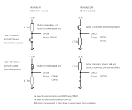
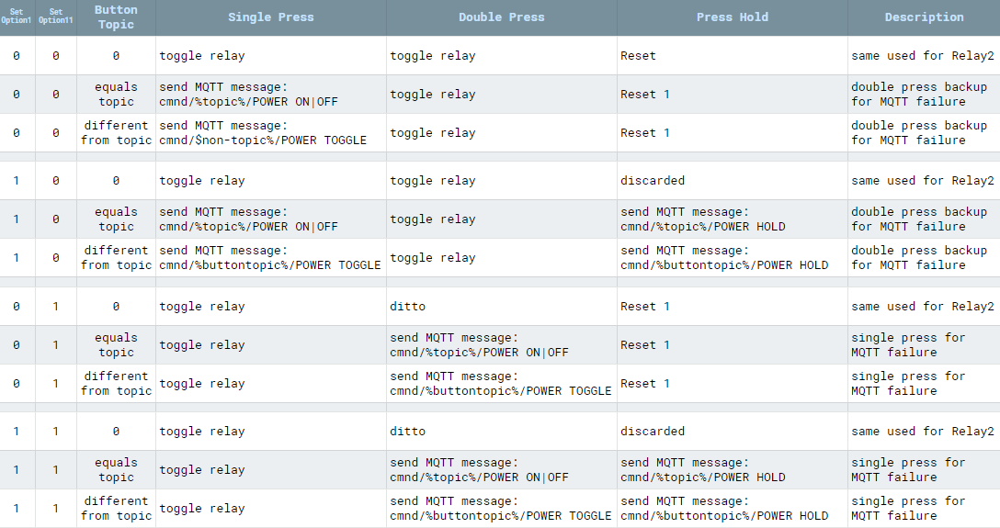

!!! info "Buttons and switches: why the difference and how to configure them"

A typical device usually has at least one button (exception being bulbs and some lights) to control the power state(s). Additional buttons and switches can be [wired](Expanding-Tasmota#connect-switch) to a free GPIO and configured in Module or Template settings.

!!! note
    Other than relays/lights, Tasmota does not publish the state of components (switches, buttons, sensors, etc.) in real-time. State of components is transmitted automatically each [TelePeriod](Commands.md#teleperiod) via the `SENSORS` message.

# Button vs. Switch
A button (also called a push-button) is a momentary or non-latching switch which causes a temporary change in the state of an electrical circuit only while the switch is pressed. An automatic mechanism (i.e. a spring) returns the switch to its default position immediately afterwards, restoring the initial circuit condition.

A switch (more precisely a latching or toggle switch), when activated by the user, remains in that state until activated again.

Learn more about buttons and switches in [this video](https://www.youtube.com/watch?v=jNvCQVrEpDQ).

Both have a similar function, but Tasmota distinguishes between a "Button" and a "Switch" in other ways.

## Switch
 </img>

In Tasmota a `Switch` is any switch or push-button additionally connected to a free GPIO. Some possibilities include:

- [mechanical toggle switch](https://en.wikipedia.org/wiki/Switch#Toggle_switch) - also called a rocker switch
- [capacitive touch switch](https://en.wikipedia.org/wiki/Touch_switch)
- [reed switch](https://en.wikipedia.org/wiki/Reed_switch)
- [PIR sensor](https://en.wikipedia.org/wiki/Passive_infrared_sensor) - even though it's technically a  sensor it is [configured as a switch in Tasmota](PIR-Motion-Sensors)
- [mechanical push-button](https://en.wikipedia.org/wiki/Push-button)

By default a switch toggles the corresponding power state (e.g., `Switch1` controls `Power1`). Every time the switch gets flipped the power state of the relay toggles.

If you want to detach switches from relays read [here](#detach-switches-with).

!!! warning
    If you define a switch with a number higher than available power outputs it will default to controlling `Power1`. Example: Switch4 on a device with Power1 and Power2 will control `Power1`.

And now, to make everything completely confusing:
A push-button can be configured as a `Switch` and a toggle switch can be configured as a `Button`. Configuring a toggle switch as a `Button` is not recommended!

### SwitchMode

To change the behavior of a physical input peripheral configured as a Tasmota `Switch<x>` component, whether a toggle switch or a [momentary switch](https://en.wikipedia.org/wiki/Switch#Biased_switches) (i.e., a push-button), use the `SwitchMode` command. If there is more than one `Switch<x>` component, use `SwitchMode<x>` where `<x>` is the number of your switch from the Tasmota GPIO configuration.

SwitchMode, as the name implies, applies _**ONLY**_ to GPIO configured in Tasmota as a `Switch<x>` [component](Components). SwitchMode has _**NO**_ impact on the behavior of GPIO configured as `Button<x>` [components](Components). SwitchMode sets the desired behavior of a `Switch<x>` component based on whether it's a switch or a push-button (i.e., a momentary switch) that is physically connected to the GPIO.

**`SwitchMode 0`**
:    _Default mode_

    Set switch to toggle mode (`0 = TOGGLE`, `1 = TOGGLE`).

    Tasmota sends `TOGGLE` command each time the state of the circuit changes (closing or opening). In case of a push button attached Tasmota will send a `TOGGLE` command when pressed and another `TOGGLE` command when released.

    !!! example
        When the button is pressed, toggle the power to ring the doorbell; when the button is released, ring the doorbell again.

**`SwitchMode 1`**
:   Set switch to follow mode (`0 = OFF`, `1 = ON`)

    At the time when the circuit is closed, Tasmota will send `ON` and opening the circuit sends `OFF`.

    !!! tip
        You want to use `SwitchMode 1` when connecting a [toggle switch](https://en.wikipedia.org/wiki/Switch#Toggle_switch) (e.g. a classic light switch) to your  device. This way the "software switch" will mirror the state of the "hardware switch". If the real switch is in the "ON" position, the state in Tasmota  is `ON` as well.

**`SwitchMode 2`**

:   Set switch to inverted follow mode (`0 = ON`, `1 = OFF`)

    At the time when the circuit is closed, Tasmota will send `OFF` and opening the circuit sends `ON`.

    !!! tip
        When connecting a momentary switch (i.e., a push-button) you will want to use `SwitchMode 3..7`.

**`SwitchMode 3`**
:    Set push-button mode (`0 = TOGGLE`, `1 = ON` (_default_))

    Tasmota will send a `TOGGLE` command when the button is pressed (closing the circuit). When the button is released (opening the circuit) nothing will happen. Default state is OFF and when pressed it's ON. (This trigger is known as [rising-edge](https://en.wikipedia.org/wiki/Signal_edge))

**`SwitchMode 4`**
:    Set inverted push-button mode (`0 = OFF` (_default_), `1 = TOGGLE`)

    Tasmota will send a `TOGGLE` command when the button is released (opening the circuit). When pressing the button (closing the circuit) nothing will happen. Default state is ON and when pressed it's OFF. (This trigger is known as [falling-edge](https://en.wikipedia.org/wiki/Signal_edge))

**`SwitchMode 5`**
:    Set push-button with long press mode (`0 = TOGGLE`, `1 = ON` (_default_), `long press = HOLD`)

    Tasmota will send a `TOGGLE` command when the button is released (opening the circuit). When pressing the button (closing the circuit) nothing will happen. Default state is ON and when pressed it's OFF. When held for the time set in `SetOption32` (_default = 4s_), Tasmota sends `HOLD` (use `Switch<x>#state=3` in rules).

**`SwitchMode 6`**
:    Set inverted push-button with long press mode (`0 = OFF` (_default_), `1 = TOGGLE`, `long press = HOLD`)

    Tasmota will send a `TOGGLE` command when the button pressed (closing the circuit). When the button is released (opening the circuit) nothing will happen. Default state is OFF and when pressed it's ON. When held for the time set in `SetOption32` (_default = 4s_), Tasmota sends `HOLD` (use `Switch<x>#state=3` in rules).

    !!! tip "Long press or hold can be used in [conjunction with rules](Rules#long-press-on-a-switch) to create additional features or to control another Tasmota device"

**`SwitchMode 7`**
:    Set toggle push-button mode. Same as `SwitchMode 0`.

**`SwitchMode 8`**
:    Set switch to multi change toggle mode (`0 = TOGGLE`, `1 = TOGGLE`, `2x change = HOLD`).

    Same as `SwitchMode 0` but when the state of the circuit changes within 0.5s twice no `TOGGLE` commands are send but Tasmota sends `HOLD` (use `Switch<x>#state=3` in rules).

    !!! warning
        When you change switch states fast (within 0.5s) some extra actions can be triggered using rules. ON and OFF power states are only changed when there is no second switch change within 0.5s.

**`SwitchMode 9`**
:    Set switch to multi change follow mode (`0 = OFF`, `1 = ON`, `2x change = HOLD`)

    Same as `SwitchMode 1` but when the state of the circuit changes within 0.5s twice no `OFF/ON` commands are send but Tasmota sends `HOLD` (use `Switch<x>#state=3` in rules).

    !!! warning
        When you change switch states fast (within 0.5s) some extra actions can be triggered using rules. ON/OFFpower state is only changed when there is no second switch change within 0.5s.

**`SwitchMode 10`**
:    Set switch to multi change inverted follow mode (`0 = ON`, `1 = OFF`, `2x change = HOLD`)

    Same as `SwitchMode 2` but when the state of the circuit changes within 0.5s twice no `ON/OFF` commands are send but Tasmota sends `HOLD` (use `Switch<x>#state=3` in rules).

    !!! warning
        When you change switch states fast (within 0.5s) some extra actions can be triggered using rules. ON/OFFpower state is only changed when there is no second switch change within 0.5s.

**`SwitchMode 11`**
:    Set switch to pushbutton with dimmer mode incl. double press feature

    !!! note
        Setoption32 must be smaller than 64, when you use switchmode 11 and 12 !!

    Tasmota will send a `TOGGLE` command when the button is pressed for a short time and then is released (use `Switch<x>#state=2` in rules).

    When pressing the button (closing the circuit) for a long time (set in `SetOption32`), Tasmota will send repeated `INC_DEC` (increment or decrement the dimmer) commands for as long as the button is pressed (use `Switch<x>#state=4` in rules).

    Two different `CLEAR` commands are available. An immediate `CLEAR` command is send upon button release - no delay (use `Switch<x>#state=7` in rules).

    Releasing the button also starts an internal timer (time is set in `SetOption32`). When released for the time set in `SetOption32`, Tasmota will send a 'delayed' `CLEAR` command (use `Switch<x>#state=6` in rules).

    If the button is pressed again before the timeout, Tasmota will send an `INV` command. The `INV` command is for the controlling software (Home Assistant) to switch between incrementing and decrementing the dimmer (use `Switch<x>#state=5` in rules).

    If button is pressed twice (within time set in `SetOption32`), Tasmota will send a `DOUBLE` command. Note that this **doesn't** change behaviour of other switch states. So along with the `DOUBLE` command, `TOGGLE` command will also be fired twice upon a double press (use `Switch<x>#state=8` in rules).
    
    If the button is pressed only once and shorter than the time set in `SetOption32`, Tasmota will also send the `POWER_DELAYED` command (use `Switch<x>#state=10` in rules) when no second press occurs within time set in `SetOption32`. You can use this for triggering single press events instead of using `TOGGLE` if you want to use single and double press individually (since `TOGGLE` is triggered for both single and double press). Keep in mind, that this event is delayed in comparison to `TOGGLE`.

    !!! tip
        Possible use case: [using rules](Rules.md#control-a-dimmer-with-one-switch) to create additional features or to control another Tasmota device. 

**`SwitchMode 12`**
:    Set switch to inverted pushbutton with dimmer mode incl. double press feature.
    Same as `Switchmode 11` but with inverted behaviour.

    !!! note
        Setoption32 must be smaller than 64, when you use switchmode 11 and 12 !!

**`SwitchMode 13`**
:    Set switch to "push to on" mode (`1 = ON`, `0 = nothing`)

    Tasmota will send an `ON` command when the button pressed (closing the circuit). When the button is released (opening the circuit) nothing will happen. Switch off using `PulseTime`.

**`SwitchMode 14`**
:    Set switch to inverted "push to on" mode (`0 = ON`, `1 = nothing`)

    !!! tip "This mode is useful with [PIR sensors](PIR-Motion-Sensors)"

**`SwitchMode 15`**
:    Send only MQTT message on switch change. This will stop the switch from controlling power outputs.

    ```console
    tele/tasmota/SENSOR = {"Time":"2021-01-01T00:00:00","Switch1":"OFF"}
    tele/tasmota/SENSOR = {"Time":"2021-01-01T00:00:00","Switch1":"ON"}
    ```
**`SwitchMode 16`**
:    Send only MQTT message on inverted switch change. This will stop the switch from controlling power outputs.

    ```console
    tele/tasmota/SENSOR = {"Time":"2021-01-01T00:00:00","Switch1":"ON"}
    tele/tasmota/SENSOR = {"Time":"2021-01-01T00:00:00","Switch1":"OFF"}
    ```

    !!! tip "Also see `SetOption114` below."


## Button
 </img>

For Tasmota, a `Button` is typically a momentary push-button (or a capacitive touch button in some light switches). By default a button toggles the corresponding power state. Every time the button gets pressed a relay or light changes its `Power` state (ON or OFF). Besides toggling  the `Power` state, a button is also used to activate [multi press button functions](#multi-press-functions), to do long press (HOLD) actions, or send messages to different MQTT topics.

[](Buttons-schematics.md)
Depending if you are using a push-to-make button or push-to-break button, as well as connecting the button between GPIO and GND or GPIO and VCC, different configurations are possible. The diagram beside (click to enlarge) present the various options:

To ignore default button behaviour of controlling power outputs you can:

1. use [`SetOption73 1`](Commands.md#setoption73)
2. use [`ButtonTopic`](#buttontopic)
3. define a rule which triggers on `Button<x>#State`. Take note: If the rule trigger only certain states, default behaviour is suppressed only for those states.


!!! example "Make Button1 publish its value to `stat/custom-topic/BUTTON` and not control Power1"
```haskell
Backlog ButtonTopic 0
```
```haskell
Rule1 on Button1#state do Publish stat/custom-topic/BUTTON %value% endon
Rule1 1
```

### Multi-Press Functions

Multipress functions for 2 and more presses cannot be changed using SetOptions or rules.

!!! danger
    If you [have changed](#changing-default-functionality) [ButtonTopic](Commands.md#buttontopic), [SetOption1](Commands.md#setoption1), [SetOption11](Commands.md#setoption11) or [SetOption13](Commands.md#setoption13) some of the listed functionality will be changed or removed.

!!! note
    `Button1` can directly control up to five relays. The number of the activated relay corresponds to the number of button presses and this feature is not present in the other buttons.
    When ButtonTopic is set to default `0` a button will always send its state for rules.

`1 short press`
:    Toggles the power state. This will blink the LED once and send an MQTT status message like `stat/tasmota/POWER = ON` or another one like `stat/tasmota/BUTTON<x> = {"ACTION":"SINGLE"}` when SetOption73 is enabled. The button state for rules is `2` (`10` if `Setoption73` is enabled).

`2 short presses`
:    When using Button1 toggles the second power state (if available on the device). This will blink the LED twice and send an MQTT status message like `stat/tasmota/POWER2 = ON` or another one like `stat/tasmota/BUTTON<x> = {"ACTION":"DOUBLE"}` when SetOption73 is enabled. The button state for rules is `11`.

`3 short presses`
:    When using Button1 toggles the third power state (if available on the device). This will blink the LED three times and send an MQTT status message like `stat/tasmota/POWER3 = ON` or another one like `stat/tasmota/BUTTON<x> = {"ACTION":"TRIPLE"}` when SetOption73 is enabled. The button state for rules is `12`.

`4 short presses`
:    When using Button1 toggles the fourth power state (if available on the device). This will blink the LED for times and send an MQTT status message like `stat/tasmota/POWER4 = ON` or another one like `stat/tasmota/BUTTON<x> = {"ACTION":"QUAD"}` when SetOption73 is enabled. The button state for rules is `13`.

`5 short presses`
:    When using Button1 toggles the fifth power state (if available on the device). This will blink the LED five times and send an MQTT status message like `stat/tasmota/POWER5 = ON` or another one like `stat/tasmota/BUTTON<x> = {"ACTION":"PENTA"}` when SetOption73 is enabled. The button state for rules is `14`.

`6 short presses`
:    Set [`WifiConfig 2`](Commands.md#wificonfig) (start Wi-Fi Manager). Can be disabled using [`SetOption1 1`](Commands.md#setoption1). For [security reasons](Securing-your-IoT-from-hacking.md#disable-unsecured-fallback-wifi-wifimanager), you should change back `WifiConfig` after that.

`**Long press**`
:    There are two separate functions associated with a button long press based on how long it is held:

    1. When held continuously for 40 seconds (Configurable with [SetOption32](Commands.md#setoption32), value is 10x the configured hold time) Tasmota will reset to firmware defaults and restart.
    2. If enabled, button pressed for 4 seconds (Configurable with [SetOption32](Commands.md#setoption32)) creates a HOLD action and send an MQTT status message like `stat/tasmota/BUTTON<x> = {"ACTION":"HOLD"}` when SetOption73 is enabled. The button state for rules is `3`.

    !!! note "If [ButtonRetain](Commands.md#buttonretain) has been enabled the MQTT message will also contain the MQTT retain flag."

    !!! danger
        When a button is configured as inverted or with a [Switchmode](Commands.md#switchmode) that keeps it as ON while depressed it activates the reset to firmware defaults function. Change the Button configuration or SwitchMode to avoid repeated reset to defaults or use `Setoption1 1` to disable that function.

    !!! warning
        If you define a button with a number higher than available power outputs it will default to controlling `Power1`. Example: Button4 on a device with Power1 and Power2 will control `Power1`.

### ButtonTopic

**`ButtonTopic 0`**
:    _Default option_

    By default a button controls the corresponding power state and doesn't send any MQTT messages itself.

    No MQTT message will be published on account of the new button state. The message you see in console is the new power state that is controlled and not the button state.

**`ButtonTopic 1`**
:    Sets MQTT button topic to device %topic%.

    When changing the state of the button an MQTT message is sent to the device topic with the payload according to `SwitchMode` set.

    !!! example
        Device topic _tasmota_ with `SwitchMode 3` yields the following message: `MQT: cmnd/tasmota/POWER = ON`

        Notice the _cmnd_ instead of the _stat_ at the beginning.

    This is the same as sending an MQTT command to this device, the device power state will be set to the defined state.

**`ButtonTopic <value>`**
:    Set button topic to a custom topic (32 characters max).

    This will send an MQTT message to a custom defined topic similarly to option 1.

    !!! example
        For example, we set the topic to _tasmota02_ with `ButtonTopic tasmota02`.
        With `SwitchMode 1` the device yields the following message: `MQT: cmnd/tasmota02/POWER = TOGGLE`

        If you have another device with the topic _tasmota02_ this action will toggle its power state while not affecting anything on the _tasmota_ device.

#### ButtonTopic Summary

`ButtonTopic 0` controls the power state directly.
`ButtonTopic 1` sends an MQTT message to the device topic. This sets the state of the devices power state accordingly.
`ButtonTopic <value>` sends an MQTT message command to the custom topic. This does not change the state of the devices power state.

!!! warning "**When a Button is set to a different topic than `0` is not possible to use `Button<x>#State` as a trigger for rules.**"

### Changing Default Functionality

If a [`ButtonTopic`](Commands.md#buttontopic) (and if [`SetOption1 1`](Commands.md#setoption1)) or [`SwitchTopic 1`](Commands.md#switchtopic) is defined (and [`SwitchMode`](Commands.md#switchmode) is set to `5` or `6`) and a button is pressed longer than defined Key Hold Time ([`SetOption32`](Commands.md#setoption32) default 4 seconds) an MQTT message like `cmnd/%topic%/POWER HOLD` will be sent. `HOLD` can be changed with [`StateText4`](Commands.md#StateText).

Command [`SetOption11`](Commands.md#setoption11) allows for swapping the functionality between the SINGLE and DOUBLE press of the push button.

These changes result in the following:

[](_media/button-matrix.png)

#### Example

You can control a ceiling fan from a Sonoff Touch:
If your standard topic of Sonoff Touch is `light` and the ceiling fan topic is `ceilingfan` issue these commands on the Sonoff Touch to activate the double press feature.
```haskell
ButtonTopic ceilingfan
SetOption11 1
```
All of the above is easier accomplished using [Rules](Rules#button-single-press-double-press-and-hold)!

## AC Frequency Detection Switch
Some devices, such as [BlitzWolf BW-SS5](https://templates.blakadder.com/blitzwolf_BW-SS5.html) or [Moes MS-104B](https://templates.blakadder.com/moes-MS-104B.html), use mains frequency detection on their switch inputs. Whenever the connected switch or button is pressed there are 50/60 Hz pulses on the switch input. Inside the switch there's a frequency detection circuit which is connected to a GPIO of the ESP8266 chip which counts those pulses. Prior to Tasmota 8.4 this kind of switching was handled using Counter sensors and scripting which is now simplified.

You can imagine this algorithm as a leaking bucket. Every pulse adds water to the bucket (little more than leaking out in a cycle), but the water is dripping countinously. If the bucket is full, we will treat the switch on. If there's no pulses, the bucket will be empty, and the we will turn off the switch. The size of the bucket is the debouncing time which controls the sensitivity of the algorithm. If the mains frequency is 50 Hz, a whole AC wave is 20 msec long (for 60 Hz it's about 17 msec; 1000 / frequency if we want the result in milliseconds). The exact frequency is not really important, because we add more water for every pulse.

After you have assigned a Switch<x\> to the GPIO connected to the AC frequency detection circuit use the ['SwitchDebounce'](Commands.md#switchdebounce) command to set the number of pulses required for the switch to be recognized as on or off. For example: `SwitchDebounce 69` will turn the switch on after three pulses and turn it off after three missing ones (3 * 20 msec is 60 and the last digit must be 9 to activate the AC detection). You will probably have to experiment with the values depending on your AC frequency and the devices frequency detection implementation.

Once the feature is enabled you can use this switch as any regular switch!

## Detach Switches with...

### SetOption114

When `SetOption114 1` all switches are detached from their respective relays and will send MQTT messages instead in the form of `{"Switch<x>":{"Action":"<state>"}}`.

!!! example
    When switch one is toggle to "ON":`{"Switch1":{"Action":"ON"}}`

### SwitchMode 15

With command `SwitchMode<x> 15` you can decouple Switch<x\> from its power output and it will instead send MQTT messages in the following format:

```json
MQT: tele/tasmota/SENSOR = {"Time":"2021-01-01T00:00:00","Switch1":"OFF"}
MQT: tele/tasmota/SENSOR = {"Time":"2021-01-01T00:00:01","Switch1":"ON"}
```
You can globally change the status text with [`StateText`](Commands.md#statetext) command.

You can change the default "Switch1" text using [`SwitchText<x>`](Commands.md#switchtext) command.  For example: `SwitchText1 Garage_Door_State`

When `Setoption114 1` is used together with `SwitchMode<x> 15`, Tasmota Integration in Home Assistant will create a binary sensor in HA using the Default text "String1" or the text mentioned in the `SwitchText` command.

### Rules

Use rules to send messages to different MQTT topics or send commands to other Tasmota devices when switch state (defined by [SwitchMode](#switchmode)) changes.

To ignore the default behaviour define a rule which triggers on `Switch<x>` for all state changes or on `Switch<x>#State` for specific state changes. If a rule matches only certain states, default switch behaviour is suppressed only for those states.

!!! example
     Make Switch1 publish any value change to `stat/custom-topic/SWITCH1` and not control Power1
```haskell
Backlog SwitchMode 1; SwitchTopic 0
```
```haskell
Backlog Rule1 on Switch1#state do Publish stat/custom-topic/SWITCH1 %value% endon; Rule1 1
```

### SwitchTopic

!!! warning
    When using `SwitchTopic 1` or `2` (or `ButtonTopic 1` or `2`)  and your MQTT broker becomes unavailable, Tasmota falls back to default `SwitchTopic 0` (or `ButtonTopic 0`), which is not optimal.<br>To avoid this, we recommend using first two options instead.

If you still need to use SwitchTopic read on!

**`SwitchTopic 0`**
:    _Default mode_

    By default a switch controls the corresponding power state and doesn't send any MQTT messages itself.

    No MQTT message will be published on account of the new switch state. The message you see in console is the new power state that is controlled and not the switch state.

**`SwitchTopic 1`**
:    _Sets MQTT switch topic to device %topic%_

    When changing the state of the switch an MQTT message is sent to the device topic with the payload according to `SwitchMode` set.

    !!! example
        Device topic _tasmota_ with `SwitchMode 3` yields the following message: `MQT: cmnd/tasmota/POWER = TOGGLE`

        Notice the _cmnd_ instead of the _stat_ at the beginning.

    This is the same as sending an MQTT commands to this device, the device power state will be set to the defined state.

**`SwitchTopic <value>`**
:    _Set switch topic to a custom topic (32 characters max)_

    This will send an MQTT message to a custom defined topic similarly to option 1.

    In the following example, we set the topic to `tasmota02` with `SwitchTopic tasmota02`.

    !!! example
        Device topic _tasmota_ with `SwitchMode 1` and custom topic _tasmota02_ yields the following message: `MQT: cmnd/tasmota02/POWER = ON`
    
        If you have another device with the topic _tasmota02_ this action will turn on its power while not affecting anything on the _tasmota_ device.

#### SwitchTopic Summary

`SwitchTopic 0` controls the power state directly.
`SwitchTopic 1` sends an MQTT message to the device topic. This sets the state of the devices power accordingly.
`SwitchTopic <value>` sends an MQTT message command to the custom topic. This does not change the state of the devices power.

---

For a practical application of everything mentioned in this article read about this excellent [LEGO nightstand switch project](https://jeff.noxon.cc/2018/11/21/lego-nightstand-light-switch/).

