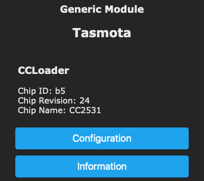

# CCLoader
!!! info "development version feature"  

This is a port of the CCLoader utility from RedBearLab in form of a driver for Tasmota. The main difference is, that now only one ESP8266 is needed to do all the tasks. As a result OTA-upgrades are possible too.  
  
The driver is tested for a CC2531, but should work on every CC25xx-device, that is supported by the original CCLoader.  

The wiring to the debug pins (= programming pins) of the CC25xx boards stays the same. It is possible to leave all wires connected (VCC,GND,RX,TX).  
  
In the current version of the Tasmota driver the pins are hardcoded and could be changed easily in the code:  
  
```
int CCL_RESET = 14; //GPIO14=D5 on NodeMCU/WeMos D1 Mini  
int CCL_DD = 4; //GPIO4=D2 on NodeMCU/WeMos D1 Mini  
int CCL_DC = 5; //GPIO5=D1 on NodeMCU/WeMos D1 Mini  
```
  
The driver must be enabled manually for a self compiled Tasmota binary.  
`#define USE_CCLOADER`  
  
  
After reboot the connected CC25xx chip will be reported in the console and the WebUI.  
  


Then chose **Firmware Upgrade** in the WebUI.  
  

  
Now download the correct firmware as a .bin-file, if you haven't done already. Do not use a .hex-file. These can be found for various chips here:  
https://github.com/Jason2866/CCLoader/tree/master/Bin 

Select **_Ugprade by file upload_**, like you would do for a OTA upgrade of the Tasmota firmware. If a CC25xx chip was successfully detected and the selected file passes a (very minimalistic) check, this will trigger the upload to the CC25xx.  
  

  
This will start the upgrade, which will take several seconds. The progress will be printed to the console and after the finish, the device gets rebooted. 
A power cycle is recommended. That’s it.  
  
Now it might be a good time to upload a Zigbee- or HM1x-firmware to your ESP8266.  

