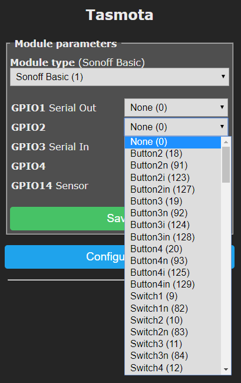

!!! info "**Component** is anything wired to the ESP8266/ESP8255 chip to be controlled by or send data to it."

<a href="../_media/components.png" target="_blank"></img></a>

Components can be: buttons, switches, relays, LEDs, sensors, displays, MCU units, etc. Every component is assigned in the device template to the GPIO it is wired (connected) to.

Every Tasmota device has some components configured by default. Most often there is a relay, a button and a LED configured as is the case for a Sonoff Basic in the following image.

!!! bug
    Tasmota 9.1 completely redesigned GPIO mapping to allow for future expansion. Read more about the [GPIO Conversion](GPIO-Conversion.md)

## Assigning Components
</img>
If you wish to expand a device with a peripheral component, after properly wiring everything, you need to assign it to a free GPIO in **Configure Module** page or use command [`GPIO<x>`](Commands.md#gpio).

Read more about [peripherals](Supported-Peripherals.md).

!!! tip
     GPIOs configured as User (1) are the GPIOs that can be assigned to components in the **Configure Module** page.

## GPIOs

| Old GPIO | New GPIO | Name            | Description                                                                                |
| -------- | -------- | --------------- | ------------------------------------------------------------------------------------------ |
| 255      | 1        | User            | User                                                                                       |
| 0        | 0        | None            | Not used                                                                                   |
| 1        | 1184     | DHT11           | DHT11 sensor                                                                               |
| 2        | 1216     | AM2301          | AM230X, DHT21 and DHT22 sensor                                                             |
| 3        | 1248     | SI7021          | Only for Sonoff Si7021, not the i2c version                                                |
| 4        | 1312     | DS18x20         | Dallas Semiconductor DS18b20 1-Wire temperature sensor                                     |
| 5        | 608      | I2C SCL         | I2C serial clock pin, used with any I2C component (sensors, displays, ...)                 |
| 6        | 640      | I2C SDA         | I2C serial data pin, used with any I2C component (sensors, displays, ...)                  |
| 7        | 1376     | WS2812          | Addressable LEDs such as WS281X or Neopixel                                                |
| 8        | 1056     | IRsend          | IR Transmitter LED                                                                         |
| 9        | 160      | Switch 1        | Switch                                                                                     |
| 10       | 161      | Switch 2        | Switch                                                                                     |
| 11       | 162      | Switch 3        | Switch                                                                                     |
| 12       | 163      | Switch 4        | Switch                                                                                     |
| 13       | 164      | Switch 5        | Switch                                                                                     |
| 14       | 165      | Switch 6        | Switch                                                                                     |
| 15       | 166      | Switch 7        | Switch                                                                                     |
| 16       | 167      | Switch 8        | Switch                                                                                     |
| 17       | 32       | Button 1        | Button active low, internal pull-up resistor                                                |
| 18       | 33       | Button 2        | Button active low, internal pull-up resistor                                                |
| 19       | 34       | Button 3        | Button active low, internal pull-up resistor                                                |
| 20       | 35       | Button 4        | Button active low, internal pull-up resistor                                                |
| 21       | 224      | Relay 1         | Relay                                                                                      |
| 22       | 225      | Relay 2         | Relay                                                                                      |
| 23       | 226      | Relay 3         | Relay                                                                                      |
| 24       | 227      | Relay 4         | Relay                                                                                      |
| 25       | 228      | Relay 5         | Relay                                                                                      |
| 26       | 229      | Relay 6         | Relay                                                                                      |
| 27       | 230      | Relay 7         | Relay                                                                                      |
| 28       | 231      | Relay 8         | Relay                                                                                      |
| 29       | 256      | Relay_i 1       | Relay inverted                                                                             |
| 30       | 257      | Relay_i 2       | Relay inverted                                                                             |
| 31       | 258      | Relay_i 3       | Relay inverted                                                                             |
| 32       | 259      | Relay_i 4       | Relay inverted                                                                             |
| 33       | 260      | Relay_i 5       | Relay inverted                                                                             |
| 34       | 261      | Relay_i 6       | Relay inverted                                                                             |
| 35       | 262      | Relay_i 7       | Relay inverted                                                                             |
| 36       | 263      | Relay_i 8       | Relay inverted                                                                             |
| 37       | 416      | PWM 1           | Pulse Width Modulated Output                                                               |
| 38       | 417      | PWM 2           | Pulse Width Modulated Output                                                               |
| 39       | 418      | PWM 3           | Pulse Width Modulated Output                                                               |
| 40       | 419      | PWM 4           | Pulse Width Modulated Output                                                               |
| 41       | 420      | PWM 5           | Pulse Width Modulated Output                                                               |
| 42       | 352      | Counter 1       | Counter Input                                                                              |
| 43       | 353      | Counter 2       | Counter Input                                                                              |
| 44       | 354      | Counter 3       | Counter Input                                                                              |
| 45       | 355      | Counter 4       | Counter Input                                                                              |
| 46       | 448      | PWM_i 1         | Pulse Width Modulated inverted Output                                                      |
| 47       | 449      | PWM_i 2         | Pulse Width Modulated inverted Output                                                      |
| 48       | 450      | PWM_i 3         | Pulse Width Modulated inverted Output                                                      |
| 49       | 451      | PWM_i 4         | Pulse Width Modulated inverted Output                                                      |
| 50       | 452      | PWM_i 5         | Pulse Width Modulated inverted Output                                                      |
| 51       | 1088     | IRrecv          | IR Receiver Input (for example TSOP1838)                                                   |
| 52       | 288      | Led 1           | LED                                                                                        |
| 53       | 289      | Led 2           | LED                                                                                        |
| 54       | 290      | Led 3           | LED                                                                                        |
| 55       | 291      | Led 4           | LED                                                                                        |
| 56       | 320      | Led_i 1         | Inverted LED - default state ON                                                            |
| 57       | 321      | Led_i 2         | Inverted LED - default state ON                                                            |
| 58       | 322      | Led_i 3         | Inverted LED - default state ON                                                            |
| 59       | 323      | Led_i 4         | Inverted LED - default state ON                                                            |
| 60       | 1408     | MHZ Rx          | MHZ 19 CO~2~ Sensor                                                                          |
| 61       | 1440     | MHZ Tx          | MHZ 19 CO~2~ Sensor                                                                          |
| 62       | 1472     | PZEM0XX Tx      | Peacefair Pzem-0XX Power Meter Tx pin                                                      |
| 63       | 1504     | PZEM004 Rx      | Peacefair Pzem-004 Power Meter Rx pin                                                      |
| 64       | 1600     | SAir Rx         | Sensor Senseair                                                                            |
| 65       | 1632     | SAir Tx         | Sensor Senseair                                                                            |
| 66       | 768      | SPI CS          | SPI Interface (ePaper Display)                                                             |
| 67       | 800      | SPI DC          | SPI Interface (ePaper Display)                                                             |
| 68       | 992      | BkLight         | Backlight (Display)                                                                        |
| 69       | 1696     | PMS5003         | PMS5003 Air Quality Sensor                                                                 |
| 70       | 1760     | SDS0X1 Rx       | Nova Fitness SDS011 Laser Dust Sensor Rx pin                                               |
| 71       | 1792     | SerBr Rx        | Serial Bridge Receive                                                                      |
| 72       | 1824     | SerBr Tx        | Serial Bridge Transmit                                                                     |
| 73       | 1856     | SR04 Tri        | Ultrasonic Sensor HC-SR04 Trigger pin                                                      |
| 74       | 1888     | SR04 Ech        | Ultrasonic Sensor HC-SR04 Echo pin                                                         |
| 75       | 1920     | SDMx20 Tx       | SDMx20-Modbus Multifunction Power Analyser Tx pin                                          |
| 76       | 1952     | SDMx20 Rx       | SDMx20-Modbus Multifunction Power Analyser Rx pin                                          |
| 77       | 1984     | SDM630 Tx       | SDM630-Modbus Multifunction Power Analyser Tx pin                                          |
| 78       | 2016     | SDM630 Rx       | SDM630-Modbus Multifunction Power Analyser Rx pin                                          |
|        |       | SDM72 Tx       | SDM72 Power Analyser Tx pin                                          |
|        |       | SDM72 Rx       | SDM72 Power Analyser Rx pin                                          |
| 79       | 2048     | TM16 CLK        | TM1638 Switch Module                                                                       |
| 80       | 2080     | TM16 DIO        | TM1638 Switch Module                                                                       |
| 81       | 2112     | TM16 STB        | TM1638 Switch Module                                                                       |
| 82       | 192      | Switch_n 1      | Switch, no pull-up resistor                                                                 |
| 83       | 193      | Switch_n 2      | Switch, no pull-up resistor                                                                 |
| 84       | 194      | Switch_n 3      | Switch, no pull-up resistor                                                                 |
| 85       | 195      | Switch_n 4      | Switch, no pull-up resistor                                                                 |
| 86       | 196      | Switch_n 5      | Switch, no pull-up resistor                                                                 |
| 87       | 197      | Switch_n 6      | Switch, no pull-up resistor                                                                 |
| 88       | 198      | Switch_n 7      | Switch, no pull-up resistor                                                                 |
| 89       | 199      | Switch_n 8      | Switch, no pull-up resistor                                                                 |
| 90       | 64       | Button_n 1      | Button, active low, no internal pull-up resistor                                            |
| 91       | 65       | Button_n 2      | Button, active low, no internal pull-up resistor                                            |
| 92       | 66       | Button_n 3      | Button, active low, no internal pull-up resistor                                            |
| 93       | 67       | Button_n 4      | Button, active low, no internal pull-up resistor                                            |
| 94       | 384      | Counter_n 1     | Counter sensor, no pull-up resistor                                                         |
| 95       | 385      | Counter_n 2     | Counter sensor, no pull-up resistor                                                         |
| 96       | 386      | Counter_n 3     | Counter sensor, no pull-up resistor                                                         |
| 97       | 387      | Counter_n 4     | Counter sensor, no pull-up resistor                                                         |
| 98       | 1536     | PZEM016 Rx      | Peacefair Pzem-016 Power Meter Rx pin                                                      |
| 99       | 1568     | PZEM017 Rx      | Peacefair Pzem-017 Power Meter Rx pin                                                      |
| 100      | 2144     | MP3 Player      | DF MP3 Player mini (Input)                                                                 |
| 101      | 1728     | SDS0X1 Tx       | Nova Fitness SDS011 Laser Dust Sensor Tx pin                                               |
| 102      | 2176     | HX711 SCK       | HX711 weight sensor serial clock input                                                     |
| 103      | 2208     | HX711 DAT       | HX711 weight sensor data output                                                            |
| 104      | 2240     | TX20            | TX20 Wind Sensor Input (Tx from sensor)                                                    |
| 105      | 1120     | RFSend          | RF Emitter (433Mhz module needed; Requires self-compile with RF_SENSOR and USE_RC_SWITCH)  |
| 106      | 1152     | RFrecv          | RF Receiver (433Mhz module needed; Requires self-compile with RF_SENSOR and USE_RC_SWITCH) |
| 107      | 2272     | Tuya Tx         | Tuya Transfer pin                                                                          |
| 108      | 2304     | Tuya Rx         | Tuya Receive pin                                                                           |
| 109      | 2336     | MGC3130 Xfr     | MGC3130 E-field Xfr pin                                                                    |
| 110      | 2368     | MGC3130 Rst     | MGC3130 E-field Reset pin                                                                  |
| 111      | 832      | SSPI MISO       | Software SPI MISO (Display)                                                                |
| 112      | 864      | SSPI MOSI       | Software SPI MOSI (Display)                                                                |
| 113      | 896      | SSPI SCLK       | Software SPI SCLK (Display)                                                                |
| 114      | 928      | SSPI CS         | Software SPI CS (Display)                                                                  |
| 115      | 960      | SSPI DC         | Software SPI DC (Display)                                                                  |
| 116      | 2400     | RF Sensor       | Theo Arendst RF433 Sensor                                                                  |
| 117      | 2432     | AZ Rx           | AZ 7798 CO~2~ datalogger                                                                     |
| 118      | 2464     | AZ Tx           | AZ 7798 CO~2~ datalogger                                                                     |
| 119      | 2496     | MX31855 CS      | MAX31855 Thermocouple Sensor Chip Select pin                                               |
| 120      | 2528     | MX31855 CLK     | MAX31855 Thermocouple Sensor Serial Clock pin                                              |
| 121      | 2560     | MX31855 DO      | MAX31855 Thermocouple Sensor Digital Output pin                                            |
| 122      | 96       | Button_i 1      | Button inverted, active high with internal pull-up resistor                                 |
| 123      | 97       | Button_i 2      | Button inverted, active high with internal pull-up resistor                                 |
| 124      | 98       | Button_i 3      | Button inverted, active high with internal pull-up resistor                                 |
| 125      | 99       | Button_i 4      | Button inverted, active high with internal pull-up resistor                                 |
| 126      | 128      | Button_in 1     | Button inverted, active high no internal pull-up resistor                                   |
| 127      | 129      | Button_in 2     | Button inverted, active high no internal pull-up resistor                                   |
| 128      | 130      | Button_in 3     | Button inverted, active high no internal pull-up resistor                                   |
| 129      | 131      | Button_in 4     | Button inverted, active high no internal pull-up resistor                                   |
| 130      | 2592     | HLWBL SEL       | Energy Monitoring (for example Pow)                                                        |
| 131      | 2624     | HLWBL SELi      | Energy Monitoring (for example Pow)                                                        |
| 132      | 2656     | HLWBL CF1       | Energy Monitoring (for example Pow)                                                        |
| 133      | 2688     | HLW8012 CF      | HLW8012 Single Phase Energy Monitor Chip CF pin                                            |
| 134      | 2720     | BL0937 CF       | BL0937 Single Phase Energy Monitor Chip CF pin                                             |
| 135      | 2752     | MCP39F5 Tx      | Energy Monitoring (for example Shelly2)                                                    |
| 136      | 2784     | MCP39F5 Rx      | Energy Monitoring (for example Shelly2)                                                    |
| 137      | 2816     | MCP39F5 Rst     | Energy Monitoring (for example Shelly2)                                                    |
| 138      | 2848     | PN532 Tx        | PN532 RFID/NFC Reader Tx pin                                                               |
| 139      | 2880     | PN532 Rx        | PN532 RFID/NFC Reader Rx pin                                                               |
| 140      | 2912     | SM16716 CLK     | SM16716 Pixel LED Serial Clock pin                                                         |
| 141      | 2944     | SM16716 DAT     | SM16716 Pixel LED Data pin                                                                 |
| 142      | 2976     | SM16716 PWR     | SM16716 Pixel LED Power pin                                                                |
| 143      | 3008     | MY92x1 DI       | Light Bulb with MY92x controller                                                           |
| 144      | 3040     | MY92x1 DCKI     | Light Bulb with MY92x controller                                                           |
| 145      | 3072     | CSE7766 Tx      | CSE7766 Single Phase Energy Monitor Chip Tx pin                                            |
| 146      | 3104     | CSE7766 Rx      | CSE7766 Single Phase Energy Monitor Chip Rx pin                                            |
| 147      | 3136     | ALux IrRcv      | AriLux RGB Controller IR receive (Input)                                                   |
| 148      | 3200     | Serial Tx       | Serial Transfer pin                                                                        |
| 149      | 3232     | Serial Rx       | Serial Receive pin                                                                         |
| 150      | 3264     | Rotary A 1      | Rotary Encoder (Mi Desk Lamp)                                                              |
| 151      | 3296     | Rotary B 1      | Rotary Encoder (Mi Desk Lamp)                                                              |
| 152      | 3265     | Rotary A 2      | Rotary Encoder (Mi Desk Lamp)                                                              |
| 153      | 3297     | Rotary B 2      | Rotary Encoder (Mi Desk Lamp)                                                              |
| 154      | 3392     | HRE CLOCK       | Clock/Power line for HR-E Water Meter                                                      |
| 155      | 3424     | HRE DATA        | Data line for HR-E Water Meter                                                             |
| 156      | 3456     | ADE7953_IRQ     | ADE7953 IRQ                                                                                |
| 157      | 544      | LedLink         | Device Status LED                                                                          |
| 158      | 576      | LedLinki        | Device Status LED, inverted                                                                |
| 159      | 3168     | ALux IrSel      | For AriLux devices - switches between IR/RF mode                                           |
| 160      | 480      | Buzzer          | Sonoff iFan03 Buzzer                                                                       |
| 161      | 512      | Buzzeri         | Sonoff iFan03 Buzzer inverted                                                              |
| 162      | 1024     | OLED Reset      | OLED Display Reset                                                                         |
| 163      | 3488     | SolaxX1 Tx      | Solax Inverter Tx pin                                                                      |
| 164      | 3520     | SolaxX1 Rx      | Solax Inverter Rx pin                                                                      |
| 165      | 3552     | Zigbee Tx       | Zigbee Serial interface Tx                                                                 |
| 166      | 3584     | Zigbee Rx       | Zigbee Serial interface Rx                                                                 |
| 167      | 3616     | RDM6300 Rx      | RDM6300 RX                                                                                 |
| 168      | 3648     | iBeacon Tx      | HM17 iBeacon Tx                                                                            |
| 169      | 3680     | iBeacon Rx      | HM17 iBeacon Rx                                                                            |
| 170      | 3712     | A4988 DIR       | A4988 Motor Direction                                                                      |
| 171      | 3744     | A4988 STP       | A4988 Step motor                                                                           |
| 172      | 3776     | A4988 ENA       | A4988 Enable motor                                                                         |
| 173      | 3808     | A4988 MS1       | A4988 Microstep increment select pin1                                                      |
| 174      | 3809     | A4988 MS2       | A4988 Microstep increment select pin2                                                      |
| 175      | 3810     | A4988 MS3       | A4988 Microstep increment select pin3                                                      |
|          | 3840     | Output Hi       | Fixed output state to high                                                                 |
|          | 3872     | Output Lo       | Fixed output state to low                                                                  |
| 176      | 3904     | DDS238-2 Tx     | DDS2382 Serial interface Tx                                                                |
| 177      | 3936     | DDS238-2 Rx     | DDS2382 Serial interface Rx                                                                |
| 178      | 3968     | DDSU666 Tx      | DDSU666 Serial interface Tx                                                                |
| 179      | 4000     | DDSU666 Rx      | DDSU666 Serial interface Rx                                                                |
| 180      | 4032     | SM2135 CLK      | SM2135 Clk                                                                                 |
| 181      | 4064     | SM2135 DAT      | SM2135 Dat                                                                                 |
| 182      | 4096     | DeepSleep       | DeepSleep wake switch                                                                      |
| 183      | 4128     | EXS Enable      | EXS Dimmer MCU Enable                                                                      |
| 184      | 4160     | Client TX       | TasmotaClient TX                                                                           |
| 185      | 4192     | Client RX       | TasmotaClient RX                                                                           |
| 186      | 4224     | Client RST      | TasmotaClient Reset Pin                                                                    |
| 187      | 4256     | Client RSTi     | TasmotaClient Reset Inverted                                                               |
| 188      | 4288     | HPMA RX         | Honeywell HPMA115S0 Serial Rx                                                              |
| 189      | 4320     | HPMA TX         | Honeywell HPMA115S0 Serial Tx                                                              |
| 190      | 4352     | GPS RX          | GPS Serial Tx                                                                              |
| 191      | 4384     | GPS TX          | GPS Serial Tx                                                                              |
| 192      | 1344     | DSB OUT         | Pseudo Single wire DS18B20 or DS18S20                                                      |
| 193      | 1280     | DHT11 OUT       | Pseudo Single wire DHT11, DHT21, DHT22, AM2301, AM2302, AM2321                             |
| 194      | 4416     | HM10 RX         | HM10-BLE-Mijia-bridge Serial                                                               |
| 195      | 4448     | HM10 TX         | HM10-BLE-Mijia-bridge Serial                                                               |
| 196      | 4480     | LE01MR RX       | F&F LE-01MR Energy Meter Serial                                                            |
| 197      | 4512     | LE01MR TX       | F&F LE-01MR Energy Meter Serial                                                            |
| 198      | 4544     | CC1101 GDO0     | CC1101 RX Pin                                                                              |
| 199      | 4576     | CC1101 GDO2     | CC1101 TX Pin                                                                              |
| 200      | 4608     | HRXL RX         | Data from MaxBotix HRXL sonar range sensor                                                 |
| 201      | 4640     | MOODL TX        | ElectriQ iQ-wifiMOODL Serial TX                                                            |
| 202      | 4672     | AS3935          | Lightning Detector Interrupt Pin                                                           |
| 203      | 1664     | PMS5003 TX      | Plantower PMS5003 Serial interface                                                         |
| 204      | 4928     | Boiler OT Rx    | OpenTherm Boiler RX pin                                                                    |
| 205      | 4960     | Boiler OT Tx    | OpenTherm Boiler TX pin                                                                    |
| 206      | 4992     | Windmeter Speed | WindMeter speed counter pin                                                                |
| 207      | 5056     | BL0940 RX       | BL0940 serial interface                                                                    |
| 208      | 5088     | TCP TX          | TCP to serial bridge                                                                       |
| 209      | 5120     | TCP RX          | TCP to serial bridge                                                                       |
| 210      | 5152     | TELEINFO RX     | [Teleinfo](Teleinfo) serial interface                                                      |
| 211      | 5184     | TELEINFO Enable | [Teleinfo](Teleinfo) Enable PIN                                                            |
| 212      | 5216     | LMT01           | LMT01 input counting pin                                                                   |
| 213      | 5248     | IEM3000 TX      | IEM3000 Serial interface                                                                   |
| 214      | 5280     | IEM3000 RX      | IEM3000 Serial interface                                                                   |
| 215      | 5312     | Zigbee RST      | Zigbee reset                                                                               |
| 216      | 5344     | DYP Rx          | DYP-ME007 Rx pin                                                                           |
|          |          | Miel Hvac Tx    | Mitsubishi Electric HVAC TX pin                                                            |
|          |          | Miel Hvac Rx    | Mitsubishi Electric HVAC RX pin                                                            |
|          |          | We517 Tx        | ORNO WE517 Serial interface                                                                |
|          |          | We517 Rx        | ORNO WE517 Serial interface                                                                |
|          |          | As608 Tx        | Serial interface AS608 / R503                                                              |
|          |          | As608 Rx        | Serial interface AS608 / R503                                                              |
|          |          | Rc522 RST       | RC522 reset                                                              |
|          |          | P9813 Clk       | P9813 Clock                                                            |
|          |          | P9813 Dat       | P9813 Data                                                             |
|          | 5728     | Option a 1      | Enable PWM2 high impedance if powered off as used by Wyze bulbs                            |
|          | 5729     | Option a 2      | Enable dummy energy monitor                                                                |
|          | 5730     | Option a 3      | Enable UDisplay universal display driver                                                   |
|          | 5731     | Option a 4      | Enable CCLoader using Zigbee Rx/Tx/Rst Gpios                                |
|          |          | Ftc532          | FTC532 touch controller serial input                                                            |
|          | 6336     | ADC pH          | Analog PH sensor                                                            |
|          |          | Bs814 Clk       | Bs814 Clock                                                            |
|          |          | Bs814 Dat       | Bs814 Data                                                             |
|          |          | Wiegand D0      | Wiegand data lines                                                            |
|          |          | Wiegand D1      | Wiegand data lines                                                             |
|          |          | Neopool Tx      | Sugar Valley RS485 interface                                                             |
|          |          | Neopool Rx      | Sugar Valley RS485 interface                                                             |
|          |          | TM1637 Tx      | TM1637 interface                                                             |
|          |          | TM1637 Rx      | TM1637 interface                                                             |
|          |          | Projector Ctrl Tx      | LCD/DLP Projector Serial Control                                                             |
|          |          | Projector Ctrl Rx      | LCD/DLP Projector Serial Control                                                            |
|          |          | XPT2046 Cs      | XPT2046 SPI Chip Select                                                         |
|        |       | CSE7761 Tx      | CSE7761 Single Phase Energy Monitor Chip Tx pin                                            |
|        |       | CSE7761 Rx      | CSE7761 Single Phase Energy Monitor Chip Rx pin                                            |
|          |          | VL53LXX XSHUT1     | VL53LXX_XSHUT (the max number of sensors is VL53LXX_MAX_SENSORS) Used when connecting multiple VL53LXX|
|          |          | MAX7219 Clk     | MAX7219 interface                                                         |
|          |          | MAX7219 Din      | MAX7219 interface                                                         |
|          |          | MAX7219 Cs      | MAX7219 interface                                                         |
|          |          | TFMINIPLUS Tx      | TFmini Plus ToF sensor interface                                                             |
|          |          | TFMINIPLUS Rx      | TFmini Plus ToF sensor interface                                                             |
|          |          | Zerocross      | Zerocross detection                                                             |
|          |          | Rotary A_n      | Rotary Encoder                                                                             |
|          |          | Rotary B_n      | Rotary Encoder                                                                             |
|          |          | Button_d 1      | Button, active low with internal pull-down resistor                                        |
|          |          | Button_d 2      | Button, active low with internal pull-down resistor                                        |
|          |          | Button_d 3      | Button, active low with internal pull-down resistor                                        |
|          |          | Button_d 4      | Button, active low with internal pull-down resistor                                        |
|          |          | Button_id 1     | Button inverted, active high with internal pull-down resistor                              |
|          |          | Button_id 2     | Button inverted, active high with internal pull-down resistor                              |
|          |          | Button_id 3     | Button inverted, active high with internal pull-down resistor                              |
|          |          | Button_id 4     | Button inverted, active high with internal pull-down resistor                              |
|          |          | Switch_d 1      | Switch, with pull-down resistor                                                            |
|          |          | Switch_d 2      | Switch, with pull-down resistor                                                            |
|          |          | Switch_d 3      | Switch, with pull-down resistor                                                            |
|          |          | Switch_d 4      | Switch, with pull-down resistor                                                            |
|          |          | Switch_d 5      | Switch, with pull-down resistor                                                            |
|          |          | Switch_d 6      | Switch, with pull-down resistor                                                            |
|          |          | Switch_d 7      | Switch, with pull-down resistor                                                            |
|          |          | Switch_d 8      | Switch, with pull-down resistor                                                            |

## ESP32 Only
| New GPIO | Name            | Description                                                                                |
| -------- | --------------- | ------------------------------------------------------------------------------------------ |
|          | Button_d 1      | Button, active low with internal pull-down resistor                                        |
|          | Button_d 2      | Button, active low with internal pull-down resistor                                        |
|          | Button_d 3      | Button, active low with internal pull-down resistor                                        |
|          | Button_d 4      | Button, active low with internal pull-down resistor                                        |
|          | Button_id 1     | Button inverted, active high with internal pull-down resistor                              |
|          | Button_id 2     | Button inverted, active high with internal pull-down resistor                              |
|          | Button_id 3     | Button inverted, active high with internal pull-down resistor                              |
|          | Button_id 4     | Button inverted, active high with internal pull-down resistor                              |
|          | EPD Data         |  Base connection EPD driver                                                                  |
|          | Halleffect         | Built in hall sensor                                                                  |
|          | Key1 TC         | ESP32 Touch pin as button                                                                  |
|          | Key1 PD         | ESP32 Touch pin as button                                                                  |
|          | Key1 Inv PD         | ESP32 Touch pin as button                                                                  |
|          | Switch_d 1      | Switch, with pull-down resistor                                                            |
|          | Switch_d 2      | Switch, with pull-down resistor                                                            |
|          | Switch_d 3      | Switch, with pull-down resistor                                                            |
|          | Switch_d 4      | Switch, with pull-down resistor                                                            |
|          | Switch_d 5      | Switch, with pull-down resistor                                                            |
|          | Switch_d 6      | Switch, with pull-down resistor                                                            |
|          | Switch_d 7      | Switch, with pull-down resistor                                                            |
|          | Switch_d 8      | Switch, with pull-down resistor                                                            |
|          | Swt1 PD         | ESP32 Touch pin as button                                                                  |

## ADC Conversion

| Old ADC | New ADC | Option      | WebUI display                                                         | MQTT mesage                                                           |
|---|---|---|---|---|
| 0       | 0       | None        | none                                                                  | none                                                                  |
| 1       | 4704    | Analog      | Analog0 %value%                                                       | {"A0":%value%}                                                        |
| 2       | 4736    | Temperature | Temperature %value% °C (°F)                                           | {"Temperature":%value%},"TempUnit":"C"}                               |
| 3       | 4768    | Light       | Illuminance %value% lux                                               | {"Illuminance":%value%}                                               |
| 4       | 4800    | Button      | none                                                                  | none                                                                  |
| 5       | 4832    | Buttoni     | none                                                                  | none                                                                  |
| 6       | 4864    | Range       | Range %value%                                                         | {"Range":%value%}                                                     |
| 7       | 4896    | CT Power    | Voltage 230 V Current %value A Power %value W Energy Total %value kWh | {"Energy":_%value_,"Power":_%value_,"Voltage":230,"Current":_%value_} |
| 8       | 3328    | Joystick    | none                                                                  | {"ANALOG":{"Joy1":%value%}                                            |
