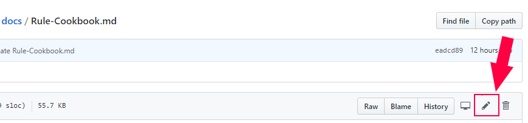
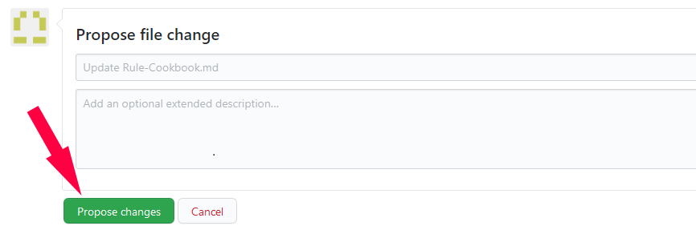
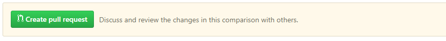
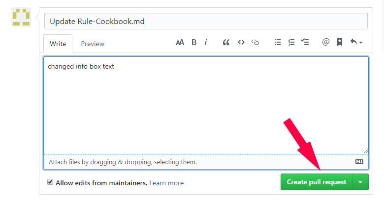

***Any contribution helps our team and makes Tasmota better for the entire community!***

You can contribute by:

- providing Pull Requests (Features, Proof of Concepts, Language files or Fixes)
- testing new released features and report issues
- [donating](https://paypal.me/tasmota) to acquire hardware for testing and implementing or out of gratitude
- contributing documentation for features and devices
- submitting [new device templates](https://templates.blakadder.com/new.html) 
- fixing spelling mistakes, broken links and other errors in the documentation
- writing guides on wiring and using sensors or your DIY projects featuring Tasmota

## Editing articles

!!! failure "You need a GitHub user account to be able to edit"

If you spot an error in an article, use the *pencil icon* link (see image below) at the top of the related [documentation GitHub repository page](https://github.com/tasmota/docs) to correct it.

This version of documentation uses strict markdown syntax with some enhancements.
See [Markdown Cheatsheet](https://github.com/adam-p/markdown-here/wiki/Markdown-Cheatsheet) for all features.

You'll be taken to the GitHub repository page of that article file, after a "fork" (copy) of the docs is made into your own GitHub account.

Click on the **edit** button (pencil icon). Edit/Add the text you wanted. When finished find the **Propose changes** button at the bottom and click it.

Next you need to click **Create pull request** which is GitHub speak for propose changes.

In the PR window add a small description of what you did and click **Create pull request**

Now you wait for one of the Tasmota admins to approve your PR (or deny :smiling_imp:, no guarantees!) 

_**Congratulations**_! 

You've made a contribution to the Tasmota project making it a better experience for all future users. Thank you!

## Adding articles

!!! failure "You need a GitHub user account to be able to edit"

If you want to add a new article, go to the [documentation GitHub repository](https://github.com/tasmota/docs), click **Add File** and name the file with an .md extension.

This version of documentation uses strict markdown syntax with some enhancements.
See [Markdown Cheatsheet](https://github.com/adam-p/markdown-here/wiki/Markdown-Cheatsheet) for all features.

You'll be taken to the GitHub repository page of that new article file, after a "fork" (copy) of the docs is made into your own GitHub account.

Don't forget to add links to other article pages in the appropriate place that refer to the new article so that the new article can also be found.

## Adding device templates to the documentation

If you want to add a new device templates go to <https://templates.blakadder.com/new.html> (or its [GitHub repository](https://github.com/blakadder/templates)).
