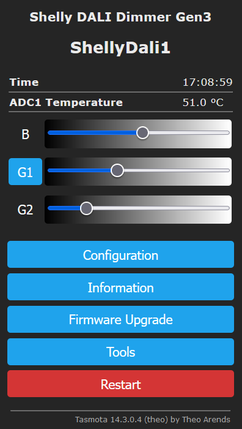

??? note "This feature is included in tasmota32 binaries"     

    When [compiling your build](Compile-your-build) add the following to `user_config_override.h`:
    ```arduino
    #ifndef USE_DALI
    #define USE_DALI        // Add support for DALI gateway (+5k code)
    #endif
    ```

## What is DALI?

[Digital Addressable Lighting Interface](https://en.wikipedia.org/wiki/Digital_Addressable_Lighting_Interface) (DALI) is a trademark for network-based products that control lighting.

A DALI network consists of at least one application controller and bus power supply (which may be built into any of the products) as well as input devices (e.g. sensors and push-buttons), control gear (e.g., electrical ballasts, LED drivers and dimmers) with DALI interfaces.

Application controllers can control, configure or query each device by means of a bi-directional data exchange. Unlike DMX, multiple controllers can co-exist on the bus.

The DALI protocol permits addressing devices individually, in groups or via broadcast.

Scenes can be stored in the devices, for recall on an individual, group or broadcast basis. Groups and scenes are used to ensure simultaneous execution of level changes, since each packet requires about 25 ms - or 1.5 seconds if all 64 addresses were to change level.

## Implemented Features

Tasmota DALI gateway is an application controller. It defaults to supporting Device Type 6 (DT6) or Part207 single color LED lighting controller using standard Tasmota light controls.

## Hardware

The driver is supported on both ESP8266 and ESP32. A possible DALI interface could look like this as used on the DALI 2 Click. </img> On the left side is the connection, TB1, to the DALI bus which should provide a voltage between 16V to 22.5V DC. On the right side is the connection to an ESP device where wires are connected according to the table:

| DALI interface | ESP device |
|----------------|------------|
|            VCC | 3V3        |
|        DALI_TX | DALI TX_i  |
|        DALI_RX | DALI RX_i  |
|            GND | GND        |

### MikroE DALI Click

Initial implementation has been performed using [DALI Click](https://www.mikroe.com/dali-click) with GPIO settings `DALI TX` and `DALI RX` and a [Busch-Jaeger Rotary dimmer](https://www.busch-jaeger.de/en/online-catalogue/detail/2CKA006599A2986) acting as a DALI bus power supply.

### MikroE DALI 2 Click

A redesigned version called [DALI 2 Click](https://www.mikroe.com/dali-2-click) also works fine whith GPIO settings `DALI TX_i` and `DALI RX_i`.

## Waveshare Pico DALI2

This [DALI2 expansion Module](https://www.waveshare.com/pico-dali2.htm) for ESP32-Pico series boards works fine with a Waveshare [ESP32-S3-Pico](https://www.waveshare.com/ESP32-S3-Pico.htm) using GPIO14 as `DALI RX` and GPIO17 as `DALI TX_i`. 

The Waveshare [ESP32-C6-Pico](https://www.waveshare.com/ESP32-C6-Pico.htm) has no GPIO connection to the Pico DALI2. At the physical locations of the Pico DALI2 signals it uses a Texas Instruments TCA9554 I/O expander, compatible with PCF8574, providing ExIO1 (`DALI TX_i`) and ExIO2 (`DALI RX`). This is currently not supported by Tasmota.

### Shelly DALI Dimmer Gen3

 </img>
The ESP32-C3 based [Shelly DALI Dimmer Gen3](https://www.shelly.com/products/shelly-dali-dimmer-gen3) is supported using template 
```
{"NAME":"Shelly DALI Dimmer Gen3","GPIO":[34,4736,0,3840,11360,11392,128,129,0,1,576,0,0,0,0,0,0,0,0,1,1,1],"FLAG":0,"BASE":1}
```
and additional commands 
```
Backlog AdcGpio1 10000,10000,4000; ButtonTopic 0; SetOption1 1; SetOption11 0; SetOption32 20; DimmerStep 5; LedTable 0
```
The following rule
```
rule1 on button1#state=2 do dimmer + endon on button2#state=2 do dimmer - endon on button1#state=3 do power 2 endon on button2#state=3 do power 2 endon
```
allows dimmer control using two buttons.

Notice that the Shelly DALI dimmer uses inverted DALI GPIO's `DALI TX_i` and `DALI_RX_i` and provides a limited DALI bus power supply of 10mA, enough for 5 DALI control gear.

To add Shelly DALI Dimmer to a bus powered environment it's best to disable the internal Shelly power supply. In that case use template (changed GPIO3)
```
{"NAME":"Shelly DALI Dimmer Gen3 (No power)","GPIO":[34,4736,0,3872,11360,11392,128,129,0,1,576,0,0,0,0,0,0,0,0,1,1,1],"FLAG":0,"BASE":1}
``` 
In addition you can easily remove the Shelly power supply assembly from the main board.

## Commands

Command|Parameters
:---|:---
DaliSend<a class="cmnd" id="dalisend"></a>|Low level DALI control.<br><br>`<byte1>,<byte2>` = Execute DALI code and do not expect a DALI backward frame.<br>`<0xA3>,<byte2>,<byte3>,<byte4>` = Set DALI parameter using DTR0 and do not expect a DALI backward frame.
DaliQuery<a class="cmnd" id="daliquery"></a>|Low level DALI control with expected response.<br><br>`<byte1>,<byte2>` = Execute DALI code and report result (DALI backward frame).
DaliScan<a class="cmnd" id="daliscan"></a>|Sequential address assignment using commissioning protocol. This resets  parameters stored on the control gear.<br><br>`1` = Reset and commission new device addresses.<br>`2` = Reset and commission additional device addresses.
DaliGear<a class="cmnd" id="daligear"></a>|To reduce DaliGroup response time set the max commissionned control gear address.<br><br>Display current max address.<br>`1..64` = Set max address (default = `64`).
DaliGroup<x\><a class="cmnd" id="daligroup"></a>|Add or remove control gear to/from up to 16 groups.<br><br>Display current group contents.<br>`[+]<device>,<device>...` = Add devices to group.<br>`-<device>,<device>...` = Remove devices from group.<br><br><x\> = 1 to 16.
DaliGroupSliders<a class="cmnd" id="daligroupsliders"></a>|Add or remove group sliders from the GUI when in `DaliLight 0` mode.<br><br>Display current groupsliders amount.<br>`1..16` = Number of groupsliders to display.
DaliPower<x\><a class="cmnd" id="dalipower"></a>|Control power to broadcast or any control gear or group.<br><br>Display current power state.<br>`0` = Turn power off.<br>`1` = Restore power to last dimmer value.<br>`2` = Toggle power.<br>`3` to `254` = Set absolute brightness.<br><br><x\> = 0 for broadcast, 1 to 64 for individual gear or 101 to 116 for group.
DaliDimmer<x\><a class="cmnd" id="dalidimmer"></a>|Control dimmer to broadcast or any control gear or group.<br><br>Display current dimmer state.<br>`0` = Turn power off.<br>`1` to `100` = Percentage of brightness.<br><br><x\> = 0 for broadcast, 1 to 64 for individual gear or 101 to 116 for group.
DaliLight<a class="cmnd" id="dalilight"></a>|Switch between DALI or Tasmota Light control. The latter allows for the DALI lighting to be controlled as a local light by any Tasmota protocol like Matter, Alexa, Hue and KNX.<br><br>Display current state.<br>`0` = Disable Tasmota light control for DaliTarget device.<br>`1` = Enable Tasmota light control for DaliTarget device (default).
DaliTarget<a class="cmnd" id="dalitarget"></a>|Select DALI target to be used when DaliLight is enabled.<br><br>Display current target.<br>`0` = Broadcast (default).<br>`1` to `64` = Individual gear.<br>`101` to `116` = group.
