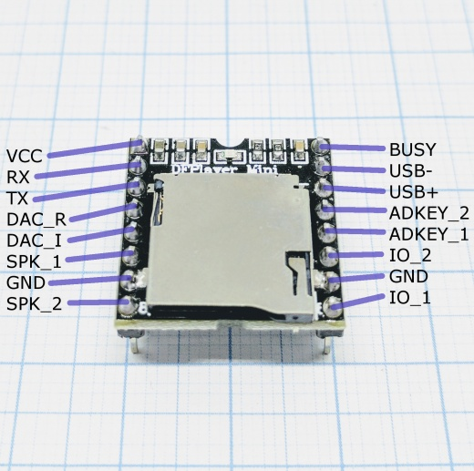

# DFRobot DFPlayer Mini MP3 Player

??? tip "This feature is included only in `tasmota-sensors` and `tasmota32` binaries" 

    When [compiling your build](Compile-your-build) add the following to `user_config_override.h`:
    ```c++
    #ifndef USE_MP3_PLAYER 
    #define USE_MP3_PLAYER                  // Use of the DFPlayer Mini MP3 Player RB-DFR-562 commands: play, pause, stop, track, volume and reset
        #define MP3_VOLUME           30     // Set the startup volume on init, the range can be 0..100(max)
    #endif
    ```

Small and low price MP3 module with an simplified output directly to the speaker

See [manufacturer site](https://wiki.dfrobot.com/DFPlayer_Mini_SKU_DFR0299) for more information.

## Configuration

### Wiring
| DFPlayer   | ESP |
|---|---|
|GND   |GND   |
|5V   |5V   |
|RX   |GPIO<x>   |

### Tasmota Settings
In the **_Configuration -> Configure Module_** page assign:
1. GPIO RX to `MP3 Player`

Available [commands](Commands.md#mp3-player)



