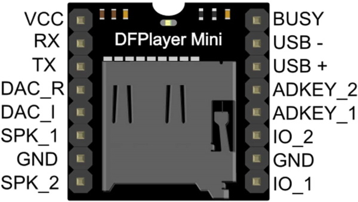

# DFRobot DFPlayer Mini MP3 Player

!!! info "This feature is included only in tasmota-sensors.bin" 

Small and low price MP3 module with an simplified output directly to the speaker

See [manufacturer site](https://wiki.dfrobot.com/DFPlayer_Mini_SKU_DFR0299) for more information.

## Configuration

### Wiring
| DFPlayer   | ESP8266 |
|---|---|
|GND   |GND   |
|5V   |5V   |
|RX   |GPIO<x>   |

### Tasmota Settings
In the **_Configuration -> Configure Module_** page assign:
1. GPIO RX to `MP3 Player`

Available [commands](Commands.md#mp3-player)

