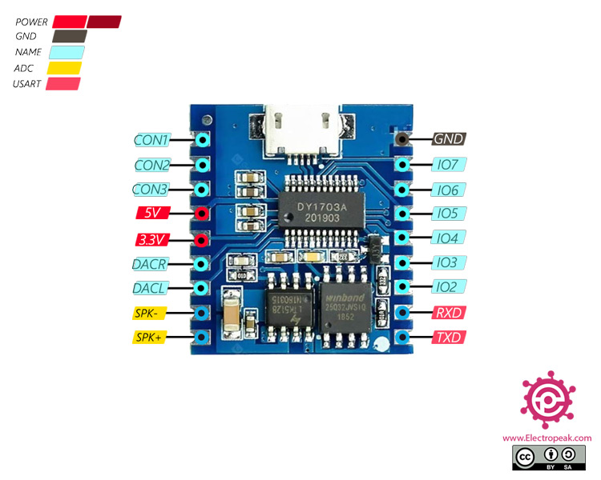

# DY-SV17F MP3 Player module

??? tip "This feature is included only in `tasmota-sensors` and `tasmota32` binaries" 

    When [compiling your build](Compile-your-build) add the following to `user_config_override.h`:
    ```c++
    #ifndef USE_DY_SV17F
    #define USE_DY_SV17F                   // Use of DY-SV17F MP3 Player commands: play, stop, track and volume
        #define MP3_VOLUME           30    // Set the startup volume on init, the range can be 0..100(max)
    #endif
    ```

The DY-SV17F MP3 Player module has 4MBytes of internal flash storage for audio files you can upload via USB. An onboard 5W amplifier can power 4, 3-5W speakers     

## Configuration

### Wiring
| DY-SV17F   | ESP |
|---|---|
|GND   |GND   |
|5V   |5V   |
|RX   |GPIO<x>   |

<!-- ### Tasmota Settings
In the **_Configuration -> Configure Module_** page assign:
1. GPIO RX to `MP3 Player` -->

## Commands
Command|Parameters
:---|:---
MP3Play<a class="cmnd" id="MP3Play"></a>|Play, works as a normal play on a real MP3 Player, starts at first MP3 file
MP3Stop<a class="cmnd" id="MP3Stop"></a>|Stop
MP3Track<a class="cmnd" id="MP3Track"></a>|`x` = play track <x\>
MP3Volume<a class="cmnd" id="MP3Volume"></a>|`0..100` = set Volume


[Datasheet](_media/peripherals/DY-SV17F_datasheet.pdf)
