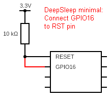
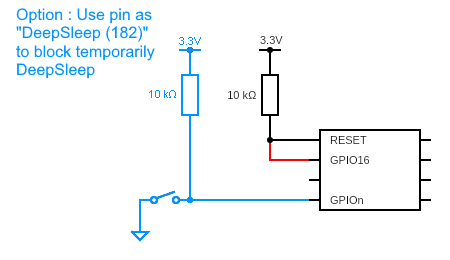
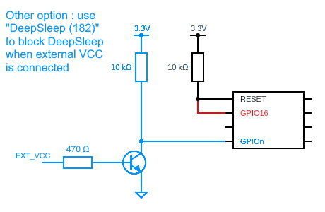
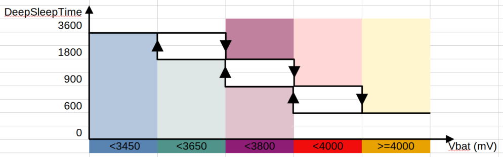
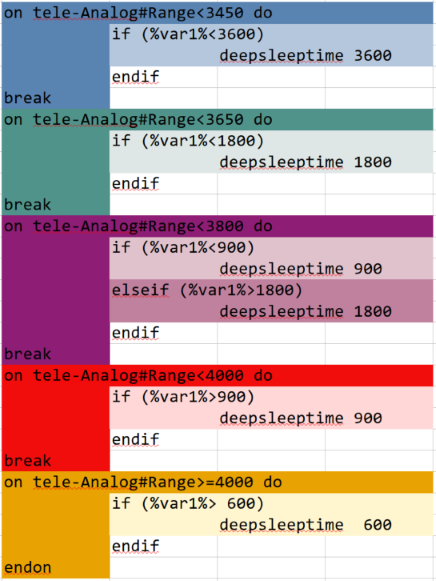

DeepSleep support for up to 10 years (i.e., 86,400 seconds = 1 day) (e.g., if used with KNX) ([`DeepSleepTime`](Commands#deepsleeptime)). 

`DeepSleepTime` sets the time the device remains in DeepSleep before it returns to full operating mode. Once the command is issued, the DeepSleep cycle commences. During DeepSleep, the device is effectively **off** and, as such, it is not possible to modify DeepSleepTime without exiting DeepSleep. 

!!! example
    With `DeepSleepTime 3600`, the device will wake up exactly every hour (e.g., 8:00am, 9:00am, ...). If you define `DeepSleepTime 86400` (i.e., 60\*60\*24), it will wake-up exactly at 0:00 local time. There is no option to shift the wakeup time; except changing the timezone. If you define `DeepSleepTime 600`, it will wake-up every 10 minutes (e.g., 8:00, 8:10, 8:20, ...).

!!! warning
  Please be aware that the minimum DeepSleep time is 10 seconds.
  


In order for the device to wake itself to perform its function during the DeepSleep cycle, the RST pin must be connected to the D0/GPIO16 pin. This is the only pin which can perform this function as the wake-up signal is sent from the RTC through D0/GPIO16 to RST. When connected to RST for DeepSleep purpose, GPIO16 may not be used for other functions. As such, it is recommended to leave it configured as `None (0)`. *On the diagram, black denotes existing parts and connections on a standard ESP board (mini-D1, NodeMCU, ...). Red denotes what is added to the DeepSleep feature.*


## Methods to (temporarly) disable DeepSleep mode

### Using a switch



Select another GPIO (let's call it "GPIOn") and connect it GND. This can be performed through a switch per the schematic below. Flipping the switch to "ON" will prevent Tasmota to enter DeepSleep again after next wake-up until the switch is flipped back OFF. *On the diagram, blue denotes additional parts and connections to be able to disableDeepSleep.* GPIOn should be defined as `DeepSleep (182)` in the configuration as shown below:


The following GPIOs **CANNOT** be used for the purpose of temporarily disabling DeepSleep as described above:<BR>
- GPIO16 (because it is connected to RST),<BR>
- GPIO15 (because of an existing on-board pull-down resistor),<BR>
- GPIO0 (because pulling it down at wake up will enter serial bootload mode).<BR>

All others GPIO should be acceptable.

An interresting use-case is to disable DeepSleep when external power (USB, PSU, solar panel...) is applied to the device using a transistor.



If the device is not (easily) accessible, methods can be used to disable the DeepSleep loop without physical access.

### Using MQTT

Send a retained `DeepSleepTime 0` command to your device. As the message is retained in the MQTT broker, the device will receive it as soon as it connectes to the MQTT broker. 

!!! example "Example: Sending from another Tasmota"
In another Tasmota console you can type the following command:<BR>
`Publish2 cmnd/%topic%/DeepSleepTime 0`<br>
To clear the retained message, once your device is out of DeepSleep, use:<br>
`Publish2 cmnd/%topic%/DeepSleepTime`

!!! Example "Example: Sending using mosquitto utilities"
Command to send a retained message:<br>
`mosquitto_pub -t "cmnd/myDeviceTopic/DeepsleepTime" -r -m "0"`<BR>
Remove retained message<BR>
`mosquitto_pub -t "cmnd/myDeviceTopic/DeepsleepTime" -r -n`<BR>
  
You can also send retained message or clear them with other MQTT tools: MQTT Explorer, ....

Once you have made your configuration change, you will need to re-enable DeepSleep mode using `DeepSleepTime` command.

### Using smart home automation 

Configure a settable flag in your home automation hub (e.g., Node-Red, openHAB, Home Assistant). The flag should subscribe to the `tele/%topic%/LWT` topic for the payload `Online`. Alternatively, if testing the payload value is not easy, subscribe to the topic `tele/%topic%/STATE` which is the 2nd topic on which the device publish right after waking-up.

The moment a message is received on this topic, the automation can publish a message to topic `cmnd/%topic%/DeepSleepTime` with payload `0`. This will cause the device to disable DeepSleep and allow maintenance such as firmware updates to be performed without having an unexpected DeepSleep event. Send the `DeepSleepTime 0` command ==only once==.

Once device maintenance is completed, place it back into DeepSleep mode using original configuration.
   
## Rules

The following triggers can be used to execute commands upon wake-up or right before entering DeepSleep:
- `Power1#Boot` : is the earliest trigger. But valid only if you have a `Relay` output defined.
- `Switch1#Boot` : is the next trigger, also occur very early in the boot process. But valid only if you have `Switch` input defined.
- `System#Boot` : is occuring later in the Tasmota boot process but is always available.
- `System#Save` : is occuring right before a restart or before entering DeepSleep.

For example the ruleset below turn on power right after Tasmota started, and turn it off just before entering DeepSleep 
``` haskel
Rule1 ON Power1#Boot DO Power on ENDON ON System#Save DO Power off ENDON
```
Any rule apply AFTER the Init() procedures of all sensors/drivers. This does mean that a POWER OFF on the GPIO may prevent sensors from being initialized correctly during start-up (e.g. DS18B20) and do not show up in teleperiod message. To ensure the GPIO is HIGH during restart you should define in the `Configure` --> `Configure module` --> `GPIO x` to `Output Hi` instead of `RELAY 1` and avoid using any rules. To ensure the GPIO goes LOW after deepsleep you need to solder a 4.7K resistor between GND and the GPIO.
    
Sequence is then as follow (only key lines are shown):
```
00:00:00.085 CFG: Loaded from File, Count 122
00:00:00.095 Project tasmota demo-sensor Version 9.5.0(tasmota-sensors)
00:00:00.105 RUL: POWER1#BOOT performs "Power ON"
00:00:00.109 RSL: POWER = {"POWER":"ON"}
00:00:00.111 RSL: POWER = ON
00:00:04.454 WIF: Connecting to AP1 DEMOAP Channel 1 BSSId XX:XX:XX:XX:XX:XX in mode 11n as demo-sensor...
00:00:05.756 WIF: Connected
00:00:06.008 HTP: Web server active on dev-4119 with IP address 192.168.168.199
15:03:40.010 MQT: Attempting connection...
15:03:40.024 MQT: Connected
15:03:40.028 MQT: tele/demo-sensor/LWT = Online (retained)
15:03:40.032 MQT: cmnd/demo-sensor/POWER = 
15:03:40.047 MQT: stat/demo-sensor/POWER = {"POWER":"ON"}
15:03:40.050 MQT: stat/demo-sensor/POWER = ON (retained)
15:03:44.472 MQT: tele/demo-sensor/STATE = {"Time":"2021-06-27T15:03:44+02:00","Uptime":"0T00:00:13","UptimeSec":13,"Heap":28,"SleepMode":"Dynamic","Sleep":50,"LoadAvg":19,"MqttCount":1,"POWER":"ON","Wifi":{"AP":1,"SSId":"DEMOAP","BSSId":"XX:XX:XX:XX:XX:XX","Channel":1,"Mode":"11n","RSSI":86,"Signal":-57,"LinkCount":1,"Downtime":"0T00:00:07"}}
15:03:44.500 MQT: tele/demo-sensor/SENSOR = {"Time":"2021-06-27T15:03:44+02:00","Switch1":"OFF","Switch2":"ON"} (retained)
15:03:44.515 RUL: SYSTEM#SAVE performs "Power OFF"
15:03:44.524 MQT: stat/demo-sensor/POWER = {"POWER":"OFF"}
15:03:44.527 MQT: stat/demo-sensor/POWER = OFF (retained)
15:03:44.539 MQT: stat/demo-sensor/DEEPSLEEP = {"DeepSleep":{"Time":"2021-06-27T15:04:00","Epoch":1624799040}}
15:03:47.433 APP: Sleeping
```
    
## Driver writer: Executing commands before entering DeepSleep

When writing a driver for a sensor, if the sensor supports a low power mode, it is a good practice to set the sensor in such low power mode in the FUNC_SAVE_BEFORE_RESTART handler. When Tasmota will restart at next wake-up, sensor will be automatically re-initialized. 

Exemple from `xsns_09_bmp.ino`:
``` C++
#ifdef USE_DEEPSLEEP
      case FUNC_SAVE_BEFORE_RESTART:
        BMP_EnterSleep();
        break;
#endif // USE_DEEPSLEEP 
```
    
In general you can also execute any command or special script ==BEFORE== device goes into DeepSleep using handler FUNC_SAVE_BEFORE_RESTART as a predefined hook to implement your own procedure. This requires you to code your own function and self-compile custom firmware.

## Overcome network issues
If the device is not able to make a WIFI connection and get an IP during the first 15 seconds after boot it will go again without any further actions into deepsleep for another cycle. If you compile your own firmware you can change the timeout (e.g. 30 seconds) by setting `#define DEEPSLEEP_NETWORK_TIMEOUT 30` in `user_config.override` or disable completly (device stay online until network connected) with `#define DEEPSLEEP_NETWORK_TIMEOUT 0`.
If MQTT or NTP does not work the TELEPERIOD will execute anyhow and send the device to deepsleep afterwards. A wrong NTP will result in wrong timestamp send to MQTT. A missing MQTT connection will avoid any send.

Another method to send the device into deepsleep after start is creating a rule like the one below. In this case the timeout can be configured online and changed.
```console
Rule1
  ON Dimmer#Boot DO RuleTimer1 30 ENDON
  ON Rules#Timer=1 DO DeepSleepTime 3600 ENDON

Rule1 ON
```

## DeepSleep Algorithm General Timing
Let's assume you have set `DeepSleepTime 3600` (one hour) and `TelePeriod 300` (five minutes). The device will first wake at 8:00 am. The device will boot and connect Wi-Fi. Next, the correct time must be sync'ed from one of the NTP servers. Now the device has all prerequisites for going into DeepSleep.

DeepSleep is then triggered after the TelePeriod event. In this example, it will occur after five minutes. Telemetry will be collected and sent (e.g., via MQTT). Now, DeepSleep can happen. First, `Offline` is published to the LWT topic on MQTT. It then calculates the new sleeping time to wake-up at 9:00 am (3600 seconds after the last wake-up). At 9:00 am this same sequence of events happens again.

If you want to minimize the time that the device is in operation, decrease TelePeriod down to 10 seconds. This period of time is counted ==after== MQTT is connected. Also, in this case, the device will wake up at 9:00 am even if the uptime was much smaller. If the device missed a wake-up it will try a start at the next event - in this case 10:00 am.

## ESP8266 DeepSleep Side-effects
Not all GPIO behave the same during DeepSleep. Some GPIO go HIGH, some LOW, some FOLLOW the relay but work only on FET transistors. As soon as current flows they go LOW. I use one GPIO to trigger a BC337 transistor to switch OFF all connected devices during DeepSleep.

Findings:

Pin|GPIO|Behavior
-|:-:|-
D0|16|Excluded due to use as wake-up pin
D1|5|KEEP STATE, go LOW if resistance to ground < infinite
D2|4|KEEP STATE, go LOW if resistance to ground < infinite
D3|0|HIGH
D4|2|HIGH
D5|14|HIGH, go LOW if resistance to ground < infinite
D6|12|HIGH, go LOW if resistance to ground < infinite
D7|13|HIGH, go LOW if resistance to ground < infinite
D8|15|LOW

## Log Output Explanation
_(logging level `4`)_

When MQTT connects at `13:08:38`, this sets the system to READY.
```
13:08:43 MQT: tele/tasmota/INFO3 = {"RestartReason":"Deep-Sleep Wake"}
13:08:44 APP: Boot Count 3
13:08:44 CFG: Saved to flash at F4, Count 96, Bytes 3824
```

In the context of DeepSleep, maintaining a device boot count is not relevant. When DeepSleep is enabled, boot count will not be incremented. This avoids excessive flash writes which will deteriorate the flash memory chip and eventually cause the device to fail. Boot count incrementing can be enabled using [`SetOption76`](Commands#setoption76).

In this example, TelePeriod is 10. Therefore when it is reached, telemetry reporting occurs.
```
13:08:48 MQT: tele/tasmota/STATE = {"Time":"2019-09-04T13:08:48","Epoch":1567595328,"Uptime":"0T00:00:14","UptimeSec":14,"Heap":24,"SleepMode":"Dynamic","Sleep":50,"LoadAvg":20,"MqttCount":1,"Wifi":{"AP":1,"SSId":"MyWLAN","BSSId":"AA:FF:AA:AA:AA:AA","Channel":11,"RSSI":100,"LinkCount":1,"Downtime":"0T00:00:08","DeepSleep":300,"Heap":25160}}
13:08:48 MQT: tele/tasmota/SENSOR = {"Time":"2019-09-04T13:08:48","Epoch":1567595328,"ANALOG":{"A0":8}}
```

Date and time is set, status and telemetry sent. Now start shutdown procedure.

First, send MQTT offline.
`13:08:48 MQT: state/sonoff/LWT = Offline`

DeepSleep is 300 seconds. Therefore +-30 sec is allowed as deviation between proposed wake-up time and real wake-up time. Reporting in 0.1sec. In this case wake-up was one second late.
`13:08:48 Timeslip 0.1 sec:? -300 < -10 < 300`

If the error is in the range, this is tagged as a normal wake up where drift can be recalculated
`13:08:48 Normal deepsleep? 1`

Recalculate a new drift that is a multiplier for the next wake-up in 1/10000. In this case, the multiplier is 1.0257
`13:08:48 % RTC new drift 10257`

And for information: New target wake-up time
`13:08:48 Next wakeup 2019-09-04T13:10:00`

Based on run time and the error in the last loop, a new sleeping time will be calculated. This will be multiplied by the `deepsleep_slip` and, ideally, the device will wake up at the time above.
`13:08:48 Sleeptime 285 sec, deepsleep_slip 10257`

The effectiveness of the compensation can be seen here. Instead of typically 160-200 seconds, most times it is better than 10 seconds in a one hour DeepSleep cycle.


## Rules to adapt DeepSleep period to battery level.

In some applications, it is interresting to adjust the DeepSleep period to the level of the battery.
For this, we consider that:

* the battery level is measured by the ESP ADC with the appropriate voltage divider,
* the Tasmota ADC mode is set to Range mode,
* `AdcParams 6` has been used so the range value represent the battery voltage in millivolts   

The below graph represent the adaptation paths we want to follow to adjust DeepSleepTime: one path
while the level is dropping, another path while the level is rising.



To implement this in Tasmota we can use [Rules](Rules.md). As Rules do not provide an AND operator,
we also need the optional `IF` feature. This requires to [compile a customized firmware](Compile-your-build.md)
with the following items in `user_config_override.h`:

``` C
#define USE_RULES
#define SUPPORT_IF_STATEMENT
``` 

First, we need to know the current value of DeepSleepTime. Values for internal settings are not
available as %variable% but they can generally be obtained by sending the command and capturing 
the result with a rule. To get the current value of DeepSleepTime, we need a trigger early in the 
boot process. For example `Wifi#Connected`.

Our first rules to get the current DeepSleepTime into %var1% would be:

``` haskel
ON Wifi#Connected DO Backlog DeepSleepTime ENDON
ON DeepSleepTime#Data DO var1 %value% ENDON
```

The best moment to compare the batery level and decide if it is necessary to change the DeepSleepTime
is right after the TelePeriod SENSOR message has been sent, which is just before Tasmota calculate
the next wake-up time. So we can use `tele-ANALOG#Range` as a
trigger for our rules. Using BREAK allows to compare the trigger only to the upper value of the
segment and stop further rules evaluations if the comparison is met. In the rule statement for a
given battery level, we compare the current value of DeepSleepTime (which is %var1%) with the value
we vant (given by the graph). If the current value is lower than the value we want, we are on the
decreasing path and we can apply the new value. If the current value is greater than the value we want,
we are on the rising path and we can apply the new value.




All above can be set into Rule1. As it is a long command, it may be necessary to enter the rule 
in 2 parts (note the usage of the `+`) :

``` haskel
Rule1 on Wifi#Connected do backlog deepsleeptime endon on deepsleeptime#data do var1 %value% endon on tele-Analog#Range<3450 do if (%var1%<3600) deepsleeptime 3600 endif break on tele-Analog#Range<3650 do if (%var1%<1800) deepsleeptime 1800 endif break 
Rule1 +on tele-Analog#Range<3800 do if (%var1%<900) deepsleeptime 900 elseif (%var1%>1800) deepsleeptime 1800 endif break on tele-Analog#Range<4000 do if (%var1%>900)deepsleeptime 900 endif break on tele-Analog#Range>=4000 do if (%var1%> 600) deepsleeptime 600 endif endon
```

Don't forget to enable using `Rule1 1`
