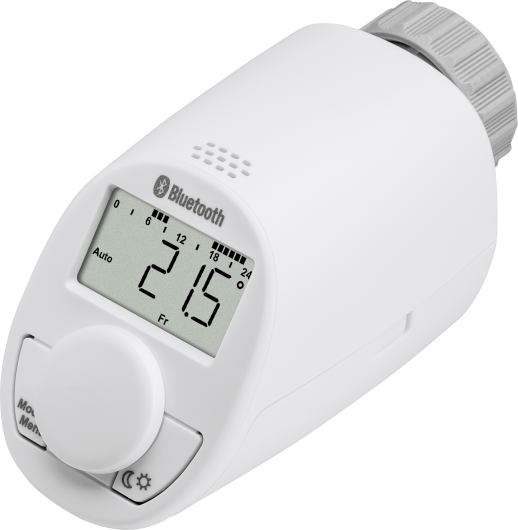

# Eqiva eQ-3 thermostatic radiator valve :material-cpu-32-bit: <br>(EQ3 TRV)

??? tip "This feature is included in tasmota32-bluetooth.bin"

    When [compiling your build](Compile-your-build), choose the `tasmota32-bluetooth` build variant or add the following to `user_config_override.h`:
    ```c++
	#define USE_BLE_ESP32
	#define USE_EQ3_ESP32
    ```

## General

This driver enables the control of Eqiva thermostatic radiator valves (TRVs).

{: style="float: right; width: 150px;" }

These models are compatible:

* Eqiva eQ-3 Bluetooth Smart (141771E0/141771E0A)
* Eqiva eQ-3 Bluetooth Smart UK version (142461D0)

Other Eqiva eQ-3 models should work as well. Ensure you select a Bluetooth model, as non-Bluetooth versions are available.

<div style="clear: both;"></div>

For advanced device settings, hardware configuration, or troubleshooting, the official user manuals can be highly helpful: [DE/EN](_media/eq3-trv/CC-RT-BLE-EQ_UM_DE-EN.pdf) | [FR/NL](_media/eq3-trv/CC-RT-BLE-EQ_UM_FR-NL.pdf) | [PL/IT](_media/eq3-trv/CC-RT-BLE-EQ_UM_PL-IT.pdf).

## Operation modes

The eQ-3 TRV has 3 modes of operation:

| Mode | Description |
| :--- | :--- |
| auto | Follows the week program. A temperature different from the week program can be set at any time, but at the next programmed timeslot the valve will switch back to the preset temperature. |
| manual | Keeps the current requested temperature. |
| holiday | Keeps the temperature set for the holiday duration and then automatically switches back to *auto* mode and running the week program. |

These 3 modes can be set and configured using different commands
described below.

## Setup
Before you can use the TRV, you will need to enable Bluetooth on the valve:

1. Press the Mode/Menu button for at least 3 seconds.
2. Select the menu item `bLE` with the control wheel and confirm by pressing the
control wheel shortly.
3. The display will show `OFF` to deactivate the function or `On` to activate the
function.
4. Confirm by pressing the control wheel shortly.
 
!!! note "Pairing Process"

    * **Older firmware** (up to 1.20): No pairing needed. Just turn Bluetooth on (`bLE` to `On`).
    * **Newer firmware** (from 1.46): You must pair the device manually:
        1. Press and hold the control wheel on the TRV for 3 seconds until `PAIr` flashes on the display.
        2. Tasmota will automatically calculate the PIN and complete the pairing in the background.

    *Note:* Make sure the Eqiva smartphone app is closed, as the TRV only connects to one device at a time.

Next you will need to make sure that BLE is enabled in Tasmota:

1. Configuration
2. Configure BLE
3. Enable Bluetooth

To determine the MAC addresses of a TRV:

1. Go to the BLE menu in Tasmota
2. Enable active scan
3. Type in the Tasmota console: [`TRVDevList`](#trvdevlist)

This will give you the MAC address of each valve.
        
!!! tip
                                                                  
    * Enable only one valve at a time as this makes it easier to identify
    * You might need to wait a minute or so or repeat the [`TRVDevList`](#trvdevlist) command a few times before the devices have been properly identified
    * Keep in mind that the TRV does NOT report the current temperature, only the requested, target, temperature. The Xiaomi Thermometer LYWSD03MMC makes a perfect combo for measuring the room temperature

After configuring, Tasmota will poll the discovered valves and publish their state under `stat/EQ3/<MAC Address>`. If you have configured an alias for the MAC address of the valve, the topic changes to `stat/EQ3/<BLEAlias>`. To configure an alias use the command [`BLEAlias`](Commands.md#blealias).

The interval between polls can be configured by using the command [`TRVPeriod`](#trvperiod). Tasmota needs to have an NTP or RTC time configured for this to work.

## Operating your TRV

There are two ways to control your TRV:

* The Tasmota Console (convenient for setup)  
    Syntax: `TRV <MAC> <subcommand> [options]`  
    Example: `TRV 001A2216A458 settemp 21.5`
* MQTT  
    Syntax: `cmnd/<tasmota_topic>/EQ3/<MAC>/<subcommand> [options]`  
    Example: `cmnd/ble_esp32/EQ3/001A2216A458/settemp 22.5`

As shown in the example above, the MQTT command topic and payload are composed of the following elements:

* Standard Tasmota `%prefix%` (e.g., `cmnd` for sending commands)
* `%topic%` of the Tasmota BLE gateway (e.g., `ble_esp32` in this example)
* An `EQ3` element to specify that the command is for the EQ3 driver
* The MAC address or alias of the TRV
* The subcommand sent to the TRV
* Optional parameters or values required by the subcommand (passed as the MQTT payload)

The available subcommands are described in the [TRV subcommands](#trv-subcommands) section.

## Available commands

### Base commands
| Command | Description and parameters |
| :--- | :--- |
| TRVPeriod<a class="cmnd" id="trvperiod"></a> | `<seconds>` = EQ3 poll interval in seconds.<br>During this interval, a `poll` ([`state`](#state)) command is automatically sent to every TRV.<br>`0` = disables automatic polling.<br>`1` = immediately starts a poll cycle, but does not change its value.<br>At boot time, this value is set to [`TelePeriod`](Commands.md#teleperiod). |
| TRVOnlyAliased<a class="cmnd" id="trvonlyaliased"></a> | `<value>` = EQ3 OnlyAliased parameter.<br>`0` = all devices will be processed (default).<br>`1` = only devices with an alias will be processed.<br>`2` = only devices whose alias starts with `EQ3` will be processed. |
| TRVMatchPrefix<a class="cmnd" id="trvmatchprefix"></a> | `<value>` = EQ3-MAC prefix matching.<br>`0` = no automatic identification (active scan is needed).<br>`1` = automatically identify EQ3 via MAC address (default). |
| TRVDevList<br>TRVScan<a class="cmnd" id="trvdevlist"></a> | Display all discovered TRVs. |
| TRVReset<a class="cmnd" id="trvreset"></a> | Remove all known devices and clear the command queue. |

### TRV subcommands

Commands must follow the syntax `TRV <MAC> <subcommand> [options]` as explained in the [Operating your TRV](#operating-your-trv) section.

| Subcommand | Description and parameters |
| :--- | :--- |
| <a class="cmnd" id="state"></a>state | Request the current valve state without changing any settings, except for synchronizing the time on the valve.<br>Note: If your ESP32 Tasmota is not synchronized with a valid date and time, this command will set the wrong time and date on the TRV. See [settime](#settime). |
| <a class="cmnd" id="settemp"></a>settemp | `<temperature>` = set the desired target temperature |
| <a class="cmnd" id="valve"></a>valve | `<value>` = control the valve state<br>`off` = enable frost protection<br>`on` = open the valve completely<br>Note: If set to *auto* or *holiday*, the valve switches back to the target temperature at the next timeslot. To set the valve permanently, please use the commands [`on`](#on) or [`off`](#off). |
| <a class="cmnd" id="on"></a>on | Set mode to *manual* and open the valve completely.<br>This can potentially extend battery life during the summer when the central heating is inactive.<br>Note: Temperature will be set to and reported as 30 °C. |
| <a class="cmnd" id="off"></a>off | Set mode to *manual* and enable frost protection.<br>Note: Temperature will be set to and reported as 4.5 °C. |
| <a class="cmnd" id="mode"></a>mode | `<value>` = define the current operating mode<br>`auto` = same as [`auto`](#auto), see below<br>`manual` = same as [`manual`](#manual), see below<br>`on` = same as [`on`](#on), see above<br>`off` = same as [`off`](#off), see above<br>`heat` = same as [`on`](#on), see above<br>`cool` = same as [`off`](#off), see above<br>Note: The third mode *holiday* can only be set with the [`setholiday`](#setholiday) command. |
| <a class="cmnd" id="auto"></a>auto | Set operating mode to *auto*.<br>Run the week program as stored in the TRV.<br>Note: Setting a custom temperature or switching to day/night mode will be overridden at the next programmed timeslot. |
| <a class="cmnd" id="manual"></a>manual | Define *manual* as the current operating mode.<br>Disable the week program and keep the temperature as selected with *settemp / day / night*. |
| <a class="cmnd" id="day"></a>day | Switch to the configured comfort temperature. |
| <a class="cmnd" id="night"></a>night | Switch to the configured reduction temperature. |
| <a class="cmnd" id="setdaynight"></a>setdaynight | `<daytemp> <nighttemp>` = set the comfort and reduction temperature |
| <a class="cmnd" id="boost"></a>boost | `[<value>]` = activate boost mode (valve opens 80% for 5 minutes). This is the default when no parameter is given.<br>`0` / `off` = deactivate boost mode (same as [`unboost`](#unboost))<br>Note: Boost mode stops automatically after 5 minutes. |
| <a class="cmnd" id="unboost"></a>unboost | Deactivate boost mode. |
| <a class="cmnd" id="lock"></a>lock | `[<value>]` = disable TRV buttons (child lock). This is the default when no parameter is given.<br>`0` / `off` = enable TRV buttons (same as [`unlock`](#unlock)) |
| <a class="cmnd" id="unlock"></a>unlock | Enable TRV buttons. |
| <a class="cmnd" id="settime"></a>settime | `[<time>]` = synchronize the current Tasmota time to the TRV if no parameter is given.<br>To send a custom time, provide it in the `yyMMddhhmmss` format (byte-by-byte decimal to hexadecimal conversion ) or use the [Hex Generator](#hex-generator).<br>Note: If your ESP32 Tasmota is not synchronized with a valid date and time, running this command without parameters will set an incorrect time and date on the TRV. |
| <a class="cmnd" id="setprofile"></a>setprofile | `<day> <temperature>-<timeslot>,<temperature>-<timeslot>,...` = set the temperature schedule for the given day<br>`0` = Saturday, `1` = Sunday, ... `6` = Friday<br>It is also possible to group days: `7` = weekend, `8` = workday, `9` = everyday.<br>Up to seven pairs can be provided. Each temperature is maintained **until** the associated time.<br>Syntax: `<day> <temperature>-<timeslot>,<temperature>-<timeslot>` (e.g., `8 21.0-07:30,18.0-22:00,16.0-24:00`)<br>Note: The last timeslot must always end at `24:00`, otherwise a default temperature is applied to the remaining time. |
| <a class="cmnd" id="reqprofile"></a>reqprofile | `<day>` = read the temperature schedule for the given day<br>`0` = Saturday, `1` = Sunday, ... `6` = Friday |
| <a class="cmnd" id="setholiday"></a>setholiday | `<end-date>,<end-time> <temperature>` = set the operating mode to *holiday*<br>The format for date and time must be `YY-MM-DD,hh:mm` (e.g., `26-12-24,18:00`).<br>The holiday mode will automatically terminate and resume *auto* mode once the end date and time are reached.<br>Note: Time is set in 30-minute steps. During the holiday period, the TRV ignores week programs. To end holiday mode manually, call [`auto`](#auto) or [`manual`](#manual). |
| <a class="cmnd" id="setwindowtempdur"></a>setwindowtempdur | `<temperature> <duration>` = set the window open detection temperature and duration in minutes<br>Syntax: `<temperature> <duration>` (e.g., `12.0 15`) |
| <a class="cmnd" id="offset"></a>offset | `<temperature>` = set the temperature offset for calibration (e.g., `-1.5` or `2.0`) |

## Results

After submitting a command, you will see one or more of the following results:

| Status | Description |
| :--- | :--- |
| queued | Command has been accepted by the BLE driver. |
| DONENOTIFIED | Command has been successfully processed by the TRV, and the results are sent in JSON format. |
| ignoredbusy | Only a single command can be accepted in the queue at a time. During the processing of a TRV command, subsequent commands will be rejected. Please resubmit. |
| FAILCONNECT | Connection to the TRV failed after three automatic retries. Please resubmit. |

Under normal circumstances, you will get a JSON-formatted response from the valve:

```json
{
  "cmd": "settemp",
  "result": "ok",
  "MAC": "001A2216A458",
  "tas": "ble-esp32-0936",
  "RSSI": -79,
  "stattime": 1786795200,
  "temp": 21.0,
  "posn": 95,
  "mode": "auto",
  "hassmode": "auto",
  "boost": "inactive",
  "dst": "set",
  "window": "closed",
  "state": "unlocked",
  "battery": "GOOD",
  "holidayend": "00-00-00 00:00",
  "windowtemp": 12.0,
  "windowdur": 15,
  "day": 21.0,
  "night": 17.0,
  "offset": 0.0
}
```

If the mode is set to `holiday`, the `"holidayend"` field indicates the exact expiration date and time:

```json
{
  "mode": "holiday",
  "holidayend": "28-01-02 10:00"
}
```

In the response for the [`setprofile`](#setprofile) command, the `profiledayset` field indicates which day or group of days was updated:

```json
{
  "cmd": "setprofile",
  "profiledayset": 4
}
```

In the response for the [`reqprofile`](#reqprofile) command, the returned JSON object includes the corresponding day-specific profile field, formatted as `profileday<n>` (where `n` ranges from `0` to `6`):

```json
{
  "cmd": "reqprofile",
  "profileday4": "17.0-07:00,23.0-10:00,17.0-17:00,21.0-23:00,17.0-24:00"
}
```

### JSON Response Fields

| Field | Description |
| :--- | :--- |
| cmd | Recent command the response is given for. |
| MAC | MAC address of the TRV. It always returns the actual MAC address, even if an alias was used in the command. |
| tas | Hostname of your Tasmota device. |
| RSSI | BLE signal strength. |
| stattime | Timestamp in seconds since Unix Epoch (January 1st, 1970). |
| temp | Target temperature. |
| posn | Valve position (`0` = closed, `100` = fully opened). |
| mode | Operating mode (`manual`, `auto` or `holiday`). |
| hassmode | Mode mapped for Home Assistant usage: `auto` (= mode *auto*), `off` (frost protection enabled), `heat` (valve is open/heating), or `idle` (valve is closed/target temperature reached). |
| boost | Boost mode status (`active` or `inactive`). Valve opens 80% for 5 minutes. |
| dst | Daylight savings time status (`set` or `unset`). |
| window | Status of the window open detection (triggered by a sudden temperature drop): `open` or `closed`. |
| state | Child lock status (disables the physical buttons on the TRV): `locked` or `unlocked`. |
| battery | Battery status of the TRV (`GOOD` or `LOW`). |
| holidayend | End date and time of holiday mode. |
| windowtemp | Configured temperature for the window open detection. |
| windowdur | Configured duration (in minutes) for the window open detection. |
| day | Configured comfort temperature. |
| night | Configured reduction temperature. |
| offset | Configured temperature offset for calibration. |
| profiledayset | The day or group of days the profile was set for (`0` ... `9`). Only included after running the [`setprofile`](#setprofile) command. |
| profileday<n> | The temperature profile for the requested day, where `<n>` ranges from `0` to `6`. Only included after running the [`reqprofile`](#reqprofile) command. |

## Control Examples

Request the current status without changing any settings:
```mqtt
cmnd/ble_esp32/EQ3/001A2216A458/state
```

Set the target temperature to 21.5 °C:
```mqtt
cmnd/ble_esp32/EQ3/001A2216A458/settemp 21.5
```

Select the *auto* operating mode to run the weekly schedule stored in the TRV:
```mqtt
cmnd/ble_esp32/EQ3/001A2216A458/auto
```

Select the *manual* operating mode to disable the weekly schedule and maintain the currently selected temperature:
```mqtt
cmnd/ble_esp32/EQ3/001A2216A458/manual
```

Select the *holiday* operating mode to suspend the weekly schedule or manual temperatures until January 2nd, 2028 at 10:00, and set the temperature to 18.5 °C:
```mqtt
cmnd/ble_esp32/EQ3/001A2216A458/setholiday 28-01-02,10:00 18.5
```

Switch the target temperature to the configured comfort level:
```mqtt
cmnd/ble_esp32/EQ3/001A2216A458/day
```

Switch the target temperature to the configured reduction level:
```mqtt
cmnd/ble_esp32/EQ3/001A2216A458/night
```

!!! info
    Setting a custom temperature or switching to day/night mode will be overridden at the next programmed timeslot.

Disable the TRV and enable frost protection until the next programmed timeslot:
```mqtt
cmnd/ble_esp32/EQ3/001A2216A458/valve off
```

Permanently disable the TRV and enable frost protection:
```mqtt
cmnd/ble_esp32/EQ3/001A2216A458/off
```

Disable the TRV and open the valve completely (potentially extending battery life during summer when the central heating is inactive) until the next programmed timeslot:
```mqtt
cmnd/ble_esp32/EQ3/001A2216A458/valve on
```

Permanently disable the TRV and open the valve completely:
```mqtt
cmnd/ble_esp32/EQ3/001A2216A458/on
```

Change the configured comfort and reduction temperatures to 22.0 °C and 17.5 °C:
```mqtt
cmnd/ble_esp32/EQ3/001A2216A458/setdaynight 22 17.5
```

Activate boost mode (valve opens 80% for 5 minutes):
```mqtt
cmnd/ble_esp32/EQ3/001A2216A458/boost
```

Disable the TRV buttons (enable child lock):
```mqtt
cmnd/ble_esp32/EQ3/001A2216A458/lock
```

Synchronize the current Tasmota time to the TRV:
```mqtt
cmnd/ble_esp32/EQ3/001A2216A458/settime
```

Set a custom time and date manually (byte-by-byte decimal to hexadecimal conversion):

* Date and time: August 15th, 2026 at 14:00:00
* Decimal representation: `26 - 08 - 15 - 14:00:00`
* Hexadecimal conversion: `1A - 08 - 0F - 0E:00:00` (`YYMMDDHHMMSS` in hex)
* Concatenated payload: `1A080F0E0000`

```mqtt
cmnd/ble_esp32/EQ3/001A2216A458/settime 1A080F0E0000
```

Alternatively, use this interactive generator to create the command payload for any custom date and time:

<div id="hex-generator" style="background-color: var(--md-code-bg-color, #f8f9fa); border: 1px solid var(--md-typeset-color, #e0e0e0); border-radius: 4px; padding: 15px; margin: 20px 0;">
  <p style="margin-top: 0; font-weight: bold;">Tasmota settime Hex Generator</p>
  <div style="display: flex; gap: 10px; margin-bottom: 10px; flex-wrap: wrap;">
	<input type="date" id="trv-date" style="padding: 5px; border-radius: 4px; border: 1px solid #ccc;">
	<input type="time" id="trv-time" step="1" style="padding: 5px; border-radius: 4px; border: 1px solid #ccc;">
	<button onclick="generateTrvHex()" style="padding: 5px 15px; border-radius: 4px; background-color: #2ed573; color: white; border: none; cursor: pointer; font-weight: bold;">Generate</button>
  </div>
  <div style="display: flex; align-items: center; gap: 10px; flex-wrap: wrap;">
	<span>Resulting Command:</span>
	<code id="trv-result" style="background-color: #e0e0e0; padding: 4px 8px; border-radius: 4px; font-weight: bold; font-size: 13px;">TRV 001A2216A458 settime ...</code>
  </div>
</div>

<script>
function generateTrvHex() {
  const dateVal = document.getElementById('trv-date').value;
  const timeVal = document.getElementById('trv-time').value;
  if (!dateVal || !timeVal) {
	document.getElementById('trv-result').innerText = "Please select date and time first!";
	return;
  }
  const d = new Date(dateVal + 'T' + timeVal);
  const yy = String(d.getFullYear()).slice(-2);
  const MM = String(d.getMonth() + 1).padStart(2, '0');
  const dd = String(d.getDate()).padStart(2, '0');
  const hh = String(d.getHours()).padStart(2, '0');
  const mm = String(d.getMinutes()).padStart(2, '0');
  const ss = String(d.getSeconds()).padStart(2, '0');
  
  const toHex = val => parseInt(val, 10).toString(16).toUpperCase().padStart(2, '0');
  const hexStr = toHex(yy) + toHex(MM) + toHex(dd) + toHex(hh) + toHex(mm) + toHex(ss);
  
  document.getElementById('trv-result').innerText = "TRV 001A2216A458 settime " + hexStr;
}

// Zeit- und Datumsobjekt für die lokale Zeitzone des Nutzers erstellen
const localNow = new Date();
const localYear = localNow.getFullYear();
const localMonth = String(localNow.getMonth() + 1).padStart(2, '0');
const localDay = String(localNow.getDate()).padStart(2, '0');
const localHours = String(localNow.getHours()).padStart(2, '0');
const localMinutes = String(localNow.getMinutes()).padStart(2, '0');
const localSeconds = String(localNow.getSeconds()).padStart(2, '0');

// Felder beim Laden der Seite exakt mit lokalen Werten füllen
document.getElementById('trv-date').value = localYear + '-' + localMonth + '-' + localDay;
document.getElementById('trv-time').value = localHours + ':' + localMinutes + ':' + localSeconds;
</script>

Set the temperature schedule for Tuesday (day 3):

* 20.5 °C until 07:30
* 17.0 °C until 17:00
* 22.5 °C until 22:00
* 18.0 °C until 24:00

```mqtt
cmnd/ble_esp32/EQ3/001A2216A458/setprofile 3 20.5-07:30,17.0-17:00,22.5-22:00,18.0-24:00
```

