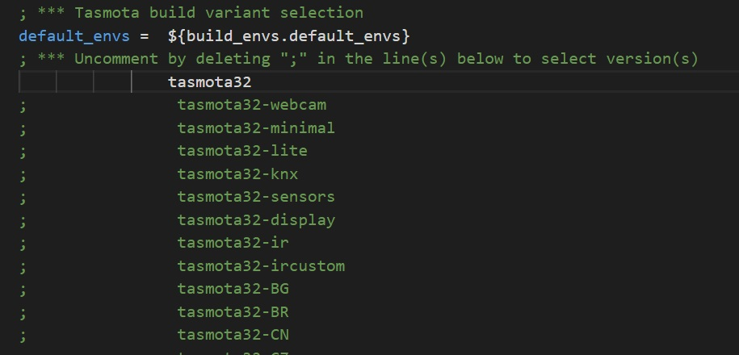

# ESP32 Support (Early alpha development)

!!! warning "ESP32 support is in early alpha and only basic functions will work"

You can download precompiled development binaries from [https://github.com/arendst/Tasmota/tree/firmware/firmware/tasmota32](https://github.com/arendst/Tasmota/tree/firmware/firmware/tasmota32)

Command syntax for flashing Tasmota32 firmware on ESP32 via Esptool (**replace COM port number!**):
```
esptool.py --chip esp32 --port COM5 --baud 921600 --before default_reset --after hard_reset write_flash -z --flash_mode dout --flash_freq 40m --flash_size detect 0x1000 bootloader_dout_40m.bin 0x8000 partitions.bin 0xe000 boot_app0.bin 0x10000 tasmota32.bin
```

## Compiling for ESP32

Rename `platformio_override_sample.ini` to `platformio_override.ini` and uncomment tasmota32 in line #28. Next build will create a `tasmota32.bin`. 



## Activate user_config_override.h

To use your `user_config_override.h` in tasmota32 you need to uncomment line 254.


## Templates and Known Devices

Some known device templates and configurations

### LilyGO TTGO T-Camera OV2640_V05

In `platformio_override.ini` uncomment the line with `tasmota32-camera.bin` and set the correct COM port. 

In `user_config_override.h` add:
```
#define USE_BMP
#define USE_DISPLAY
#define USE_DISPLAY_SSD1306
#define HOW_SPLASH
```

Upload via USB, then apply the following Template:

```json
{"NAME":"TTGO_V05","GPIO":[65504,65504,65504,65504,5090,5088,65504,65504,5056,5024,5089,5091,65504,65504,5092,5184,0,640,608,5093,0,5152,4928,5120,0,0,0,0,4992,160,65,65504,5094,0,0,5095],"FLAG":0,"BASE":2}
```

To make the device work nicely, change the following settings in the Console:

Camera settings to correct orientation (USB on the bottom):
```
WCFlip ON
WCMirror ON
WCResolution 6
WCSaturation 0
WCBrightness -1
WCContrast 1
```

Display Settings (USB on the bottom):
```
DisplayRotate 2
DisplayCols 21
DisplayRows 7
DisplayMode 2
```

BME280 Settings (it is not very trustable):
```
HumOffset 10
TempOffset -15
```

