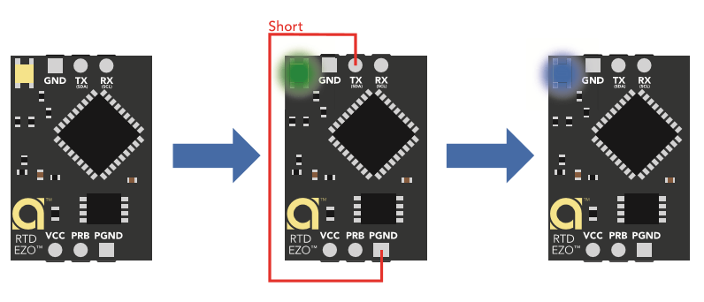

# EZO sensors

??? failure "This feature is not included in precompiled binaries"  

    When [compiling your build](Compile-your-build) add the following to `user_config_override.h`:
    ```c++
    //  #define USE_EZOPH         // [I2cDriver55] Enable support for EZO's pH sensor (+0k3 code) - Shared EZO code required for any EZO device (+1k2 code)
    //  #define USE_EZOORP        // [I2cDriver55] Enable support for EZO's ORP sensor (+0k3 code) - Shared EZO code required for any EZO device (+1k2 code)
    //  #define USE_EZORTD        // [I2cDriver55] Enable support for EZO's RTD sensor (+0k2 code) - Shared EZO code required for any EZO device (+1k2 code)
    //  #define USE_EZOHUM        // [I2cDriver55] Enable support for EZO's HUM sensor (+0k3 code) - Shared EZO code required for any EZO device (+1k2 code)
    //  #define USE_EZOEC         // [I2cDriver55] Enable support for EZO's EC sensor (+0k3 code) - Shared EZO code required for any EZO device (+1k2 code)
    //  #define USE_EZOCO2        // [I2cDriver55] Enable support for EZO's CO2 sensor (+0k2 code) - Shared EZO code required for any EZO device (+1k2 code)
    //  #define USE_EZOO2         // [I2cDriver55] Enable support for EZO's O2 sensor (+0k3 code) - Shared EZO code required for any EZO device (+1k2 code)
    //  #define USE_EZOPRS        // [I2cDriver55] Enable support for EZO's PRS sensor (+0k7 code) - Shared EZO code required for any EZO device (+1k2 code)
    //  #define USE_EZOFLO        // [I2cDriver55] Enable support for EZO's FLO sensor (+0k4 code) - Shared EZO code required for any EZO device (+1k2 code)
    //  #define USE_EZODO         // [I2cDriver55] Enable support for EZO's DO sensor (+0k3 code) - Shared EZO code required for any EZO device (+1k2 code)
    //  #define USE_EZORGB        // [I2cDriver55] Enable support for EZO's RGB sensor (+0k5 code) - Shared EZO code required for any EZO device (+1k2 code)
    //  #define USE_EZOPMP        // [I2cDriver55] Enable support for EZO's PMP sensor (+0k3 code) - Shared EZO code required for any EZO device (+1k2 code)    
    ```

EZO is a series of chemical sensors provided by [Atlas Scientific](https://atlas-scientific.com/)

At this point in time, the following EZO sensors are supported:

| build `#define` | Sensor ID | Sensor Name |
|---|---|---|
| USE_EZODO | EZO-D.O. | Disolved Oxygen |
| USE_EZOORP | EZO-ORP | Oxygen Reduction Potential |
| USE_EZOPH | EZO-pH | pH |
| USE_EZOEC | EZO-EC | Electric Conductivity |
| USE_EZORTD | EZO-RTD | Temperature |
| USE_EZOFLO | EZO-FLO | Flow Meter |
| USE_EZOCO2 | EZO-CO2 | Carbon Dioxyde (gas) |
| USE_EZOPRS | EZO-PRS | Pressure |
| USE_EZOO2 | EZO-O2 | Oxygen (gas) |
| USE_EZOHUM | EZO-HUM | Humidity |
| USE_EZORGB | EZO-RGB | Color |

## Configuration

All EZO devices must operate under the I^2^C mode to be compatible with Tasmota.  One of the easiest way to achieve this is to short **SDA/Tx to PGND** while powering the device through **VCC & GND**.  For more details, see [Instructables](https://www.instructables.com/UART-AND-I2C-MODE-SWITCHING-FOR-ATLAS-SCIENTIFIC-E/).



Tasmota will automatically detect any new device that has an I^2^C bus address between 0x61-0x70 (which covers the default address range of all EZO devices).  Tasmota supports any multiple of EZO devices (up to 16 of any kind).  When more than one device is detected, the devices will be indexed starting at index 1 (ex: EZO-1) and ordered by their I^2^C address.  If only one EZO device is connected, there will be no indexing of them.  You may change the address of your device by sending an I^2^C command to the device.  For example, to change the address of a single EZOpH sensor, the following command can be issued in the console: `Sensor78 I^2^C,100`

Specific details about the list of commands available for your EZO device can be found in the device-specific datasheet on the [Atlas Scientific's](https://atlas-scientific.com/) website.  In order to individually address a single EZO sensor when more than one is detected, the index must be specified on the command by appending "-#" to the command: `Sensor78-2 I2C,101`

## Calibration

Many EZO devices require calibration in order to accurately report values.  Calibration can be easily achieved by issuing the appropriate commands and following the instructions in the EZO datasheets.  One easy way to achieve this is to put the sensor in the baseline environement and use the web interface to see when the value stabilizes.  Once it does, visit the console and issue the device-specific calibration command.

## Readings

Currently, Tasmota samples the sensor information at the rate of 1Hz (1 sample/second) irrespective of the EZO device.

Some EZO devices support reporting different units.  For example EZO-RTD supports reading the temperature in °C, °K, or °F.  In order to save memory, Tasmota will only be able reading the default format (ie: °C).  If you wish to see the value in another format, you can use Tasmota's ability to display Farenheit to do the conversion for you.  For conversions that are not supported by Tasmota, you may use OpenHab, Home Assistant or any other system in conjunction with MQTT to do the cnoversion.  In every case, there exists a simple formula that will allow you to convert from one format to another and the EZO device are merely utilizing that formula to return the value.  It's important to make sure that the default units are used.  If that's not the case, Tasmota will simply assume that the default units are used and the number will seem drastically wrong.

Some device supports the output of multiple diffrent sensors in one single EZO devices.  One example of this is the EZO-HUM which supports outputing the humidity as well as the temperature.  By default, only the humidity is enabled, but a command can be sent to enable the temperature as well.  In that case, Tasmota does support reading the additional sensor provided that the command enables its output.

Some readings can be made more precise by specifying additional parameters.  The most common one is temperature.  For example, the EZO-pH sensor can return more accurate values if it compensates for the temperature.  At this point in time, Tasmota does not support reading sensor data which compensates with any other sensor's data.  That said, these are typically well-established equations that will allow you to convert the existing reading and adjust it based on the reading from the other sensor.  A simple Google search can be done to understand how to compensate in each case.

Sleep mode for EZO devices is currently NOT supported by Tasmota.

