description: Getting started with Tasmota. What you need, how to install and do initial configuration.

## Prerequisites
### Needed Hardware

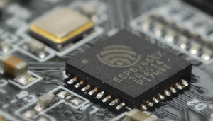</img>

#### ESP Device
Every [Espressif](https://www.espressif.com/en/products/socs) ESP8266, ESP8285, ESP32, ESP32-S or ESP32-C3 chipset based device can be flashed with Tasmota. The term ***ESP*** refers to any of them.

#### Serial-to-USB Adapter
The [power supplied to the device](https://www.letscontrolit.com/wiki/index.php?title=Power) is **one of the most important elements** for both flashing the device and for stable operation. You must ensure that the device receives sufficient power (current AND appropriate voltage level) to properly flash the firmware on the device.

* ==RECOMMENDED== [CH340G](https://cdn.sparkfun.com/datasheets/Dev/Arduino/Other/CH340DS1.PDF) is the most reliable and the cheapest one to boot ([1](https://www.aliexpress.com/item/32761423124.html), [2](https://www.sparkfun.com/products/14050)).
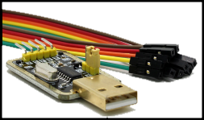</img>
* [FTDI FT232](https://www.ftdichip.com/Products/ICs/FT232R.htm) - these adapters have a lot of fakes in the market so buy only from reliable sources ([example](https://www.sparkfun.com/products/13746)). Buy only the variant with a separate 3.3V regulator on PCB! 
* [CP2102](https://www.silabs.com/documents/public/data-sheets/cp2102-9.pdf) or [PL2303](http://www.prolific.com.tw/UserFiles/files/ds_pl2303HXD_v1_4_4.pdf) - works with certain devices, but using an external 3.3V supply might be necessary. Not recommended for beginners!
* [NodeMCU](https://en.wikipedia.org/wiki/NodeMCU) You can also use a NodeMCU (or similar) as a reliable serial-to-USB adapter if you disable the onboard ESP by bridging GND to the RST or EN pin, and connect TX and RX straight to another ESP82xx instead of crossed.
* [RaspberryPi](Flash-Sonoff-using-Raspberry-Pi) - only for advanced users. External 3.3V supply necessary.

!!! note "Don't forget to install drivers for your serial-to-USB adapter."

!!! danger
    Some adapters can be switched between 3.3V and 5V for the data pins, but still provide 5V on the power pin which will irreparably destroy your device.  You **MUST** make sure the data (RX and TX) and VCC pins are set for 3.3V. 

Some devices, such as [NodeMCU](https://en.wikipedia.org/wiki/NodeMCU), [D1 mini](https://www.wemos.cc/en/latest/d1/d1_mini.html) or [M5Stack products](https://m5stack.com/), have an USB upload port and the serial-to-USB adapter built in.

Many CH340G devices will not work, the "golden CH340G" has a voltage regulator on it to supply enough power to the ESP device - many do not.  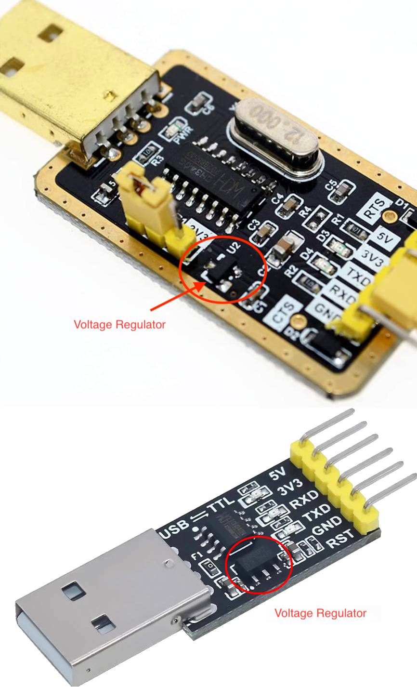</img> The ESP requires at least 150mA, many 3.3V serial programmers do not supply this much current as many serial programming tasks do not require a large amount of power.

When using an external 3.3V supply, simply ensure the ground (GND) of both are connected, this ensures a common ground. A PC power supply can be a source for 3.3V DC power.

#### Soldering Tools
To solder you'll of course need a soldering iron, soldering tin and some flux. If you're new to soldering check out some soldering tutorial videos while you're at it.

If you're intimidated by soldering there are 3D printed jigs available for different modules and devices. At worst, you could get away with holding the headers tightly with jumper wires in pin holes during flashing but it is not a foolproof process and flashing might fail.

#### Jumper Wires

You could use any kind of wire but [jumper wires](http://blog.sparkfuneducation.com/what-is-jumper-wire) (also called DuPont wires) are more practical than soldering and desoldering.

#### Pin Headers
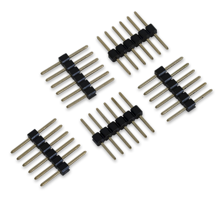</img>

[Pin headers](https://learn.sparkfun.com/tutorials/connector-basics/pin-header-connectors) come in male or female version. Choose according to your jumper wire connectors.

#### Computer with Linux, Windows or MacOS
You need a computer with a USB port to upload the firmware to your device and configure it.

#### Smartphone
Tasmota installed from a precompiled binary needs to be configured to work with your Wi-Fi network before you can access the Tasmota web UI. This is usually done by connecting to a Tasmota Wi-Fi Access Point with your smartphone (or tablet or computer with Wi-Fi). 

### Needed Software
#### Tasmota Firmware Binary
Download a Tasmota firmware binary file (.bin). If you're not sure which binary is the right one for you just start with `tasmota.bin` or consult the [builds table](Firmware-Builds) to see which features you need. 

Official release binaries can be downloaded from [firmware server](http://ota.tasmota.com/tasmota/release/). 

Latest _**development**_ branch binaries are available only from our [OTA server](http://ota.tasmota.com/tasmota). The latest merged development code is compiled hourly. 

#### Flashing Tool

- [**Tasmota Web Installer**](https://tasmota.github.io/install/) - flash Tasmota using a Chrome based browser for ESP82XX and ESP32
- [**Tasmotizer**](https://github.com/tasmota/tasmotizer) - flashing and firmware download tool _for ESP82XX only_. (Windows, Linux or Mac) 
- [**ESP-Flasher**](https://github.com/Jason2866/ESP_Flasher) - GUI flasher for Tasmota based on esptool.py for ESP82XX *and* ESP32. (Windows, Linux or Mac)
- [**Esptool.py**](https://github.com/espressif/esptool) - the official flashing tool from Espressif for ESP82XX *and* ESP32. (Requires Python)

??? info "Compiling Tools (optional)"

    If you want to modify the code or default settings and [compile your own Tasmota firmware](Compile-your-build).

### MQTT Knowledge
Tasmota is designed to be controlled and communicate via [MQTT](http://mqtt.org/). To use it to its fullest potential you need an [MQTT broker](https://www.hivemq.com/blog/mqtt-essentials-part-3-client-broker-connection-establishment/). 

Read our [article on MQTT](MQTT) to learn why it is essential in Tasmota.

## Hardware Preparation

We need to connect to the serial programming interface of the ESP chip. This is done by connecting our serial-to-USB converter TX and RX pins to the ESP RX and TX pins and powering the chip with the 3.3V and GND pins.

In most cases those pins are available on the PCB in the form of pin holes or solder pads but pin headers or jumper wires need to be soldered or otherwise applied. In some cases you will need to solder wires directly on the chip's pins which requires some experience and good soldering equipment.

!!! failure "DO NOT CONNECT DEVICES TO MAINS AC POWER WHILE THE COVER IS OPEN AND CIRCUIT BOARD IS EXPOSED!!!"

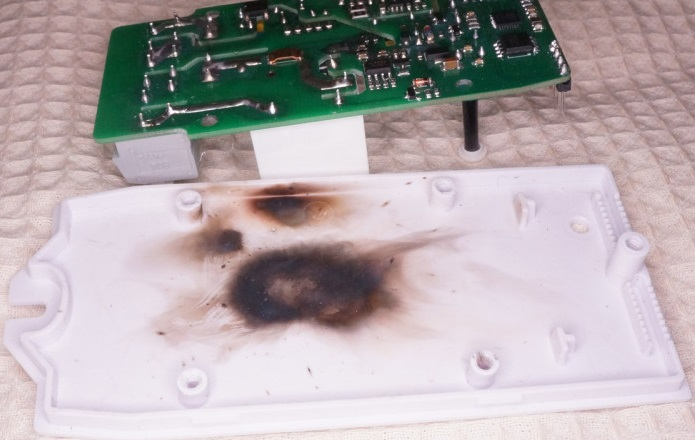

==**NEVER TRY TO FLASH WHILE YOUR DEVICE IS CONNECTED TO MAINS POWER!!!**==

==**YOU CAN BE ELECTROCUTED IF YOU DO NOT KNOW WHAT YOU ARE DOING!**==

If you are not careful, your own health will be in danger. Shorting your serial interface with mains AC power will fry your device and serial adapter and will also harm or destroy your computer. It is important to _**always have all mains power cables disconnected from the device**_ while being connected via serial or even while the case of the device is opened.

### Serial Connection
Each device has its pins labelled differently. If the labelling isn't visible on the PCB please refer to the devices flashing guide or search the Internet for correct pin locations. Device specific instructions and restrictions are documented in the [Tasmota Supported Devices Repository](https://templates.blakadder.com/). Pinouts for commonly used Wi-Fi modules are [found here](Pinouts.md)

When you have identified pins on your device, connect wires according to the table:

|Serial adapter  | ESP device |
|-----------:|:-------------------|
|        3V3 | 3V3 or VCC         |
|         TX | RX                 |
|         RX | TX                 |
|        GND | GND                |

**Note that TX from your adapter goes to RX on the ESP device and RX from adapter goes to TX on the device!**


### Programming Mode
</img>

ESP needs to be put into **programming mode** or **flash mode** before the firmware can be uploaded. This is done by connecting GPIO0 pin to GND while the chip is booting. 

On many devices the installed control button is connected to GPIO0 and GND, making entering Programming Mode easy. On others you will need to bridge the pins on the PCB or directly on the chip with a jumper wire. GPIO0 locations for popular modules can be found in [Pinouts](Pinouts.md)!

Device specific instructions are documented in [Tasmota Supported Devices Repository](https://templates.blakadder.com/).

To put the ESP into Programming Mode:

1. Disconnect serial-to-USB adapter and power
2. Bridge GPIO0 and GND (by pressing the on-board button or connection with a wire)
3. Connect the serial-to-USB adapter to your computer
4. After a few seconds disconnect GPIO0 from GND (release button or remove the wire connection). On devices that do not provide the GPIO0 connected button, it may be easier to leave the wired bridge in place throughout the entire flashing process (erase & upload). Doing so will not create any problems. After the firmware is uploaded successfully, remove the bridge. This allows the device to boot normally.

??? tip "esptool.py programming mode test"
     You can test whether your device is in Programming Mode by attempting to read information from the ESP82xx chip. This requires `esptool.py`. Instructions on installing and using `esptool` are provided below. For example (`COM5` will be your COM port):  

     - `esptool.py -p COM5 read_mac` (It should read the MAC address. It may fail afterwards during Uploading and running a "stub". This is normal.)
     - `esptool.py -p COM5 flash_id`

If everything went well, you are now in Programming Mode and ready to continue with [flashing](#flashing). If the flashing process is unable to start, disconnect the device and retry the steps.

### Common Mistakes

- Wire connections and solder joints - Double check all connections and also check for solder overflow.
- Use a USB ==**data cable**== - Some USB cables are for charging only and do not connect the data lines needed to load the firmware onto the device.
- Insufficient power delivered over the serial-to-USB adapter. This leads to flashing failures or corrupted flash altogether. Supply more power with a separate 3.3V power supply or get an adapter with a better power supply. Be sure all DC voltages use the same GND line.
- Recheck your serial-to-USB adapter so to ensure that it supplies 3.3V voltage and **NOT 5V**. _**5V will damage the ESP chip!**_
- Releasing GPIO0 button/wire before booting is finished - It is safe to leave GPIO0 connected to GND during the entire programming process (erase & upload). Just be sure to remove the GPIO0 to GND bridge before booting the device for regular operation.
- Make sure that the RX pin is connected to the TX pin between the serial adapter and your ESP device, and vice versa.
- Erase the flash first and power cycle before uploading the Tasmota firmware binary. Not erasing can leave behind remnants of the previous flash contents which can interfere with the new firmware operation.

## Flashing

If you have followed [Hardware preparation](#hardware-preparation), your device should be in _Programming Mode_ and ready for a Tasmota firmware binary to be installed.

!!! tip "You may want to back up the device manufacturer's firmware on the one in a million chance you don't like Tasmota."

Choose an installation method:

=== "Web Installer :material-google-chrome:"
    With a Chrome based browser open [https://tasmota.github.io/install](https://tasmota.github.io/install) and follow the instructions.
    
     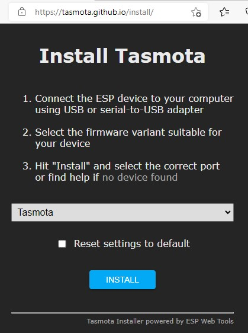

    Tasmota Web Installer will install an appropriate build for your device. 

     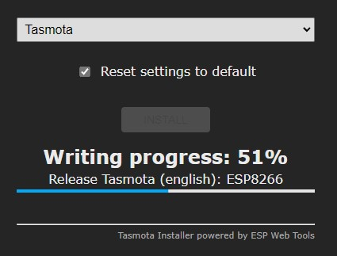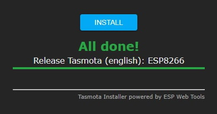


=== "Tasmotizer! :material-linux: :material-apple: :material-microsoft-windows:"
    Tasmotizer! is specifically designed for use with Tasmota with an easy to use GUI and [esptool.py](https://github.com/espressif/esptool) under the hood.

    Download the [latest release](https://github.com/tasmota/tasmotizer/releases) for your platform. In Windows just double click the downloaded file and it'll start, no installation required. For python follow the installation [instructions](https://github.com/tasmota/tasmotizer#installation-and-how-to-run). 

    <!-- !!! tip "[Video tutorial](https://youtu.be/hIwIhu5OWiA) by SuperHouseTV" -->

    !!! note 
        If you get an anti-virus infection warning don't fret, it is a [known false positive](https://stackoverflow.com/questions/43777106/program-made-with-pyinstaller-now-seen-as-a-trojan-horse-by-avg). If you're still apprehensive you can always run the Python version. 

    **It is time to Tasmotize!**

    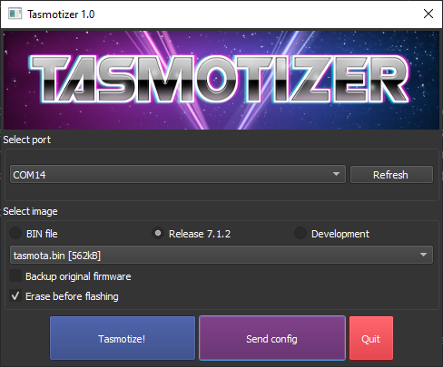

    1. Connect your device to the serial-to-USB adapter or plug in NodeMCU/D1 mini.
    1. Check whether the correct **serial port** (COM or tty port) is selected. Tasmotizer! will try its best to select the right one for you.
    1. Choose Tasmota firmware binary:
        * **BIN file** - browse to the Tasmota firmware binary you downloaded or compiled.
        * **Release** - select from a list of available release binaries
        * **Development** - select from a list of latest development binaries
    4. _optional_ Backup the original device firmware
    5. Erase flash

    !!! danger 
        Leave *Erase before flashing* checked if it is the first time flashing Tasmota on the device or you're experiencing issues with the existing flash and need to do a full erase. If you're upgrading an already flashed Tasmota and wish to keep your settings, uncheck *Erase before flashing*.

    6. Click **Tasmotize** and wait until done.

    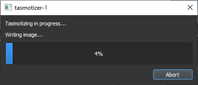

    If the flash was successful it will display: 

    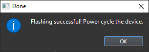

    Unplug your serial programming adapter or device and plug it back in or connect to another power source. 

=== "esptool.py :material-linux: :material-apple: :material-microsoft-windows:"

    Esptool is the official Espressif tool for flashing ESP chips. It requires Python, if you do not have an installed copy of Python 2.x or 3.x download and install it from https://www.python.org.

    Download the [esptool Source code](https://github.com/espressif/esptool/releases) to a folder of your choice.
    Go to the folder and install Esptool with command 
    ```
    python setup.py install
    ```

    Make sure you followed the steps to put your device in programming mode. Place your chosen firmware binary file in the same folder as esptool.py.

    Esptool uses the serial interface to communicate with your device. On Windows these interfaces are named COM1, COM2, etc. and on Linux they are named /dev/ttyUSB0, /dev/ttyUSB1, etc. Before using esptool, make sure you know which serial port your programming adapter is connected to.

    The following use `COM5` as an example. Change `COM5` with your serial port designation.

    Ensure the device is in programming mode before each step.

    #### Backup Firmware <small>(optional step)</small>
    Backup the current firmware with the following command:
    ```
    esptool.py --port COM5 read_flash 0x00000 0x100000 fwbackup.bin
    ```
    *When the command completes the device is not in programming mode anymore.* Repeat the process of putting your device in programming mode.

    #### Erase Flash Memory
    Erase the complete flash memory holding the firmware with the following command:
    ```
    esptool.py --port COM5 erase_flash
    ```
    It only takes a few seconds to erase 1M of flash.

    *When the command completes the device is not in programming mode anymore.* Repeat the process of putting your device in programming mode.

    #### Upload Firmware
    Load the chosen Tasmota firmware file with the following command (e.g., `tasmota.bin` in this example):

    ```
    esptool.py --port COM5 write_flash -fs 1MB -fm dout 0x0 tasmota.bin
    ```

    Unplug your serial programming adapter or your device and plug it back in or connect to another power source. Your device is now ready for [Initial configuration](#initial-configuration). 

    !!! tip "For proper device initialization after the firmware upload completes, power down and power up the device."

=== "OTA Conversion :material-airplane-settings:"

    **Tasmota is NOT a developer of these tools. For help and troubleshooting you will need to _get support from those projects_.**

    - [**MgOS to Tasmota**](https://github.com/arendst/mgos-to-tasmota) - OTA flash for Shelly devices
    - [**Tuya-Convert**](Tuya-Convert) - OTA flash for devices with Tuya chips. **Does not work in 99% of cases**
    - [**Sonoff DIY**](Sonoff-DIY) - OTA flash for select Sonoff devices **Does not work anymore**
    - [**esp2ino**](https://github.com/elahd/esp2ino) - OTA flash for select Wyze devices. **Does not work anymore**

You've successfully flashed your device with Tasmota but now you need to connect the freshly tasmotised device to your Wi-Fi network. 

## Initial Configuration

=== "Using Web UI"

    Tasmota provides a wireless access point for easy Wi-Fi configuration. 

    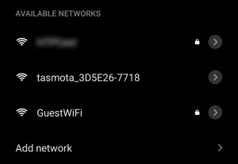</img>Connect your device to a power source and grab your smartphone (or tablet or laptop or any other web and Wi-Fi capable device). Search for a Wi-Fi AP named _**tasmota_XXXXXX-####**_ (where _XXXXXX_ is a string derived from the device's MAC address and _####_ is a number) and connect to it. _In this example the Wi-Fi AP is named **tasmota_3D5E26-7718**._ 

    When it connects to the network, you may get a warning that there is no Internet connection and be prompted to connect to a different network. _Do not allow the mobile device to select a different network_.

    <p></p>

    !!! warning 
        Wi-Fi manager server is active for only 3 minutes. If you miss the window you might have to disconnect your device from power and reconnect.

    </img>
    After you have connected to the Tasmota Wi-Fi AP, open `http://192.168.4.1` in a web browser on the smartphone (or whatever device you used). 
    Depending on the phone, it will take you to the Tasmota configuration page automatically, or you will get a prompt to *sign in to Wi-Fi network* or *authorize*. Tapping on the AP name should also open the configuration page.

    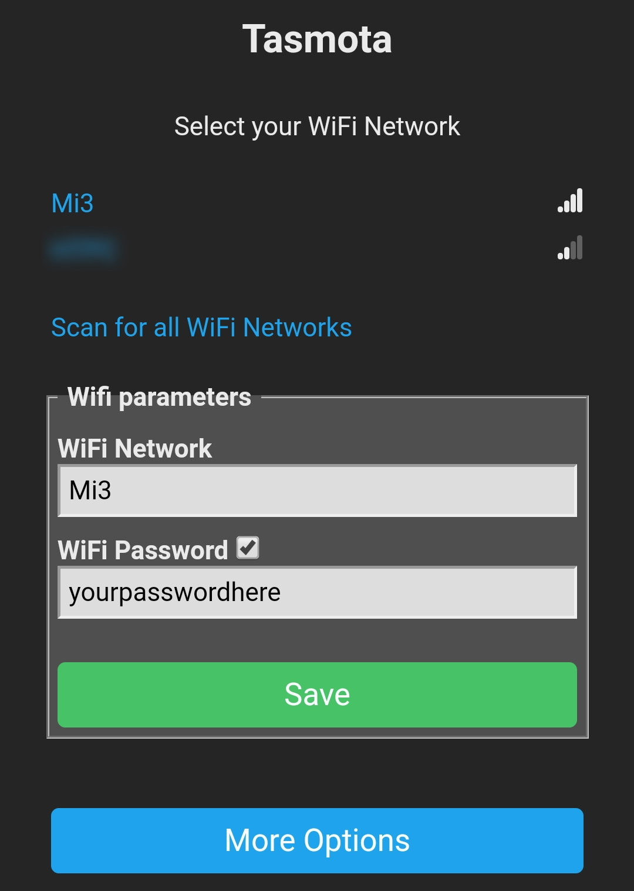</img> 
    At the top of the page you can select one of the discovered Wi-Fi networks or have Tasmota scan again. Enter your WiFi credentials:

    **WiFi Network** - your Wi-Fi network name (SSID
    Selecting the desired network name from the list will enter it automatically in this field. _SSID's are case sensitive_

    **WiFi Password** - password for your Wi-Fi network   
    Wi-Fi password has to be under 64 characters and without special characters (e.g. asterisks) or white spaces

    Click the checkbox if you want to see the password you enter to ensure that it is correct. Click on **Save** to apply the settings. The device will try to connect to the network entered. 

    </img> 

    If it was successful, you will see this message:

    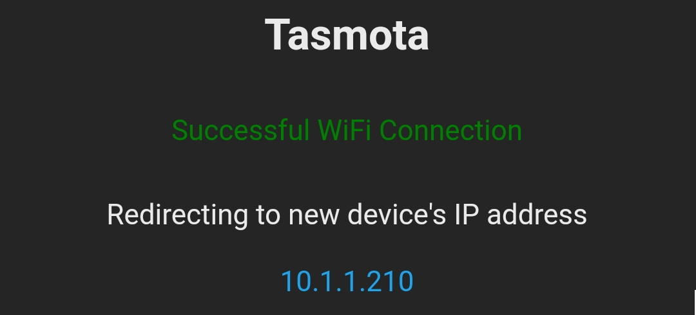</img> 

    Some phones will redirect you to the new IP immediately, on others you need to click the link to open it in a browser.

    The _tasmota_XXXXXX-####_ network will no longer be present. Therefore your smartphone will automatically be disconnected and should connect back to its data network.

    !!! failure 
            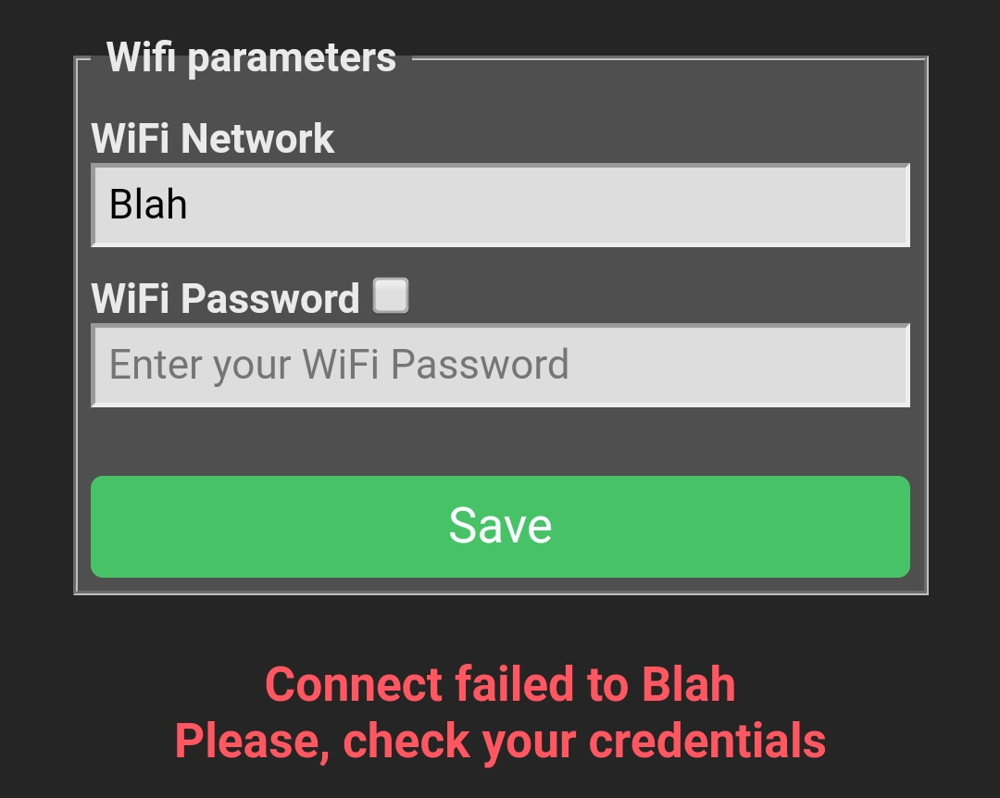</img>In case the network name or password were entered incorrectly, or it didn't manage to connect for some other reason, Tasmota will return to the "Wi-Fi parameters" screen with an error message.

    If you don't know the IP of the newly flashed device look in your router settings or find it with an IP scanner:

    * [Fing](https://www.fing.com/products/) - for Android or iOS
    * [Angry IP Scanner](https://angryip.org/) - open source for Linux, Windows and Mac. Requires Java.
    * [Super Scan](https://sectools.org/tool/superscan/) - Windows only (free)

    Open the IP address with your web browser and you have full access to Tasmota.

    Now is the time to set up [MQTT](MQTT) and the last remaining, but equally important, step:

    Set up your device's feature using a [Template](Templates) in **Configuration - Configure Template** or [Module](Modules) in **Configuration - Configure Module**.

    **Configure Other (optional)**

    Configure your device name which is displayed in webUI and used for [Home Assistant discovery](Home-Assistant.md). 

    Configure web admin password for the webUI. Default username is `admin`. This type of security is rudimentary since Tasmota doesn't use HTTPS, do not expose your device outside of your local network.

=== "Using Serial Terminal"

     If you flashed the device using serial-to-USB adapter (or it is a NodeMCU/D1 mini) you can take advantage of the existing connection and configure your device over the serial connection using [Commands](Commands).

    First you will need a serial terminal program that connects to Tasmota console over the serial connection you used to flash it.

     * **[Termite](https://www.compuphase.com/software_termite.htm)** - simple terminal for windows
     * **[Termie](http://termie.sourceforge.net/)** - open source clone of Termite
     * **[Putty](https://www.putty.org/)** - popular client available on every platform
     * **[Minicom](https://www.acmesystems.it/minicom)** - one of many Linux terminals

      !!! tip 
          Enable _local echo_ so that you can see what is typed and transmitted to the device. Enable **Append CR+LF** since every request needs to end with `<CR><LF>`. 

    *In this example [Termite](https://www.compuphase.com/software_termite.htm) on Windows is used.*

    Download Termite and extract the .exe file, no installation necessary. Connect your serial-to-USB adapter or NodeMCU/D1 mini to the computer.

    

    Open Termite and set it to the proper COM port (*Termite selects the first available port by default*). 
    Set Baud rate to 115200 and Forward to none. 

    

    Connect your device to the serial-to-USB adapter. You should see the initial boot output in Termite.
    If your screen is empty type `status` in the bottom command bar and hit enter. If you get a return message from your device similar to the one displayed under purple `status` you're all set.

    To configure Tasmota you need to issue commands, some commands will reboot your device and to avoid that we will use the `Backlog` command feature.

    Configure your Wi-Fi network and a secondary Wi-Fi network

    ```console
    Backlog ssid1 <yourssid>; password1 <your_password>; ssid2 <your_ssid2>; password2 <your_password>
    ```
    

    Device will restart and connect to your network. It will display your devices newly assigned IP. Direct your web browser to that IP address to access the Web UI for further configuration and control.

    Configure MQTT broker address, MQTT credentials, unique device topic and OTA url to the latest official release
    ```console
    Backlog mqtthost <yourhost>; mqttuser <user>; mqttpassword <password>; topic <unique_topic>; otaurl http://ota.tasmota.com/tasmota/release/tasmota.bin
    ```

    [Commands](Commands) and Backlog are powerful and in time you can learn to configure almost everything (NTP servers, longitude and latitude, custom device options, etc) with a few copy and paste moves.

      !!! tip 
          Keep your personal configuration in a text file and simply copy and paste the backlog commands to a newly flashed device.

## After Configuration

Your device running Tasmota is now ready to be [controlled](Commands).

Check out all the Tasmota [features](Features) and ways to [integrate it](Integrations) with other platforms.

!!! warning
     If you experience power fluctuations in your power grid its best to immediately disable [Power Cycle Recovery](Device-Recovery#fast-power-cycle-device-recovery) feature with command [`SetOption65 1`](Commands.md#setoption65) immediately or you might end up with firmware defaults on your device.
