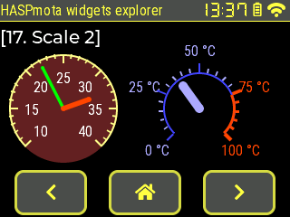
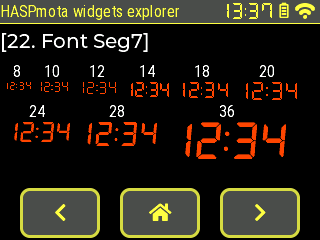
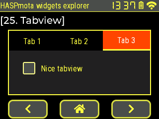

# HASPmota :material-cpu-32-bit:

!!! tip "This feature is included in tasmota32-lvgl.bin"

!!! tip "Starting from v14.5.0.2, HASPmota automatically starts if a file `pages.jsonl` is present"

Tasmota happily supports the openHASP compatible format, known as HASPmota. This format allows you to describe rich graphics interfaces using simple JSON templates. The HASPmota support in Tasmota leverages the power of [LVGL](https://tasmota.github.io/docs/LVGL/) and the [Berry language](https://tasmota.github.io/docs/Berry/), but you don't need to code or learn the LVGL API to use it.

This feature is heavily inspired from @fvanroie's [openHASP project](https://github.com/HASwitchPlate/openHASP).

## Running HASPmota

HASPmota, like OpenHASP, relies of describing the elements to be displayed in a simple JSONL file. [JSONL (JSON Lines)](https://jsonlines.org/) is a file format where each line is a valid JSON value. The default file name is `pages.jsonl`.

When a file `pages.jsonl` is present in the file system, HASPmota is automatically started without any additional code needed (since v14.5.0.2, previously you needed to start HASPmota in `autoexec.be`).

HASPmota auto-start is triggered after `autoexec.be` is executed, so you have the opportunity to start HASPmota yourself, or initialize any sensor or components `autoexec.be` time. You can also use a different name than `pages.jsonl` and start HASPmota at any time of your convenience.

### Running HASPMota manually

If you need to start HASPmota manually, you can use the following code in `autoexec.be`:

```berry
import haspmota
haspmota.start()         # manually start HASPmota using default 'pages.jsonl' file
```

You can pass an additional parameter with the name of the template file:

```berry
import haspmota
haspmota.start("my_template.jsonl")
```

## Gallery of widgets

[{width="160"}](#label)
[{width="160"}](#spangroup-styled-text)
[{width="160"}](#btn)
[{width="160"}](#led)
[{width="160"}](#switch)
[{width="160"}](#checkbox)
[{width="160"}](#line)
[{width="160"}](#bar)
[{width="160"}](#btnmatrix)
[{width="160"}](#chart)
[{width="160"}](#img)
[{width="160"}](#roller)
[{width="160"}](#qrcode)
[{width="160"}](#slider)
[{width="160"}](#arc)
[{width="160"}](#scale-scale_section-scale_line)
[{width="160"}](#scale-scale_section-scale_line)
[{width="160"}](#spinner)
[{width="160"}](#dropdown-and-dropdown_list)
[{width="160"}](#embedded-fonts)
[{width="160"}](#embedded-symbols)
[{width="160"}](#embedded-special-fonts)
[{width="160"}](#msgbox)
[{width="160"}](#cpicker)
[{width="160"}](#tabview)


The `jsonl` file used to display the widgets can be found [widget demo JSONL file](_media/lvgl/haspmota_demo.jsonl)

## Minimal requirements

**Hardware**: HASPmota is supported on all ESP32 variants, and requires a display configured with universal display (using `display.ini` or `autoconf`). When they are correctly configured, you should see a splash screen at startup.

Currently **PSRAM** is strongly recommended to run HASPmota if you want to use images and external fonts. Boards without PSRAM can do basic HASPmota.

**Firmware**: HASPmota is included in `tasmota32-lvgl` firmwares, you don't need any additional `.tapp` file.

## Quick tour

You can see HASPmota in action in a couple of minutes.

Upload `tamota_demo.tapp` to your file system. The easy way is to use the following command in Tasmota console:

- `UrlFetch https://raw.githubusercontent.com/arendst/Tasmota/development/tasmota/berry/haspmota/haspmota_demo.tapp`
- `Restart 1` to restart
- Enjoy

You should see the following screen, and click on buttons to switch to the second screen:


### Understanding the template

HASPmota automatically loads the template from a file named `pages.jsonl`. This file contains JSON Lines, i.e. a single JSON document per line. Each line describes an element on the screen. Elements are grouped into pages.

Page `0` contains objects that are displayed on all screens. They are typically used for headers and menus.

The lines below define the header label (red background) and the clock and wifi widgets.

``` json
{"page":0,"comment":"---------- Upper stat line ----------"}

{"id":11,"obj":"label","x":0,"y":0,"w":320,"pad_right":90,"h":22,"bg_color":"#D00000","bg_opa":255,"radius":0,"border_side":0,"text":"Tasmota","text_font":"montserrat-20"}

{"id":15,"obj":"lv_wifi_arcs","x":291,"y":0,"w":29,"h":22,"radius":0,"border_side":0,"bg_color":"#000000","line_color":"#FFFFFF"}
{"id":16,"obj":"lv_clock","x":232,"y":3,"w":55,"h":16,"radius":0,"border_side":0}
```

The lines below describe the 3 buttons at the bottom, and their respective actions.

``` json
{"comment":"---------- Bottom buttons - prev/home/next ----------"}
{"id":101,"obj":"btn","x":20,"y":210,"w":80,"h":25,"action":"prev","bg_color":"#1fa3ec","radius":10,"border_side":0,"text":"\uF053","text_font":"montserrat-20"}
{"id":102,"obj":"btn","x":120,"y":210,"w":80,"h":25,"action":"back","bg_color":"#1fa3ec","radius":10,"border_side":0,"text":"\uF015","text_font":"montserrat-20"}
{"id":103,"obj":"btn","x":220,"y":210,"w":80,"h":25,"action":"next","bg_color":"#1fa3ec","radius":10,"border_side":0,"text":"\uF054","text_font":"montserrat-20"}
```

Page `1` is the default page, and contains different widgets types: labels and arc. The values are changed at runtime via Tasmota's rule system, see below for details.

``` json
{"page":1,"comment":"---------- Page 1 ----------"}
{"id":0,"bg_color":"#0000A0","bg_grad_color":"#000000","bg_grad_dir":1,"text_color":"#FFFFFF"}

{"id":2,"obj":"arc","x":20,"y":65,"w":80,"h":100,"border_side":0,"type":0,"rotation":0,"start_angle":180,"end_angle":0,"start_angle1":180,"value_font":12,"value_ofs_x":0,"value_ofs_y":-14,"bg_opa":0,"text":"--.-°C","min":200,"max":800,"val":0,"val_rule":"ESP32#Temperature","val_rule_formula":"val * 10","text_rule":"ESP32#Temperature","text_rule_format":"%2.1f °C"}

{"id":5,"obj":"label","x":2,"y":35,"w":120,"text":"Temperature","align":1}

{"id":10,"obj":"label","x":172,"y":35,"w":140,"text":"MPU","align":0}
{"id":11,"obj":"label","x":172,"y":55,"w":140,"text":"x=","align":0,"text_rule":"MPU9250#AX","text_rule_format":"x=%6.3f","text_rule_formula":"val / 1000"}
{"id":12,"obj":"label","x":172,"y":75,"w":140,"text":"y=","align":0,"text_rule":"MPU9250#AY","text_rule_format":"y=%6.3f","text_rule_formula":"val / 1000"}
{"id":13,"obj":"label","x":172,"y":95,"w":140,"text":"z=","align":0,"text_rule":"MPU9250#AZ","text_rule_format":"z=%6.3f","text_rule_formula":"val / 1000"}
```

Page `2` contains custom widgets as Berry code. These widgets are imported within `haspmota_widgets.tapp`

``` json
{"page":2,"comment":"---------- Page 2 ----------"}
{"id":0,"bg_color":"#0000A0","bg_grad_color":"#000000","bg_grad_dir":1,"text_color":"#FFFFFF"}

{"comment":"---------- Wifi status ----------"}
{"id":20,"obj":"lv_wifi_graph","x":257,"y":25,"w":60,"h":40,"radius":0}
{"id":21,"obj":"lv_tasmota_info","x":3,"y":25,"w":251,"h":40,"radius":0}
{"id":22,"obj":"lv_tasmota_log","x":3,"y":68,"w":314,"h":90,"radius":0,"text_font":12}
```

Finally, the following line allows to run arbitrary Berry code.

``` json
{"comment":"--- Trigger sensors every 2 seconds ---","berry_run":"tasmota.add_cron('*/2 * * * * *', def () var s = tasmota.read_sensors() if (s) tasmota.publish_rule(s) end end, 'hm_every_5_s')"}
```

The code trigger a read of sensors every 2 seconds and publish the JSON result to be parsed by the rule engine.

``` berry
tasmota.add_cron('*/2 * * * * *', def () var s = tasmota.read_sensors() if (s) tasmota.publish_rule(s) end end, 'hm_every_5_s')
```

## HASPmota reference

### Integration to Berry

#### objects as `p<x>b<y>`

Each HASPmota widget is mapped to a global variable of name `p<x>b<y>`. Example:  `p1b10`. Such objects can be directly used via their attributes.

Example:

```
p1b10.x += 10
p1b10.text = "Hello"
print(p1b10.w)
```

#### pages as `p<x>`

Pages objects are mapped to a global variable of name `p<x>`.

Changing pages can be done with `p2.show()`

#### move to page programmatically

Use `haspmota.page_show(<action>)` with a parameter action taking one of the following: `next`, `prev`, `back`, `p<n>`.

```berry
haspmota.page_show('next')      # move to next page
haspmota.page_show('prev')      # move to previous page
haspmota.page_show('back')      # move to home page
haspmota.page_show('p3')        # move to page 3
```

#### additional parsing

HASPmota parses all lines from the file `pages.jsonl`. You can dynamically add new objects as JSON with `haspmota.parse(<json>)`. This functions takes a single json line. It is highly recommended to specify the page id in the json, otherwise the object is added to the current page.


### Pages

Pages object are identified by object if `0`. Example:

``` json
{"page":1,"id":0,"bg_color":"#0000A0","bg_grad_color":"#000000","bg_grad_dir":1,"text_color":"#FFFFFF"}
```

Internally HASPmota pages are implemented with LVGL screens, i.e. a parent object.

Page `0` is a special page that is displays over every screens. It is the perfect place to put navigation menus. It is implement as `lv.layer_top()`.

Page `1` is always present and the default page.

Attributes specific to page|Details
:---|:---
`prev`|(int) target page number when pressing PREV button
`next`|(int) target page number when pressing NEXT button
`home`|(int) target page number when pressing HOME button
  |And generally all object attributes

### Classes of widgets

Attribute `"obj"` can take the following values:

HASPmota Class|Embedded LVGL class
:---|:---
`obj`|`lv.obj`
`btn`|`lv.btn`
`switch`|`lv.switch`
`checkbox`|`lv.checkbox`
`label`|`lv.label`
`spinner`|`lv.spinner`
`line`|`lv.line`
`img`|`lv.img`
`dropdown`|`lv.dropdown`
`roller`|`lv.roller`
`btnmatrix`|`lv.buttonmatrix`
`bar`|`lv.bar`
`scale`|`lv.scale`
`slider`|`lv.slider`
`arc`|`lv.arc`
`textarea`|`lv.textarea`
`led`|`lv.led`
`chart`|`lv.chart`
`cpicker`|`lv.colorwheel` (ported from LVGL8 to LVGL9)
`spangroup`|`lv.spangroup`
`span`|`lv.span`
`msgbox`|`lv.msgbox`
`qrcode`|`lv.qrcode`
`tabview`|`lv.tabview`

You can also import custom widget as long as they inherit from `lv.obj` and the class name matches the module name.

Example: `"obj":"lv_wifi_graph"` will trigger the following:
- `import lv_wifi_graph`
- instantiation of `lv_wifi_graph(parent)` object
- if successful, it can be used like a typical HASPmota object

### Attributes

!!!note "New in Tasmota v13.4.0.4, sizes can be expressed in percentage of the screen."

Values in pixels can be expressed in percentage instead of absolute value. Just suffix the attribute name with `%`. Example: `"h%:100` instead of `"h":320`. Percentage values can only be set (written to); when you read back a size, it is always in pixels.

When using Berry scripting, `h%` is not a valid attribute name so you need to use the special syntax:

```berry
p10b20.('h%') = 100
```

Below are the standard attributes:

Attribute name|LVGL equivalent|Details
:---|:---|:---
`comment`||Ignored
`meta`|any|Any data, can be retrieved from Berry code with `p<x>b<y>.meta`
`page`|0 to 15<br>Parent screen object|Page id for the current object.<br>If not present, takes the value of the current page
`id`|0..255|Id number of the object. Id `0` means the entire page.<br>A global berry object is created with name `p<page>b<id>` (ex: `p1b10`)
`obj`|widget class|Class of the widget (see above).<br>If not present, the entire JSON line is ignored
`action`|`"next"`, `"prev"`, `"back"` or `"p<x>"`|Switch to page when the object is touched
`x`|`x`|X coordinate of top left corner
`y`|`y`|Y coordinate of top left corner (Y is pointing down)
`h`|`height`|Height in pixels
`w`|`width`|Width in pixels
`hidden`|flag `lv.OBJ_FLAG_HIDDEN`|Object is hidden (bool)
`enabled`|flag `lv.OBJ_FLAG_CLICKABLE`|Object is touch/clickable (bool)
`click`|flag `lv.OBJ_FLAG_CLICKABLE`|Synonym of `enabled`. Object is touch/clickable (bool)
`toggle`|flag `lv.STATE_CHECKED`|When enabled, creates a toggle-on/toggle-off button. If false, creates a normal button.<br>TODO check if bool or string
`radius`|`style_radius`|Radius of rounded corners
`bg_opa`|`style_bg_opa`|Opacity: `0` is transparent, `255` is opaque
`bg_color`|`style_bg_color`|Color of background, format is `#RRGGBB`
`bg_grad_color`|`style_bg_grad_color`|Color of background gradient
`bg_grad_dir`|`style_bg_grad_dir`|Gradient direction<br>`0`: none<br>`1`: Vertical (top to bottom) gradient<br>`2`: Horizontal (left to right) gradient
`border_side`|`style_border_side`|Borders to be displayed (add all values)<br>`0`: none<br>`1`: bottom<br>`2`: top<br>`4`: left<br>`8`: right<br>`15`: full (all 4)
`border_width`|`style_border_width`|Width of border in pixels
`border_color`|`style_border_color`|
`line_color`|`style_line_color`|Color of line
`line_width`|`style_line_width`|
`line_width1`|`style_arc_width`|Sets the line width of an `arc` indicator part
`pad_left`|`style_pad_left`|Left padding in pixels
`pad_right`|`style_pad_right`|Right padding in pixels
`pad_top`|`style_pad_top`|Top padding in pixels
`pad_bottom`|`style_pad_bottom`|Bottom padding in pixels
`pad_all`|`style_pad_all`|Sets all 4 padding values at once (Write-only)

### Attributes related to text content

Attribute name|LVGL equivalent|Details
:---|:---|:---
`text`|`text`|Sets the inner text of the object.<br>If the native LVGL object does not support text (like `lv.btn`), a `lv.label` sub-object is automatically created.
`value_str`|`text`|Synonym of `text`
`align`|`style_text_align`|Set alignment for text<br>`0` or `"left"`: `lv.TEXT_ALIGN_LEFT`<br>`1` or `"center"`: `lv.TEXT_ALIGN_CENTER`<br>`2` or `"right"`: `lv.TEXT_ALIGN_RIGHT`
`text_font`|`style_text_font`|Sets the font name and size for the text.<br>If `int`, the default font is `robotocondensed_latin1` and the parameter sets the size<br>If `string`, the font is in the form `<font_name>-<font_size>`, example: `montserrat-20` or in the form `A:<font_file>` to load a binary font from the file-system.
`value_font`|`style_text_font`|Synonym of `text_font`
`text_color`|`style_text_color`|Sets the color of text
`text_decor`|`style_text_decor`|Sets the text decorator, can be ORed<br>`0`: none<br>`1` underline<br>`2`: strike-through
`text_opa`|`style_text_opa`|Sets the text opacity<br>`0`: transparent<br>`255`: opaque 
`text_letter_space`|`style_text_letter_space`|Set the letter space in pixels
`text_line_space`|`style_text_line_space`|Set the line space in pixels.
`long_mode`<br>`label_mode`|`set_long_mode`|Usually the size of the label is automatically expanded to the text size. If the width or height are explicitly set, the following policies are applied:<br>`"expand"`: expand to size<br>`break` or `0`: (`lv.LABEL_LONG_WRAP`) Wrap too long lines<br>`"dots"` or `1`: (`lv.LABEL_LONG_DOT`) Replaces the last 3 characters from bottom right corner of the label with dots<br>`"scroll"` or `2`: (`lv.LABEL_LONG_SCROLL`) If the text is wider than the label scroll it horizontally back and forth. If it's higher, scroll vertically<br>`"loop"` or `3`: (`lv.LABEL_LONG_SCROLL_CIRCULAR`) If the text is wider than the label scroll it horizontally continuously. If it's higher, scroll vertically.<br>`"crop"` or `4`: (`lv.LABEL_LONG_CLIP`) Simply clip the parts of the text outside the label.
`value_color`|`style_text_color`|Synonym of `text_color`
`value_ofs_x`|`x` of sub-label|Sets the X offset in pixels within the object
`value_ofs_y`|`y` of sub-label|Sets the Y offset in pixels within the object
`text_rule`||Link the text to a Tasmota rule, see below
`text_rule_formula`||Link the text to a Tasmota rule, see below
`text_rule_format`||Link the text to a Tasmota rule, see below

### Attributes related to values

Attribute name|LVGL equivalent|Details
:---|:---|:---
`min`|`range`|Set the minimum value of range (int)
`max`|`range`|Set the maximum value of range (int)
`val`|`value`|Set the value (int)
`val_rule`||Link a value to a Tasmota rule, see below
`val_rule_formula`||Link a value to a Tasmota rule, see below

### `flex` (flex layout)

HASPmota originally supported only absolute positions and sizes in pixels, which made it challenging to handle different screen sizes. LVGL, on the other hand, provides a [flexbox layout](https://docs.lvgl.io/master/layouts/flex.html). This layout can arrange items into rows or columns (tracks), handle wrapping, adjust the spacing between the items and tracks, and dynamically adjust the size of the items to fill the remaining space, while respecting their minimum and maximum width and height constraints. Flex layout in LVGL is a set of attributes that can be assigned to any object, such as `"obj"`. To make it easier to create transparent and invisible Flex containers, HASPmota has introduced the `flex` classes.

Class `flex` defines a transparent object used as a container for LVGL flex layout. It is for example used to place buttons in the lower part of the screen in HASPmota demo.

```json
{"id":100,"obj":"flex","x":0,"y%":80,"h%":20,"w%":100,"flex_main_place":3}
```

Default values used for `flex`:

Default attribute|Description
:---|:---
`"obj":"flex"`|`flex` is a subclass of `obj`
`"pad_all":0`|No padding
`"radius":0`|Rectangle object (no rounded corners)
`"border_width":0`|No border
`"margin_all":0`|No margin
`"bg_opa":0`|Background transparent
`"h%":100`|Default height of 100%, can be changed
`"w%":100`|Default width of 100%, can be changed


```json
{"id":100,"obj":"flex","x":0,"y":188,"h":50,"w%":100,"flex_main_place":3}
  # [sub-objects with "parentid":100]
```

General flex attributes|Description
:---|:---
`flex_flow`|Sets the layout flow<br>`0`: (`lv.FLEX_FLOW_ROW`) Place the children in a row without wrapping<br>`1`: (`lv.FLEX_FLOW_COLUMN`) Place the children in a column without wrapping<br>`4`: (`lv.FLEX_FLOW_ROW_WRAP`) Place the children in a row with wrapping<br>`5`: (`lv.FLEX_FLOW_COLUMN_WRAP`) Place the children in a column with wrapping<br>`8`: (`lv.FLEX_FLOW_ROW_REVERSE`) Place the children in a row without wrapping but in reversed order<br>`9`: (`lv.FLEX_FLOW_COLUMN_REVERSE`) Place the children in a column without wrapping but in reversed order<br>`12`: (`lv.FLEX_FLOW_ROW_WRAP_REVERSE`) Place the children in a row with wrapping but in reversed order<br>`13`: (`lv.FLEX_FLOW_COLUMN_WRAP_REVERSE`) Place the children in a column with wrapping but in reversed order
`flex_main_place`|Determines how to distribute the items in their track on the main axis.<br>`0`: (`lv.FLEX_ALIGN_START`) means left on a horizontally and top vertically (default)<br>`1`: (`lv.FLEX_ALIGN_END`) means right on a horizontally and bottom vertically<br>`2`: (`lv.FLEX_ALIGN_CENTER`) simply center<br>`3`: (`lv.FLEX_ALIGN_SPACE_EVENLY`) items are distributed so that the spacing between any two items (and the space to the edges) is equal (does not apply to `flex_track_place`)|`4`: (`lv.FLEX_ALIGN_SPACE_AROUND`) items are evenly distributed in the track with equal space around them (does not apply to `track_cross_place`)<br>`5`: (`lv.FLEX_ALIGN_SPACE_BETWEEN`) items are evenly distributed in the track: first item is on the start line, last item on the end line (does not apply to `flex_track_place`)
`flex_cross_place`|Determines how to distribute the items in their track on the cross axis. E.g. if the items have different height place them to the bottom of the track<br>Same values as `flex_main_place`
`flex_track_place`|Determines how to distribute the tracks<br>Same values as `flex_main_place` except `3`, `4` and `5`
`flex_grow` (on child)|Make one or more children fill the available space on the track. When more children have grow parameters, the available space will be distributed proportionally to the grow values.
`pad_row`|Sets the padding between the rows
`pad_column`|Sets the padding between the columns

Children object can also influence the flex layout with the folowing attributes:

Children flex attributes|Description
:---|:---
`flex_in_new_track`|(bool) When `true` force item into a new line
`flex_grow`|Make one or more children fill the available space on the track. When more children have grow parameters, the available space will be distributed proportionally to the grow values. See LVGL documentation for more details.

### `fixed` (fixed layout)

Fixed layout allows to create a transparent object in which you can place fixed position and fixed size object. This is equivalent to `obj` but fully transparent.

It can be used as an alternative to `flex` above as a container used in flex layout.

### `label`

Example:


```json
{"id":10,"obj":"label","x":0,"y":30,"w":240,"h":24,"text":"[1. Instructions]","text_font":"montserrat-20"}
```

Attributes are all related to [text](#attributes-related-to-text-content) content (see above).

### `btn`

Example:


```json
{"id":11,"obj":"btn","x":0,"y":60,"w":80,"h":30,"bg_color":"#4f4f4f","text_color":"#FFFF44","radius":10,"text":"Disabled","border_width":3,"border_side":15,"border_color":"#FFFF44","border_opa":210,"enabled":false}
{"id":12,"obj":"btn","x":100,"y":60,"w":80,"h":30,"bg_color":"#4f4f4f","text_color":"#FFFF44","radius":10,"text":"Enabled","border_width":3,"border_side":15,"border_color":"#FFFF44","border_opa":210}

{"id":13,"obj":"btn","x":0,"y":100,"w":80,"h":30,"text_color":"#FFFF44","radius":0,"text":"Disabled","border_width":3,"border_side":15,"border_opa":210,"enabled":false,"bg_color":"#884488","border_color":"#DD3300"}
{"id":14,"obj":"btn","x":100,"y":100,"w":80,"h":30,"text_color":"#FFFF44","radius":0,"text":"Enabled","border_width":3,"border_side":15,"bg_color":"#884488","border_color":"#DD3300"}
```

### `switch`

Example:


```json
{"id":11,"obj":"switch","x":0,"y":60,"w":60,"h":30,"bg_color":"#4f4f4f","bg_color20":"#FFFF88","bg_color11":"#FF4400"}
{"id":12,"obj":"switch","x":80,"y":60,"w":60,"h":30,"toggle":true,"bg_color":"#4f4f4f","bg_color20":"#FFFF88","bg_color11":"#FF4400"}
{"id":13,"obj":"switch","x":160,"y":60,"w":60,"h":30,"enabled":false,"bg_color":"#4f4f4f","bg_color20":"#FFFF88","bg_color11":"#FF4400"}
{"id":14,"obj":"switch","x":240,"y":60,"w":60,"h":30,"toggle":true,"enabled":false,"bg_color":"#4f4f4f","bg_color20":"#FFFF88","bg_color11":"#FF4400"}

{"id":21,"obj":"switch","x":0,"y":100,"w":130,"h":30,"bg_color":"#4f4f4f","bg_color20":"#FFFF88","bg_color11":"#FF4400","text":"On","text_color":"#FFFF44","text_color01":"#000000"}
{"id":22,"obj":"switch","x":140,"y":100,"w":130,"h":30,"toggle":true,"bg_color":"#4f4f4f","bg_color20":"#FFFF88","bg_color11":"#FF4400","text":"Off","text_color":"#FFFF44","text_color01":"#000000"}
```

Attribute name|LVGL equivalent|Details
:---|:---|:---
`toggle`||`true` or `false`: read or change the value of the switch
`bg_color`||Color of the indicator when the switch is Off
`bg_color11`||Color of the indicator when the switch is On
`bg_color20`||Color of the knob
`text_color`||Color of the text when the switch if Off
`text_color01`||Color of the text when the switch if On
`radius20`||Radius of the knob.

### `checkbox`

Example:


```json
{"id":11,"obj":"checkbox","x":0,"y":60,"w":60,"h":30,"text":"","border_color10":"#FFFF88","bg_color10":"#4F4F4F","bg_color11":"#FF4400"}
{"id":12,"obj":"checkbox","x":80,"y":60,"w":60,"h":30,"toggle":true,"text":"","border_color10":"#FFFF88","bg_color10":"#4F4F4F","bg_color11":"#FF4400"}
{"id":13,"obj":"checkbox","x":160,"y":60,"w":60,"h":30,"text":"","enabled":false,"border_color10":"#FFFF88","bg_color10":"#4F4F4F","bg_color11":"#FF4400"}
{"id":14,"obj":"checkbox","x":240,"y":60,"w":60,"h":30,"text":"","toggle":true,"enabled":false,"border_color10":"#FFFF88","bg_color10":"#4F4F4F","bg_color11":"#FF4400"}
```

Attribute name|Details
:---|:---
`toggle`|`true` or `false`: read or change the value of the checkbox
`bg_color`|Color of the indicator when the checkbox is Off
`bg_color11`|Color of the indicator when the checkbox is On
`text_color`|Color of the text when the checkbox if Off
`text_color01`|Color of the text when the checkbox if On

### `slider`

Example:


```json
{"id":11,"obj":"slider","x":0,"y":60,"w":100,"h":10,"bg_color":"#FFFF88","bg_color10":"#FFFF88","bg_color20":"#FF4400","val":65}
{"id":12,"obj":"slider","x":0,"y":90,"w":180,"h":20,"bg_color":"#4F4F4F","bg_color10":"#00FF00","bg_color20":"#FF4400","val":40,"bg_opa":255,"border_color":"#FFFF88","border_width":2,"pad_all":6,"radius":6}
{"id":13,"obj":"slider","x":0,"y":120,"w":180,"h":15,"bg_color":"#4F4F4F","bg_opa":255,"bg_color10":"#4444FF","bg_color20":"#FF4400","val":26,"min":-20,"max":30,"bg_grad_color10":"#FF4400","bg_grad_dir10":2}
```

Attribute name|LVGL equivalent|Details
:---|:---|:---
`bg_color`||Color of the background (inactive) part of the slider, by default dimmed with `bg_opa`
`bg_color10`||Color of the active part of the slider
`bg_color20`||Color of the indicator
`border_width`||Width of the overall border, `0` by default
`pad_all`||Padding of the overall border, `0` by default
`bg_grad_color10`||End color of the active part of the slider when gradient is enabled
`bg_grad_dir10`||Gradient direction<br>`0`: none<br>`1`: Vertical (top to bottom) gradient<br>`2`: Horizontal (left to right) gradient
`min`||(int) Minimum value
`max`||(int) Maximum value
`val`||(int) Current value

### `bar`

Example:


```json
{"id":11,"obj":"bar","x":0,"y":60,"w":100,"h":10,"bg_color":"#FFFF88","bg_color10":"#FFFF88","val":65}
{"id":12,"obj":"bar","x":0,"y":90,"w":180,"h":20,"bg_color":"#4F4F4F","bg_color10":"#00FF00","val":40,"bg_opa":255,"border_color":"#FFFF88","border_width":2,"pad_all":6,"radius":6}
{"id":13,"obj":"bar","x":0,"y":120,"w":180,"h":15,"bg_color":"#4F4F4F","bg_opa":255,"bg_color10":"#4444FF","val":26,"min":-20,"max":30,"bg_grad_color10":"#FF4400","bg_grad_dir10":2}
```

Attribute name|LVGL equivalent|Details
:---|:---|:---
`bg_color`||Color of the background (inactive) part of the slider, by default dimmed with `bg_opa`
`bg_color10`||Color of the active part of the slider
`border_width`||Width of the overall border, `0` by default
`pad_all`||Padding of the overall border, `0` by default
`bg_grad_color10`||End color of the active part of the slider when gradient is enabled
`bg_grad_dir10`||Gradient direction<br>`0`: none<br>`1`: Vertical (top to bottom) gradient<br>`2`: Horizontal (left to right) gradient
`min`||(int) Minimum value, inherited from parent `scale` if `parentid` refers to a `scale`
`max`||(int) Maximum value, inherited from parent `scale` if `parentid` refers to a `scale`
`val`||(int) Current value

### `scale`, `scale_section`, `scale_line`

Example:


```json
{"id":11,"obj":"scale","x":10,"y":60,"w":200,"h":30,"min":10,"max":40,"total_tick_count":31,"major_tick_every":5,"label_show":true,"line_color":"#FFFF88","line_color10":"#00FF00","line_color30":"#00FF00","line_width":2,"line_width10":2,"line_width30":2,"length10":10,"length30":5,"pad_top":10}
  {"id":12,"obj":"bar","parentid":11,"y":-8,"w%":100,"h":6,"radius":0,"radius10":0,"bg_color":"#4F4F4F","bg_color10":"#FFFF88","val":27}

{"id":22,"obj":"scale","x":240,"y":35,"w":74,"h":140,"min":0,"max":100,"mode":4,"total_tick_count":21,"major_tick_every":5,"label_show":true,"line_color":"#4444FF","line_color10":"#4444FF","line_color30":"#AAAAFF","line_width":2,"line_width10":2,"line_width30":2,"length10":10,"length30":5,"text_src":["0 °C", "25 °C", "50 °C", "75 °C", "100 °C"],"bg_color":"#607D8B","bg_opa":127,"pad_left":16,"radius":8,"pad_ver":12}
  {"id":23,"obj":"scale_section","parentid":22,"min":75,"max":100,"line_color":"#FF4400","line_width":3,"line_color10":"#FF4400","line_width10":4,"text_color10":"#FF4400","line_color30":"#FF4400","line_width30":3}
  {"id":24,"obj":"bar","parentid":22,"x":-10,"h%":100,"w":6,"radius":0,"radius10":0,"bg_color":"#4F4F4F","bg_color10":"#AAAAFF","val":27}
```


```json
{"id":21,"obj":"scale","x":10,"y":60,"w":120,"h":120,"min":10,"max":40,"mode":8,"bg_opa":255,"bg_color":"#662222","radius":32767,"clip_corner":true,"label_show":true,"total_tick_count":31,"major_tick_every":5,"length10":10,"length30":5,"angle_range":270,"rotation":135,"arc_color":"#FFFF88","line_color10":"#FFFF88","line_color30":"#FFFF88","arc_width":2,"line_width10":2,"line_width30":2,"length10":10,"length30":5}
  {"id":22,"obj":"scale_line","parentid":21,"line_color":"#00FF00","line_width":4,"line_rounded":true,"needle_length":50,"val":22}
  {"id":23,"obj":"scale_line","parentid":21,"line_color":"#FF4400","line_width":6,"line_rounded":true,"needle_length":30,"val":33}

{"id":31,"obj":"scale","x":180,"y":80,"w":80,"h":80,"min":0,"max":100,"mode":16,"bg_opa":0,"label_show":true,"total_tick_count":21,"major_tick_every":5,"text_src":["0 °C", "25 °C", "50 °C", "75 °C", "100 °C"],"arc_color":"#4444FF","line_color10":"#4444FF","line_color30":"#AAAAFF","text_color":"#AAAAFF","arc_width":2,"line_width10":2,"line_width30":2,"length10":10,"length30":5}
  {"id":32,"obj":"scale_section","parentid":31,"min":75,"max":100,"arc_color":"#FF4400","arc_width":3,"line_color10":"#FF4400","line_width10":4,"text_color10":"#FF4400","line_color30":"#FF4400","line_width30":3}
  {"id":33,"obj":"scale_line","parentid":31,"line_color":"#AAAAFF","line_width":10,"line_rounded":true,"needle_length":30,"val":37}
```

Note: there is no current `val` on the scale object. It must be done with a second `bar` object for linear scale or with a `scale_meter` sub-object for circular scale.

`scale` attribute|Details
:---|:---
`mode`|Set scale mode<br>`0`: `lv.SCALE_MODE_HORIZONTAL_TOP`<br>`1`: `lv.SCALE_MODE_HORIZONTAL_BOTTOM`<br>`2`: `lv.SCALE_MODE_VERTICAL_LEFT`<br>`4`: `lv.SCALE_MODE_VERTICAL_RIGHT`<br>`8`: `lv.SCALE_MODE_ROUND_INNER`<br>`16`: `lv.SCALE_MODE_ROUND_OUTER`
`min`|(int) Minimum value
`max`|(int) Maximum value
`total_tick_count`|Set the number of total ticks
`major_tick_every`|Set a major tick being every Nth ticks
`line_width`|Set the line width of the scale line
`arc_width`|Set the line width of the scale line (for circular scale)
`line_width10`|Set the line width of the major ticks
`line_width30`|Set the line width of the minor ticks
`line_color`|Set the line color of the scale line
`arc_color`|Set the line color of the scale line (for circular scale)
`line_color10`|Set the line color of the major ticks
`line_color30`|Set the line color of the minor ticks
`length10`|Set the length of the major ticks
`length30`|Set the length of the minor ticks
`label_show`|(bool) Show or hide the labels
`options`|(array of string) Labels for major ticks. It is not necessary to end with an empty string.
`angle_range`|Set the angular range of a circular scale (in degrees 0..360)
`rotation`|Set the angular offset from the 3 o'clock position (clock-wise, in degrees 0..360)

You can define sub-scales to have a different rendering on the scale using a sub-object `scale_section`

```json
  {"id":13,"obj":"scale_section","parentid":12,"min":75,"max":100,"line_color":"#FF4400","line_width":3,"line_color10":"#FF4400","line_width10":4,"text_color10":"#FF4400","line_color30":"#FF4400","line_width30":3}
```

`scale_section` attribute|Details
:---|:---
`parentid`|Set to the `id` of the `scale` it belongs to
`min`|(int) Minimum value of the sub-section
`max`|(int) Maximum value of the sub-section
`line_width`|Set the line width of the scale line
`arc_width`|Set the line width of the scale line (for circular scale)
`line_width10`|Set the line width of the major ticks
`line_width30`|Set the line width of the minor ticks
`line_color`|Set the line color of the scale line
`arc_color`|Set the line color of the scale line (for circular scale)
`line_color10`|Set the line color of the major ticks
`line_color30`|Set the line color of the minor ticks
`length10`|Set the length of the major ticks
`length30`|Set the length of the minor ticks

For circular scales, you can define zero or more line indicators with sub-objects `scale_line`

```json
  {"id":22,"obj":"scale_line","parentid":21,"line_color":"#00FF00","line_width":4,"line_rounded":true,"needle_length":50,"val":22}
```

`scale_line` attribute|Details
:---|:---
`parentid`|Set to the `id` of the `scale` it belongs to
`val`|(int) The value of the indicator line in the scale (between `min` and `max`)
`line_width`|Set the line width of the scale line
`line_color`|Set the line color of the scale line
`line_rounded`|(bool) Rounds both ends of the line
`needle_length`|Length of the line

For linear scales, you can just use a `bar` sub-object. It inherits `min` and `max` values from the parent `scale` object.

### `arc`

Example:


```json
{"id":11,"obj":"arc","x":10,"y":60,"w":100,"h":100,"arc_color10":"#FFFF88","bg_color20":"#FF4400","min":-20,"max":40,"val":26,"text":"76%","label_to_angle":-20}
{"id":12,"obj":"arc","x":150,"y":60,"w":100,"h":120,"arc_color10":"#00FF00","bg_color20":"#FF4400","val":65,"text":"Nominal","angle":-40,"border_width20":4,"border_color20":"#FFFFFF","end_angle":310}
```

Attribute name|LVGL equivalent|Details
:---|:---|:---
`start_angle`|`bg_start_angle`|Start angle of the arc background.<br>Angles are in degrees in `0..360`] range.<br>Zero degrees is at the middle right (3 o'clock) of the object and the degrees are increasing in clockwise direction.
`end_angle`|`bg_end_angle`|End angle of the arc background.
`start_angle1`|`start_angle`|Start angle of the arc indicator.
`end_angle1`|`end_angle`|End angle of the arc indicator.
`rotation`|`rotation`|Offset to the 0 degree position
`type`|`mode`|Sets the arc mode<br>`0`: `lv.ARC_MODE_NORMAL`<br>`1`: `lv.ARC_MODE_REVERSE`<br>`2`: `lv.ARC_MODE_SYMMETRICAL`
`arc_color10`||Sets the color of the arc indicator
`border_width20`||Border width of the indicator, `0` by default
`border_color20`||Border color of the indicator
`bg_color20`||Color of the indicator
`text`||Sets the text of the label, centered by default, can be turned with `label_to_angle`
`label_to_angle`|`rotate_obj_to_angle`|Rotates the label to the current value, and sets an offset in pixels (positive is towards the outer, negative towards the inner)
`pad_top2`|`style_pad_top`|Top padding for `lv.PART_KNOB` part
`pad_bottom2`|`style_pad_bottom`|Bottom padding for `lv.PART_KNOB` part
`pad_left2`|`style_pad_left`|Left padding for `lv.PART_KNOB` part
`pad_right2`|`style_pad_right`|Right padding for `lv.PART_KNOB` part
`pad_all2`|`style_pad_all`|Set all 4 padding for `lv.PART_KNOB` part (write-only)
`radius2`|`style_radius`|Radius for `lv.PART_KNOB` part

### `img`

Example:


```json
{"id":11,"obj":"img","x":10,"y":60,"raw":"iVBORw0KGgoAAAANSUhEUgAAADgAAABACAYAAABP97SyAAAACXBIWXMAAAeDAAAHgwGiB5NRAAAAGXRFWHRTb2Z0d2FyZQB3d3cuaW5rc2NhcGUub3Jnm+48GgAACLxJREFUaIHVmntwlNUZxn/vt7tZArmQAALBVoTaoEIoeKOmSgIK4gwJCSRltE4VlBS0M9bWsTNOq0yn/YMynakdRSiO2kq9ACEbqEBVSORmqwGHS7202mpF0USQ3ZDs9Xv7xzqTkOzlfLtbC89MZjLved7Lk3O+L+d7zxFV5XyFtFW7OVm8FOwlIJcCMdD9IKu13rcbQM5XgfLHucMYNqQFuCHBsKI8oAt9vz5/BTbXrgWWpaAoMPu8FCjNtcuAtWmJyvbzTqBsmj8by9oOeAzoX1j/64JyCdm04DrEasZMHADnjUDZVDMHS3cgFDlwO3zOCxREpLnmXizZCgx16LzmnH4GZWNjKa7QeqAuA+/N1Psa3DmvKgeQlSstKg59D5euBkY5D8A79ISXKKrn1AzKuiYPo040YvMThG9lFETxY3O1NvjeATgnZlCaa6aDLGAkS1HKkIxD9WKxSBfGxcFXLFC23+ylW0pwu8rBmgo6FeUGkK/nIHwvQq3W+V46K2cul6i01E1E7Rko00Amgl0GMgLwAiXAsJwlOxsJxUEOZrCpTSYh1m2HeyaUF8iEym57yJj4iEIWa80BTmBLoy5q2ZNoMOMZXNEmCxTuA67rb49h/aszWvzRW6GLvP8MXTg1huXNKIEZ9uGmUWt8HycjOBa4fLdUYrEK5dp0XIXAF3bh4SPBCe53QxdWRNWV7yhZqtDCI3SOuV+XrY2kIhoLbNomQ6WAVQIryGDtKQQ+i5W8+dqZy0Z9Eh0xyal/H+QoYt+jda3tRmwTgStekQp18TyQRWF9iOJ++0jwos6O4KTpUdtl+uIJoDzMCP8jWrU7aporrcDlu2QWFs1AsWlQU6hy8v3I2CN7z0yd0qt5pWnoO8mP1Oq8F0NOcqQUuLxNFiM8jZLnJKhTCJw5HhnZsat72qRuzb8gBXUnMW+dNrzQaxw7mcAftMt8UZr5KjcDQs8H4TFvvBKYPi2MuzAJazf5kXmmM5lYYOuwabbt2viJFTtxKC+me7zhSX7RkVmU7giqnDwavPjogeDkb9sqiT5u12m9r8kk1mCBW4pGIHQAF/Wzxvxiv9nujfb+ZUjoqmh8Z5IKnwJ7gA4RPsXmc1vII/4cXyIwg/hPyjgxrH/s7L7K/2F49BWDR/VOrW99Ik0dCQT6ip9FdXEyB4Wug57I0efyQxXdlvZ/MYQQNmPz2Jpq3ZcucdPLUmx5aER5AJiYgqpd0eH7tnXPuDxo55X0swdRnaYLW99OledsgVuKahFa0hUHoIL/b3mRg38aGro6ovpqzOaetbP0PRPf/mjqEI8VoAn4OSm+/RTp2tMz5b2/B8df08+8Q+t981LF7xO4TjxcUHgMuMS4OiF4Suy7Smq6nzH2SYIfviRlMQ/NCtek4nVFi9t9/sorI7jj/z9F52td67Zk/L6ezAUFd+JEHJwmJtW5EAfwuxv1416oAjak4o10n555R+mOzjJ317G4RVbLypVJe0vxgZVigfzIQT29KPOoP/2aA5+0eLJKg5938n0g6YwAWNjja4r2l1cPPdSOUs7lHYna919yAaYWzcXZ0rybOv8BY74DvNCgsbCHW4Cjaaju8iH/mdlYtHtfnit6RzJSXKDYtxpXoLRS63/SmJ8BnqjUgCUsIf5RmRKl7kDlbSUvTb5p56ixicYttosXlfmGuSOo5WQpZ4xHZ+rrwPMmXA/RyRPyuhJqsAgXXg3G3eLnqP/ifUNu1pAYD6LYJlwV5iSyW9hUmmfk98bcHOCx2fo+gumzPiOR0cKSqYYBPiMc2G/IzRkUs40HMO6uV2T0QKOF6jcMA+ynQWPmpeUIMV40pXpcXDzQZiFcaOYuR8yryh3GungXIWxEFr420GShJPvuOhtqf+qstNzgoSqNonSacNUerMUChpilkm5HleUQKpwx4iXQYgFBoyyWGv4hcg9R43PBQZNgAX4jV5tBb6ivAo0bxYX5EdrpgQYL+MzI1bIuNS8rdxheykTSdxAAUOHzgTYL5J1E5MHeer2z0nIDy0XKD9oBGPR1bwFvGTqX0Tx8uoNkOYGA6T75+Noq7RpotJDYXuNsLr3LmJsDLN8l4wDTlXMokdHi1Jm9iOGbVHUprcWmO5/sYfEwhndiFP6cOMTtGkR52TClB5tfGnKzwordUg7cbkhXsdmaaCD+wav6B/PU2oCvcJE53znuOyD5KmzAvKu+f80sPZ5oIC7wdPdWMNsOAYLyNC3DEzRjc4OeII8CxvFF+G2ysbjA+DL9jXkJMhTsVloLKsx9DLBRXJGWotUFiJOLPx+MVrYkG+xrt7m8jwKDXrMpUIZt7aOlcKEDn+TYPqIIT2GrB368uMf7pqmbwi8eqtKk54V9Ams6A8BPHZZVALIRX9E6WoeVOfTtQ8vwOYQiHcDNAFdGPFO8KiYb7I6x7aRsgA04mxChpfBV4DvOq9QeRB4h5nqc+lMfpKW3iZtThTcB9yFUDxx+1RtpfzY/ODNFhKglXPtlcyopBh++tJSMh9hB4vdaMoENvAG0gRxF7Q8RVzeibmKMxMU3Ua4BnQ0kPZKzlRP3lgZKI8kOX5UH1lTrqnTFJD4f9BXNR2nh/3yfdHN+aP/L3nCi2xzbHq+iRkl/wSCxgFr/VtB7si0wW8wN5Q26oCDw17CHW0zEQaoZWhBYg/BgFvVljQJbKsbFrL4jOeFwOMTNT1RqwDRG6iVY6/8V8Ra68bWNHEMW9Xg/iv/GrkiQ6vVz9aSTAOmfsVr/k1+29k13OjlFue2u8CqP2QXc5FQcOLnK1TqsDNt6CuRGp0myQBfo3SwIvJBpAOeX8XyF30VlNZj2UzNCDGU9Uf0ZDYGsVk5mtw2fkiGUFCxB5X5gfDYFDEAYZQM2q1joT3m5wBTZXYjdKC7cRTcieitQg/kpVX/ENwYizxG2n8l2xgYidzd+28TN6aIrsPV6hMuActBxIIXAcOL91x7gE+DfKMcQfR1lD3UBs85eBvgvt7U0RJwz7ZIAAAAASUVORK5CYII="}
{"id":12,"obj":"img","x":200,"y":60,"scale":350,"src":"tasmota_logo","image_recolor":"#FFFFFF","image_recolor_opa":255}
```

using the following image: 

Attribute name|LVGL equivalent|Details
:---|:---|:---
`src`|`src`|Path to the image in the file-system<br>`"tasmota_logo"` to use the embedded logo in Flash. Note that this logo is black, so it needs to be recolored to white on dark background
`raw`||You can embed directly a PNG image as a `base64` string, instead of a file
`image_recolor`|`style_image_recolor`|Color used to recolor the image
`image_recolor_opa`|`style_image_recolor_opa`|Opacity of image recoloring<br>`0`: no recolor<br>`255`: full recolor
`scale`<br>`scale_x`<br>`scale_y`|`scale`|Zoom value, `256` (default) is no zoom, `128` is half size, `256` is double size<br>`scale_x` and `scale_y` can be used to the scale independently horizontally and vertically (non-uniform scale)
`angle`|`angle`|Angle of the image, in 1/10th of degrees. Range `0`..`3600`
`antialias`|`antialias`|`true` (defaul) the transformations are higher quality but slower

Example of code to convert an image to `base64`:

```berry
f=open('logo-berry.png')
raw=f.readbytes()
f.close()
f=open('logo-bery.b4','w')
f.write(raw.tob64())
f.close()
```

### `roller`

Example:


```json
{"id":11,"obj":"roller","x":10,"y":55,"options":"Option 1\nOption 2\nOption 3\nOption 4","val":1,"bg_color50":"#FF4400","text_color":"#FFFF88","text_color50":"#000000","border_color":"#FFFF88"}
```

Attribute name|LVGL equivalent|Details
:---|:---|:---
`options`|`options`|(string) options separated by `\n`
`val`||The number of the selected item, `0` (default) is the first item
`bg_color50`||Background color of the selected item
`text_color`||Text color of non-selected options
`text_color50`||Text color of the selected options
`text`|`selected_text`|(read-only) Get the text of the currently selected item. The string is truncated to the first 256 bytes.

### `dropdown` and `dropdown_list`

Example:


```json
{"id":11,"obj":"dropdown","x":10,"y":55,"direction":3,"options":"Option 1\nOption 2\nOption 3\nOption 4","val":1,"bg_color50":"#FF4400","text_color":"#FFFF88","text_color50":"#FFFF88","border_color":"#FFFF88"}
  {"id":12,"obj":"dropdown_list","parentid":11,"h":90,"text_color":"#EAEAEA","bg_color51":"#FF4400"}
```

Attribute name|Details
:---|:---
`options`|(string) options separated by `\n`
`val`|The number of the selected item, `0` (default) is the first item
`direction`|Direction of the dropdown, the arrow symbol is automatically adjusted<br>`0`: down<br>`1`: up<br>`2`: left<br>`3`: right
`bg_color50`|Background color of the selected item
`text_color`|Text color of non-selected options
`text_color50`|Text color of the selected options
`text`|(read-only) Get the text of the currently selected item. The string is truncated to the first 256 bytes.

If you want to apply style to the `list` sub-object, you can define a `dropdown_list` with `parentid` referring to the `dropdown` object.

Attribute name|Details
:---|:---
`options`|(string) options separated by `\n`
`bg_color51`|Background color of the selected item
`text_color`|Text color of non-selected options

### `spinner`

Example:


```json
{"id":11,"obj":"spinner","x":10,"y":60,"w":100,"h":100,"angle":200,"speed":5000,"arc_color":"#4F4F4F","arc_color10":"#FFFF88"}
```

Attribute name|LVGL equivalent|Details
:---|:---|:---
`angle`||The length of the spinning segment in degrees - can be changed after initial value since v12.1.1.1
`speed`||The time for 1 turn in ms - can be changed after initial value since v12.1.1.1

### `btnmatrix`

Example:


Example from `pages.jsonl`:

```json
{"id":11,"obj":"btnmatrix","x":5,"y":60,"w":310,"h":125,"bg_color":"#4F4F4F","options":["1","2","3","4","5","\n","6","7","8","9","0","\n","Action1","Action2",""],"border_color30":"#FFFF88","border_width30":2,"bg_color30":"#4F4F4F","text_color30":"#FFFF88","border_color":"#4F4F4F"}
```

Attribute name|LVGL equivalent|Details
:---|:---|:---
`options`||(json array) Array of strings where each element is the label of a button. Use `"\n"` for a new line of buttons, and end with an empty string `""`
`border_color`||Color of the overall border
`border_color30`||Color of the border of each button
`border_width30`||Border width of each button
`text_color30`||Color of the inner text of each button


For `btnmatrix`, events generated contain an addtional suffix to indicate which button was pressed or released.

Example: `p9b11_0` means page `9`, object id `11`, button `0`

```
xx:xx:25.131 {'hasp': {'p9b11_0': {'event': 'changed'}}}
xx:xx:25.134 {'hasp': {'p9b11_0': {'event': 'down'}}}
xx:xx:25.520 {'hasp': {'p9b11_0': {'event': 'long'}}}
xx:xx:25.670 {'hasp': {'p9b11_0': {'event': 'changed'}}}
xx:xx:25.735 {'hasp': {'p9b11_0': {'event': 'release'}}}
xx:xx:25.737 {'hasp': {'p9b11_0': {'event': 'up'}}}
```

### `led`

Example:


Example from `pages.jsonl`:

```json
{"id":11,"obj":"led","x":10,"y":60,"w":20,"h":20,"color":"#FF0000"}
{"id":12,"obj":"led","x":60,"y":60,"w":20,"h":20,"color":"#FF0000","val":200}
{"id":13,"obj":"led","x":110,"y":60,"w":20,"h":20,"color":"#FF0000","val":0}

{"id":21,"obj":"led","x":10,"y":100,"w":20,"h":20,"color":"#00FF00"}
{"id":22,"obj":"led","x":60,"y":100,"w":20,"h":20,"color":"#00FF00","val":200}
{"id":23,"obj":"led","x":110,"y":100,"w":20,"h":20,"color":"#00FF00","val":0}

{"id":31,"obj":"led","x":10,"y":140,"w":20,"h":20,"color":"#FFFF88"}
{"id":32,"obj":"led","x":60,"y":140,"w":20,"h":20,"color":"#FFFF88","val":200}
{"id":33,"obj":"led","x":110,"y":140,"w":20,"h":20,"color":"#FFFF88","val":0}
```

Attribute name|LVGL equivalent|Details
:---|:---|:---
`val`<br>`brightness`|`set_brightness`|The brightness from `0` (off) to `255` (on)
`color`|`set_color`|The overall color of the led

### `line`

Example:


Example from `pages.jsonl`:

```json
{"id":11,"obj":"line","x":0,"y":60,"w":100,"h":50,"line_color":"#FFFF88","line_width":3,"points":[[0,0],[30,40],[65,15],[90,50]]}
{"id":12,"obj":"line","x":120,"y":60,"w":100,"h":50,"line_color":"#00FF00","line_width":5,"points":[[0,0],[30,40],[65,15],[90,50]],"y_invert":true,"line_rounded":true}
```

Attribute name|LVGL equivalent|Details
:---|:---|:---
`points`||(JSON array) Array of 2-value arrays, each entry is a point<br>Ex: `[[0,0],[30,40],[65,15],[90,50]]`
`line_rounded`||(bool) Make the end points of the lines rounded. `true`: rounded, `false`: perpendicular line ending
`y_invert`||(bool) `false`: y == 0 point is in the top of the object<br>`true`: y == 0 will be the bottom of the object

### `chart`

!!!note "This object is not part of OPENhasp."

The `chart` object allows to track values over time and show them in a graph.


Example of `pages.jsonl`:
```json
{"page":10,"id":10,"obj":"chart","x":10,"y":60,"w":230,"h":120,"bg_color":"#440000","border_color":"#FFFF44","bg_opa":100,"border_color":"#0099EE","border_width":1,"radius":0,"pad_all":2,"y_min":0,"y_max":50,"point_count":50,"height10":0,"width10":0,"v_div_line_count":0,"h_div_line_count":5,"line_color":"#555555","line_width30":3}

{"comment":"--- Add random values to chart every second ---","berry_run":"tasmota.add_cron('*/1 * * * * *', def () import math var val = math.rand() % 50 global.p10b10.val = val val = math.rand() % 50 global.p10b10.val2 = val end, 'hm_every_1_s_chart')"}
```

You can also add values programmatically:

```berry
global.p10b10.val = 10
global.p10b10.val = 40
global.p10b10.val = 30
global.p10b10.val = 40
global.p10b10.val = 20

global.p10b10.val2 = 45
global.p10b10.val2 = 35
global.p10b10.val2 = 55
global.p10b10.val2 = -5
global.p10b10.val2 = 25
```

Attribute name|LVGL equivalent|Details
:---|:---|:---
`x_min`<br>`x_max`<br>`y_min` or `y2_min`<br>`y_max` or `y2_max`|`set_range`|Set the minimum and maximum values for `x` or `y` scales. Default are 0..100 for both axis.<br>`y2_min` and `y2_max` control the range for the second data series.
`point_count`|`point_count`|Set the number of points to display in the chart. Default is `10`. Changing this value clears the content of the chart.
`height10`<br>`width10`||Set the height and width for dots for each value. Set to `0` to remove dots and live only lines.
`v_div_line_count`<br>`h_div_line_count`|`div_line_count`|Set the number of division lines vertically and horizontally. Detault for `v_div_line_count` is `5`, for `h_div_line_count` is `3`.<br>Change the division line color with `line_color`.
`type`|`chart_type`|Change the chart type.<br>`0`: Don't draw the series<br>`1` (`LINE`): Connect the points with lines<br>`2` (`BAR`): Draw columns.<br>`3` (`SCATTER`): Draw points and lines in 2D (x,y coordinates).
`series1_color`<br>`series2_color`|`set_series_color`|Sets the color for each series
`val`<br>`val2`||Add a value to the fist series with `val` and to second series with `val2`.
`zoom_x`<br>`zoom_y`|`zoom`|Zoom into the chart in X or Y direction.<br>`256` for no zoom, `512` double zoom.
`update_mode`|`update_mode`|Set update mode of the chart object, default is `SHIFT`.<br>`0`: (`SHIFT`) Shift old data to the left and add the new one the right<br>`1`: (`CIRCULAR`) Add the new data in a circular way

### `cpicker`

The `cpicker` (color picker) object allows to select a color, encoded as `#RRGGBB` where RR/GG/BB are Hex values for Red/Green/Blue. Color Picker has 3 modes: "hue", "saturation", "value"; use long press to change mode.


Example of `pages.jsonl`:
```json
{"id":10,"obj":"cpicker","x":20,"y":60,"w":120,"h":120,"color":"#FFFF00","mode":"hue","scale_width":20}
```

Attribute name|LVGL equivalent|Details
:---|:---|:---
`color`|`color_rgb`|Set or read the current color as `#RRGGBB` string, where Red/Green/Blue are encoded as 2-digit hex. Example: `#FFFF00` is yellow.
`mode`|`mode`|Set or read the current mode<br>`hue` displays a hue ring<br>`saturation` displays a saturation ring from 0 to white<br>`value` displays a brightness ring from pure color to black
`mode_fixed`|`mode_fixed`|(bool) Set or read the `mode_fixed` attribute. If `true`, there is no mode change on long-press.
`scale_width`|`arc_width`|(int) Set or read the width of the ring
`pad_inner`||This attribute is ignored but present for OpenHASP compatibility. Since LVGL 8, there is no inner circle showing the color. There color is shown on the knob instead

### `spangroup` (styled text)

!!!note "Available (since Tasmota v13.4). This object is not part of OPENhasp."

The `spangroup` object is equivalent to HTML `<span>` and allows to have a text area composed of multiple fragments, each fragment with its own style, size, font, color...


Example:

```json
{"id":11,"obj":"spangroup","x":0,"y":60,"w":300,"h":115,"text_font":"robotocondensed-16","bg_color":"#000088","bg_opa":255}
  {"id":12,"obj":"span","parentid":11,"text":"This is "}
  {"id":13,"obj":"span","parentid":11,"text":"RED","text_color":"#FF0000","text_font":"montserrat-28"}
  {"id":14,"obj":"span","parentid":11,"text":" and this is "}
  {"id":15,"obj":"span","parentid":11,"text":"GREEN","text_color":"#00FF00","text_font":"montserrat-28","text_decor":1}
  {"id":16,"obj":"span","parentid":11,"text":" underlined"}
  {"id":17,"obj":"span","parentid":11,"text":"\nAnd this is almost transparent","text_opa":100,"text_font":"montserrat-20"}
```

You must first define a `spangroup` object, and add as many as `span` sub-objects. You need to define the `parentid` attribute to the `spangroup`.

Note: span are parsed in the order in the jsonl file, not by id number. Text from span can be updated via rules, like normal HASPmota text.

Attribute name|LVGL equivalent|Details
:---|:---|:---
`parentid`||Set to the `id` of the `spangroup` it belongs to
`align`|`set_align`|Similar to `label` object<br>`0`: (default) align auto<br>`1`: align left<br>`2`: align center<br>`3`: align right
`mode`|`set_mode`|Display modes:<br>`0`: fixes the object size<br>`1`: expand the object size to the text size but stay on a single line<br>`2`: (default) keep width, break the too long lines and auto expand height
`overflow`|`set_overflow`|Trucature modes:<br>`0`: (default) truncates the text at the limit of the area<br>`1`: will display an ellipsis `(...)` when text overflows the area
`indent`|`set_indent`|Set the indent of the first line in pixels
`max_lines`|`set_max_lines`|Set the maximum number of lines to be displayed in `mode`=`2`, negative values indicate no limit

Each `span` sub-object must have an explicit `parentid` to the `spangroup`, and accepts only the following attributes (mostly from `lv_style`):

Attribute name|LVGL equivalent|Details
:---|:---|:---
`text`|`set_text`|Sets the text of the `span` element, use `\n` for a new line
`text_color`|`set_text_color`|Sets the color of text
`text_decor`|`set_text_decor`|Sets the text decorator, can be ORed<br>`0`: none<br>`1` underline<br>`2`: strike-through
`text_opa`|`set_text_opa`|Sets the text opacity<br>`0`: transparent<br>`255`: opaque 
`text_letter_space`|`set_text_letter_space`|Set the letter space in pixels
`text_line_space`|`set_text_line_space`|Set the line space in pixels.

### `tabview`

!!!note "Available (since Tasmota v14.4.2)."

The `tabview` can be used to organize content in tabs.


Example:

```json
{"id":10,"obj":"tabview","x%":5,"y":60,"h%":55,"w%":90,"tab_bar_size":40,"btn_pos":1,"bg_color":"#222222","border_width":2,"border_color":"#FFFF44","val":2}
  {"id":51,"obj":"tab","parentid":10,"text":"Tab 1","tab_bg_color":"#000000","tab_bg_color01":"#FF4400","tab_text_color":"#FFFF44","tab_text_color01":"#FFFFFF","tab_border_color":"#FFFF44","tab_border_side":1,"tab_border_width":0,"tab_border_width01":3}
  {"id":52,"obj":"tab","parentid":10,"text":"Tab 2","tab_bg_color":"#000000","tab_bg_color01":"#FF4400","tab_text_color":"#FFFF44","tab_text_color01":"#FFFFFF","tab_border_color":"#FFFF44","tab_border_side":1,"tab_border_width":0,"tab_border_width01":3}
  {"id":53,"obj":"tab","parentid":10,"text":"Tab 3","tab_bg_color":"#000000","tab_bg_color01":"#FF4400","tab_text_color":"#FFFF44","tab_text_color01":"#FFFFFF","tab_border_color":"#FFFF44","tab_border_side":1,"tab_border_width":0,"tab_border_width01":3}
    {"id":61,"obj":"switch","x":20,"y":10,"w":60,"h":30,"parentid":51,"radius":25,"radius20":25,"bg_color":"#4f4f4f","bg_color20":"#FFFF88","bg_color11":"#FF4400"}
    {"id":71,"obj":"dropdown","x":15,"y":10,"w":110,"h":30,"parentid":52,"options":"Apple\nBanana\nOrange\nMelon","bg_color50":"#FF4400","text_color":"#FFFF88","text_color50":"#FFFF88","border_color":"#FFFF88"}
      {"id":72,"obj":"dropdown_list","parentid":71,"text_color":"#EAEAEA","bg_color51":"#FF4400"}
    {"id":81,"obj":"checkbox","x":15,"y":10,"w":120,"h":30,"parentid":53,"text":" Nice tabview","border_color10":"#FFFF88","bg_color10":"#4F4F4F","bg_color11":"#FF4400","text_color":"#FFFF44"}
```

You must first define a `tabview` object, and add as many as `tab` sub-objects. You need to define the `parentid` attribute to the `tabview`. Sub-objects are then placed within each `tab` as long as you define `parentid` to the `tab`.

`tabview` Attribute name|LVGL equivalent|Details
:---|:---|:---
`tab_bar_size`|`tab_bar_size`|(write-only) Set the vertical size of tab buttons.
`bg_color`|`bg_color`|Set the background color for the content background of the sub-tabs
`val`||Set or read the index of the active tab (0..count-1).
`count`||(read-only) Read the number of tabs
`text`||(read-only) Read the label of the active tab
`border_color`|`border_color`|Set the color of the overall border of tabview.
`border_width`|`border_width`|Set the border size of the overall border of tabview.

`tab` Attribute name|LVGL equivalent|Details
:---|:---|:---
`parentid`||Set to the `id` of the `tabview` it belongs to.
`text`||Set the title of the tab button; cannot be changed once the tab is created.
`tab_bg_color`||Set the background color of the tab button when it is not selected.
`tab_bg_color01`||Set the background color of the tab button when it is selected.
`tab_text_color`||Set the text color of the tab button when it is not selected.
`tab_text_color01`||Set the text color of the tab button when it is selected.
`tab_radius`||Set the radius of the tab button. Set to `0` by default for rectangular tab buttons.

### `msgbox`

The `msgbox` (message box) object allows to display a pop-up with a text content and one or multiple buttons. The pop-up can be made "modal" (not impemented yet).


Example of `pages.jsonl`:
```json
{"id":10,"obj":"msgbox","x":0,"y":0,"w%":80,"h":100,"text":"A message box with two buttons.","border_color":"#FF4400","bg_color":"#4f4f4f","bg_opa":200,"buttons_bg_color":"#FF4400","buttons_border_width":3,"buttons_border_color":"#FFFFFF","text_color":"#FFFFFF","options":["Apply","Close"]}
```

Attribute name|LVGL equivalent|Details
:---|:---|:---
`text`|`content`|Set the contect of the Message box. If you write a new value, it will add to the existing content (LVGL limitation)
`options`|(array of string, not empty) Labels for buttons
`footer_<X>`<br>`header_<X>`<br>`title_<X>`<br>`content<X>`<br>`buttons_<X>`||Prefix to set or read style attributes on sub-objects of the message box.<BR>Styles for `buttons_` cannot be read, and set the same style for all buttons.
`border_color`||Set the color of the border of the pop-up.
`text_color`||Set the text color of the content
`bg_opa`||Set the opacity of the pop-up, `255` (fully opaque) by default.
`buttons_bg_color`||Set the background color of all buttons.
`buttons_border_width`||Set the border width of all buttons.
`buttons_border_color`||Set the border color of all buttons.

### `qrcode`

Example:


```json
{"id":11,"obj":"qrcode","qr_text":"https://tasmota.github.io/","x":85,"y":55,"qr_size":120,"qr_light_color":"#FFFF88","qr_dark_color":"#4F4F4F"}
```

Attribute name|LVGL equivalent|Details
:---|:---|:---
`qr_size`||Size in pixels of the QRCode, always square (height = width). This cannot be changed once the object is created.
`qr_dark_color`||Color used for the dark pixels. This cannot be changed once the object is created.
`qr_light_color`||Color used for the light pixels. This cannot be changed once the object is created.
`qr_text`||(mandatory) String to encode as a QRCode, can be changed at any moment.

## HASPmota styling

Since v13.2.0.1, HASPmota includes styling extensions replicating [OpenHASP Styling Properties](https://www.openhasp.com/0.6.3/design/styling/).

Styling attributes can include a 2-digit suffix to indicate which element and which state the styling attributes refers to:

The part indexes are:

- 00 = main part of the object (i.e. the background)
- 10 = the indicator or needle, highlighting the the current value
- 20 = the knob which can be used the change the value
- 30 = the background of the items/buttons
- 40 = the items/buttons (not implemented yet)
- 50 = the selected item
- 60 = major ticks of the gauge object
- 70 = the text cursor
- 80 = the scrollbar
- 90 = other special part, not listed above

The state indexes:

- 00 = default styling
- 01 = styling for toggled state
- 02 = styling for pressed, not toggled state
- 03 = styling for pressed and toggled state
- 04 = styling for disabled not toggled state
- 05 = styling for disabled and toggled state

A `toggle` `btn` can be made to show `text` `yellow` when toggled ON with `"text_color":"white","text_color01":"yellow"`

The following attributes accept styling suffix:

- `radius`
- `border_side`
- `border_width`
- `border_color`
- `line_width`
- `bg_color`
- `bg_grad_color`
- `bg_grad_dir`
- `line_color`
- `pad_left`
- `pad_right`
- `pad_top`
- `pad_bottom`
- `pad_all`
- `text_color`

## Tasmota extensions

### Auto-dimming

HASPmota has an auto-dimming features that triggers after a period of inactivity (i.e. no touch on the screen). The screen is first dimmed to lower brightness after `dimming_time` minutes and turned off after `dimming_duration` seconds. When dimmed or off, touch events are disabled, to prevent pressing on an invisible button and triggering unwanted behavior.

Parameters are associated to `p0b0` (page `0` item `0`):

```json
{"page":0,"id":0,"dimming_time":1,"dimming_min":35,"dimming_duration":30}
```

Parameters:

- `dimming_time` number of **minutes** before changing from full brightness to 1/4 brightness. Default: `0` = off.
- `dimming_duration` number of **seconds** before turning screen off. Default `30` seconds
- `dimming_min` minimum visible value for DisplayDimmer that keeps the screen on. Default `1`. This used for screen that turn off the backlighting when `DisplayDimmer` is under a certain value.

Events sent:

- `{"hasp":{"p0b0":{"idle":"short"}}}` is sent when dimming is enabled
- `{"hasp":{"p0b0":{"idle":"long"}}}` is sent when screen is turned off
- `{"hasp":{"p0b0":{"idle":"off"}}}` is sent when screen is turned on again after a press on the screen

### Update sensor value via rules

You can automatically adjust attributes `val` and `text` from sensor values via a simple rule engine.

attribute|description
:---|:---
val\_rule|Rule pattern to trigger an update of the `val` attribute.<br>Example: `"val_rule":"ESP32#Temperature"`
val\_rule\_formula|Optional expression (using Berry) to transform the value extracted from the rule to the value pushed to `val`. This typically allows to adjust ranges of values.<br>Input value is always converted to `float` not `int`. The input value is named `val`.<br>Example: `"val_rule_formula":"val / 1000"` 

Changing a `text` attribute from rules:

attribute|description
:---|:---
text\_rule|Rule pattern to trigger an update of the `text` attribute.<br>Example: `"text_rule":"ESP32#Temperature"`
text\_rule\_formula|Optional expression (using Berry) to transform the value extracted from the rule to the value pushed to `val`. This typically allows to adjust ranges of values.<br>Input value is always converted to `float` not `int`. The input value is named `val`.<br>Example: `"val_rule_formula":"val * 10"`
text\_rule\_format|String format of the result string. The format uses Berry's `string.format()`, which is a subset of `printf` format.<br>Example: `"text_rule_format":"%2.1f °C"`

### React to user actions

Every time the user touches an active element on the screen, HASPmota publishes internal events you can listen and react to. For example if you press a button `p1b10`, HASPmota publishes an event `{"hasp":{"p1b10":{"event":"up"}}` when the button is released. You can easily create a rule to react to this event.

Example:

``` berry
tasmota.add_rule("hasp#p1b10#event=up", / -> print("Button p1b10 pressed"))
```

Events with value `changed` indicate that the value of the widgets has changed. Events are only fired if the change in value comes from a screen interaction. No event is fired when the value was changed programmatically. The new value is sent as `val` attribute, and for specific widgets (roller) a `text` attribute is sent for the label of the value. `{"hasp":{"p1b1":{"val":3,"text":"A3","event":"changed"}}}`

Example:

``` berry
tasmota.add_rule("hasp#p1b1#text", / text-> print("p1b1 text value=", text))
```

### Run arbitrary Berry code

Inserting an attribute `berry_run` to any object will compile and run the embedded Berry code right after widget initialization. If you need the current widget object, it requires a special construct like: `"berry_run":"return def (x) print(x) end"`

One common use is to trigger sensors read every 2 seconds:

``` json
{"comment":"--- Trigger sensors every 2 seconds ---","berry_run":"tasmota.add_cron('*/2 * * * * *', def () tasmota.publish_rule(tasmota.read_sensors()) end, 'oh_every_5_s')"}
```

## HASPmota fonts

HASPmota can use 3 types of LVGL fonts:

- embedded fonts, i.e. fonts included in Tasmota firmware
- binary bitmat fonts (extension `.lvfont`), stored in the Tasmota file-system using `lv_font_conv` tool. Tasmota includes various fonts pre-converted
- TrueType fonts (extension `.ttf`), stored in the Tasmota file-system. TrueType vector fonts can be scaled at any size and render well at high font-sizes, but require significant PSRAM memory. Bitmaps TrueType (BDF) are now supported since Tasmota v13.4

### Embedded fonts

Use attribute like `"text_font":"<font_name>-<font_size>"`. The default is `"text_font":"robotocondensed-16"`


Embedded font|Details
:---|:---
`robotocondensed-12`<br>`robotocondensed-16`<br>`robotocondensed-24`|Default OpenHASP
`montserrat-10`<br>`montserrat-14`<br>`montserrat-20`<br>`montserrat-28`|Default LVGL normal font, including icons
`unscii-8`<br>`unscii-16`|Default LVGL, 8 px and 16 px pixel perfect font with only ASCII characters
`seg7-8`<br>`seg7-10`<br>`seg7-12`<br>`seg7-14`<br>`seg7-16`<br>`seg7-18`<br>`seg7-20`<br>`seg7-24`<br>`seg7-28`<br>`seg7-36`<br>`seg7-48`|7 segments display, contains digits, space, ':' and '!' for a space of the size of ':'<br>Sizes 8, 10, 12, 14, 16, 18 are pixel-perfect bold<br>Sizes 20, 24, 28, 36, 48 are dithered (2 bits per pixel) bold-italic

### Embedded symbols

HASPmota combines icons from LVGL and from OpenHASP.


You can use the following icons fonts:

Embedded font|Details
:---|:---
`icons-10`|Also contained in `montserrat-10`
`icons-12`|
`icons-14`|Also contained in `montserrat-14`
`icons-18`|
`icons-20`|Also contained in `montserrat-20`
`icons-24`|
`icons-28`|Also contained in `montserrat-28`

### Embedded special fonts

The font `seg7` is used to look like 7-segment display. To improve readability, sizes up to 20 are straight, and sizes above 24 are slightly italic.


Embedded font|Details
:---|:---
`seg7-8`<br>`seg7-10`<br>`seg7-12`<br>`seg7-14`<br>`seg7-16`<br>`seg7-18`<br>`seg7-20`<br>`seg7-24`<br>`seg7-28`<br>`seg7-36`<br>`seg7-48`|7 segments display, contains digits, space, ':' and '!' for a space of the size of ':'<br>Sizes 8, 10, 12, 14, 16, 18 are pixel-perfect bold<br>Sizes 20, 24, 28, 36, 48 are dithered (2 bits per pixel) bold-italic

### Binary bitmap fonts

Files of extension `.lvfont`, they are similar to embedded fonts but can be loaded dynamically from the file-system.

Generally speaking, binary bitmap fonts are mostly used for low resolution font, or they take too much memory. For larger font, prefer TrueType fonts (see below).

#### Pixel-perfect fonts

Pixel-perfect fonts don't use dithering and are specially designed for low resolution monochrome displays.

example:


Same image zoomed x2


`unscii-8` (bottom font) is embedded by default.

To use the other fonts, add the corresponding file to the Tasmota file system.

Fonts below are from [KreativeKorp](http://www.kreativekorp.com/software/fonts/apple2/)

- `Berkelium64.lvfont` Berkelium (BSW) GEOS System Font
- `PrintChar21.lvfont` The Ultimate Apple II Font
- `Shaston320.lvfont` Shaston GS/OS System Font

Fonts below are from Daniel Linssen 

- `m5x7.lvfont` <https://managore.itch.io/m5x7>
- `m3x6.lvfont` <https://managore.itch.io/m3x6>


Here is the HASPmota template for the screen above:

``` jsonl
{"page":0,"comment":"---------- Upper stat line ----------"}
{"id":0,"text_color":"#FFFFFF"}
{"id":11,"obj":"label","x":0,"y":0,"w":320,"pad_right":90,"h":22,"bg_color":"#D00000","bg_opa":255,"radius":0,"border_side":0,"text":"Tasmota","text_font":"montserrat-20"}

{"id":15,"obj":"lv_wifi_arcs","x":291,"y":0,"w":29,"h":22,"radius":0,"border_side":0,"bg_color":"#000000","line_color":"#FFFFFF"}
{"id":16,"obj":"lv_clock","x":232,"y":3,"w":55,"h":16,"radius":0,"border_side":0}

{"page":1,"comment":"---------- Page 1 ----------"}
{"id":5,"obj":"label","x":2,"y":30,"w":316,"text":"Berkelium 74192.168.x.x ABCDEF\nThe quick brown fox jumps over the lazy dog","text_font":"A:Berkelium64.lvfont"}
{"id":6,"obj":"label","x":2,"y":55,"w":316,"text":"PrintChar21 192.168.x.x ABCDEF\nThe quick brown fox jumps over the lazy dog","text_font":"A:PrintChar21.lvfont"}
{"id":7,"obj":"label","x":2,"y":80,"w":316,"text":"Shaston320 192.168.x.x ABCDEF\nThe quick brown fox jumps over the lazy dog","text_font":"A:Shaston320.lvfont"}
{"id":8,"obj":"label","x":2,"y":105,"w":316,"text":"m5x7 192.168.x.x ABCDEF\nThe quick brown fox jumps over the lazy dog","text_font":"A:m5x7.lvfont"}
{"id":9,"obj":"label","x":2,"y":130,"w":316,"text":"m3x6 192.168.x.x ABCDEF\nThe quick brown fox jumps over the lazy dog","text_font":"A:m3x6.lvfont"}

{"id":99,"obj":"label","x":2,"y":170,"w":316,"text":"unscii-8 192.168.x.x ABCDEF\nThe quick brown fox jumps over the lazy dog","text_font":"unscii-8"}
```

### TrueType fonts


Add support for TTF fonts in HASPmota. The attributes needs to specify the font name and the size `"text_font":"sketchbook.ttf-32"`

Example:


Related `pages.jsonl` file:

``` jsonl
{"page":0,"comment":"---------- Upper stat line ----------"}
{"id":0,"text_color":"#FFFFFF"}
{"id":11,"obj":"label","x":0,"y":0,"w":320,"pad_right":90,"h":22,"bg_color":"#D00000","bg_opa":255,"radius":0,"border_side":0,"text":"Tasmota","text_font":"montserrat-20"}

{"id":15,"obj":"lv_wifi_arcs","x":291,"y":0,"w":29,"h":22,"radius":0,"border_side":0,"bg_color":"#000000","line_color":"#FFFFFF"}
{"id":16,"obj":"lv_clock","x":232,"y":3,"w":55,"h":16,"radius":0,"border_side":0}

{"page":1,"comment":"---------- Page 1 ----------"}
{"id":1,"obj":"label","x":2,"y":40,"w":316,"text":"sketchbook-32\n192.168.x.x ABCDEF\nThe quick brown fox jumps over the lazy dog","text_font":"sketchbook.ttf-32"}
```
