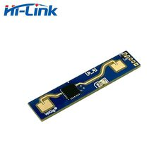
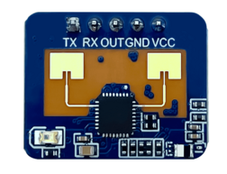
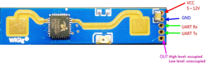
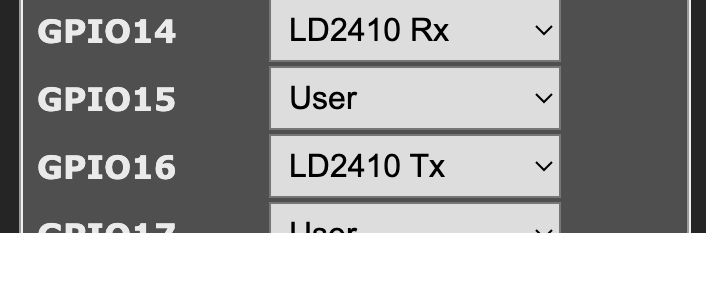
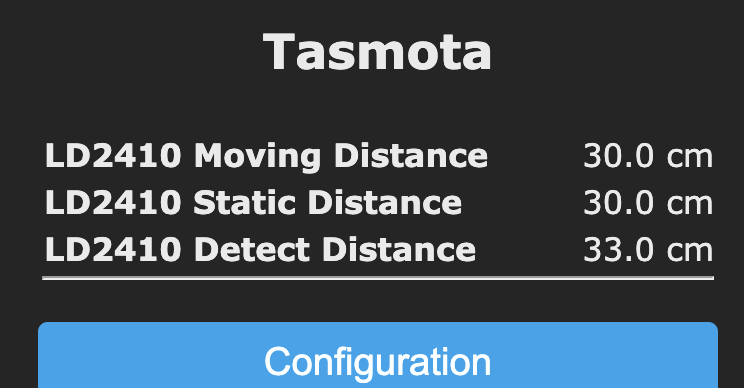
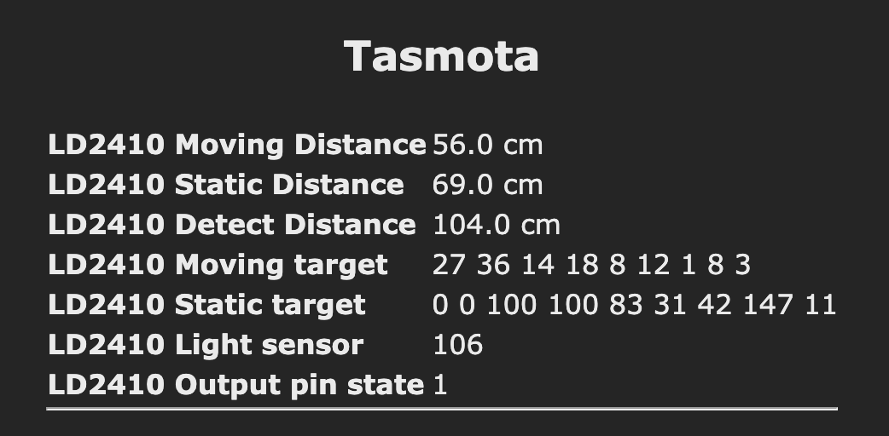

# HLK-LD2410 24GHz mmWave presence sensor

??? failure "This feature is not included in precompiled binaries"

    When [compiling your build](Compile-your-build) add the following to `user_config_override.h`:
    ```c++
    #ifndef USE_LD2410
    #define USE_LD2410
    #endif
    ```

!!! warning "This feature is designed only to work with HLK-LD 2410, HLK-LD2410B and HLK-LD2410C modules. To work with the HLK-LD2410S module see [here](HLK-LD2410S.md)."




## Configuration
### Wiring


| HLK-LD2410(B,C)  | ESP |
|---|---|
|GND   |GND
|VCC   | 5V
|TX   | GPIOx
|RX   | GPIOy
|OUT    | GPIOz

!!! Warning "Warning: The power supply voltage of the module is **5V**, and the power supply capacity of the input power supply is required to be greater than 200mA.<br>**The module IO output level is 3.3V!**"

### Tasmota Settings
In the **_Configuration -> Configure Module_** page assign:

- GPIOx to `LD2410 Tx`
- GPIOy to `LD2410 Rx`
- GPIOz to `Switch` or `Button`

??? example "Settings example"
    

## Usage
Tasmola is ready to read the status packet from the LD2410 module



Console output:
```
12:52:46.234 RSL: SENSOR = {"Time":"2024-11-09T12:52:46","LD2410":{"Distance":[200.0,181.0,144.0],"Energy":[13,100]}}
```

If an object is detected, a report will be sent every second. You can disable sending every second by setting [`SetOption160`](Commands.md#setoption160) to `1`

### Commands

Set factory default settings:
```
LD2410Duration 0
```

Set no-one duration in seconds (default 5):
```
LD2410Duration 1..65535
```

Set moving distance sensitivity for up to 9 gates (at 0.75 meter interval):
```
LD2410MovingSens 50,50,40,30,20,15,15,15,15
```

Set static distance sensitivity for up to 9 gates (at 0.75 meter interval):
```
LD2410StaticSens 0,0,40,40,30,30,20,20,20
```
#### Engineering mode
Start/stop engineering mode:
```
LD2410EngineeringStart
LD2410EngineeringEnd
```

Read last sensors received in engineering mode command and output:
```
LD2410Get
```
```
13:40:21.997 RSL: RESULT = {"LD2410":{"Moving energy":[13,12,10,9,9,8,1,4,4],"Static energy":[0,0,100,100,45,32,147,15,5],"Light":103,"Out_pin":1}}
```

In engineering mode, the main page additionally displays the obtained values for moving and static targets:



!!! info "Light sensor available if installed on board"

### Rules

You can use the LD2410 trigger to create rules, example:
```
rule1 ON LD2410 DO state ENDON
```
!!! warning "If [`SetOption160`](Commands.md#setoption160) is set to `1` rules wii be triggered only in log interval. Set [`SetOption160`](Commands.md#setoption160) to `0` for trigger on detected piople"

