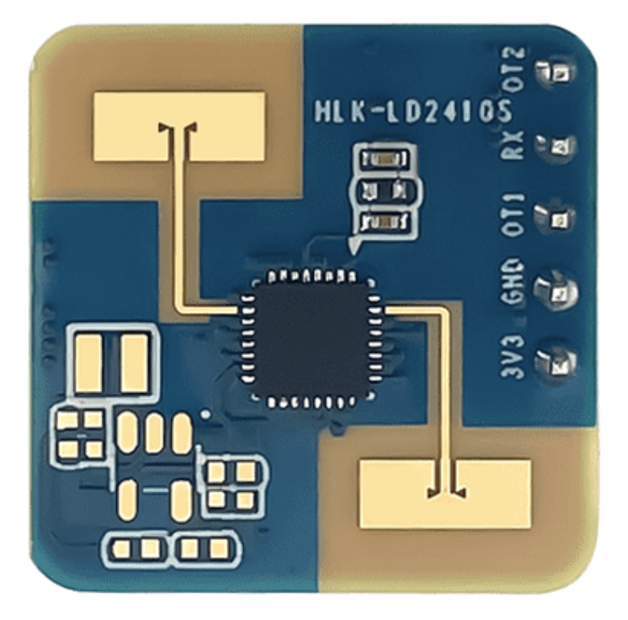
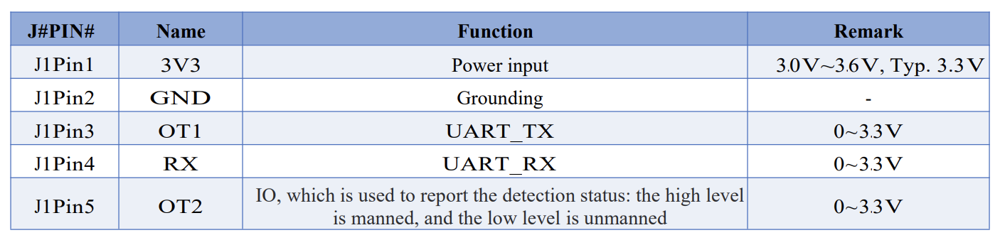
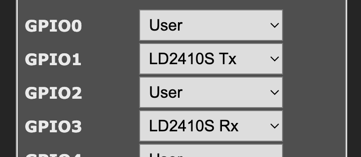
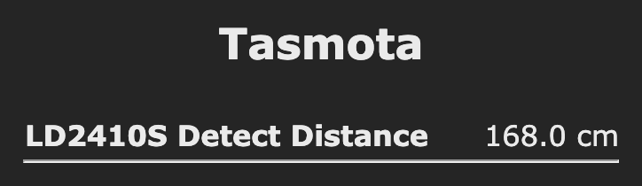
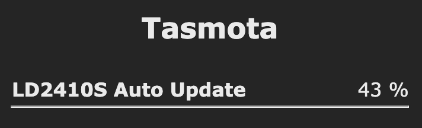

# HLK-LD2410S Low energy 24GHz mmWave presence sensor

??? failure "This feature is not included in precompiled binaries"

    When [compiling your build](Compile-your-build) add the following to `user_config_override.h`:
    ```c++
    #ifndef USE_LD2410S
    #define USE_LD2410S
    #endif
    ```

!!! warning "This feature is designed only to work with HLK-LD 2410S module. To work with the HLK-LD2410(B,C) modules see [here](HLK-LD2410.md)."



## Configuration
### Wiring


| HLK-LD2410S  | ESP |
|---|---|
|GND   |GND
|3V3   | 3.3V
|OT1   | GPIOx
|RX   | GPIOy
|OT2    | GPIOz

!!! Warning "Warning: The power supply voltage of the module is **3.3V**"

### Tasmota Settings
In the **_Configuration -> Configure Module_** page assign:

- GPIOx to `LD2410S Rx`
- GPIOy to `LD2410S Tx`
- GPIOz to `Switch` or `Button`

??? example "Settings example"
    

## Usage
Tasmola is ready to read the status packet from the LD2410S module



Console output:
```
15:46:09.267 RSL: SENSOR = {"Time":"2024-11-09T15:46:09","LD2410S":{"Distance":196.0, "People":2}}
```
Where **_People_** values: 0/1 - not detected, 2/3 - detected

### Commands

- **Reread common, trigger and hold parameters from device (_use this command after change module settings or after `LD2410S_AutoUpdate` command_):**
```
LD2410S_ReRead
```
- **Show previously received parameters on startup or after `LD2410S_ReRead` command:**
```
LD2410S_Parameters
```
and result:
```
15:55:56.399 RSL: RESULT = {"LD2410S_Common":{"Near Door": 0,"Far Door":16,"Hold Time":10,"Status freq":10,"Distance freq":10,"Response speed":5},"Trigger values":[47,46,37,35,31,30,31,32,31,30,29,31,30,29,27,29],"Hold values":[45,45,34,32,30,29,30,31,30,29,28,30,29,28,26,28]}
```
- **Set common parameters: near door, far door, hold_time, status_freq, distance_freq, response_speed (see [manual](https://www.hlktech.net/)):**
```
LD2410S_SetCommon 0-16,1-16,10-120,5-80,5-80,5/10
```
- **Set trigger values (the value at which the status changes to "people"):**
```
LD2410S_SetTrigger n,n1..n16
```
- **Set hold values (the value of holding the "people" status):**
```
LD2410S_SetHold n,n1..n16
```
- **Set device output mode `0`-short, `1`-normal:**
```
LD2410S_Out_Mode 0/1
```
_Console output in short mode:_
```
16:09:49.247 RSL: SENSOR = {"Time":"2024-11-09T16:09:49","LD2410S":{"Distance":0.0, "People":0}}
```
_Console output in normal mode:_
```
16:22:59.255 RSL: SENSOR = {"Time":"2024-11-09T16:22:59","LD2410S":{"Distance":187.0, "People":2, "Energy":[0,0,209,217,86,131,104,141,80,128,116,253,251,209,51,232]}}
```
- **Start autoupdate trigger and hold thresholds/ Params: trigger_scale,retension_factor,scan_time:**
```
LD2410S_AutoUpdate 2,1,60
```
_Concole output:_
```
16:29:58.239 RSL: SENSOR = {"Time":"2024-11-09T16:29:58","LD2410S":{"Update threshold":"0%"}}
16:29:59.261 RSL: SENSOR = {"Time":"2024-11-09T16:29:59","LD2410S":{"Update threshold":"2%"}}
16:30:00.277 RSL: SENSOR = {"Time":"2024-11-09T16:30:00","LD2410S":{"Update threshold":"3%"}}
...
16:31:01.230 RSL: SENSOR = {"Time":"2024-11-09T16:31:01","LD2410S":{"Update threshold":"100%"}}
```
And in main web page:<br>

- **Start reports every seconds (need for tuning in normal output mode):**
```
LD2410S_Follow 0/1
```

### Rules

You can use the LD2410S trigger to create rules, example:
```
rule1 ON LD2410S#Distance >0 DO state ENDON
rule2 ON LD2410S#People =2 DO state ENDON
```
