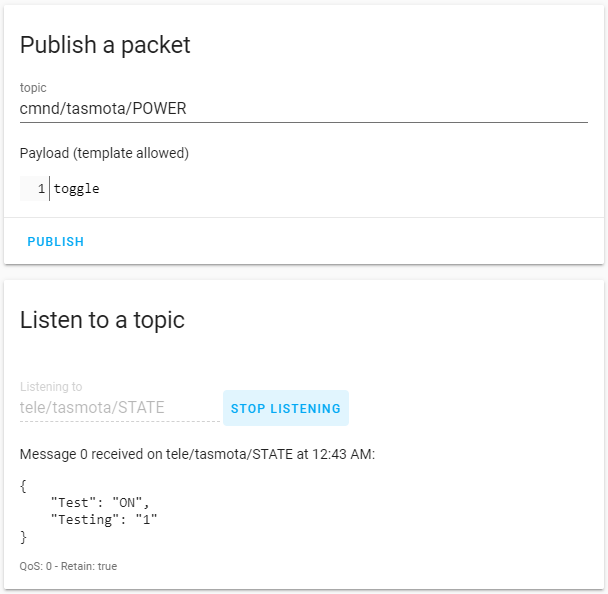
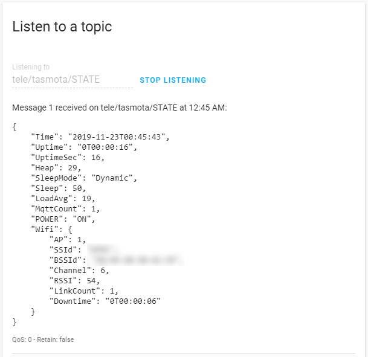
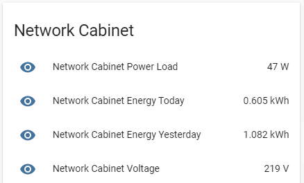

# Home Assistant

[Home Assistant](https://home-assistant.io/) (HA) is an open source home automation solution that puts local control and privacy first.

Tasmota communicates with Home Assistant using MQTT. Before going any further, make sure MQTT is [properly set up in Home Assistant](https://www.home-assistant.io/docs/mqtt/broker) and [in Tasmota](MQTT). 

First, test if the two can communicate. 

In Home Assistant web UI go to **Developer Tools - MQTT**. Subscribe to `tele/topic%/STATE` and click **START LISTENING**. You should see a JSON response from your device.

To test control of a relay or light, as **Publish a packet topic** enter `cmnd/%topic%/POWER` with payload `toggle`. When you click **PUBLISH** your device should switch state and a JSON response will be visible in **Listen to a topic** window.




Home Assistant has two avenues of adding Tasmota devices:

1. Using MQTT discovery
2. Adding by editing configuration.yaml 

!!! note "After every change to the configuration file you'll need to restart Home Assistant to make it aware of the changes."

If you don't want to use MQTT discovery, skip to [Manual Configuration](#configurationyaml-editing) 

## Automatic Discovery
Home Assistant has a feature called [MQTT discovery](https://www.home-assistant.io/docs/mqtt/discovery/).
With MQTT discovery no user interaction or configuration file editing is needed to add new devices in Home Assistant.

!!! note "Automatic discovery is currently supported for:"

=== "Relays"
    Announced to Home Assistant as [MQTT Switch](https://www.home-assistant.io/integrations/switch.mqtt/).

    To make a relay discovered as "light" in Home Assistant use command [`SetOption30 1`](Commands.md#setoption30)   

    _Alternatively you can configure it manually using [Light Switch](https://www.home-assistant.io/components/light.switch/) integration._

=== "Lights"
    Announced to Home Assistant as [MQTT Light](https://www.home-assistant.io/integrations/light.mqtt/).

    Discovery supports single channel Dimmer as well as multi-channel RGB, RGBW, RGBCCT and CCT lights.
    To have multi-channel PWM instead of a single light entity under Home Assistant use [`SetOption68 1`](Commands.md#setoption68).
    If you have a light with 4 or 5 channels like an `RGBCCT` bulb you may want to use [`SetOption37 128`](Commands.md#setoption37) to have two separated lights, one for RGB and one for White or Temperature management.  

    _Alternatively you can configure it manually using [Light](https://www.home-assistant.io/integrations/light/) integration._

=== "Buttons"
    Announced to Home Assistant as [Automation Trigger](https://www.home-assistant.io/docs/automation/trigger/).

    To have buttons discovered `SetOption73` must be set to `1` and it will automatically start to listen and publish using `/stat/%topic%/BUTTON<x>T` topic.

    Discovery will follow all the possible combinations made using SetOption1, SetOption11 and Setoption13.

=== "Switches"
    Announced to Home Assistant as [MQTT Binary Sensor](https://www.home-assistant.io/integrations/binary_sensor.mqtt/) and/or as a [Automation Trigger](https://www.home-assistant.io/docs/automation/trigger/).

    To have switches discovered `SwitchTopic` must be set to a custom name and it will automatically start to listen and publish using `/stat/%topic%/SWITCH<x>` (binary sensor) or `/stat/%topic%/SWITCH<x>T` (trigger) topics.

    Depending by the `SwitchMode`used, a switch can be a Trigger (`TOGGLE`or `HOLD`), a Binary Sensor (`ON`/`OFF`) or both at the same time.

    Example:  
    When using with `SwitchMode 0` Tasmota will create just one Trigger for `TOGGLE`.  
    When using with `SwitchMode 1` Tasmota will create a `Binary Sensor` with `ON` and `OFF` Payloads.  
    When using with `Switchmode 5` Tasmota will create a `Binary Sensor` with `ON` and `OFF` Payloads and a Trigger for `TOGGLE`.  

    All switchmodes are supported with the sole exception of `SwitchMode11` and `SwitchMode12` able to generate just a `TOGGLE` trigger.

    **When a switch is set to a different topic than `0` is not possible to use `Switch#State` as a trigger for rules.**

Types of devices not listed above (fans, covers, etc) require [manual configuration](#fans)

### Enabling 

For a Tasmota device to be automatically discovered by Home Assistant you need to enable MQTT discovery with command:

```console
SetOption19 1
```

!!! failure "Discovery is not built in to tasmota lite. Use the full version (tasmota.bin) for discovery."

After the automatic discovery feature is enabled a retained MQTT message starting with topic "homeassistant/" is sent to the broker. That message contains your device configuration which will be picked up and used by Home Assistant to automatically add your device.
Tasmota uses the name of the module (or template) to identify the device and it can be easily altered to a more meaningful name directly on the Home Assistant integration page after the first discovery.

**Each time the device is restarted, the configuration will be sent again to Home Assistant**

Enabling discovery will automatically change some SetOptions to suit the new configuration:

**`SetOption4` to `0`**   
Return MQTT response always as `RESULT` and not as %COMMAND% topic

**`SetOption17` to `1`**
  Show Color as a comma-separated decimal string instead of hexadecimal

**`SetOption59` to `1`**
Send `tele/%topic%/STATE` in addition to `stat/%topic%/RESULT` for commands `State`, `Power` and any command causing a light to be turned on.

!!! note "For every change you made on your device configuration you will need a reboot or use `SetOption19 1` again to see the changes under Home Assistant."

!!! warning
     Please be advised that not all sensors can be correctly rendered under Home Assistant. In those cases a fallback function will be used to create a generic sensor and the correct operation is not guaranteed.

### Disabling 
To disable MQTT discovery and remove the retained message, execute `SetOption19 0`.  
The "homeassistant/" topic is removed from Home Assistant and MQTT broker. 

### Finalizing Setup
All automatically discovered entities will show up under:  
**Configuration -> Integrations -> Configured -> MQTT**  

The entities are grouped by hardware, example for a Sonoff Basic:


By clicking on one of the entities, and then on the cog wheel, name in Home Assistant and `entity_id` can be customized:


For every device discovered with `SetOption19` an informative sensor will be created automatically:


[Home Assistant](https://home-assistant.io/) (Hass) is an open-source home automation platform running on Python 3.

## configuration.yaml editing

The advantage of manually configuring a device is that you maintain control of all aspects of the configuration.

Home Assistant [configuration](https://www.home-assistant.io/docs/configuration/) is done by editing the `configuration.yaml` file.

!!! warning "All the configurations are just examples."
  You need to be familiar with Home Assistant's configuration structure and procedures.   
  Straight copy paste of the given examples into configuration.yaml will not work for you. 

If you are using a localized (non-english) version be sure to check the correct spelling and cases for values:

  * 'payload_available' 
  * 'payload_not_available'
  * 'payload_on'
  * 'payload_off'

!!! tip
    If you want the power states to be persistent in Tasmota and Home Assistant set `PowerRetain 1` instead of using `retain: true` in Home Assistant

### Switches
Add in Home Assistant using the [MQTT Switch](https://www.home-assistant.io/components/switch.mqtt/) integration.

**Required Commands**   
`SetOption59 1` - enables sending of tele/%topic%/STATE on POWER and light related commands

!!! example "Single Switch"

```yaml
switch:
  - platform: mqtt
    name: "Tasmota Switch"
    state_topic: "stat/tasmota/RESULT"  
    value_template: "{{ value_json.POWER }}"
    command_topic: "cmnd/tasmota/POWER"
    payload_on: "ON"
    payload_off: "OFF"
    availability_topic: "tele/tasmota/LWT"
    payload_available: "Online"
    payload_not_available: "Offline"
    qos: 1
    retain: false
```


!!! example "Multiple Switches"
When a device has more than one relay you need to create a new switch for each relay. For each relay use corresponding POWER<x\> (POWER1, POWER2, etc)  or if [SetOption26](Commands.md#setoption26) is enabled)

```yaml
switch:
  - platform: mqtt
    name: "Tasmota Switch 1"
    state_topic: "stat/tasmota/RESULT"  
    value_template: "{{ value_json.POWER1 }}"
    command_topic: "cmnd/tasmota/POWER1"
    payload_on: "ON"
    payload_off: "OFF"
    availability_topic: "tele/tasmota/LWT"
    payload_available: "Online"
    payload_not_available: "Offline"
    qos: 1
    retain: false
  - platform: mqtt
    name: "Tasmota Switch 2"
    state_topic: "stat/tasmota/RESULT"  
    value_template: "{{ value_json.POWER2 }}"
    command_topic: "cmnd/tasmota/POWER2"
    payload_on: "ON"
    payload_off: "OFF"
    availability_topic: "tele/tasmota/LWT"
    payload_available: "Online"
    payload_not_available: "Offline"
    qos: 1
    retain: false
  - platform: mqtt
    name: "Tasmota Switch 3"
    state_topic: "stat/tasmota/RESULT"  
    value_template: "{{ value_json.POWER3 }}"
    command_topic: "cmnd/tasmota/POWER3"
    payload_on: "ON"
    payload_off: "OFF"
    availability_topic: "tele/tasmota/LWT"
    payload_available: "Online"
    payload_not_available: "Offline"
    qos: 1
    retain: false
```

!!! example "Dimmer"
Used for dimmers and dimmable lights (single channel lights).

```yaml
light:
  - platform: mqtt
    name: "Dimmer"
    command_topic: "cmnd/tasmota/POWER"
    state_topic: "tele/tasmota/STATE"
    state_value_template: "{{value_json.POWER}}"
    availability_topic: "tele/tasmota/LWT"
    brightness_command_topic: "cmnd/tasmota/Dimmer"
    brightness_state_topic: "tele/tasmota/STATE"
    brightness_scale: 100
    on_command_type: "brightness"
    brightness_value_template: "{{value_json.Dimmer}}"
    payload_on: "ON"
    payload_off: "OFF"
    payload_available: "Online"
    payload_not_available: "Offline"
    qos: 1
    retain: false
```

!!! tip
    If you are using your device to control a light, you may want to use [`MQTT Light`](https://www.home-assistant.io/components/light.mqtt/) integration instead.   
Simply replace `switch:` with `light:` in the configuration keeping everything else the same.

### Lights
Add in Home Assistant using the [MQTT Light](https://www.home-assistant.io/components/light.mqtt/) integration.

**Required Commands**   
`SetOption17 1` - enables decimal colors\
`SetOption59 1` - enables sending of tele/%topic%/STATE on POWER and light related commands

**Optional Commands**   
`Fade on` - makes transitions smoother   
`Speed 5` - sets transition speed

!!! example "Dimming"
Used for dimmers and dimmable lights (single channel lights).

```yaml
light:
  - platform: mqtt
    name: "Dimmer"
    command_topic: "cmnd/tasmota/POWER"
    state_topic: "tele/tasmota/STATE"
    state_value_template: "{{value_json.POWER}}"
    availability_topic: "tele/tasmota/LWT"
    brightness_command_topic: "cmnd/tasmota/Dimmer"
    brightness_state_topic: "tele/tasmota/STATE"
    brightness_scale: 100
    on_command_type: "brightness"
    brightness_value_template: "{{value_json.Dimmer}}"
    payload_on: "ON"
    payload_off: "OFF"
    payload_available: "Online"
    payload_not_available: "Offline"
    qos: 1
    retain: false
```

!!! example "RGB Light"

```yaml
light:
  - platform: mqtt
    name: "RGB Light"
    command_topic: "cmnd/tasmota/POWER"
    state_topic: "tele/tasmota/STATE"
    state_value_template: "{{value_json.POWER}}"
    availability_topic: "tele/tasmota/LWT"
    brightness_command_topic: "cmnd/tasmota/Dimmer"
    brightness_state_topic: "tele/tasmota/STATE"
    brightness_scale: 100
    on_command_type: "brightness"
    brightness_value_template: "{{value_json.Dimmer}}"
    rgb_command_topic: "cmnd/tasmota/Color2"
    rgb_state_topic: "tele/tasmota/STATE"
    rgb_value_template: "{{value_json.Color.split(',')[0:3]|join(',')}}"
    effect_command_topic: "cmnd/tasmota/Scheme"
    effect_state_topic: "tele/tasmota/STATE"
    effect_value_template: "{{value_json.Scheme}}"
    effect_list:
      - 0
      - 1
      - 2
      - 3
      - 4
    payload_on: "ON"
    payload_off: "OFF"
    payload_available: "Online"
    payload_not_available: "Offline"
    qos: 1
    retain: false
```
!!! example "RGB+W Light"

```yaml
light:
  - platform: mqtt
    name: "RGB+W Light"
    command_topic: "cmnd/tasmota/POWER"
    state_topic: "tele/tasmota/STATE"
    state_value_template: "{{value_json.POWER}}"
    availability_topic: "tele/tasmota/LWT"
    brightness_command_topic: "cmnd/tasmota/Dimmer"
    brightness_state_topic: "tele/tasmota/STATE"
    brightness_scale: 100
    on_command_type: "brightness"
    brightness_value_template: "{{value_json.Dimmer}}"
    white_value_state_topic: "tele/tasmota/STATE"
    white_value_command_topic: "cmnd/tasmota/White"
    white_value_scale: 100
    white_value_template: "{{ value_json.Channel[3] }}"
    rgb_command_topic: "cmnd/tasmota/Color2"
    rgb_state_topic: "tele/tasmota/STATE"
    rgb_value_template: "{{value_json.Color.split(',')[0:3]|join(',')}}"
    effect_command_topic: "cmnd/tasmota/Scheme"
    effect_state_topic: "tele/tasmota/STATE"
    effect_value_template: "{{value_json.Scheme}}"
    effect_list:
      - 0
      - 1
      - 2
      - 3
      - 4
    payload_on: "ON"
    payload_off: "OFF"
    payload_available: "Online"
    payload_not_available: "Offline"
    qos: 1
    retain: false
```
!!! example "RGB+CCT Light"
Also known as RGBWW or 5 channel lights

```yaml
light:
  - platform: mqtt
    name: "RGBCCT Light"
    command_topic: "cmnd/tasmota/POWER"
    state_topic: "tele/tasmota/STATE"
    state_value_template: "{{value_json.POWER}}"
    availability_topic: "tele/tasmota/LWT"
    brightness_command_topic: "cmnd/tasmota/Dimmer"
    brightness_state_topic: "tele/tasmota/STATE"
    brightness_scale: 100
    on_command_type: "brightness"
    brightness_value_template: "{{value_json.Dimmer}}"
    color_temp_command_topic: "cmnd/tasmota/CT"
    color_temp_state_topic: "tele/tasmota/STATE"
    color_temp_value_template: "{{value_json.CT}}"
    rgb_command_topic: "cmnd/tasmota/Color2"
    rgb_state_topic: "tele/tasmota/STATE"
    rgb_value_template: "{{value_json.Color.split(',')[0:3]|join(',')}}"
    effect_command_topic: "cmnd/tasmota/Scheme"
    effect_state_topic: "tele/tasmota/STATE"
    effect_value_template: "{{value_json.Scheme}}"
    effect_list:
      - 0
      - 1
      - 2
      - 3
      - 4
    payload_on: "ON"
    payload_off: "OFF"
    payload_available: "Online"
    payload_not_available: "Offline"
    qos: 1
    retain: false
```

!!! example "Addressable LED"

Applies only to [WS281x](WS2812B-and-WS2813) lights. 

```yaml
light:
  - platform: mqtt
    name: "Addressable LED"
    command_topic: "cmnd/tasmota/POWER"
    state_topic: "stat/tasmota/STATE"
    state_value_template: "{{value_json.POWER}}"
    availability_topic: "tele/tasmota/LWT"
    brightness_command_topic: "cmnd/tasmota/Dimmer"
    brightness_state_topic: "stat/tasmota/STATE"
    brightness_scale: 100
    on_command_type: "brightness"
    brightness_value_template: "{{value_json.Dimmer}}"
    rgb_command_topic: "cmnd/tasmota/Color2"
    rgb_state_topic: "tele/tasmota/STATE"
    rgb_value_template: "{{value_json.Color.split(',')[0:3]|join(',')}}"
    effect_command_topic: "cmnd/tasmota/Scheme"
    effect_state_topic: "stat/tasmota/STATE"
    effect_value_template: "{{value_json.Scheme}}"
    effect_list:
      - 0
      - 1
      - 2
      - 3
      - 4
      - 5
      - 6
      - 7
      - 8
      - 9
      - 10
      - 11
      - 12
    payload_on: "ON"
    payload_off: "OFF"
    payload_available: "Online"
    payload_not_available: "Offline"
    qos: 1
    retain: false
```

!!! example "No SetOption17 RGB"

 If you don't want to use `SetOption17 1` you can change
  ```yaml
  rgb_value_template: "{{value_json.Color.split(',')[0:3]|join(',')}}"
  ```
to
```yaml
  rgb_value_template: "{{ (value_json.Color[0:2]|int(base=16),value_json.Color[2:4]|int(base=16),value_json.Color[4:6]|int(base=16)) | join(',')}}"
```
<!-- tabs:end -->

### Sensors
Add in Home Assistant using the [MQTT Sensor](https://www.home-assistant.io/components/sensor.mqtt/) integration.

A sensor will send its data in set intervals defined by [`TelePeriod`](Commands.md#teleperiod) (default every 5 minutes).

<!-- tabs:start -->

!!! example "Temperature"

Check your sensor name in Tasmota and change accordingly. This example uses the DHT22 sensor.

```yaml
sensor:
  - platform: mqtt
    name: "Tasmota Temperature"
    state_topic: "tele/tasmota/SENSOR"
    value_template: "{{ value_json['DHT22'].Temperature }}"
    unit_of_measurement: "°C"  # "F" if using Fahrenheit
    availability_topic: "tele/tasmota/LWT"
    payload_available: "Online"
    payload_not_available: "Offline"
    device_class: temperature
```

!!! example "Humidity"

Check your sensor name in Tasmota and change accordingly. This example uses the DHT22 sensor.

```yaml
sensor:
  - platform: mqtt
    name: "Tasmota Humidity"
    state_topic: "tele/tasmota/SENSOR"
    value_template: "{{ value_json['DHT22'].Humidity }}"
    unit_of_measurement: "%"
    availability_topic: "tele/tasmota/LWT"
    payload_available: "Online"
    payload_not_available: "Offline"
    device_class: humidity
```

!!! example "Pressure"
Check your sensor name in Tasmota and change accordingly. This example uses the BMP280 sensor.

```yaml
sensor:
  - platform: mqtt
    name: "Tasmota Pressure"
    state_topic: "tele/tasmota/SENSOR"
    value_template: "{{ value_json.BMP280.Pressure }}"
    unit_of_measurement: "hPa"
    device_class: pressure
```
Change unit_of_measurement to `"mmHg"` if [`SetOption24 1`](Commands.md#setoption24)

!!! example "Wi-Fi Signal Quality"

Monitor the relative Wi-Fi signal quality of a device.

```yaml
sensor:
  - platform: mqtt
    name: "Tasmota Wi-Fi Quality"
    state_topic: "tele/tasmota/STATE"
    unit_of_measurement: "%"
    value_template: "{{value_json['Wifi'].RSSI }}"
    availability_topic: "tele/tasmota/LWT"
    payload_available: "Online"
    payload_not_available: "Offline"
    device_class: signal_strength
```

### Power Monitoring
</img>

Add in Home Assistant using the [MQTT Sensor](https://www.home-assistant.io/components/sensor.mqtt/) integration.

Power monitoring sensors will send their data in set intervals defined by [`TelePeriod`](Commands.md#teleperiod) (default every 5 minutes).

To get all the data in Home Assistant requires multiple sensors which you can later group to your liking in [Lovelace UI](https://www.home-assistant.io/lovelace/)

<!-- tabs:start -->

!!! example "Power Monitoring"

```yaml
sensor:
  - platform: mqtt
    name: "Energy Today"
    state_topic: "tele/tasmota/SENSOR"
    value_template: '{{ value_json["ENERGY"]["Today"] }}'
    unit_of_measurement: "kWh"
  - platform: mqtt
    name: "Power"
    state_topic: "tele/tasmota/SENSOR"
    value_template: '{{ value_json["ENERGY"]["Power"] }}'
    unit_of_measurement: "W"
  - platform: mqtt
    name: "Voltage"
    state_topic: "tele/tasmota/SENSOR"
    value_template: '{{ value_json["ENERGY"]["Voltage"] }}'
    unit_of_measurement: "V"
  - platform: mqtt
    name: "Current"
    state_topic: "tele/tasmota/SENSOR"
    value_template: '{{ value_json["ENERGY"]["Current"] }}'
    unit_of_measurement: "A"
```
!!! tip
    For additional sensors use "Total";"Yesterday";"Period","ApparentPower","ReactivePower";"Factor" in `value_template` string

<!-- AGAIN WITH THIS MANUAL UPDATE MALARKEY

#### Manual updates

The manual message retrieved with command ``Status 8`` or ``cmnd/pow1/status 8`` will show:
```
stat/pow1/STATUS8 = {"StatusPWR":{"Yesterday":0.002, "Today":0.002, "Power":4, "Factor":0.37, "Voltage":227, "Current":0.056}}
```
The HA configuration for Power Factor would then be:
```yaml
# Example configuration.yaml entry
sensor:
  - platform: mqtt
    name: "Power Factor"
    state_topic: "stat/pow1/STATUS8"
    value_template: "{{ value_json.StatusPWR.Factor }}"

```
 -->
<!-- tabs:end -->

[Video tutorial](https://www.youtube.com/watch?v=ktHQrhAF8VQ) on a power monitoring plug setup by Digiblur

### Binary Sensors
Add in Home Assistant using the [MQTT Binary Sensor](https://www.home-assistant.io/components/binary_sensor.mqtt/) integration.

!!! example "PIR Sensor"

Used for a configured [PIR Sensor](PIR-Motion-Sensors) and requires this rule:

**Required Commands**
```console
Rule1 on Switch1#State=1 do Publish stat/hall/MOTION ON endon on Switch1#State=1 do Publish stat/hall/MOTION OFF endon
Rule1 1
```
```yaml
binary_sensor:
  - platform: mqtt
    name: "Tasmota Motion Sensor"
    state_topic: "stat/tasmota/MOTION"
    availability_topic: "tele/tasmota/LWT"
    payload_available: "Online"
    payload_not_available: "Offline"
    device_class: motion
    qos: 1
```

!!! example "Door Sensor"

Requires a reed switch configured in Tasmota.

**Required Commands**
```console
Rule1 on Switch1#State=1 do Publish stat/hall/MOTION ON endon on Switch1#State=1 do Publish stat/hall/MOTION OFF endon
Rule1 1
```
```yaml
binary_sensor:
  - platform: mqtt
    name: "Tasmota Motion Sensor"
    state_topic: "stat/tasmota/MOTION"
    availability_topic: "tele/tasmota/LWT"
    payload_available: "Online"
    payload_not_available: "Offline"
    device_class: door   # also: window, garage_door or opening
    qos: 1
```

!!! example "RF Bridge"

An RF door sensor configured with an RF receiver in Tasmota.
```yaml
binary_sensor:
  - platform: mqtt
    name: "RF bridge rfkey"
    payload_on: "1"
    payload_off: "0"
    device_class: opening
    state_topic: "tele/tasmota/RESULT"
    value_template: '{{ value_json.RfReceived.RfKey }}'
```
<!-- tabs:end -->

### Fans
Add in Home Assistant using the [MQTT Fan](https://www.home-assistant.io/components/fan.mqtt/) integration.

<!-- tabs:start -->

!!! example "Fan"

Derived from [#2839](https://github.com/arendst/Tasmota/issues/2839) by @kbickar and @finity69x2


```yaml
# Example configuration.yaml entry
fan:
- platform: mqtt  
    name: "Tasmota Fan"
    command_topic: "cmnd/tasmota/FanSpeed"
    speed_command_topic: "cmnd/tasmota/FanSpeed"    
    state_topic: "stat/tasmota/RESULT"
    speed_state_topic: "stat/tasmota/RESULT"
    state_value_template: >
      
        04
      
        04
      
    speed_value_template: "{{ value_json.FanSpeed }}"
    availability_topic: tele/tasmota/LWT
    payload_off: "0"
    payload_on: "4"
    payload_low_speed: "1"
    payload_medium_speed: "2"
    payload_high_speed: "3"
    payload_available: Online
    payload_not_available: Offline
    speeds:
      - off
      - low
      - medium
      - high
```
<!-- tabs:end -->

### Device Specific

<!-- tabs:start -->

!!! example "iFan02"
Combination of configs found in issue 
[#2839](https://github.com/arendst/Tasmota/issues/2839)
and Home Assistant forum thread 
[Sonoff IFan02 (Tasmota) MQTT Fan](https://community.home-assistant.io/t/sonoff-ifan02-tasmota-mqtt-fan/64083).

```yaml
fan:
  - platform: mqtt  
    name: "Pat Ceiling Fan"  
    state_topic: "stat/ifan02/RESULT"
    speed_state_topic: "stat/ifan02/RESULT"
    state_value_template: >
        
          02
        
          02
        
    speed_value_template: "{{ value_json.FanSpeed }}"
    availability_topic: tele/ifan02/LWT
    payload_available: Online
    payload_not_available: Offline
    speed_command_topic: "cmnd/ifan02/FanSpeed"
    payload_low_speed: "1"
    payload_medium_speed: "2"
    payload_high_speed: "3"
    command_topic: "cmnd/ifan02/FanSpeed"
    payload_off: "0"
    payload_on: "2"
    qos: 1
    retain: false
    speeds:
      - low
      - medium
      - high
light:
  - platform: mqtt
    name: "Pat Ceiling Light"
    state_topic: "tele/ifan02/STATE"
    value_template: "{{ value_json.POWER }}"
    command_topic: "cmnd/ifan02/POWER"
    availability_topic: "tele/ifan02/LWT"
    qos: 1
    payload_on: "ON"
    payload_off: "OFF"
    payload_available: "Online"
    payload_not_available: "Offline"
    retain: false
```

!!! example "Sonoff S31"
Configure the device as Sonoff S31, and run:\
`SetOption4 1`   
`SetOption59 1`

```yaml
switch:
  - platform: mqtt
    name: "s31 power"
    state_topic: "tele/s31/STATE"
    value_template: "{{ value_json.POWER }}"
    command_topic: "cmnd/s31/POWER"
    availability_topic: "tele/s31/LWT"
    qos: 1
    payload_on: "ON"
    payload_off: "OFF"
    payload_available: "Online"
    payload_not_available: "Offline"
    retain: false

sensor:
  - platform: mqtt
    name: "s31 Voltage"
    state_topic: "tele/s31/SENSOR"
    value_template: "{{ value_json['ENERGY'].Voltage }}"
    unit_of_measurement: "V"
    availability_topic: "tele/s31/LWT"
    qos: 1
    payload_available: "Online"
    payload_not_available: "Offline"
  - platform: mqtt
    name: "s31 Current"
    state_topic: "tele/s31/SENSOR"
    value_template: "{{ value_json['ENERGY'].Current | round(2) }}"
    unit_of_measurement: "A"
    availability_topic: "tele/s31/LWT"
    qos: 1
    payload_available: "Online"
    payload_not_available: "Offline"
  - platform: mqtt
    name: "s31 Power"
    state_topic: "tele/s31/SENSOR"
    value_template: "{{ value_json['ENERGY'].Power }}"
    unit_of_measurement: "W"
    availability_topic: "tele/s31/LWT"
    qos: 1
    payload_available: "Online"
    payload_not_available: "Offline"
    device_class: power
  - platform: mqtt
    name: "s31 Power Factor"
    state_topic: "tele/s31/SENSOR"
    value_template: "{{ value_json['ENERGY'].Factor }}"
    availability_topic: "tele/s31/LWT"
    qos: 1
    payload_available: "Online"
    payload_not_available: "Offline"
  - platform: mqtt
    name: "s31 Energy Today"
    state_topic: "tele/s31/SENSOR"
    value_template: "{{ value_json['ENERGY'].Today }}"
    unit_of_measurement: "kWh"
    availability_topic: "tele/s31/LWT"
    qos: 1
    payload_available: "Online"
    payload_not_available: "Offline"
  - platform: mqtt
    name: "s31 Energy Yesterday"
    state_topic: "tele/s31/SENSOR"
    value_template: "{{ value_json['ENERGY'].Yesterday }}"
    unit_of_measurement: "kWh"
    availability_topic: "tele/s31/LWT"
    qos: 1
    payload_available: "Online"
    payload_not_available: "Offline"
  - platform: mqtt
    name: "s31 Energy Total"
    state_topic: "tele/s31/SENSOR"
    value_template: "{{ value_json['ENERGY'].Total }}"
    unit_of_measurement: "kWh"
    availability_topic: "tele/s31/LWT"
    qos: 1
    payload_available: "Online"
    payload_not_available: "Offline"
```

<!-- tabs:end -->

### Zigbee Devices

<!-- tabs:start -->

!!! example "Dimmable Light"
This configuration is for a dimmable light reporting on `0xE1F9` using endpoint 1, cluster 8 for brightness. `ZbRead` part in the template is needed to always update the brightness values.

```yaml
# Example configuration.yaml entry
light:
  - platform: mqtt
    schema: template
    name: "Fire Light"
    command_topic: "cmnd/zigbee-gateway/Backlog"
    state_topic: "tele/zigbee-gateway/SENSOR"
    command_on_template: >
        
        ZbSend { "device":"0xE1F9", "send":{"Dimmer":{{ brightness }} } }; ZbSend { "device":"0xE1F9", "send":{"Power":true} }; delay 20; ZbRead { "device":"0xE1F9", "endpoint":1, "cluster":8, "read":0 }
        
        ZbSend { "device":"0xE1F9", "send":{"Power":true} }; delay 20; ZbRead { "device":"0xE1F9", "endpoint":1, "cluster":8, "read":0 }
        
    command_off_template: 'ZbSend { "device":"0xE1F9", "send":{"Power":false} }; delay 20; ZbRead { "device":"0xE1F9", "endpoint":1, "cluster":8, "read":0 }'
    state_template: >
        
        
        on
        
        off
        
        
        {{ states('light.fire_light') }}
        
    brightness_template: >
        
        {{ value_json['ZbReceived']['0xE1F9'].Dimmer | int }}
        
        {{ state_attr('light.fire_light', 'brightness') | int }}
        
```

!!! example "Water Leak Sensor"
This specific configuration is for Xiaomi Aqara Water Leak sensor reporting on `0x099F`.

```yaml
# Example configuration.yaml entry
binary_sensor:
  - platform: mqtt
    name: "Water Leak"
    state_topic: "tele/zigbee-gateway/SENSOR"
    value_template: >
      
      
      ON
      
      OFF
      
      
      {{ states('binary_sensor.water_leak') }}
      
    availability_topic: "tele/zigbee-gateway/LWT"
    payload_available: "Online"
    payload_not_available: "Offline"
    qos: 1
    device_class: moisture
```

!!! example "Enable join switch"

```yaml
- platform: mqtt
  name: Zigbee2Tasmota enable join
  state_topic: "tele/zigbee/RESULT"
  command_topic: "cmnd/zigbee/ZbPermitJoin" 
  payload_on: "1"
  payload_off: "0"
  state_on: "Enable Pairing mode for 60 seconds"
  state_off: "off"
  optimistic: false
  qos: 1
  retain: false
  value_template: '{{value_json.ZbState.Message }}'
  icon: mdi:zigbee
```
   
<!-- tabs:end -->

## Useful Automations

!!! example "Extended device information"

Wi-Fi signal quality can be added as a parameter to any previous configuration by appending this section to the existing configuration yaml

```yaml
    json_attributes_topic: "tele/tasmota/STATE"
    json_attributes_template: "{{ value_json.Wifi | tojson }}"
```

!!! example "Sync Power State"

When MQTT broker or Home Assistant is restarted, or there is a WiFi outage, Tasmota device states may not be synced with Home Assistant. Use this automation to keep your devices in sync, including power state, *immediately* after Home Assistant is started.

```yaml
automation:
  - id: Sync Tasmota states
    alias: Sync Tasmota states
    initial_state: true
    trigger:
      platform: homeassistant
      event: start
    action:
    # sync state for devices with default fulltopics
    - service: mqtt.publish
      data:
        topic: cmnd/tasmotas/state
        payload: ''
    # sync state for autodiscovery devices
    - service: mqtt.publish
      data:
        topic: tasmotas/cmnd/state
        payload: ''
```

To sync a single TuyaMCU device states add this block with your %topic% to the automation. !!! bug 
    You could use `tasmotas` but SerialSend might cause issues on other devices so proceed with caution.

```yaml
    - service: mqtt.publish
      data:
        topic: cmnd/%topic%/serialsend5
        payload: 55aa0001000000
```

Sync Zigbee device states. Add this block with your %topic% and your Zigbee device name, endpoint and cluster.

!!! example "Example for a dimmable light"
```yaml
    - service: mqtt.publish
      data:
        topic: cmnd/zigbee-gateway/Backlog
        payload: ZbRead { "device":"0xE1F9", "endpoint":1, "cluster":6, "read":0 }; delay 5; ZbRead { "device":"0xE1F9", "endpoint":1, "cluster":8, "read":0 }
```

!!! example "Report Firmware Version"

Add a sensor like below for each Tasmota device whose firmware version you want to track.

```yaml
# Example configuration.yaml entry
sensor:
  - platform: mqtt
    name: "Tasmota"
    state_topic: "stat/tasmota/STATUS2"
    value_template: "{{value_json['StatusFWR'].Version }}"
    availability_topic: "tele/tasmota/LWT"
    payload_available: "Online"
    payload_not_available: "Offline"
    qos: 0
```

Automation to have each device report firmware version on Home Assistant reboot. 
*You can manually trigger this automation from Home Assistant UI.*

```yaml
automation:
  - alias: "Tasmota Firmware Version Check"
    trigger:
      platform: homeassistant
      event: start
    action:
      - service: mqtt.publish
        data:
          topic: "cmnd/tasmotas/STATUS"
          payload: "2"
```

!!! tip
    If you want all your devices to switch to autodiscovery method go through Developer tools - MQTT by publishing to grouptopic `cmnd/tasmotas/SetOption19` with payload `1`


