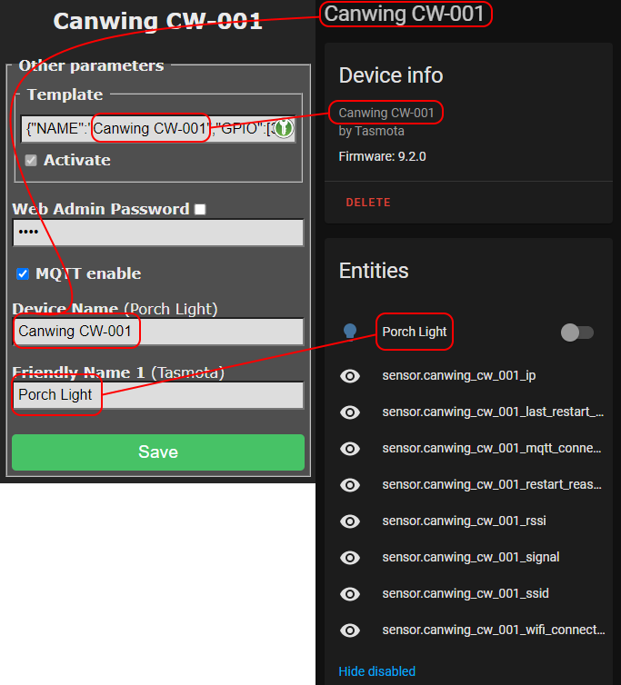

description: Everything about using Tasmota in Home Assistant

# Home Assistant

!!! failure "Home Assistant support is not built in to tasmota-lite.bin. Use the standard tasmota.bin or other binaries that include Home Assistant support." 
    Check the "Program Version" in the webUI **Information** page to make sure which version of Tasmota you're running.

[Home Assistant](https://home-assistant.io/) is an open source home automation solution that puts local control and privacy first.

Tasmota communicates with Home Assistant using MQTT. Before going any further, make sure MQTT is properly set up in [Home Assistant](https://www.home-assistant.io/integrations/mqtt/) and [Tasmota](MQTT). 

Home Assistant has different options of adding Tasmota devices:

1. Official Tasmota integration (**preferred**)
2. Manual configuration by editing configuration.yaml
3. MQTT discovery (_deprecated due to many breaking changes in Home Assistant_)

## Tasmota Integration

Once you configure the [Home Assistant](https://www.home-assistant.io/integrations/tasmota/) integration every new Tasmota device with `SetOption19 0` set, will be discovered automatically. 

All Tasmota devices will be listed in their own Tasmota card in **Configuration - Integrations** menu in Home Assistant.

!!! warning 
    Do not change the FullTopic in order to use this feature. Leave it as default.



Tasmota uses [`DeviceName`](Commands.md#devicename) to name the device in Tasmota integration and [`FriendlyName<x>`](Commands.md#friendlyname) to name power outputs (switch or light entities in HA). 

??? tip "Use templates to change the Module name"
    Setting the [template](Templates) name will change the Module name as well which will be reflected in Home Assistant. This helps in identifying when dealing with a large number of devices. Its nicer than having 10 Sonoff S31's or a bunch of TuyaMCU's"
    

!!! bug 
    If you are using Home Assistant OS [MQTT add-on](https://github.com/home-assistant/addons/tree/master/mosquitto) add the following to the ACL file (user section or general section): `topic write tasmota/discovery/#` to give Tasmota devices write access to the discovery topic.
    
    
### Supported Entities

- Lights as `light` entities.  
  Single channel Dimmers, RGB lights, RGB lights with Color Temperature control and RGB lights with White control are supported.
- Relays as `switch` entities
  With [`SetOption30 1`](Commands.md#setoption30) all relays one the device will be added as light entities instead
- Sensors as `sensor` entities
- Switches as `binary_sensor` entities or `automation triggers` depending on `SwitchMode` used when [`SetOption114 1`](Commands.md#setoption114)
- Buttons as automation triggers when [`SetOption73`](Commands.md#setoption73) is enabled
- Shutters as cover entities. 
  Currently only shutter modes 1 to 4 are supported. Shutter mode 5 and Tuya shutters are not supported.
- Devices configured as iFan02 or iFan03 as fan entities. Tuya fans are not supported.
- Each discovered device will by default add 8 disabled sensors. Enable the ones you need. You cannot delete them, they will simply be re-added on a restart.

Types of devices not listed above still require [manual configuration](#editing-configurationyaml)


!!! warning "Zigbee and Bluetooth devices paired in Tasmota will **NOT** be discovered in Home Assistant"

### Transition from MQTT Discovery

If you have been using `SetOption19 1` for device discovery, setting it to `SetOption19 0` will remove your Tasmota device from the MQTT device list and add it to the Tasmota integrations in HA. They will be treated as new entities in Home Assistant but if you previously used default values they will use the same entity_id as the MQTT discovery devices.

### Removing devices

You cannot as long as Home Assistant support is enabled in your Tasmota binary. Disable the device in Home Assistant instead. There is no setoption to disable all autodiscovery.


Deleting them from Home Assistant while Tasmota device is still active will simply rediscover all the entities. 

If you opt to switch to MQTT Discovery, issuing `SetOption19 1` command will remove all Tasmota entities and add new entities under the MQTT integration.

### Supplemental Custom Discovery Message

You can use [MQTT Discovery](https://www.home-assistant.io/docs/mqtt/discovery/) in HA to add sensors and other entities that are not covered with Tasmota integration and associate them with an already discovered device.

When creating the MQTT discovery JSON add this device identifier `,"device":{"connections":[["mac","%macaddr%"]]}` where %macaddr% is the mac address of the device without `:`. When used in a rule variable `%macaddr%` will be replaced automatically.

There are Home Assistant Blueprints for specific device types to create needed entities at out blueprints GitHub. Look for the icon in templates to one-click import the configuration automation.

<a href="https://github.com/tasmota/blueprints/" title="Blueprints"></a>

Examples of creating custom discovery messages:

- [RFID Tag](https://blakadder.com/tasmota-tags/)
- [PIR sensor](https://blakadder.com/pir-in-tasmota-integration/)

## Editing configuration.yaml

Adding devices manually is done by editing the `configuration.yaml` file and adding appropriate blocks of yaml code to the corresponding section.

!!! note "After every change to the configuration.yaml file you'll need to restart Home Assistant to make it aware of the changes."

The advantage of manually configuring a device is that you maintain control of all aspects of the configuration.

!!! warning "All the configurations are just examples."
  You need to be familiar with Home Assistant's configuration structure and procedures.   
  Straight copy paste of the given examples into configuration.yaml will probably not work for you. 

If you are using a localized (non-english) version be sure to check the correct spelling and cases for values:

  * 'payload_available' 
  * 'payload_not_available'
  * 'payload_on'
  * 'payload_off'

!!! tip
    If you want the power states to be persistent in Tasmota and Home Assistant set `PowerRetain 1` instead of using `retain: true` in Home Assistant

### Switches

Add in Home Assistant using the [MQTT Switch](https://www.home-assistant.io/components/switch.mqtt/) integration.

**Required Commands**   
`SetOption59 1` - enables sending of tele/%topic%/STATE on POWER and light related commands

!!! example "Single Switch"

```yaml
switch:
  - platform: mqtt
    name: "Tasmota Switch"
    state_topic: "stat/tasmota/RESULT"  
    value_template: "{{ value_json.POWER }}"
    command_topic: "cmnd/tasmota/POWER"
    payload_on: "ON"
    payload_off: "OFF"
    availability_topic: "tele/tasmota/LWT"
    payload_available: "Online"
    payload_not_available: "Offline"
    qos: 1
    retain: false
```


!!! example "Multiple Switches"
When a device has more than one relay you need to create a new switch for each relay. For each relay use corresponding POWER<x\> (POWER1, POWER2, etc)  or if [SetOption26](Commands.md#setoption26) is enabled)

```yaml
switch:
  - platform: mqtt
    name: "Tasmota Switch 1"
    state_topic: "stat/tasmota/RESULT"  
    value_template: "{{ value_json.POWER1 }}"
    command_topic: "cmnd/tasmota/POWER1"
    payload_on: "ON"
    payload_off: "OFF"
    availability_topic: "tele/tasmota/LWT"
    payload_available: "Online"
    payload_not_available: "Offline"
    qos: 1
    retain: false
  - platform: mqtt
    name: "Tasmota Switch 2"
    state_topic: "stat/tasmota/RESULT"  
    value_template: "{{ value_json.POWER2 }}"
    command_topic: "cmnd/tasmota/POWER2"
    payload_on: "ON"
    payload_off: "OFF"
    availability_topic: "tele/tasmota/LWT"
    payload_available: "Online"
    payload_not_available: "Offline"
    qos: 1
    retain: false
  - platform: mqtt
    name: "Tasmota Switch 3"
    state_topic: "stat/tasmota/RESULT"  
    value_template: "{{ value_json.POWER3 }}"
    command_topic: "cmnd/tasmota/POWER3"
    payload_on: "ON"
    payload_off: "OFF"
    availability_topic: "tele/tasmota/LWT"
    payload_available: "Online"
    payload_not_available: "Offline"
    qos: 1
    retain: false
```

!!! example "Dimmer"
Used for dimmers and dimmable lights (single channel lights).

```yaml
light:
  - platform: mqtt
    name: "Dimmer"
    command_topic: "cmnd/tasmota/POWER"
    state_topic: "tele/tasmota/STATE"
    state_value_template: "{{value_json.POWER}}"
    availability_topic: "tele/tasmota/LWT"
    brightness_command_topic: "cmnd/tasmota/Dimmer"
    brightness_state_topic: "tele/tasmota/STATE"
    brightness_scale: 100
    on_command_type: "brightness"
    brightness_value_template: "{{value_json.Dimmer}}"
    payload_on: "ON"
    payload_off: "OFF"
    payload_available: "Online"
    payload_not_available: "Offline"
    qos: 1
    retain: false
```

!!! tip
    If you are using your device to control a light, you may want to use [`MQTT Light`](https://www.home-assistant.io/components/light.mqtt/) integration instead.   
Simply replace `switch:` with `light:` in the configuration keeping everything else the same.

### Lights
Add in Home Assistant using the [MQTT Light](https://www.home-assistant.io/components/light.mqtt/) integration.

All configurations require `SetOption59 1` - enables sending of tele/%topic%/STATE on POWER and light related commands

**Optional Commands**   
`Fade on` - makes transitions smoother   
`Speed 5` - set transition speed

!!! example "Dimmable"
    Used with dimmers and dimmable only lights (single channel lights).

```yaml
light:
  - platform: mqtt
    name: "Dimmer"
    command_topic: "cmnd/tasmota/POWER"
    state_topic: "tele/tasmota/STATE"
    state_value_template: "{{ value_json.POWER }}"
    availability_topic: "tele/tasmota/LWT"
    brightness_command_topic: "cmnd/tasmota/Dimmer"
    brightness_state_topic: "tele/tasmota/STATE"
    brightness_scale: 100
    on_command_type: "brightness"
    brightness_value_template: "{{ value_json.Dimmer }}"
    payload_on: "ON"
    payload_off: "OFF"
    payload_available: "Online"
    payload_not_available: "Offline"
    qos: 1
    retain: false
```

!!! example "RGB Light"
    Should also be used with lights using [White Blend Mode](Lights.md#white-blend-mode)

`SetOption17 1` - enables color status in decimals

```yaml
light:
  - platform: mqtt
    name: "RGB Light"
    command_topic: "cmnd/tasmota/POWER"
    state_topic: "tele/tasmota/STATE"
    state_value_template: "{{ value_json.POWER }}"
    availability_topic: "tele/tasmota/LWT"
    brightness_command_topic: "cmnd/tasmota/Dimmer"
    brightness_state_topic: "tele/tasmota/STATE"
    brightness_scale: 100
    on_command_type: "brightness"
    brightness_value_template: "{{ value_json.Dimmer }}"
    rgb_command_topic: "cmnd/tasmota/Color2"
    rgb_state_topic: "tele/tasmota/STATE"
    rgb_value_template: "{{ value_json.Color.split(',')[0:3]|join(',') }}"
    effect_command_topic: "cmnd/tasmota/Scheme"
    effect_state_topic: "tele/tasmota/STATE"
    effect_value_template: "{{ value_json.Scheme }}"
    effect_list:
      - 0
      - 1
      - 2
      - 3
      - 4
    payload_on: "ON"
    payload_off: "OFF"
    payload_available: "Online"
    payload_not_available: "Offline"
    qos: 1
    retain: false
```

!!! example "RGB+W Light"
    In this configuration RGB and white cannot be on at the same time. See [Lights](Lights.md#4-channels-rgbw-lights) for options.

`SetOption17 1` - enables color status in decimals

```yaml
light:
  - platform: mqtt
    name: "RGB+W Light"
    command_topic: "cmnd/tasmota/POWER"
    state_topic: "tele/tasmota/STATE"
    state_value_template: "{{ value_json.POWER }}"
    availability_topic: "tele/tasmota/LWT"
    brightness_command_topic: "cmnd/tasmota/Dimmer"
    brightness_state_topic: "tele/tasmota/STATE"
    brightness_scale: 100
    on_command_type: "brightness"
    brightness_value_template: "{{ value_json.Dimmer }}"
    white_value_state_topic: "tele/tasmota/STATE"
    white_value_command_topic: "cmnd/tasmota/White"
    white_value_scale: 100
    white_value_template: "{{ value_json.White }}"
    rgb_command_topic: "cmnd/tasmota/Color2"
    rgb_state_topic: "tele/tasmota/STATE"
    rgb_value_template: "{{ value_json.Color.split(',')[0:3]|join(',') }}"
    effect_command_topic: "cmnd/tasmota/Scheme"
    effect_state_topic: "tele/tasmota/STATE"
    effect_value_template: "{{value_json.Scheme}}"
    effect_list:
      - 0
      - 1
      - 2
      - 3
      - 4
    payload_on: "ON"
    payload_off: "OFF"
    payload_available: "Online"
    payload_not_available: "Offline"
    qos: 1
    retain: false
```

!!! example "RGB+CCT Light"
    Also called RGBWW, RGBCW or 5 channel lights

`SetOption17 1` - enables color status in decimals

```yaml
light:
  - platform: mqtt
    name: "RGBCCT Light"
    command_topic: "cmnd/tasmota/POWER"
    state_topic: "tele/tasmota/STATE"
    state_value_template: "{{ value_json.POWER }}"
    availability_topic: "tele/tasmota/LWT"
    brightness_command_topic: "cmnd/tasmota/Dimmer"
    brightness_state_topic: "tele/tasmota/STATE"
    brightness_scale: 100
    on_command_type: "brightness"
    brightness_value_template: "{{ value_json.Dimmer }}"
    color_temp_command_topic: "cmnd/tasmota/CT"
    color_temp_state_topic: "tele/tasmota/STATE"
    color_temp_value_template: "{{ value_json.CT }}"
    rgb_command_topic: "cmnd/tasmota/Color2"
    rgb_state_topic: "tele/tasmota/STATE"
    rgb_value_template: "{{ value_json.Color.split(',')[0:3]|join(',') }}"
    effect_command_topic: "cmnd/tasmota/Scheme"
    effect_state_topic: "tele/tasmota/STATE"
    effect_value_template: "{{ value_json.Scheme }}"
    effect_list:
      - 0
      - 1
      - 2
      - 3
      - 4
    payload_on: "ON"
    payload_off: "OFF"
    payload_available: "Online"
    payload_not_available: "Offline"
    qos: 1
    retain: false
```

!!! example "Addressable LED"
    Applies only to [WS281x](WS2812B-and-WS2813) lights. 

```yaml
light:
  - platform: mqtt
    name: "Addressable LED"
    command_topic: "cmnd/tasmota/POWER"
    state_topic: "stat/tasmota/STATE"
    state_value_template: "{{ value_json.POWER }}"
    availability_topic: "tele/tasmota/LWT"
    brightness_command_topic: "cmnd/tasmota/Dimmer"
    brightness_state_topic: "stat/tasmota/STATE"
    brightness_scale: 100
    on_command_type: "brightness"
    brightness_value_template: "{{ value_json.Dimmer }}"
    rgb_command_topic: "cmnd/tasmota/Color2"
    rgb_state_topic: "tele/tasmota/STATE"
    rgb_value_template: "{{ value_json.Color.split(',')[0:3]|join(',') }}"
    effect_command_topic: "cmnd/tasmota/Scheme"
    effect_state_topic: "stat/tasmota/STATE"
    effect_value_template: "{{ value_json.Scheme }}"
    effect_list:
      - 0
      - 1
      - 2
      - 3
      - 4
      - 5
      - 6
      - 7
      - 8
      - 9
      - 10
      - 11
      - 12
    payload_on: "ON"
    payload_off: "OFF"
    payload_available: "Online"
    payload_not_available: "Offline"
    qos: 1
    retain: false
```

!!! example "RGB with hex values"

If you don't want to use `SetOption17 1` with decimal values and use default hex values, change:

```yaml
rgb_value_template: "{{value_json.Color.split(',')[0:3]|join(',')}}"
```
to
```yaml
  rgb_command_template: "{{ '%02X%02X%02X' | format(red, green, blue)}}"
  rgb_value_template: "{{ (value_json.Color[0:2]|int(base=16),value_json.Color[2:4]|int(base=16),value_json.Color[4:6]|int(base=16)) | join(',')}}"
```

!!! example "Control RGB and White independently"
    Using color picker will keep white light on. If you use the white slider RGB light will get turned off. White value and dimmer value are connected, to have more granular control you will have to [split the lights](Lights.md#rgb-and-white-split).

Replace 

```yaml
rgb_value_template: "{{value_json.Color.split(',')[0:3]|join(',')}}"
```
to
```yaml
  rgb_command_template: "{{ '%02X%02X%02X=' | format(red, green, blue)}}"
  rgb_value_template: "{{ (value_json.Color[0:2]|int(base=16),value_json.Color[2:4]|int(base=16),value_json.Color[4:6]|int(base=16)) | join(',')}}"
```

The key is the `=` after color string in hex. It will retain current white value while changing color. 

!!! example "Using schema: template light"

    Thorough explanation of template: schema lights and its features on [https://blakadder.com/template_schema_lights/](https://blakadder.com/template_schema_lights/)
<!-- tabs:end -->

### Sensors

Add in Home Assistant using the [MQTT Sensor](https://www.home-assistant.io/components/sensor.mqtt/) integration.

A sensor will send its data in set intervals defined by [`TelePeriod`](Commands.md#teleperiod) (default every 5 minutes).

!!! example "Temperature"

Check your sensor name in Tasmota and change accordingly. This example uses the DHT22 sensor.

```yaml
sensor:
  - platform: mqtt
    name: "Tasmota Temperature"
    state_topic: "tele/tasmota/SENSOR"
    value_template: "{{ value_json['DHT22'].Temperature }}"
    unit_of_measurement: "°C"  # "F" if using Fahrenheit
    availability_topic: "tele/tasmota/LWT"
    payload_available: "Online"
    payload_not_available: "Offline"
    device_class: temperature
```

!!! example "Humidity"

Check your sensor name in Tasmota and change accordingly. This example uses the DHT22 sensor.

```yaml
sensor:
  - platform: mqtt
    name: "Tasmota Humidity"
    state_topic: "tele/tasmota/SENSOR"
    value_template: "{{ value_json['DHT22'].Humidity }}"
    unit_of_measurement: "%"
    availability_topic: "tele/tasmota/LWT"
    payload_available: "Online"
    payload_not_available: "Offline"
    device_class: humidity
```

!!! example "Pressure"
Check your sensor name in Tasmota and change accordingly. This example uses the BMP280 sensor.

```yaml
sensor:
  - platform: mqtt
    name: "Tasmota Pressure"
    state_topic: "tele/tasmota/SENSOR"
    value_template: "{{ value_json.BMP280.Pressure }}"
    unit_of_measurement: "hPa"
    device_class: pressure
```
Change unit_of_measurement to `"mmHg"` if [`SetOption24 1`](Commands.md#setoption24)

!!! example "Wi-Fi Signal Quality"

Monitor the relative Wi-Fi signal quality of a device.

```yaml
sensor:
  - platform: mqtt
    name: "Tasmota Wi-Fi Quality"
    state_topic: "tele/tasmota/STATE"
    unit_of_measurement: "%"
    value_template: "{{value_json['Wifi'].RSSI }}"
    availability_topic: "tele/tasmota/LWT"
    payload_available: "Online"
    payload_not_available: "Offline"
    device_class: signal_strength
```

### Power Monitoring

</img>

Add in Home Assistant using the [MQTT Sensor](https://www.home-assistant.io/components/sensor.mqtt/) integration.

Power monitoring sensors will send their data in set intervals defined by [`TelePeriod`](Commands.md#teleperiod) (default every 5 minutes).

To get all the data in Home Assistant requires multiple sensors which you can later group to your liking in [Lovelace UI](https://www.home-assistant.io/lovelace/)

!!! example "Power Monitoring"

```yaml
sensor:
  - platform: mqtt
    name: "Energy Today"
    state_topic: "tele/tasmota/SENSOR"
    value_template: '{{ value_json["ENERGY"]["Today"] }}'
    unit_of_measurement: "kWh"
  - platform: mqtt
    name: "Power"
    state_topic: "tele/tasmota/SENSOR"
    value_template: '{{ value_json["ENERGY"]["Power"] }}'
    unit_of_measurement: "W"
  - platform: mqtt
    name: "Voltage"
    state_topic: "tele/tasmota/SENSOR"
    value_template: '{{ value_json["ENERGY"]["Voltage"] }}'
    unit_of_measurement: "V"
  - platform: mqtt
    name: "Current"
    state_topic: "tele/tasmota/SENSOR"
    value_template: '{{ value_json["ENERGY"]["Current"] }}'
    unit_of_measurement: "A"
```
!!! tip
    For additional sensors use "Total";"Yesterday";"Period","ApparentPower","ReactivePower";"Factor" in `value_template` string

[Video tutorial](https://www.youtube.com/watch?v=ktHQrhAF8VQ) on a power monitoring plug setup by Digiblur

### Binary Sensors
Add in Home Assistant using the [MQTT Binary Sensor](https://www.home-assistant.io/components/binary_sensor.mqtt/) integration.

!!! example "PIR Sensor"

Used for a configured [PIR Sensor](PIR-Motion-Sensors) and requires correct [SwitchMode](Commands.md#switchmode) with ON/OFF states and this rule:

**Required Commands**
```console
Rule1 on Switch1#State=1 do Publish stat/%topic%/MOTION ON endon on Switch1#State=0 do Publish stat/%topic%/MOTION OFF endon
Rule1 1
```
```yaml
binary_sensor:
  - platform: mqtt
    name: "Tasmota Motion Sensor"
    state_topic: "stat/tasmota/MOTION"
    availability_topic: "tele/tasmota/LWT"
    payload_available: "Online"
    payload_not_available: "Offline"
    device_class: motion
    qos: 1
```


!!! example "Door Sensor"

Requires a reed switch configured in Tasmota. Make sure correct [SwitchMode](Commands.md#switchmode) is set

**Required Commands**
```console
Rule1 on Switch1#State=1 do Publish stat/%topic%/DOOR ON endon on Switch1#State=0 do Publish stat/%topic%/DOOR OFF endon
Rule1 1
```
```yaml
binary_sensor:
  - platform: mqtt
    name: "Door Sensor"
    state_topic: "stat/tasmota/GARAGE"
    availability_topic: "tele/tasmota/LWT"
    payload_available: "Online"
    payload_not_available: "Offline"
    device_class: door   # also: window, garage_door or opening
    qos: 1
```

!!! example "RF Bridge"

An RF door sensor configured with an RF receiver in Tasmota.
```yaml
binary_sensor:
  - platform: mqtt
    name: "RF bridge rfkey"
    payload_on: "1"
    payload_off: "0"
    device_class: opening
    state_topic: "tele/tasmota/RESULT"
    value_template: '{{ value_json.RfReceived.RfKey }}'
```
<!-- tabs:end -->

### Fans

Add in Home Assistant using the [MQTT Fan](https://www.home-assistant.io/components/fan.mqtt/) integration.

<!-- tabs:start -->

!!! example "Fan"

Derived from [#2839](https://github.com/arendst/Tasmota/issues/2839) by @kbickar and @finity69x2


```yaml
# Example configuration.yaml entry
fan:
- platform: mqtt  
  name: "Tasmota Fan"
  command_topic: "cmnd/tasmota/FanSpeed"
  speed_command_topic: "cmnd/tasmota/FanSpeed"    
  state_topic: "stat/tasmota/RESULT"
  speed_state_topic: "stat/tasmota/RESULT"
  state_value_template: >
    
      04
    
      04
    
  speed_value_template: "{{ value_json.FanSpeed }}"
  availability_topic: tele/tasmota/LWT
  payload_off: "0"
  payload_on: "4"
  payload_low_speed: "1"
  payload_medium_speed: "2"
  payload_high_speed: "3"
  payload_available: "Online"
  payload_not_available: "Offline"
  speeds:
    - "off"
    - "low"
    - "medium"
    - "high"
```
<!-- tabs:end -->

### Covers

Add in Home Assistant using the [MQTT Cover](https://www.home-assistant.io/components/cover.mqtt/) integration.

<!-- tabs:start -->

!!! example "TuyaMCU Curtain/Shade Motor"

Requires `SetOption66 1`. In this example dpId1 is for open/close/stop of the motor, dpId2 sets position and dpId3 displays the current position.

```yaml
# Example configuration.yaml entry
cover:
  - platform: mqtt
    name: "Tuya Curtain"
    command_topic: "cmnd/tasmota/TuyaSend4"
    payload_open: "1,0"
    payload_close: "1,2"
    payload_stop: "1,1"
    position_open: 0
    position_closed: 100
    position_topic: "tele/tasmota/RESULT"
    position_template: >-
          
          {{ value_json.TuyaReceived.DpType2Id3 }}
            
          {{ state_attr('cover.tuya_curtain','current_position') | int }}
            
    set_position_topic: "cmnd/tasmota/TuyaSend2"
    set_position_template: '2,{{ position }}'
    availability_topic: "tele/tasmota/LWT"
    payload_available: "Online"
    payload_not_available: "Offline"
```

If you change `name:` make sure to reflect that change in the value_template cover name!

<!-- tabs:end -->

### Climate

<!-- tabs:start -->

[Detailed guide](https://blakadder.com/tuya-climate/) when using MQTT Climate or Generic Thermostat in Home Assistant

<!-- tabs:end -->

### Device Specific

<!-- tabs:start -->

<!--!!! example "iFan02"
OBSOLETE CONFIGURATION! Combination of configs found in issue [#2839](https://github.com/arendst/Tasmota/issues/2839)
and Home Assistant forum thread [Sonoff IFan02 (Tasmota) MQTT Fan](https://community.home-assistant.io/t/sonoff-ifan02-tasmota-mqtt-fan/64083). 

```yaml
fan:
  - platform: mqtt  
    name: "Pat Ceiling Fan"  
    state_topic: "stat/ifan02/RESULT"
    speed_state_topic: "stat/ifan02/RESULT"
    state_value_template: >
        
          02
        
          02
        
    speed_value_template: "{{ value_json.FanSpeed }}"
    availability_topic: tele/ifan02/LWT
    payload_available: "Online"
    payload_not_available: "Offline"
    speed_command_topic: "cmnd/ifan02/FanSpeed"
    payload_low_speed: "1"
    payload_medium_speed: "2"
    payload_high_speed: "3"
    command_topic: "cmnd/ifan02/FanSpeed"
    payload_off: "0"
    payload_on: "2"
    qos: 1
    retain: false
    speeds:
      - "low"
      - "medium"
      - "high"
light:
  - platform: mqtt
    name: "Pat Ceiling Light"
    state_topic: "tele/ifan02/STATE"
    state_value_template: "{{ value_json.POWER }}"
    command_topic: "cmnd/ifan02/POWER"
    availability_topic: "tele/ifan02/LWT"
    qos: 1
    payload_on: "ON"
    payload_off: "OFF"
    payload_available: "Online"
    payload_not_available: "Offline"
    retain: false
```-->

!!! example "Sonoff S31"
Configure the device as Sonoff S31, and run: [`SetOption4 1`](Commands.md#setoption4), [`SetOption59 1`](Commands.md#setoption59).

```yaml
switch:
  - platform: mqtt
    name: "s31 power"
    state_topic: "tele/s31/STATE"
    value_template: "{{ value_json.POWER }}"
    command_topic: "cmnd/s31/POWER"
    availability_topic: "tele/s31/LWT"
    qos: 1
    payload_on: "ON"
    payload_off: "OFF"
    payload_available: "Online"
    payload_not_available: "Offline"
    retain: false

sensor:
  - platform: mqtt
    name: "s31 Voltage"
    state_topic: "tele/s31/SENSOR"
    value_template: "{{ value_json['ENERGY'].Voltage }}"
    unit_of_measurement: "V"
    availability_topic: "tele/s31/LWT"
    qos: 1
    payload_available: "Online"
    payload_not_available: "Offline"
  - platform: mqtt
    name: "s31 Current"
    state_topic: "tele/s31/SENSOR"
    value_template: "{{ value_json['ENERGY'].Current | round(2) }}"
    unit_of_measurement: "A"
    availability_topic: "tele/s31/LWT"
    qos: 1
    payload_available: "Online"
    payload_not_available: "Offline"
  - platform: mqtt
    name: "s31 Power"
    state_topic: "tele/s31/SENSOR"
    value_template: "{{ value_json['ENERGY'].Power }}"
    unit_of_measurement: "W"
    availability_topic: "tele/s31/LWT"
    qos: 1
    payload_available: "Online"
    payload_not_available: "Offline"
    device_class: power
  - platform: mqtt
    name: "s31 Power Factor"
    state_topic: "tele/s31/SENSOR"
    value_template: "{{ value_json['ENERGY'].Factor }}"
    availability_topic: "tele/s31/LWT"
    qos: 1
    payload_available: "Online"
    payload_not_available: "Offline"
  - platform: mqtt
    name: "s31 Energy Today"
    state_topic: "tele/s31/SENSOR"
    value_template: "{{ value_json['ENERGY'].Today }}"
    unit_of_measurement: "kWh"
    availability_topic: "tele/s31/LWT"
    qos: 1
    payload_available: "Online"
    payload_not_available: "Offline"
  - platform: mqtt
    name: "s31 Energy Yesterday"
    state_topic: "tele/s31/SENSOR"
    value_template: "{{ value_json['ENERGY'].Yesterday }}"
    unit_of_measurement: "kWh"
    availability_topic: "tele/s31/LWT"
    qos: 1
    payload_available: "Online"
    payload_not_available: "Offline"
  - platform: mqtt
    name: "s31 Energy Total"
    state_topic: "tele/s31/SENSOR"
    value_template: "{{ value_json['ENERGY'].Total }}"
    unit_of_measurement: "kWh"
    availability_topic: "tele/s31/LWT"
    qos: 1
    payload_available: "Online"
    payload_not_available: "Offline"
```

<!-- tabs:end -->

<!-- tabs:start -->

!!! example "Covers"
For shutter position to persist in Home Assistant through device reboots, execute `PowerRetain 1`.

These sample configurations should allow the shutter work in Home Assistant. This is only an example and may need further modification to work in your environment.

This example uses a new configuration for roller shutters with options for positioning. It assumes that `%prefix%/%topic%/` is configured in the Tasmota Full Topic MQTT parameter.  

```yaml
cover:
  - platform: mqtt
    name: "Balcony Blinds"
    availability_topic: "tele/%topic%/LWT"
    payload_available: "Online"
    payload_not_available: "Offline"
    position_topic: stat/%topic%/Shutter1
    position_open: 100
    position_closed: 0
    set_position_topic: "cmnd/%topic%/ShutterPosition1"
    command_topic: "cmnd/%topic%/Backlog"
    payload_open: "ShutterOpen1"
    payload_close: "ShutterClose1"
    payload_stop: "ShutterStop1"
    retain: false
    optimistic: false
    qos: 1
```
Check [Issue 130](https://github.com/stefanbode/Sonoff-Tasmota/issues/130) for more information about this configuration.

Another integration example:  
```yaml
cover:
  - platform: mqtt
    name: "Test"
    availability_topic: "tele/%topic%/LWT"
    state_topic: "stat/%topic%/RESULT"
    command_topic: "cmnd/%topic%/Backlog"
    value_template: '{{ value | int }}'
    qos: 1
    retain: false
    payload_open: "ShutterOpen1"
    payload_close: "ShutterClose1"
    payload_stop: "ShutterStop1"
    state_open: "ON"
    state_closed: "OFF"
    payload_available: "Online"
    payload_not_available: "Offline"
    optimistic: false
    tilt_command_topic: 'cmnd/%topic%/ShutterPosition1'
    tilt_status_topic: 'cmnd/%topic%/ShutterPosition1'
    set_position_topic: 'cmnd/%topic%/ShutterPosition1'
    position_topic: "stat/%topic%/SHUTTER1"
    tilt_min: 0
    tilt_max: 100
    tilt_closed_value: 0
    tilt_opened_value: 100
```
Integration example with position updated during movement (Tasmota versions >= v8.1.0.5):  

```yaml
cover:
  - platform: mqtt
    name: "Balcony Blinds"
    availability_topic: "tele/%topic%/LWT"
    payload_available: "Online"
    payload_not_available: "Offline"
    position_topic: "stat/%topic%/RESULT"
    position_template: >
      
        {{ value_json.Shutter1.Position }}
      
        
          50
        
          {{ state_attr('cover.balcony_blinds','current_position') }}
        
          
    position_open: 100
    position_closed: 0
    set_position_topic: "cmnd/%topic%/ShutterPosition1"
    command_topic: "cmnd/%topic%/Backlog"
    payload_open: "ShutterOpen1"
    payload_close: "ShutterClose1"
    payload_stop: "ShutterStop1"
    retain: false
    optimistic: false
    qos: 1
```

In addition, add to your home assistant start up automation a query for the current shutter position:
```yaml
- alias: "Power state on HA start-up"
  trigger:
    platform: homeassistant
    event: start
  action:
    - service: mqtt.publish
      data:
        topic: "cmnd/%shutters grouptopic%/shutterposition"
        payload: ""       
```

### Zigbee Devices

<!-- tabs:start -->
!!! warning 
    The following Zigbee examples assume [`SetOption83`](Commands.md#setoption83), [`SetOption89`](Commands.md#setoption89), [`SetOption100`](Commands.md#setoption100), [`SetOption112`](Commands.md#setoption112), [`SetOption118`](Commands.md#setoption118), [`SetOption119`](Commands.md#setoption119) are all set to `0`. Setting any of these to `1` will change topic and/or payload structure from that used in the examples.

!!! example "Dimmable Light"
This configuration is for a dimmable light reporting on `0xE1F9` using endpoint 1, cluster 8 for brightness. `ZbRead` part in the template is needed to always update the brightness values.

```yaml
# Example configuration.yaml entry
light:
  - platform: mqtt
    schema: template
    name: "Fire Light"
    command_topic: "cmnd/zigbee-gateway/Backlog"
    state_topic: "tele/zigbee-gateway/SENSOR"
    command_on_template: >
        
        ZbSend { "device":"0xE1F9", "send":{"Dimmer":{{ brightness }} } }; ZbSend { "device":"0xE1F9", "send":{"Power":true} }; delay 20; ZbRead { "device":"0xE1F9", "endpoint":1, "cluster":8, "read":0 }
        
        ZbSend { "device":"0xE1F9", "send":{"Power":true} }; delay 20; ZbRead { "device":"0xE1F9", "endpoint":1, "cluster":8, "read":0 }
        
    command_off_template: 'ZbSend { "device":"0xE1F9", "send":{"Power":false} }; delay 20; ZbRead { "device":"0xE1F9", "endpoint":1, "cluster":8, "read":0 }'
    state_template: >
        
        
        on
        
        off
        
        
        {{ states('light.fire_light') }}
        
    brightness_template: >
        
        {{ value_json['ZbReceived']['0xE1F9'].Dimmer | int }}
        
        {{ state_attr('light.fire_light', 'brightness') | int }}
        
```

!!! example "Water Leak Sensor"
This specific configuration is for Xiaomi Aqara Water Leak sensor reporting on `0x099F`.

```yaml
# Example configuration.yaml entry
binary_sensor:
  - platform: mqtt
    name: "Water Leak"
    state_topic: "tele/zigbee-gateway/SENSOR"
    value_template: >
      
      
      ON
      
      OFF
      
      
      {{ states('binary_sensor.water_leak') }}
      
    availability_topic: "tele/zigbee-gateway/LWT"
    payload_available: "Online"
    payload_not_available: "Offline"
    qos: 1
    device_class: moisture
```

!!! example "Enable join switch"

```yaml
- platform: mqtt
  name: Zigbee2Tasmota enable join
  state_topic: "tele/zigbee/RESULT"
  command_topic: "cmnd/zigbee/ZbPermitJoin" 
  payload_on: "1"
  payload_off: "0"
  state_on: "Enable Pairing mode for 60 seconds"
  state_off: "off"
  optimistic: false
  qos: 1
  retain: false
  value_template: '{{value_json.ZbState.Message }}'
  icon: mdi:zigbee
```
   
<!-- tabs:end -->

## Useful Automations

!!! example "Extended device information"

Wi-Fi signal quality can be added as a parameter to any previous configuration by appending this section to the existing configuration yaml

```yaml
    json_attributes_topic: "tele/tasmota/STATE"
    json_attributes_template: "{{ value_json.Wifi | tojson }}"
```

!!! example "Sync Power State"

When MQTT broker or Home Assistant is restarted, or there is a WiFi outage, Tasmota device states may not be synced with Home Assistant. Use this automation to keep your devices in sync, including power state, *immediately* after Home Assistant is started.

```yaml
automation:
  - id: Sync Tasmota states
    alias: Sync Tasmota states
    initial_state: true
    trigger:
      platform: homeassistant
      event: start
    action:
    # sync state for devices with default fulltopics
    - service: mqtt.publish
      data:
        topic: cmnd/tasmotas/state
        payload: ''
    # sync state for pre8.2 autodiscovery devices
    - service: mqtt.publish
      data:
        topic: tasmotas/cmnd/state
        payload: ''
```

To sync a single TuyaMCU device states add this block with your %topic% to the automation. !!! bug 
    You could use `tasmotas` but SerialSend might cause issues on other devices so proceed with caution.

```yaml
    - service: mqtt.publish
      data:
        topic: cmnd/%topic%/serialsend5
        payload: 55aa0001000000
```

Sync Zigbee device states. Add this block with your %topic% and your Zigbee device name, endpoint and cluster.

!!! example "Example for a dimmable light"
```yaml
    - service: mqtt.publish
      data:
        topic: cmnd/zigbee-gateway/Backlog
        payload: ZbRead { "device":"0xE1F9", "endpoint":1, "cluster":6, "read":0 }; delay 5; ZbRead { "device":"0xE1F9", "endpoint":1, "cluster":8, "read":0 }
```

!!! example "Report Firmware Version"

Add a sensor like below for each Tasmota device whose firmware version you want to track.

```yaml
# Example configuration.yaml entry
sensor:
  - platform: mqtt
    name: "Tasmota"
    state_topic: "stat/tasmota/STATUS2"
    value_template: "{{value_json['StatusFWR'].Version }}"
    availability_topic: "tele/tasmota/LWT"
    payload_available: "Online"
    payload_not_available: "Offline"
    qos: 0
```

Automation to have each device report firmware version on Home Assistant reboot. 
*You can manually trigger this automation from Home Assistant UI.*

```yaml
automation:
  - alias: "Tasmota Firmware Version Check"
    trigger:
      platform: homeassistant
      event: start
    action:
      - service: mqtt.publish
        data:
          topic: "cmnd/tasmotas/STATUS"
          payload: "2"
```

!!! tip
    If you want all your devices to switch to autodiscovery method go through Developer tools - MQTT by publishing to grouptopic `cmnd/tasmotas/SetOption19` with payload `1`


## MQTT Discovery

!!! warning "Development of this component is halted in favor of Tasmota (beta) integration"

Home Assistant has a feature called [MQTT discovery](https://www.home-assistant.io/docs/mqtt/discovery/).
With MQTT discovery no user interaction or configuration file editing is needed to add new devices in Home Assistant. Most of the changes will be updated in HA automatically.

### Enable Autodiscovery
Enable autodiscovery on a device with the command:

```console
SetOption19 1
```

After the automatic discovery feature is enabled a retained MQTT message starting with topic "homeassistant/" is sent to the broker. That message contains your device configuration which will be picked up and used by Home Assistant to automatically add your device to MQTT integrations.    

Tasmota uses [`DeviceName`](Commands.md#devicename) to identify the device in Home Assistant MQTT integration and [`FriendlyName<x>`](Commands.md#friendlyname) to identify power outputs (switch or light entities in HA).

!!! note "When changing some settings you might need a reboot or use `SetOption19 1` again to see the new changes under Home Assistant."

!!! note "Special settings for each device type:"

### Finalising Setup

All automatically discovered entities will show up under **Configuration -> Integrations -> MQTT** card.

The entities are grouped under a device defined by DeviceName and identified by Tasmota as the "manufacturer":


Overview of a Tasmota device in Home Assistant integration compared to **Configuration -> Configure Other**:


For every device an informative sensor will be created automatically:


!!! warning "This sensor will update on `TelePeriod` which is 5 minutes by default"
    It will show as "Unavailable" until the first TelePeriod MQTT message

You can further customise your device in Home Assistant by clicking on the entity name.

!!! note "Enabling discovery will automatically change some SetOptions to suit the new configuration"

**`SetOption4` to `0`**: Return MQTT response always as `RESULT` and not as %COMMAND% topic

**`SetOption17` to `1`**: Show Color as a comma-separated decimal string instead of hexadecimal

**`SetOption59` to `1`**: Send `tele/%topic%/STATE` in addition to `stat/%topic%/RESULT` for commands `State`, `Power` and any command causing a light to be turned on.

### Supported Entities

=== "Buttons"
    Announced to Home Assistant as [Automation Trigger](https://www.home-assistant.io/docs/automation/trigger/).

    To have buttons discovered [`SetOption73`](Commands.md#setoption73) must be set to `1` and it will automatically start to listen and publish using `/stat/%topic%/BUTTON<x>T` topic.

    Discovery will follow all the possible combinations made using SetOption1, SetOption11 and Setoption13.

=== "Lights"
    Announced to Home Assistant as [MQTT Light](https://www.home-assistant.io/integrations/light.mqtt/).

    Discovery supports single channel Dimmer as well as multi-channel RGB, RGBW, RGBCCT and CCT lights.

    To have multi-channel PWM instead of a single light entity under Home Assistant use [`SetOption68 1`](Commands.md#setoption68).

    If you have a light with 4 or 5 channels (RGB+W or RGB+CCT) you can [split them](Lights.md#rgb-and-white-split) into two separate lights, first one for RGB and second for White/CT.  

    !!! note 
        Tasmota will no longer switch `%prefix%` and `%topic%` and will keep the default topic structure. This could lead to a very long topic for a light and autodiscovery could fail to parse the necessary code for Home Assistant. In this case a warning will be shown in the logs and Tasmota Console. 
        To avoid this issue keep your [Topic](Commands.md#topic) and/or [FriendlyName](Commands.md#friendlyname) as short as possible.


    _Alternatively you can configure it manually using [Light](https://www.home-assistant.io/integrations/light/) integration._
    
    !!! warning 
         Pay attention to the order of the relays when used in conjunction with lights. The relays have priority over the lights, an incorrect order could lead to an erroneous light control. Add them starting from relay1.
         Entities for relays and lights will not be available in Home Assistant until the configuration will be updated.
    
=== "Relays"
    Announced to Home Assistant as [MQTT Switch](https://www.home-assistant.io/integrations/switch.mqtt/).

    To make a relay discovered as "light" in Home Assistant use command [`SetOption30 1`](Commands.md#setoption30)   

    _Alternatively you can configure it manually using [Light Switch](https://www.home-assistant.io/components/light.switch/) integration._
    
    !!! warning 
         Pay attention to the order of the relays when used in conjunction with lights. The relays have priority over the lights, an incorrect order could lead to an erroneous light control. Add them starting from relay1.
         Entities for relays and lights will not be available in Home Assistant until the configuration will be updated.

=== "Sensors"
    Announced to Home Assistant as [MQTT Sensor](https://www.home-assistant.io/integrations/sensor.mqtt/).

    When discovery is enabled Tasmota will send all the sensors information to Home Assistant. For each sensor present, entities will be created in numbers equal to the items present below him.

    Example:     
    An AM2301 sensor will generate one entity for Temperature, one for Humidity and one for Dew point.   

    !!! warning
         Please be advised that not all sensors can be correctly rendered under Home Assistant. In those cases a fallback function will be used to create a generic sensor and the correct operation is not guaranteed.

=== "Switches"
    Announced to Home Assistant as [MQTT Binary Sensor](https://www.home-assistant.io/integrations/binary_sensor.mqtt/) and/or as an [Automation Trigger](https://www.home-assistant.io/docs/automation/trigger/).

    To have switches discovered `SwitchTopic` must be set to a custom name and it will automatically start to listen and publish using `stat/%topic%/SWITCH<x>` (binary sensor) or `stat/%topic%/SWITCH<x>T` (trigger) topics.

    Depending by the `SwitchMode`used, a switch can be a Trigger (`TOGGLE`or `HOLD`), a Binary Sensor (`ON`/`OFF`) or both at the same time.

    Example:  
    When using with `SwitchMode 0` Tasmota will create just one Trigger for `TOGGLE`.  
    When using with `SwitchMode 1` Tasmota will create a `Binary Sensor` with `ON` and `OFF` Payloads.  
    When using with `Switchmode 5` Tasmota will create a `Binary Sensor` with `ON` and `OFF` Payloads and a Trigger for `TOGGLE`.  

    All switchmodes are supported with the sole exception of `SwitchMode11` and `SwitchMode12` able to generate just a `TOGGLE` trigger.

    **When a switch is set to a different topic than `0` is not possible to use `Switch#State` as a trigger for rules.**


Types of devices not listed above (covers, etc) require [manual configuration](#editing-configurationyaml)

### Disabling

To disable MQTT discovery and remove the retained message, execute `SetOption19 0`.  
The "homeassistant/" topic is removed from Home Assistant and MQTT broker.  Changed setoptions will not revert to defaults!

## Troubleshooting

Test if Tasmota and Home Assistant can communicate properly. 

In Home Assistant web UI go to **Configuration - Integrations**, locate MQTT broker card and click on **CONFIGURE**. Subscribe to `tele/%topic%/STATE` and click **START LISTENING**. You should see a JSON response from your device inside 5 minutes.

To test control of a relay or light, as **Publish a packet topic** enter `cmnd/%topic%/POWER` with payload `toggle`. When you click **PUBLISH** your device should switch state and a JSON resc


