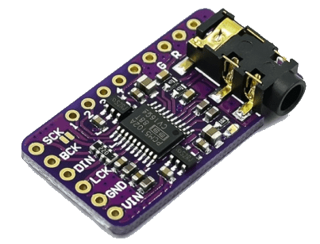
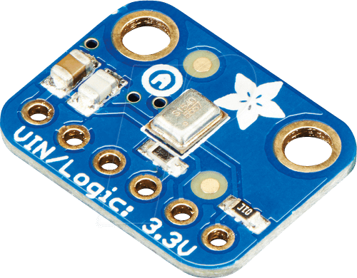

# I2S Audio for ESP32

??? failure "This feature is not included in precompiled binaries"  

    Add the following to the build environment and [compile your build](Compile-your-build):

    ```arduino
    build_flags                 = ${env:tasmota32_base.build_flags}
                                  -DUSE_I2S_ALL
    ```
    Also requires `lib_extra_dirs = lib/lib_audio` added to the build environment

    You can create smaller firmware versions with selective use of the build flags:
    ```
      #define USE_I2S ;             base flag - always needed
      #define USE_I2S_AUDIO ;       base flag - always needed
      #define USE_I2S_MIC ;         microphone support
      #define USE_SHINE ;           MP3 encoder support for microphone
      #define MP3_MIC_STREAM ;      streaming from microphone to local network
      #define USE_I2S_AUDIO_BERRY ; the I2S module for Berry
      #define USE_I2S_AAC ;         AAC decoder - needs about 75 kB flash
      #define USE_I2S_OPUS ;        OPUS codec - needs about 25 kB flash
    ```
  
The main difference to the older ESP8266 sound driver is the configuration of the various settings at runtime with the command `i2sconfig`, which uses a hidden driver file.  

I2S (Inter-IC Sound) is a serial, synchronous communication protocol that is usually used for transmitting audio data between two digital audio devices.  
The I2S framework of the ESP-IDF supports 3 communication modes which are standard, PDM and TDM. TDM is the most advanced mode and very uncommon in the IOT world - there is no support for it in Tasmota yet.  
  
Support for different I2S modes varies across the ESP32 family:  
  
|Target|Standard|PDM TX|PDM RX|TDM|ADC/DAC|LCD/Camera
| --- | --- | --- | --- | --- | --- | --- |
|ESP32|I2S 0/1|I2S 0|I2S 0|none|I2S 0|I2S 0|
|ESP32-S2|I2S 0|none|none|none|none|I2S 0|
|ESP32-C3|I2S 0|I2S 0|none|I2S 0|none|none|
|ESP32-C6|I2S 0|I2S 0|none|I2S 0|none|none|
|ESP32-S3|I2S 0/1|I2S 0|I2S 0|I2S 0/1|none|none|

Note the limited support for PDM microphones.


## Audio settings
  
Without any additional argument `i2sconfig` will print the current audio configuration to the console in JSON format, e.g.:

```
MQT: stat/tasmota_4359CC/RESULT = 
{"I2SConfig":
{"Sys":{"Version":2,"Duplex":0,"Tx":0,"Rx":1,"Exclusive":0,
"MclkInv0":0,"MclkInv1":0,"BclkInv0":0,"BclkInv1":0,"WsInv0":0,
"WsInv1":0,"Mp3Preallocate":1},
"Tx":{"SampleRate":16000,"Gain":10,"Mode":0,"SlotMask":3,
"SlotConfig":0,"Channels":2,"APLL":1},
"Rx":{"SampleRate":32000,"Gain":30,"Mode":1,"SlotMask":1,
"SlotWidth":32,"Channels":1,"DCFilterAlpha":32511,
"LowpassAlpha":17719,"APLL":1,"WsWidth":32,"WsPol":0,"BitShift":1,
"LeftAlign":1,"BigEndian":0,"LsbOrder":0,
"DMAFrame":768,"DMADesc":5}}}
```

Some properties are easy to understand like number of channels or sample rate.  
The "weird ones" a very likely data structures from the I2S audio framework of the ESP-IDF. Numeric values for these properties are integer representations of `enums` in many cases.  
This allows for a very flexible audio setup to support a wide range of hardware combinations with one firmware image.  
  
Changing values is done by passing a JSON with the new key-value-pair.  
  
Examples:  
  
`i2sconfig {"Rx":{"Mode":0}}` switch input of the microphone to standard modes, where all other default values are set to use an INMP441 with left-channel-configuration.  
`i2sconfig {"Rx":{"SlotMask":2}}` would change the microphone in standard mode to the right channel.
  

`i2sconfig {"Rx":{"SampleRate":48000}}` changes sample rate of the microphone.  
`i2sconfig {"Rx":{"DMAFrame":768}}` use DMA buffer for higher sample rate.  
  
### How to apply complex settings? The ugly truth ...
  
In order to support basically any type of microphone in a combination with a certain ESP32 type, we need to find documentation about the needed settings (this works rarely or never) or find/generate demo code, which can be converted to Tasmotas I2S driver.  
In example the INMP441 does not need the same setting on different SOC's of the ESP32 family.  
  
For the ESP32-S3 this microphone works with the following configuration macro from Espressif (found with trial and error):  
  
```
#define I2S_STD_PHILIPS_SLOT_DEFAULT_CONFIG(bits_per_sample, mono_or_stereo) { \
    .data_bit_width = bits_per_sample, \
    .slot_bit_width = I2S_SLOT_BIT_WIDTH_AUTO, \
    .slot_mode = mono_or_stereo, \
    .slot_mask = (mono_or_stereo == I2S_SLOT_MODE_MONO) ? \
                I2S_STD_SLOT_LEFT : I2S_STD_SLOT_BOTH, \
    .ws_width = bits_per_sample, \
    .ws_pol = false, \
    .bit_shift = true, \
    .msb_right = true, \
}
```
  
Now we have to translate this.
    
`I2S_SLOT_BIT_WIDTH_AUTO` is an enum with an int value of 0, so we need:  
```
i2sconfig {"Rx":{"SlotWidth":0}}
```  
  
`I2S_STD_SLOT_LEFT` and `I2S_STD_SLOT_BOTH` are enums too with values of 1 and 3. For mono:  
```
i2sconfig {"Rx":{"SlotMask":1}}
```  

The next values are pretty obvious:  
```
i2sconfig {"Rx":{"WsWidth":16}}
i2sconfig {"Rx":{"WsPol":0}}
i2sconfig {"Rx":{"BitShift":1}}
```  

The C struct member `.msb_right` does only exist on ESP32 and ESP32-S2 and is not part of the driver settings with this name.  
Instead the settings key *LsbOrder* is reused for these 2 SOC's:  
```
i2sconfig {"Rx":{"LsbOrder":1}}
```  

The rest of the data is inferred from the currently fixed sample rate of the Tasmota driver of 16 bits and channel number with the driver key `channels`.  


## Audio Output

{ align=right width="200" }

For audio output an I2S digital audio decoder (DAC) board is required. It is recommended to use an external DAC

|I2S DAC | ESP32 |
| --- | --- |
|BCLK|I2S_BCLK|
|LRCK/WS|I2S_WS|
|DIN|I2S_DOUT|
| SD | NC | 
| GAIN | NC |
| VIN | 3V3 or 5V |
| GND | GND |

### Internal DAC

ESP32 has two 8-bit DAC (digital to analog converter) channels, connected to GPIO25 (Channel 1) and GPIO26 (Channel 2).

Those channels can be driven via the I2S driver when using the “built-in DAC mode” enabled with `USE_I2S_NO_DAC`

### Commands

|CMD DAC|action|
|---|---|
|I2SGain | `0..100` = sets the volume of the audio signal |
|I2SPlay | `<decoder_type> file` = plays an audio file from the file system, sound is played in a separate task not blocking the system|
|I2SLoop | `<decoder_type> file` = plays an audio file from the file system in an endless loop<br>Example: `i2sloop2 file.opus`|
|I2SRtttl| `string` = play [Ring Tones Text Transfer Language (RTTTL)](https://www.mobilefish.com/tutorials/rtttl/rtttl_quickguide_specification.html) ringtones (requires defined `USE_I2S_RTTTL`) |
|I2SSay  | `text` = speaks the text you typed (only English language supported)|
|I2STime | tells current Tasmota time in English (requires defined `USE_I2S_SAY_TIME`)|
|I2SWr   | `<decoder_type> url` = starts playing a [radio](http://fmstream.org/) stream, no blocking (requires defined `USE_I2S_WEBRADIO`)<BR>no parameter = stops playing the stream|
|I2SStop  | stops current play operation|
|I2SPause  | pauses current file play operation, can be resumed with `i2splay` (without any argument)|
  
Tasmota can support multiple audio codec types for file playback/loop, microphone recordings and web radio, which are MP3, AAC (decoder only!!) and OPUS. For the referring commands the type is provided at the `index` position of the command (right behind the command without a space). The filename does not matter, there is no check for naming conventions. Wrong combinations can lead to crashes.  

|Codec index|Codec name|
|---|---|
|0| AAC - decoder only, must be provided as `AAC` format, not embedded in an `M4A` container!|
|1| MP3 - if you do not provide the type explicitly, this is the automatic default
|2| OPUS - most modern and open standard, but has highest memory requirements. Allows nearly perfect gapless looping.|


## Audio Input

For microphone input an I2S microphone must be connected. It is pretty common, that the captured audio signal has a very low volume.  
Hence a relatively high gain factor is needed, that can be configured with:  
`i2sconfig {"Rx":{"Gain":30}}`  


### I2S Microphone - standard mode

{ align=right width="200" }
  
Use command `i2sconfig {"Rx":{"Mode":0}}` to switch audio input to standard mode.

| I2S Microphone | ESP32 |
| --- | --- |
| SCK | I2S_BCLK |
| WS | I2S_WS |
| SD | I2S_DIN |
| L/R | GND |
| VDD | 3.3V |
| GND | GND |

If you're using only the microphone without a DAC you still need to set pin `I2S_DOUT` to an unused GPIO.

### I2S Microphone - PDM mode

[Pulse density modulation](https://en.wikipedia.org/wiki/Pulse-density_modulation) (PDM) microphones are handled as I2S microphones in the ESP-IDF and need only two data wires in comparison to standard I2S microphones. They're used in [ESP32-S3-BOX](https://templates.blakadder.com/espressif_ESP32-S3-BOX.html), [Seeed Xiao Sense](https://templates.blakadder.com/seeedstudio_XIAO_ESP32S3_SENSE.html) and others.

Use command `i2sconfig {"Rx":{"Mode":1}}` to switch audio input to PDM mode.

| Microphone | ESP32 |
| --- | --- | 
| CLK | I2S_WS | 
| DATA | I2S_DIN | 
| L/R | GND | 
| VDD | 3.3V |
| GND | GND | 
| NC | I2S_DOUT |
| NC | I2S_BCLK | 

When using PDM microphones the microphone CLK pin is configured as `I2S_WS` in Tasmota.

### Commands

!!! warning "ESP32 with enough RAM required! PSRAM recommended."
  Optional: `i2sconfig {"Sys":{"Mp3Preallocate":1}}` to turn on buffer preallocation at boot time. Can solve issues, if there is not enough contiguous RAM available later. 


| CMD | Action |
| --- | --- |
| I2SMIC | Internal debug function. Can be used to do a silent warm start of the microphone to avoid the initial noise, that basically every I2S microphone produces.  |
| I2SRec | `<encoder_type> file` = starts recording a .mp3 or .webm audio file to the file system, no blocking,<BR> correct file suffix provided by the user,<BR> no parameter = stops recording<BR>`-?` = shows how many seconds already recorded |
| I2SStream |(requires defined `MP3_MIC_STREAM`)<BR>`1` = starts streaming .mp3/.webm server at `http://<device_ip>:81/stream.mp3` or `http://<device_ip>:81/stream.webm`<BR> `0` = stop the stream |
  
Supported sampling frequencies are:  
32000, 44100 and 48000 Hz - for MP3  
8000, 12000, 16000, 24000, 48000 Hz - for Opus/Webm

Frequencies above 32000 Hz will probably bring down most ESP32's, which have to punch above their weights here, although it might work with very good WiFi conditions - especially on the ESP32-S3.  
  
8000 Hz will distort voices quite a lot.  
  
The efficiency of the Opus encoder reveals weaknesses of many clients (including VLC, Chrome and Firefox), which do not adapt their receive buffers to the low bandwidth of the audio stream. Thus these first fill up the buffers - holding above 5- 30 seconds now - and start playing with the resulting latency.  
Notable exception is Apple's Safari with a delay of about 1 second. The cross-platform console player `mpv` is not far behind.    
  
Streaming can introduce rhythmic noise into the stream with the send rate of the data packets by interference of the WiFi radio. Proper cabeling and shielding is needed here. This can be quite difficult to achieve.  

## I2S Audio Bridge

Starts a UDP audio service to connect 2 ESP32 devices as an audio intercom ([an example](https://github.com/arendst/Tasmota/discussions/16226)). 

Needs audio output and microphone on 2 devices (no PSRAM needed)  

```
build_flags                 = ${env:tasmota32_base.build_flags}
                              -DUSE_I2S_ALL
                              -DUSE_I2S_BRIDGE
```

|CMD bridge|action|
|---|---|
| I2SBridge | `ip` = sets the IP of the slave device<BR>`0` = stop bridge<BR>`1` = start bridge in read mode<BR>`2` = start bridge in write mode<BR>`3` = start bridge in loopback mode<BR>`4` = set bridge to master<br>`5` = set bridge to slave<br>`6` = set microphone to swapped<BR>`7` = set microphone to not swapped<BR>`p<x>` = sets the push to talk button where `x` is the button's GPIO pin number|

If a push to talk button is defined the bridge goes to write mode if the button is pushed and to read mode if the button is released.  
  
## Codec / DAC
  
Some ESP boards contain integrated circuits or modules that convert audio signals between analog and digital forms, sometimes with support for digital audio processing, mixing and volume control. These external audio codec chips are typically controlled via an additional I2C connection, while the pure audio data still runs over I2S.  
The intended integration into the core I2S audio driver works with an additional Berry driver that establishes the I2C connection and may provide additional audio commands, while communicating with the core I2S driver via some callbacks.  
A way to ease the setup work for the end user is to create `Autoconf` packages for specific boards. Examples already exist for the audio boards `Louder-ESP32` and `Louder-ESP32S3` (each using a TAS5805m), which, after initial WiFi setup, only have to be selected in the [Autoconf](ESP32.md#autoconf) section of the `Configuration` menu.  
Currently there is no official support for any of these devices, but you may suggest a board to be looked at in Tasmota's GH discussions or in the Discord channel.
