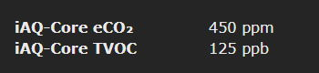

# iAQ-Core indoor air quality sensor

!!! failure "This feature is not included in precompiled binaries"  

To use it you must [compile your build](Compile-your-build). Add the following to `user_config_override.h`:
```
#ifndef USE_IAQ
#define USE_IAQ         // [I2cDriver46] Enable iAQ-core air quality sensor (I2C address 0x5a) (+0k6 code)
#endif
```
----
The iAQ-core indoor air quality module is a low-cost, ultra compact solution for detecting poor air quality. This module uses micro-machined metal oxide semiconductor (MOS) technology to detect a broad range of VOCs while correlating directly with CO2 and TVOC levels in the room.

!!! warning
    All testing and driver programming has been done using iAQ-Core C sensor model. We don't know whether **iAQ-Core P** will work with this driver.

## Configuration
#### Wiring
Follow datasheet for required pull-ups when connecting the bare sensor module directly to ESP8266. Wemos and NodeMCU board include the required pull-up.

</img>

| Breakout | ESP8266   |
|----------|-----------|
| VCC/VIN  | +3.3VDC   |
| GND      | GND       |
| SCL      | GPIOy  |
| SDA      | GPIOx  |

#### Tasmota Settings
In the **_Configuration -> Configure Module_** page assign:

1. GPIOx to `I2C SDA (6)`
2. GPIOy to `I2C SCL (5)`

After configuring the GPIO's the driver will detect iAQ-Core automatically.

On every power on sensor will run in _Warm up_ mode for 5 minutes to calibrate. During this webUI shows:


and console displays `iAQ: Error 10`

When warm-up is finished, sensor will show readings in web UI:



and in MQTT topic (according to TelePeriod):    
```
{"Time":"2020-01-01T00:00:00","IAQ":{"eCO2":450,"TVOC":125,"Resistance":76827}}
```

## Usage
Typical sensor reading should be around 450 ppm eCO2 and 125 ppb TVOC. Resistance is sensor's gas resistance in Ohm and is the baseline reading from which eCO2 and TVOC are calculated from

If you see error messages in console, take appropriate action:

`iAQ: Error 1`    
During use, a message `iAQ: Error 1` will randomly appear. This is normal, it's a skipped reading due to sensor still taking environment data during polling.

`iAQ: Error 80`    
If this error persists, the sensor is broken and should be replaced.

`iAQ: Error ff`    
General connection error. Check your wiring and if the power supply supplies enough power to the sensor. Run `I2CScan` to check if the sensor can be found on 0x5a I^2^C address. 

## Breakout Boards


#### Where to get

* [AliExpress sensor module](https://www.aliexpress.com/item/32995755913.html)
* [Aliexpress breakout board](https://www.aliexpress.com/item/32842131750.html)
* [Mouser](https://eu.mouser.com/ProductDetail/ams/IAQ-CORE-C)
* [DigiKey](https://www.digikey.com/product-detail/en/ams/IAQ-CORE-C/IAQ-COREC-ND/5117221)

[iAQ-Core Datasheet](https://www.sciosense.com/wp-content/uploads/2020/01/iaQ-Core-Datasheet.pdf)
