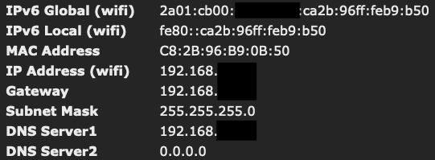

# IPv6

!!! info "IPv6 is supported by default on ESP32; requires a specific build for ESP8266"

Tasmota supports dual-stack IPv4 and IPv6 networks on ESP8266 and ESP32. If you want to know more about IPv6 see the [wikipedia IPv6 page](https://en.wikipedia.org/wiki/IPv6). Keep in mind that concepts in IPv6 are very different than IPv4.

Tasmota supports IPv4 only networks (Legacy) and dual-stack IPv4+IPv6 networks.

!!! danger "Tasmota does not support IPv6 only networks, and it will yield to a crash after some time (may be fixed in the future)."

## Building IPv6 version of Tasmota

IPv6 is enabled by default on ESP32 since v12.3.1.1.


For **ESP8266** you need to compile with `-DPIO_FRAMEWORK_ARDUINO_LWIP2_IPV6_HIGHER_BANDWIDTH` option in `platform.ini` instead of `-DPIO_FRAMEWORK_ARDUINO_LWIP2_HIGHER_BANDWIDTH_LOW_FLASH`, and set `-DUSE_IPV6`. The code impact is +34.5kB; and you need `#define USE_IPV6` in `my_user_config.h` or in `user_config_override.h`. See [Compiling](Compile-your-build.md).


## Network pre-requisites

In all cases, Tasmota will enable a **Link-Local** address on all interfaces (Wifi and Ethernet if present). Link-Local addresses start with `fe80::` followed by 64 bits derived from the MAC address of the device. Link-Local addresses are not routable across VLANs nor via the Internet and is used only to communicate with the router and with devices on the same LAN (useful in the Matter protocol).

IPv6 networks generally support SLAAC (Stateless Address Autoconfiguration, SLAAC). SLAAC allows Tasmota to compute an IPv6 Global Address that is routable across VLANs and possibly accross the internet depending on your router configuration.

Note: Unifi UDM Pro has a bug for years that prevent SLAAC from working. Although the bug was never fixed by Unifi, there are multiple work-arounds to be found online.

For SLAAC to work, the network size must be at least `/64` or larger (i.e. `/xx` with `xx` lower or equal to `64`). The first 64 bits are set by the network, the last 64 bits are derived from the MAC address in the same way than Link-Local.

Address type|Example of value
:---|:---
MAC|`C8:2B:96:B9:0B:50`
IPv4|`192.168.x.x`
IPv6 Link-Local|`fe80::ca2b:96ff:feb9:b50`
IPv6 Global|`2a01:cb00:xxxx:xxxx:ca2b:96ff:feb9:b50`



Because of limitations in esp-idf, Tasmota does not support IPv6 Temporary Addresses nor ULA addresses. DHCPv6 support is disabled, because it is not really useful in a home network, and because esp-idf support is limited to state-less mode.

Features known to work (ESP8266 and ESP32):

- [x] Allocation of a Link-Local address
- [x] Allocation of a Global address via SLAAC
- [x] Works on Wifi and Ethernet
- [x] Response to ping on Global address
- [x] Webui listens on Global address
- [x] MQTT to a IPv6 broker
- [x] DNS resolution for IPv4 (A) and IPv6 (AAAA) records
- [x] Ping to IPv6 address (ICMP6)
- [x] Berry webclient and tcpclient to IPv6 addresses
- [x] Berry udpclient to IPv6 addresses
- [ ] Berry udpclient to IPv6 multicast addresses (untested but likely to not work)

## dual-stack DNS

If a DNS entry has both a v4 address (A record) and a v6 address (AAAA) record, you can choose which address to use:

- if no IPv6 Global Address is assigned, only A records are queried
- If a IPv6 Glbal Address is assigned:
  - `SetOption149 0`: v4 'A' query is done first, then v6 'AAAA' query if no v4 entry was found
  - `SetOption149 1`: v6 'AAAA' query is done first, then v4 'A' query if no v6 entry was found

Note: IPv4 is generally assigned first and IPv6 Global Address takes a few more seconds. Even if `SetOption149 1` is selected, first queries are likely to return IPv4 addresses anyways.

## Link-local interface names

Starting with Tasmota v14 based on Arduino Core 3 (esp-idf 5.1), link-local addresses now needs an interface name to distinguish which physical interface to use between WIFI and Ethernet. The format is the IPv6 official format: `<ipv6_link_local>%<interface_name>`.

Example: `fe80::86cc:a8ff:fe64:b768%st1`

Typical interface names are:

- `st1`: Wifi (aka STA mode) - this is the most common interface to use
- `en2`: Ethernet interface if present
- `lo0`: localhost loopback interface, generally not used

## Troubleshooting

Enable `weblog 3` or `seriallog 3` to get more details about IPv6 and DNS resolution.

Example:

```
weblog 3
ping www.wikipedia.org

14:35:50.335 WIF: DNS resolved 'www.wikipedia.org' (185.15.58.224) in 14 ms
14:35:50.338 RSL: RESULT = {"Ping":"Done"}
14:35:51.475 RSL: RESULT = {"Ping":{"www.wikipedia.org":{"Reachable":true,"IP":"185.15.58.224","Success":1,"Timeout":0,"MinTime":17,"MaxTime":17,"AvgTime":17}}}

SetOption149 1
ping www.wikipedia.org

14:36:24.205 WIF: DNS resolved 'www.wikipedia.org' (2a02:ec80:600:ed1a::1) in 14 ms
14:36:24.210 RSL: RESULT = {"Ping":"Done"}
14:36:25.232 RSL: RESULT = {"Ping":{"www.wikipedia.org":{"Reachable":true,"IP":"2a02:ec80:600:ed1a::1","Success":1,"Timeout":0,"MinTime":24,"MaxTime":24,"AvgTime":24}}}
```

You can also use `Status 5` to know all assigned IP addresses and DNS server entries (`st` is Wifi STA, `en` is Ethernet):

```
Status 5

14:37:09.339 WIF: 'st' IPv4 192.168.2.x
14:37:09.350 WIF: 'st' IPv6 fe80::ca2b:96ff:feb9:b50 local
14:37:09.351 WIF: 'st' IPv6 2a01:cb00:xxxx:xxxx:ca2b:96ff:feb9:b50 
14:37:09.363 WIF: 'lo' IPv4 127.0.0.1
14:37:09.364 WIF: 'lo' IPv6 ::1 
14:37:09.365 WIF: DNS(0): 192.168.2.1
14:37:09.366 WIF: DNS(1): 0.0.0.0
[...]
```
