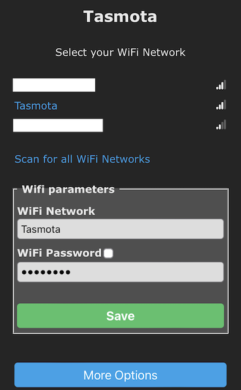
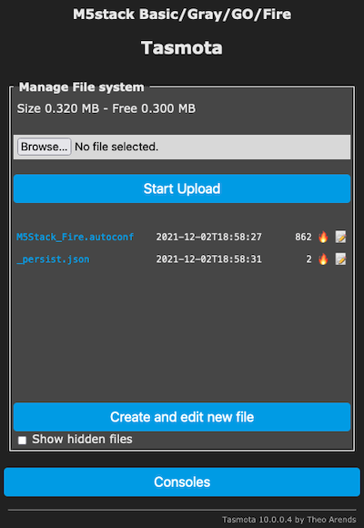
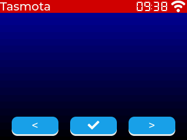

# LVGL in less than 10 minutes with Tasmota

Tasmota is a widely used open-source firmware for ESP8266 and EPS32 based devices. It supports a wide variety of devices, sensors and integrations to Home Automation and Cloud services. Tasmota firmware is downloaded more than 200,000 times each month, and has an active and growing community.

In 2021, Tasmota added full support of LVGL for ESP32 based devices. It also introduced the [Berry scripting language](https://github.com/berry-lang/berry/wiki/Reference), a small-footprint language similar to Python and fully integrated in Tasmota. A comprehensive mapping of LVGL in Berry language is available, similar to the mapping of Micropython.

The tutorial below illustrates how to install Tasmota on M5Stack devices (based on ESP32) and run your first LVGL application in Berry - all in less than 10 minutes.

We will use nice [M5Stack](https://m5stack.com/) devices that integrate ESP32 and a 320x240 display, with touchscreen or physical buttons depending on the device.

{ width="50" }

## Flash Tasmota-lvgl on the device

We have packaged an easy to use Web Flasher for ESP32.

_If this method fails or if you prefer local client method, have a look at [Getting Started](https://tasmota.github.io/docs/Getting-Started/) on Tasmota documentation._


- Connect your M5Stack device via a USB Cable.

- Connect to the [Tasmota Web Installer](https://arendst.github.io/Tasmota-firmware/)


- Scroll down in `Development` section and select `Tasmota32 LVGL`


- Click `Connect` and select the appropriate Serial Port. It should connect in a couple of second.


- Click `Install Development Tasmota32 Lvgl (English)`


- Check `Erase Device` if it's the first time you install Tasmota, or you may experience unwanted behavior. Click `Next`


- Click `Install`


- It should take a little more to Erase and Flash


You can now close the Web Flasher and proceed to the Wifi configuration

## Configure Tasmota Wifi

The next step can be done with a phone or a computer.

- Connect to temporary the wifi access point with a name starting with `tasmota-...`


- You should be automatically brought to the Wifi configuration page. If not, try connecting to `192.168.4.1`



- Select your wifi network (yes, my wifi is named `Tasmota`...), enter the password and hit `Save`. If all goes well, you should see the IP address of Tasmota and be redirected to it.


- You should now see the Tasmota main screen.


## Configure Tasmota for M5Stack

Tasmota is based on general purpose firmwares, you now need to configure specifically for your M5Stack device. We provide two templates, one for `M5Stack Basic/Gray/GO/Fire` and one for `M5Stack Core2`.

- Go to Tasmota main screen and click on `Configuration`


- Then click on `Auto-configuration`. You are now on the Auto-configuration page. Select `M5Stack Fire` or `M5Stack Core2`. Then click on `Apply configuration`.


The device restarts and you should be back to Tasmota main page. The screen should have been configured (you should see a short flash on the screen).


## Try a LVGL demo app

In this last step, we will try to run a small LVGL application written in Berry.

- Go to Tasmota Main Screen and click `Consoles` then `Manage File System`



- Click on `Create and edit new file`, enter the filename `autoexec.be` and copy the following code in the text pane:


``` python
#- start LVGL and init environment -#
lv.start()

tasmota.cmd("DisplayDimmer 50")

hres = lv.get_hor_res()       # should be 320
vres = lv.get_ver_res()       # should be 240

scr = lv.scr_act()            # default screean object
f20 = lv.montserrat_font(20)  # load embedded Montserrat 20

#- Background with a gradient from black #000000 (bottom) to dark blue #0000A0 (top) -#
scr.set_style_bg_color(lv.color(0x0000A0), lv.PART_MAIN | lv.STATE_DEFAULT)
scr.set_style_bg_grad_color(lv.color(0x000000), lv.PART_MAIN | lv.STATE_DEFAULT)
scr.set_style_bg_grad_dir(lv.GRAD_DIR_VER, lv.PART_MAIN | lv.STATE_DEFAULT)

#- Upper state line -#
stat_line = lv.label(scr)
if f20 != nil stat_line.set_style_text_font(f20, lv.PART_MAIN | lv.STATE_DEFAULT) end
stat_line.set_long_mode(lv.LABEL_LONG_SCROLL)                                        # auto scrolling if text does not fit
stat_line.set_width(hres)
stat_line.set_align(lv.TEXT_ALIGN_LEFT)                                              # align text left
stat_line.set_style_bg_color(lv.color(0xD00000), lv.PART_MAIN | lv.STATE_DEFAULT)    # background #000088
stat_line.set_style_bg_opa(lv.OPA_COVER, lv.PART_MAIN | lv.STATE_DEFAULT)            # 100% background opacity
stat_line.set_style_text_color(lv.color(0xFFFFFF), lv.PART_MAIN | lv.STATE_DEFAULT)  # text color #FFFFFF
stat_line.set_text("Tasmota")
stat_line.refr_size()                                                                # new in LVGL8
stat_line.refr_pos()                                                                 # new in LVGL8

#- display wifi strength indicator icon (for professionals ;) -#
wifi_icon = lv_wifi_arcs_icon(stat_line)    # the widget takes care of positioning and driver stuff
clock_icon = lv_clock_icon(stat_line)

#- create a style for the buttons -#
btn_style = lv.style()
btn_style.set_radius(10)                        # radius of rounded corners
btn_style.set_bg_opa(lv.OPA_COVER)              # 100% backgrond opacity
if f20 != nil btn_style.set_text_font(f20) end  # set font to Montserrat 20
btn_style.set_bg_color(lv.color(0x1fa3ec))      # background color #1FA3EC (Tasmota Blue)
btn_style.set_border_color(lv.color(0x0000FF))  # border color #0000FF
btn_style.set_text_color(lv.color(0xFFFFFF))    # text color white #FFFFFF

#- create buttons -#
prev_btn = lv.btn(scr)                            # create button with main screen as parent
prev_btn.set_pos(20,vres-40)                      # position of button
prev_btn.set_size(80, 30)                         # size of button
prev_btn.add_style(btn_style, lv.PART_MAIN | lv.STATE_DEFAULT)   # style of button
prev_label = lv.label(prev_btn)                   # create a label as sub-object
prev_label.set_text("<")                          # set label text
prev_label.center()

next_btn = lv.btn(scr)                            # right button
next_btn.set_pos(220,vres-40)
next_btn.set_size(80, 30)
next_btn.add_style(btn_style, lv.PART_MAIN | lv.STATE_DEFAULT)
next_label = lv.label(next_btn)
next_label.set_text(">")
next_label.center()

home_btn = lv.btn(scr)                            # center button
home_btn.set_pos(120,vres-40)
home_btn.set_size(80, 30)
home_btn.add_style(btn_style, lv.PART_MAIN | lv.STATE_DEFAULT)
home_label = lv.label(home_btn)
home_label.set_text(lv.SYMBOL_OK)                 # set text as Home icon
home_label.center()

#- callback function when a button is pressed, react to EVENT_CLICKED event -#

def btn_clicked_cb(obj, event)
    var btn = "Unknown"
    if   obj == prev_btn  btn = "Prev"
    elif obj == next_btn  btn = "Next"
    elif obj == home_btn  btn = "Home"
    end
    print(btn, "button pressed")
end

prev_btn.add_event_cb(btn_clicked_cb, lv.EVENT_CLICKED, 0)
next_btn.add_event_cb(btn_clicked_cb, lv.EVENT_CLICKED, 0)
home_btn.add_event_cb(btn_clicked_cb, lv.EVENT_CLICKED, 0)
```

- Click `Save` and restart the device. You should now see this on the M5Stack screen:



You will find more information on [LVGL-Tasmota-Berry mapping](https://tasmota.github.io/docs/LVGL/).
