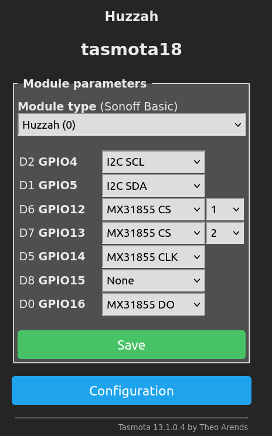

# MAX31855 / MAX6675 Thermocouple Amplifier

??? tip "This feature is included only in `tasmota-sensors` and `tasmota32` binaries" 

    When [compiling your build](Compile-your-build) add the following to `user_config_override.h`:
    ```c++
    #ifndef USE_MAX31855
    #define USE_MAX31855  // Add support for MAX31855/MAX6675 K-Type thermocouple sensor using softSPI
    #endif
    ```

This driver is used to read [type-K thermocouples](https://en.wikipedia.org/wiki/Thermocouple#Type_K) using a [MAX31855 amplifier](https://www.adafruit.com/product/269).

## Configuration

### Tasmota Settings

Parameter|Connector|Description
-|-|-
MX31855 CS #|CS|Chip select, wire a separate pin to each peripheral if using multiple.
MX31855 CLK|CLK|Along with power and DO, shared among peripherals.
MX31855 DO|DO|
|Vin|3-5V if using Adafruit's breakout.
|GND|

Use [SetOption94](https://tasmota.github.io/docs/Commands/#setoption94) to choose the appropriate driver (MAX31855 or MAX6675)

## Example Project

This example shows two thermocouple amplifier breakouts wired up to one [Huzzah ESP8266](https://templates.blakadder.com/adafruit_HUZZAH.html). The peripherals use the same `CLK` and `DO` pins, but each has a separate `CS`.

### Tasmota Configuration

This Tasmota configuration shows the thermocouples as well as unrelated I2C setup on `GPIO4` and `GPIO5`.




Sensor data is reported like this:

```
tele/tasmota_30EF0B/SENSOR = {
  "Time":"2023-12-11T00:54:59",
  "MAX31855-0":{
    "Temperature":22.8,
    "ReferenceTemperature":23.6,
    "Error":0
  },
  "MAX31855-1":{
    "Temperature":22.5,
    "ReferenceTemperature":22.9,
    "Error":0
  },
  "TempUnit":"C"
}
```

The `ReferenceTemperature`, also known as "cold junction temperature", is the PCB temperature which is used as the basis for the thermocouple's voltage offset to find the thermocouple or "hot junection" temperature.

### Home Assistant View

The sensor values are autodiscovered [in Home Assistant](Home-Assistant). In the screenshot below they have been renamed.


### Wiring


