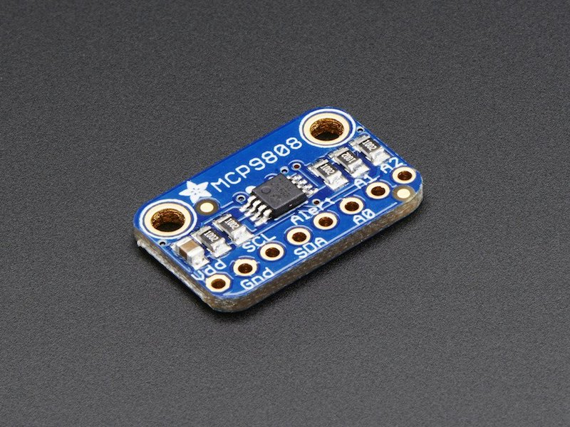

# AHT1x temperature and humidity sensor
!!! failure "This feature is not included in precompiled binaries"  

To use it you must [compile your build](Compile-your-build). Add the following to `user_config_override.h`:
```
#ifndef USE_MCP9808
#define USE_MCP9808      // [I2cDriver51] Enable MCP9808 temperature sensor (I2C addresses 0x18 - 0x1F) (+0k9 code)
#endif
```
----

the MCP9808 is an I<sup>2</sup>C temperature sensor. Tasmota support up to 8 devices.

## Configuration


### Wiring
| MCP9808   | ESP8266 |
|---|---|
|VCC   |3.3V
|GND   |GND   
|SDA   | GPIOx
|SCL   | GPIOy


### Tasmota Settings 
In the **_Configuration -> Configure Module_** page assign:

1. GPIOx to `I2C SDA (6)`
2. GPIOy to `I2C SCL (5)`

After a reboot the driver will detect automatically up to 8 MCP9808 and display sensor readings.

and in MQTT topic (according to TelePeriod):    
```
{"Time":"2020-01-01T00:00:00","MCP9808":{"Temperature":24.7},"TempUnit":"C"}
```


### Breakout Boards



### Datasheet
[MCP9808](http://ww1.microchip.com/downloads/en/DeviceDoc/25095A.pdf)    

