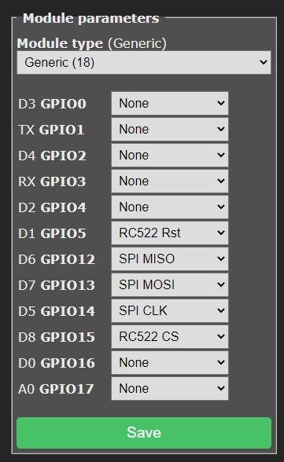

# MFRC522 RFID reader

??? failure "This feature is not included in precompiled binaries"  

    When [compiling your build](Compile-your-build) add the following to `user_config_override.h`:
    ```arduino
    #define USE_SPI                         // Hardware SPI using GPIO12(MISO), GPIO13(MOSI) and GPIO14(CLK) in addition to two user selectable GPIOs(CS and DC)
    #define USE_RC522                       // Add support for MFRC522 13.56Mhz Rfid reader (+6k code)
    #define USE_RC522_DATA_FUNCTION         // Add support for reading data block content (+0k4 code)
    #define USE_RC522_TYPE_INFORMATION      // Add support for showing card type (+0k4 code)
    ```

The MFRC522 is a highly integrated reader/writer IC for contactless communication at 13.56 MHz. The MFRC522 reader supports ISO/IEC 14443 A/MIFARE and NTAG. [Datasheet](https://www.nxp.com/docs/en/data-sheet/MFRC522.pdf).

This reader is ubiquitous in many Arduino starter and sensor kits. It uses SPI protocol for communication with ESP.


### Wiring
| MFRC522 |  ESP8266       |   Tasmota
| ------- | -------------- |  ----------
|  SDA    | GPIO0..5,15,16 |  RC522 CS
|  SCK    | GPIO14         |  SPI CLK
|  MOSI   | GPIO13         |  SPI MOSI
|  MISO   | GPIO12         |  SPI MISO
|  IRQ    | not used       |
|  GND    | GND            |
|  RST    | GPIO0..5,15,16 |  RC522 Rst
|  3V3    | 3V3            |

### Tasmota Settings 
In the **_Configuration -> Configure Module_** page assign:

- GPIOx to `RC522 Rst`   
- GPIOy to `RC522 CS`   
- GPIO12 to `SPI MISO`   
- GPIO13 to `SPI MOSI`   
- GPIO14 to `SPI CLK`   

The module will reboot when you save this configuration.

During start-up the following information should be visible in your console output:

```json
00:00:00 MFR: RC522 Rfid Reader detected
```
If the device was not found please check your wiring and configuration and confirm that everything is as it should be.

!!! example 
    Configured using NodeMCU on pins: D1 (connected to RC522 Rst) and D8 (connected to RC522 CS)



## Usage

Tasmota will scan for a new card detect 4 times per second and if found will report it via immediate telemetry.

The output on the console will look similar to the below when a new card is detected

```json
13:10:50.346 MQT: tele/rfid-test/SENSOR = {"Time":"2021-01-23T13:10:50","RC522":{"UID":"BA839D07","Data":"","Type":"MIFARE 1KB"}}
```

The UID of the card/tag is reported and any text stored in BLOCK 1 of a Mifare Classic card (up to 15 characters in length) is reported in the `DATA` field of the JSON sent via telemetry. Please note that the `DATA` field cannot contain spaces.

### Using the UID or DATA 

For the purpose of using card/tag data on the device itself you will need to use rules along with the events that are caused.

!!! example 
    Example rule for responding to a specific UID on the device when a card/tag matching a specific UID is presented

```
rule1 on RC522#UID=BA839D07 do power on endon
```

## Breakout Boards


