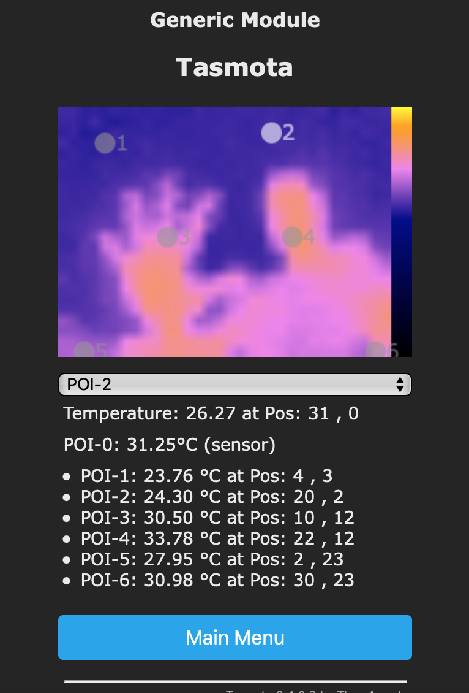
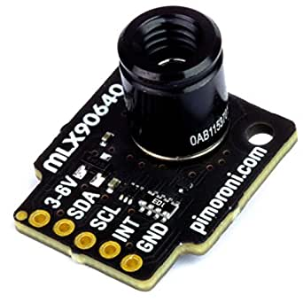

# MLX90640 Far infrared thermal sensor array

!!! failure "This feature is not included in precompiled binaries"  

To use it you must [compile your build](Compile-your-build). Add the following to `user_config_override.h`:
```
#ifndef USE_MLX90640
#define USE_MLX90640            // [I2cDriver53]
#endif
```
----
The MLX90640 is a IR sensor array of 32x24 pixels, that is connected via an usual I2C-connection.  
Intended use case is to measure multiple points of interest of an object without the need to directly put a sensor on it, for instance if you are not allowed to apply hardware modifications to a heating.
The update frequency of the measurements is approximately 1 per second. In the first driver version 6 POI‘s are freely selectable (POI1..6). POI-0 is reserved for the ambient temperature of the sensor (Ta).  
Data is published at Teleperiod as an array [POI-0...6]:  
  
```
{
    "Time": "2020-09-11T09:18:08",
    "MLX90640": {
        "Temperature": [30.8, 28.5, 24.2, 25.7, 24.5, 24.6, 24.9]
    },
    "TempUnit": "C"
}
```

## Configuration

### Wiring
| MLX90640   | ESP |
|---|---|
|GND   |GND   
|VCC   |3.3V
|SDA   | GPIOx
|SCL   | GPIOy

### Tasmota Settings 
In the **_Configuration -> Configure Module_** page assign:

1. GPIOx to `I2C SDA`
2. GPIOy to `I2C SCL`

After a reboot the driver will detect MLX90614 automatically and display Temperature measurements.  
  
### Commands  
  
Command:  
MLXPOIn xxyy, n ist poi 1...6, xx 0...31, yy 0...23  
Example: Point 2 at x:12 and y:08 results in mlxpoi2 1208 
  
The configuration can be saved via RULES.  
  
## Web-GUI  
  
In order to find the correct coordinates a thermal view is provided via webGUI, where points can be validated and/or updated. A stable Wifi-setup is mandatory for reliable operation.  
  

  


## Breakout Boards


