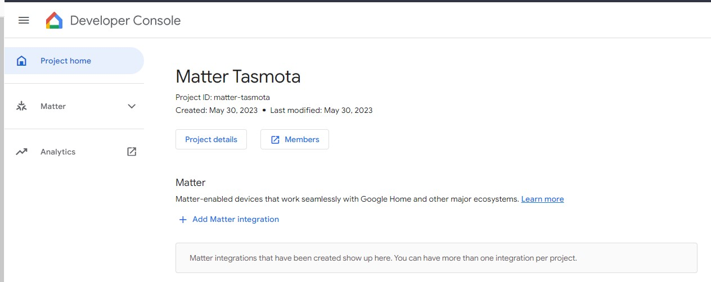
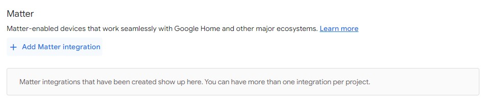
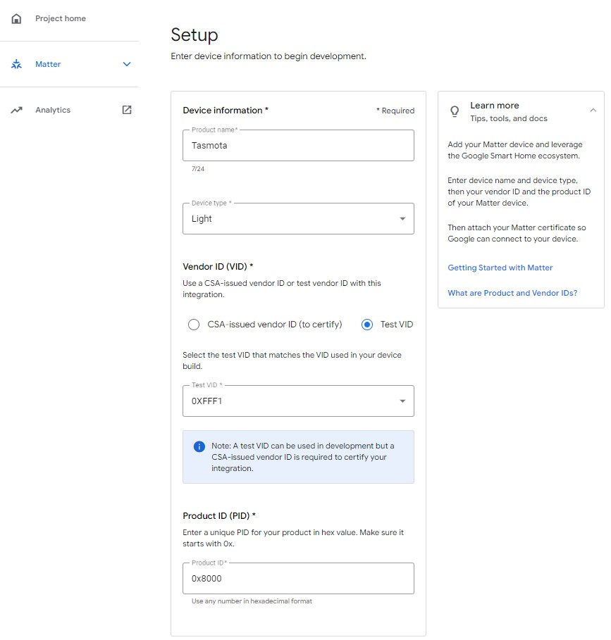
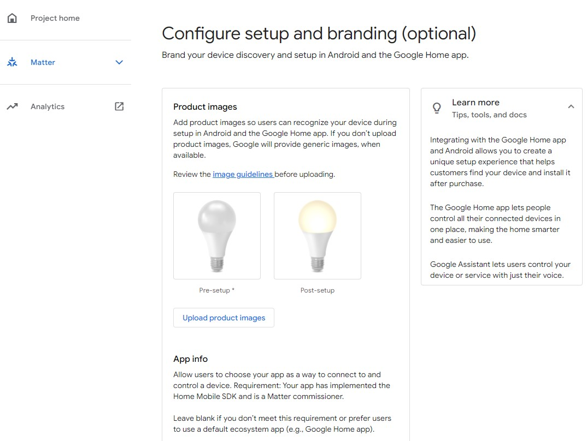
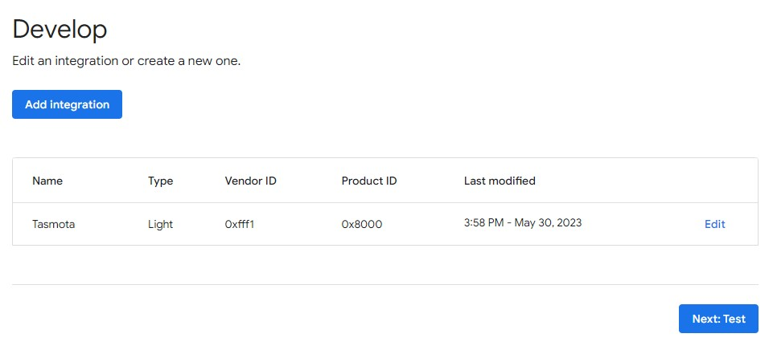
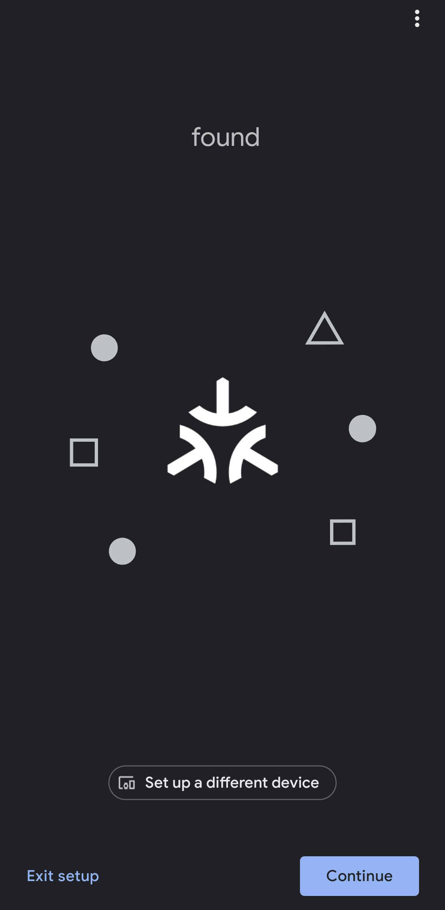

# Beginners Guide to adding Tasmota Matter to Google Home

Google Home will not accept devices using a test Vendor ID like Tasmota does. To pair Tasmota with Google Home you will need a [Matter compatible Google device](https://support.google.com/googlenest/answer/12391458?hl=en) and the following procedure to enable Tasmota for your Google Home account.

## Create a Project

Open [Google Home Developer Console](https://console.home.google.com/projects) logged in under the same account used for Google Home.

Click on **Create a project** then **Create project**. Enter a name for your project (e.g., "Matter Tasmota").

## Add Matter Integration

Click on "Add Matter Integration"

Click **Next: Develop** then **Next:Setup**

## Enter Device Information

Enter the name for the devices used.

Vendor ID needs to be **0xFFF1** as selected by default.

Product ID used by Tasmota devices is **0x8000**.

Once you've filled out the required fields click on **Save & continue**

## Configure setup and branding (optional)

At this step you can change the images used in Google Home app during device commissioning. There is no need to fill out *Android package name* field.

Click **Save**

## Setup Complete

Main page will now have an integration as shown:

## Add Device to Google Home

Activate **Open Commissioning** on the Tasmota device and then click on add new device, then select **New device** in the Google Home app. Tasmota device should be discovered as a Matter device. Scan the QR code from the web UI and click on Agree to connect the Tasmota device to Google Home.

