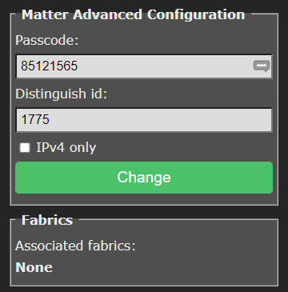

# Matter 

!!! danger "Matter protocol support is highly experimental and not feature complete"

??? failure "This feature is not included in precompiled binaries :material-cpu-32-bit:"
    When [compiling your build](Compile-your-build) add the following flag your environment or `user_config_override.h`:
    ```arduino
    #define USE_MATTER_DEVICE
    ```

## What is Matter?

Matter is a new secure, reliable, local standard/protocol for smart devices launched at the end of 2022. Learn more [about Matter](https://csa-iot.org/all-solutions/matter/).

Tasmota supports Matter over IP (Wi-Fi or Ethernet) as an end-device. This means that you can connect a Tasmota device to a Matter gateway, using standard and well defined protocols. The Matter communication is completely local.

!!! bug "Thread is not supported" 
    Thread requires a specific radio and is not supported by ESP32 devices, it would require an additional, separate MCU.

Matter cannot be supported on ESP8266 due to limited memory resources. We are exploring the possibility to use a single ESP32 as a Matter bridge to control ESP8266 devices through the bridge.

### Supported platforms

Tasmota Matter is confirmed to work with:

- [Apple Home](https://www.apple.com/home-app/)
- [Amazon Alexa](https://www.digitaltrends.com/home/how-to-connect-matter-devices-amazon-alexa/)
- [Espressif-Matter](https://apps.apple.com/in/app/espressif-matter/id1604739172) iOS/Mac app
- [Home Assistant](https://next.home-assistant.io/integrations/matter#configuration)

... more to come

## Getting Started

Install Tasmota with Matter support. Unofficial binaries are available for ESP32 variants in our [web installer](https://tasmota.github.io/install/) at the bottom of the list under **unofficial** builds.

Go to ***Configuration --> Configure Matter*** and enable Matter.


After a restart device commissioning will be open for 10 minutes.


Add the device in your smart home solution by scanning the QR code or with the "Manual pairing code" if code scanning is not possible.

## Configuration

After Matter support is enabled the ***Configuration --> Configure Matter*** menu is used to configure options.

### Matter Passcode

You can change the passcode and ID of the device or force it to use IPv4 only.



### Current Configuration

Configure your device for Matter discovery. Tasmota tries to configure supported features automatically.

You can add or remove features manually in this menu.

Changing these options requires a device restart.

#### Endpoint

To add new features you need to add [Endpoints](https://blog.espressif.com/matter-clusters-attributes-commands-82b8ec1640a0).

They're labelled as `Ep.` in the table. They don't need to have sequential numbers but 0 is always reserved for "Root node" type.

#### Type

Select your endpoint type from the drop down. Types are limited by the [Matter specification](https://developer.nordicsemi.com/nRF_Connect_SDK/doc/latest/nrf/protocols/matter/overview/data_model.html#device-type-overview).

### Param

To link a Tasmota power output (light/relay) to an endpoint

To link a Tasmota sensor to an endpoint add the [rule trigger](Rules.md#rule-trigger) of the sensor to the _Param_ value.

!!! example "You can easily find out the param value by issuing `Status 8` in the console:"
    ```json
    MQT: tele/tasmota_4BC990/SENSOR = {"Time":"2023-05-28T20:04:27","SCD40":{"CarbonDioxide":618,"eCO2":623,"Temperature":23.8,"Humidity":61.1,"DewPoint":15.8},"TempUnit":"C"}
    ```

    Param for a Temperature endpoint will be `SCD#Temperature` and the _Param_ for a Humidity endpoint will be `SCD#Humidity` in this case.


### Fabrics

In short fabrics are Matter node identifiers. [Long story here...](https://matter-smarthome.de/en/know-how/what-is-a-matter-fabric/).


Deleting a Fabric will remove its commissioned status related to the commissioner.

## Known Limitations

Matter support is still highly experimental, there are some limitations:

- Matter requires IPv6 support, yet IPv4 is often tolerated. For debug purpose you can force Tasmota to manage Matter only on IPv4
- Tasmota devices with dual active networks (Ethernet + Wifi) are not yet supported. You need to disable Wifi or Ethernet. For example use [Ethernet Network Flipper](https://tasmota.github.io/docs/Berry-Cookbook/#ethernet-network-flipper)
- Tasmota cannot be Matter certified, it uses development vendor id's, which typically raise user warnings when commissioning the device

What's not suported:

- **ESP8266** because of limited memory resources and lack of Berry support
- **Thread** as it requires a separate MCU. The number of Thread devices is still very limited.
- **Zigbee**

## Commands

Command | Description
:---- | :---
MtrJoin |`1` = open commissioning for 10 minutes<BR>`0` = close commissioning

## Events

Events published as JSON MQTT that can be captured in rules:

`{"Matter":{"Initialized":1}}`    
when the device is configured (all endpoints created)

`{"Matter":{"Commissioning":1,"PairingCode":"00054912336","QRCode":"MT:Y.K90IRV01YZ.548G00"}}`     
  when commissioning is open

`{"Matter":{"Commissioning":0}}`     
  when commissioning is closed

## Internal Operation

Read more about the [internal operation](Matter-Internals.md)