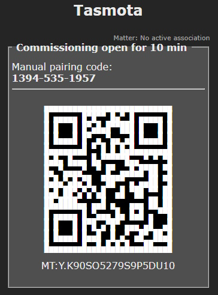

# Matter 

!!! tip "Matter protocol supported in all ESP32 variants (C3/S2/S3) since Tasmota v13.0.0. ESP8266 is not supported although ESP8266 devices can be handled via a single ESP32 in bridge mode (see below)"

??? tip "This feature is included in standard `tasmota32xx` builds; not in special variants (display, sensors...)" 

    When [compiling your build](Compile-your-build) add the following flag to the build environment or `user_config_override.h`:
    ```arduino
    #define USE_MATTER_DEVICE
    ```

## What is Matter?

The Matter protocol is an open-source, royalty-free standard designed to enable smart home devices from different manufacturers to work seamlessly and securely together. The Matter standard was launched end of 2022, and is supported since July 2023 by Tasmota v13.0 and above. Learn more [about Matter](https://csa-iot.org/all-solutions/matter/).

Tasmota supports Matter over IP (Wi-Fi or Ethernet) as an end-device. This means that you can connect a Tasmota device to a Matter gateway, using standard and well defined protocols. The Matter communication is completely local.

Matter cannot be directly supported on ESP8266 due to limited memory resources but you can use an ESP32 device as a Matter bridge to other Tasmota and [OpenBK](https://github.com/openshwprojects/OpenBK7231T_App) devices.


!!! info "Thread is not supported" 
    Thread requires a specific radio and is not supported by ESP32 devices, it would require an additional, separate MCU.
    Espressif has launched a certified Thread Border Router based on ESP32S3 + ESP32H2 which should allow to
    bridge Thread device to a Wifi/Ethernet local network. Stay tuned...

### Supported platforms

Tasmota Matter is confirmed to work with:

- [Apple Home](https://www.apple.com/home-app/) - [requirements](https://support.apple.com/en-us/HT207057)
- [Amazon Alexa](https://www.digitaltrends.com/home/how-to-connect-matter-devices-amazon-alexa/) - [requirements](https://developer.amazon.com/en-US/alexa/matter)
- [Espressif-Matter](https://apps.apple.com/in/app/espressif-matter/id1604739172) iOS/Mac app
- [Google Home](https://support.google.com/googlenest/answer/12391458?hl=en) - only works after following these [instructions](Matter-with-Google.md)
- [Home Assistant](https://next.home-assistant.io/integrations/matter#configuration)

[More information](https://github.com/mfucci/node-matter#pairing-and-usage-information) on pairing with above mentioned smart home systems.

## Getting Started

Matter is supported by default. The binaries are available for all ESP32 variants in our [web installer](https://tasmota.github.io/install/)

Go to ***Configuration --> Configure Matter*** and enable Matter with the checkmark then click ***Save***.


After a restart device commissioning will be open for 10 minutes.



Add the device to your Matter hub by scanning the QR code or with the "Manual pairing code" if code scanning is not possible.  

## Configuration

After Matter support is enabled the ***Configuration --> Configure Matter*** menu is used to configure options.


Here you can enable/disable Matter or open commissioning again if needed.

### Current Configuration

Configuration of your device for Matter discovery. Tasmota tries to configure supported features automatically.

You can change the name of the Matter endpoint, switch its Parameter number or remove the endpoint by clicking the &#128293; icon.


After changing these options click ***Change configuration***.

### Add to configuration

#### Add local sensor or device

To add new features you need to add [Endpoints](https://blog.espressif.com/matter-clusters-attributes-commands-82b8ec1640a0).


##### Name

Name your endpoint to give it a label in your Matter hub (might not be supported by all hubs)

##### Type

Select your endpoint type from the drop down. Types are limited by the [Matter specification](https://developer.nordicsemi.com/nRF_Connect_SDK/doc/latest/nrf/protocols/matter/overview/data_model.html#device-type-overview) and some types might not be supported by the Matter hub.

##### Parameter

To link a Tasmota power output (light/relay) to an endpoint set its parameter equal to the POWER number.

!!! example "A relay on `POWER2` will have Parameter set to `2`"

To link a Tasmota sensor to an endpoint add the [rule trigger](Rules.md#rule-trigger) of the sensor to the _Parameter_ value.

!!! example "You can easily find out the parameter value by issuing `Status 8` in the console:"
    ```json
    MQT: tele/tasmota/SENSOR = {"Time":"2023-05-28T20:04:27","SCD40":{"CarbonDioxide":618,"eCO2":623,"Temperature":23.8,"Humidity":61.1,"DewPoint":15.8},"TempUnit":"C"}
    ```

    Parameter for a Temperature endpoint will be `SCD#Temperature` and the Parameter for a Humidity endpoint will be `SCD#Humidity` in this case.


After entering click ***Create new endpoint*** and it will appear in the ***Current configuration*** list


#### Add Remote Tasmota or OpenBK

With this option you can bridge any existing Tasmota or OpenBK device to Matter.


Enter the IP or hostname of the remote device and click ***Auto-configure remote Tasmota***

This will bring you to another menu where you can further configure the remote device.


Add remote [Endpoints](#endpoint) same as for a local sensors and devices.

When finished click ***Add endpoints***. The remote device will appear in the ***Current configuration*** list.


!!! note 
    Full Bridge mode is not yet supported, which means that currently you can't dynamically add new devices/endpoints. Adding a new Tasmota-end-device requires to remove the border router from the controller and pair it again. This will be addressed in the near future.

When a command arrives from the Matter controller, it is passed immediately to the end-device. Any change made on the end-device is eventually sent back to Matter controller via polling. Polling is done every 3 seconds for lights and relays and every 5 seconds for sensors.

The Matter border router needs to have IP connectivity to the Tasmota end-device to send HTTP requests. However they don't need to be on the same VLAN (contrary to Matter which needs the controller and the device to be on the same VLAN).

!!! warning "There is a limit to the number of endpoints"
    Matter bridge cannot support a large number of endpoints since the numerous HTTP requests will impact performance. 
    It is recommended to limit the number of remote endpoints to 8 per Matter bridge.

#### Reset all and Auto-discover

This option will reset all configured endpoints and try to auto discover them again.

## Advanced Configuration

### Matter Passcode

You can change the passcode and ID of the device or force it to use IPv4 only.


### Fabrics

In short fabrics are Matter node identifiers. [Long story here...](https://matter-smarthome.de/en/know-how/what-is-a-matter-fabric/).


Deleting a Fabric will remove its commissioned status from the Matter hub.

## Known Limitations

Matter support is still in testing, there are some limitations:

- Matter requires IPv6 support, yet IPv4 is often tolerated. For debug purpose you can force Tasmota to manage Matter only on IPv4
- Tasmota devices with dual active networks (Ethernet + Wifi) are not yet supported. You need to disable Wifi or Ethernet. For example use [Ethernet Network Flipper](https://tasmota.github.io/docs/Berry-Cookbook/#ethernet-network-flipper)
- Tasmota cannot be Matter certified, it uses development vendor id's, which typically raise user warnings when commissioning the device
- Matter is also in an early phase with hub development and not all hubs support all Matter device types yet

What's not suported:

- **Thread** as it requires a separate MCU. The number of Thread devices is still very limited.
- **ESP8266** directly because of limited memory resources and lack of Berry support but you can add them to Matter via the Remote option
- **Zigbee**

## Matter Command Events
Whenever a command is received from the controller, an event is generated and published to MQTT. This event can be matched by a rule.

Example:

```
20:08:36.201 MQT: stat/tasmota_xxxxxx/COMMAND = {"MtrReceived":{"9":{"Ep":9,"Name":"Light0","Power":1}}}
```

Note: only commands trigger an event (Controller to Tasmota). When a sensors updates the controller (Tasmota to Controller), it is not considered as a command but as an update of internal state.

Endpoints are identified both by endpoint number `"Ep":<x>` and by name if a friendlyname is defined `"Name":"<friendlyname>"`. The formatting of MQTT topic and JSON payload use the same SetOption's as Zigbee.

SetOption|Description
:---|:---
SO83|Use friendly_name as key instead of `ep<x>`
SO100|Remove `MtrReceived` key prefix
SO119|Remove the endpoint or friendly name as key, the device name is still published in "Name" key
SO89|Publish on distinct topics per endpoint, by default `stat/tasmota_xxxxxx/<ep>/COMMAND`
SO112|If `SO89 1`, use the friendly name in topic instead of endpoint number
SO118|Move `MtrReceived` from JSON message and into the subtopic replacing "COMMAND" default
SO125|Hide bridge from topic (use with SetOption89)

Examples below consider an endpoint number `9` with friendlyname `Light0`:

83|100|119|118|144|JSON Payload
:---|:---|:---|:---|:---|:---|:---|:---
0|0|0|0|0|`{"MtrReceived":{"ep9":{"Name":"Light0","Power":1}}}`
1|0|0|0|0|`{"MtrReceived":{"Light0":{"Name":"Light0","Power":1}}}`
0|1|0|0|x|`{"ep9":{"Name":"Light0","Power":1}}`
1|1|0|0|x|`{"Light0":{"Name":"Light0","Power":1}}`
x|0|1|0|0|`{"MtrReceived":{"Name":"Light0","Power":1}}`
x|1|1|0|x|`{"Name":"Light0","Power":1}`
0|0|0|1|x|`{"ep9":{"Name":"Light0","Power":1}}`
0|0|0|0|1|`{"Time":"2023-09-20T09:21:26","MtrReceived":{"ep9":{"Name":"Light0","Power":1}}}`
1|0|0|0|1|`{"Time":"2023-09-20T09:21:26","MtrReceived":{"Light0":{"Name":"Light0","Power":1}}}`
1|0|1|0|1|`{"Time":"2023-09-20T09:21:26","MtrReceived":{"Name":"Light0","Power":1}}`


89|112|118|125|MQTT Topic
|:---|:---|:---|:---|:---|:---
0|x|0|x|`stat/tasmota_xxxxxx/COMMAND`
1|0|0|0|`stat/tasmota_xxxxxx/9/COMMAND`
1|1|0|0|`stat/tasmota_xxxxxx/Light0/COMMAND`
0|x|1|x|`stat/tasmota_xxxxxx/COMMAND`
1|0|1|0|`stat/tasmota_xxxxxx/9/MtrReceived`
1|1|1|0|`stat/tasmota_xxxxxx/Light0/MtrReceived`
1|0|0|1|`stat/9/COMMAND`
1|1|0|1|`stat/Light0/COMMAND`
1|0|1|1|`stat/9/MtrReceived`
1|1|1|1|`stat/Light0/MtrReceived`

To reset all options, use:

```
Backlog SO83 0; SO89 0; SO100 0; SO112 0; SO118 0; SO119 0; SO125 0; SO144 0
```

Actual exampe
21:37:34.158 MQT: stat/tasmota_xxxxxx/COMMAND = {"Light0":{"Name":"Light0","Power":1}
21:41:27.341 MQT: stat/tasmota_xxxxxx/COMMAND = {"ep9":{"Name":"Light0","Power":1}}


## Commands

Command | Description
:---- | :---
MtrJoin |`1` = open commissioning for 10 minutes<BR>`0` = close commissioning

## Misc Events

Events published as JSON MQTT that can be captured in rules:

`{"Matter":{"Initialized":1}}`    
when the device is configured (all endpoints created). Can be used in rules with trigger `Matter#Initialized`

`{"Matter":{"Commissioning":1,"PairingCode":"00054912336","QRCode":"MT:Y.K90IRV01YZ.548G00"}}`     
  when commissioning is open

`{"Matter":{"Commissioning":0}}`     
  when commissioning is closed

## For developers

Developers might be interested in understanding the [Tasmota Matter Internals](Matter-Internals.md)
