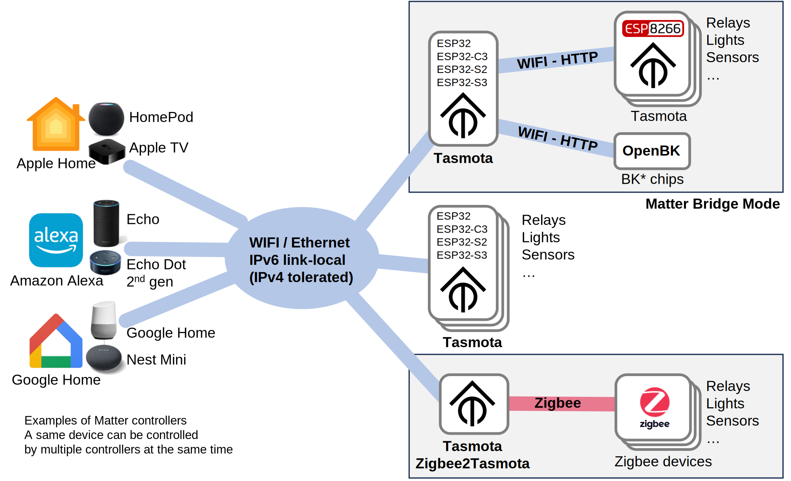
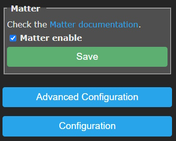
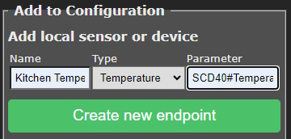

# Matter 

!!! tip "Matter protocol supported in all ESP32 variants (C3/S2/S3) since Tasmota v13.0.0. ESP8266 is not supported although ESP8266 devices can be handled via a single ESP32 in bridge mode (see below)"

??? tip "This feature is included in standard `tasmota32xx` builds; not in special variants (display, sensors...)" 

    When [compiling your build](Compile-your-build) add the following flag to the build environment or `user_config_override.h`:
    ```arduino
    #define USE_MATTER_DEVICE
    ```

## What is Matter?

The Matter protocol is an open-source, royalty-free standard designed to enable smart home devices from different manufacturers to work seamlessly and securely together. The Matter standard was launched end of 2022, and is supported since July 2023 by Tasmota v13.0 and above. Learn more [about Matter](https://csa-iot.org/all-solutions/matter/).

Tasmota supports Matter over IP (Wi-Fi or Ethernet) as an end-device. This means that you can connect a Tasmota device to a Matter gateway, using standard and well defined protocols. The Matter communication is completely local.

Matter cannot be directly supported on ESP8266 due to limited memory resources but you can use an ESP32 device as a Matter bridge to other Tasmota and [OpenBK](https://github.com/openshwprojects/OpenBK7231T_App) devices.



!!! info "Thread is not supported" 
    Thread requires a specific radio and is not supported by ESP32 devices, it would require an additional, separate MCU.
    Espressif has launched a certified Thread Border Router based on ESP32S3 + ESP32H2 which should allow to
    bridge Thread device to a Wifi/Ethernet local network. Stay tuned...

### Supported platforms

Tasmota Matter is confirmed to work with:

- [Apple Home](https://www.apple.com/home-app/) - [requirements](https://support.apple.com/en-us/HT207057)
- [Amazon Alexa](https://www.digitaltrends.com/home/how-to-connect-matter-devices-amazon-alexa/) - [requirements](https://developer.amazon.com/en-US/alexa/matter)
- [Espressif-Matter](https://apps.apple.com/in/app/espressif-matter/id1604739172) iOS/Mac app
- [Google Home](https://support.google.com/googlenest/answer/12391458?hl=en) - only works after following these [instructions](Matter-with-Google.md)
- [Home Assistant](https://next.home-assistant.io/integrations/matter#configuration)

[More information](https://github.com/mfucci/node-matter#pairing-and-usage-information) on pairing with above mentioned smart home systems.

## Getting Started

Matter is supported by default. The binaries are available for all ESP32 variants in our [web installer](https://tasmota.github.io/install/)

Go to ***Configuration --> Configure Matter*** and enable Matter with the checkmark then click ***Save***.



After a restart device commissioning will be open for 10 minutes.


Add the device to your Matter hub by scanning the QR code or with the "Manual pairing code" if code scanning is not possible.  

## Configuration

After Matter support is enabled the ***Configuration --> Configure Matter*** menu is used to configure options.


Here you can enable/disable Matter or open commissioning again if needed.

### Current Configuration

Configuration of your device for Matter discovery. Tasmota tries to configure supported features automatically.

You can change the name of the Matter endpoint, switch its Parameter number or remove the endpoint by clicking the &#128293; icon.


After changing these options click ***Change configuration***.

### Adding supported device types

#### Add local sensor or device

To add new features you need to add [Endpoints](https://blog.espressif.com/matter-clusters-attributes-commands-82b8ec1640a0).


##### Name

Name your endpoint to give it a label in your Matter hub (might not be supported by all hubs)

##### Type

Select your endpoint type from the drop down. Types are limited by the [Matter specification](https://developer.nordicsemi.com/nRF_Connect_SDK/doc/latest/nrf/protocols/matter/overview/data_model.html#device-type-overview) and some types might not be supported by the Matter hub.

##### Parameter

To link a Tasmota power output (light/relay) to an endpoint set its parameter equal to the POWER number.

!!! example "A relay on `POWER2` will have Parameter set to `2`"

To link a Tasmota sensor to an endpoint add the [rule trigger](Rules.md#rule-trigger) of the sensor to the _Parameter_ value.

!!! example "You can easily find out the parameter value by issuing `Status 8` in the console:"
    ```json
    MQT: tele/tasmota/SENSOR = {"Time":"2023-05-28T20:04:27","SCD40":{"CarbonDioxide":618,"eCO2":623,"Temperature":23.8,"Humidity":61.1,"DewPoint":15.8},"TempUnit":"C"}
    ```

    Parameter for a Temperature endpoint will be `SCD#Temperature` and the Parameter for a Humidity endpoint will be `SCD#Humidity` in this case.



After entering click ***Create new endpoint*** and it will appear in the ***Current configuration*** list


#### Add Remote Tasmota or OpenBK

With this option you can bridge any existing Tasmota or OpenBK device to Matter.


Enter the IP or hostname of the remote device and click ***Auto-configure remote Tasmota***

Since v13.3.0.2, web passwords are supported for remote Tasmota devices. Include the `admin:<password>@<IP_or_hostname>`.
For example if the password is `banana`, specify the address as `admin:banana@192.168.2.78`


This will bring you to another menu where you can further configure the remote device.


Add remote Endpoints same as for a local sensors and devices.

When finished click ***Add endpoints***. The remote device will appear in the ***Current configuration*** list.


When a command arrives from the Matter controller, it is passed immediately to the end-device. Any change made on the end-device is eventually sent back to Matter controller via polling. Polling is done every 3 seconds for lights and relays and every 5 seconds for sensors.

The Matter border router needs to have IP connectivity to the Tasmota end-device to send HTTP requests. However they don't need to be on the same VLAN (contrary to Matter which needs the controller and the device to be on the same VLAN).

!!! warning "There is a limit to the number of endpoints"
    Matter bridge cannot support a large number of endpoints since the numerous HTTP requests will impact performance. 
    It is recommended to limit the number of remote endpoints to 8 per Matter bridge.

#### Reset all and Auto-discover

This option will reset all configured endpoints and try to auto discover them again.

### Specific supported types

Find below specific information you need to know for certain device types

#### Lights

When possible, native lights are automatically mapped to Matter lights. Currently, lights with 1/2/3 channels are mapped to `Light 1 Dimmer`/`Light 2 CT`/`Light 3 RGB` endpoint types. They don't need any parameter, except for bridged device where you need to indicate the `Power<x>` number associated to the light (this is due to bridge mode not able to automatically detect it).

##### RGB and White Split

See [RGB and White Split](https://tasmota.github.io/docs/Lights/#rgb-and-white-split) enabled with `SetOption37 128`.

4 channels lights are split as 1 RGB and 1 Dimmer:


5 channels light are split as 1 RGB and 1 CT:


##### Independent PWM Channels

See [Independent PWM Channels](https://tasmota.github.io/docs/Lights/#independent-pwm-channels) enabled with `SetOption68 1`

All channels are defined as independant Light Dimmers:


Note: the first Dimmer has no parameter and is mapped to the default (first) channel. Other channels need an additional `light` parameter to map to the appropriate channel (numbering starts with `1` which is also the default).

### Bridging Zigbee devices

Since v14.2.0, it is now possible to control a selection of Zigbee devices via a Z2T (Zigbee2Tasmota) bridge device. Such bridge device should have Zigbee and Matter enabled; currently you need to self-compile the firmware.

!!! warning "This mode is not possible if you are using **Zigbee2MQTT** or **ZHA** with Tasmota in TCP tunnel (`TCPStart`). In such modes, Tasmota has no visibility on the data passed between Z2M/ZHA, and has no control over the Zigbee MCU.""

!!! tip "Matter control of zigbee lights is compatible with Alexa Hue, you can have the same light controlled by multiple controllers."

To configure a Zigbee devices mapped to a Matter endpoint, you simply need to choose the Zigbee Matter type and select the Zigbee device: either by shortaddr (ex: 0xABCD) or by friendlyname (preferred).


Matter type|Zigbee mapping
:---|:---
Zig Light 0 OnOff|Light On/Off controlled via `Power` command and attribute
Zig Light 1 Dimmer|Light with 1 channel, controlled via `Power` and `Bri` commands and attributes
Zig Light 2 CT|Light with 2 channels (white with color temperature), controlled via `Power`, `Bri` and `CT` commands and attributes
Zig Temperature|Temperature sensor, reported via `Temperature` attribute
Zig Pressure|Atmospheric Pressure sensor, reported via `Pressure` attribute
Zig Humidity|Atmospheric Humidity sensor, reported via `Humidity` attribute
Zig Occupancy|Occupancy sensor, reported via `Occupancy` attribute

Limitations: currently only the first endpoint light can be controlled. Plugs with multple relays are not yet supported (only the first one is accessible).


## Advanced Configuration

### Matter Passcode

You can change the passcode and ID of the device or force it to use IPv4 only.


### Fabrics

In short fabrics are Matter node identifiers. [Long story here...](https://matter-smarthome.de/en/know-how/what-is-a-matter-fabric/).


Deleting a Fabric will remove its commissioned status from the Matter hub.

## Known Limitations

Matter support is still in testing, there are some limitations:

- Matter requires IPv6 support, yet IPv4 is often tolerated. For debug purpose you can force Tasmota to manage Matter only on IPv4
- Tasmota devices with dual active networks (Ethernet + Wifi) are not yet supported. You need to disable Wifi or Ethernet. For example use [Ethernet Network Flipper](https://tasmota.github.io/docs/Berry-Cookbook/#ethernet-network-flipper)
- Tasmota cannot be Matter certified, it uses development vendor id's, which typically raise user warnings when commissioning the device
- Matter is also in an early phase with hub development and not all hubs support all Matter device types yet

What's not suported:

- **Thread** as it requires a separate MCU. The number of Thread devices is still very limited.
- **ESP8266** directly because of limited memory resources and lack of Berry support but you can add them to Matter via the Remote option
- **Zigbee** (it will come later)

## Matter Command Events
Whenever a command is received from the controller, an event is generated and published to MQTT. This event can be matched by a rule.

Example:

```
20:08:36.201 MQT: stat/tasmota_xxxxxx/COMMAND = {"MtrReceived":{"9":{"Ep":9,"Name":"Light0","Power":1}}}
```

Note: only commands trigger an event (Controller to Tasmota). When a sensors updates the controller (Tasmota to Controller), it is not considered as a command but as an update of internal state.

Endpoints are identified both by endpoint number `"Ep":<x>` and by name if a friendlyname is defined `"Name":"<friendlyname>"`. The formatting of MQTT topic and JSON payload use the same SetOption's as Zigbee.

SetOption|Description
:---|:---
SO83|Use friendly_name as key instead of `ep<x>`
SO100|Remove `MtrReceived` key prefix
SO119|Remove the endpoint or friendly name as key, the device name is still published in "Name" key
SO89|Publish on distinct topics per endpoint, by default `stat/tasmota_xxxxxx/<ep>/COMMAND`
SO112|If `SO89 1`, use the friendly name in topic instead of endpoint number
SO118|Move `MtrReceived` from JSON message and into the subtopic replacing "COMMAND" default
SO125|Hide bridge from topic (use with SetOption89)

Examples below consider an endpoint number `9` with friendlyname `Light0`:

83|100|119|118|144|JSON Payload
:---|:---|:---|:---|:---|:---
0|0|0|0|0|`{"MtrReceived":{"ep9":{"Name":"Light0","Power":1}}}`
1|0|0|0|0|`{"MtrReceived":{"Light0":{"Name":"Light0","Power":1}}}`
0|1|0|0|x|`{"ep9":{"Name":"Light0","Power":1}}`
1|1|0|0|x|`{"Light0":{"Name":"Light0","Power":1}}`
x|0|1|0|0|`{"MtrReceived":{"Name":"Light0","Power":1}}`
x|1|1|0|x|`{"Name":"Light0","Power":1}`
0|0|0|1|x|`{"ep9":{"Name":"Light0","Power":1}}`
0|0|0|0|1|`{"Time":"2023-09-20T09:21:26","MtrReceived":{"ep9":{"Name":"Light0","Power":1}}}`
1|0|0|0|1|`{"Time":"2023-09-20T09:21:26","MtrReceived":{"Light0":{"Name":"Light0","Power":1}}}`
1|0|1|0|1|`{"Time":"2023-09-20T09:21:26","MtrReceived":{"Name":"Light0","Power":1}}`


89|112|118|125|MQTT Topic
:---|:---|:---|:---|:---
0|x|0|x|`stat/tasmota_xxxxxx/COMMAND`
1|0|0|0|`stat/tasmota_xxxxxx/9/COMMAND`
1|1|0|0|`stat/tasmota_xxxxxx/Light0/COMMAND`
0|x|1|x|`stat/tasmota_xxxxxx/COMMAND`
1|0|1|0|`stat/tasmota_xxxxxx/9/MtrReceived`
1|1|1|0|`stat/tasmota_xxxxxx/Light0/MtrReceived`
1|0|0|1|`stat/9/COMMAND`
1|1|0|1|`stat/Light0/COMMAND`
1|0|1|1|`stat/9/MtrReceived`
1|1|1|1|`stat/Light0/MtrReceived`

To reset all options, use:

```
Backlog SO83 0; SO89 0; SO100 0; SO112 0; SO118 0; SO119 0; SO125 0; SO144 0
```

## Matter Virtual Devices

Since v13.1.0.3, it is possible to define "virtual devices" (lights, sensors...) visible from the controller but that do not map to an actual device or sensors managed by Tasmota. You can completely customize the behavior of the virtual device with rules or Berry scripts:

- whenever the controller sends a command, it generates a "Matter Command Event" JSON payload that you handle with rules
- you send back updates of the status of the device when you want via `MtrUpdate` command. Updates are automatically sent back to the controller via hidden Matter subscription.

### `MtrUpdate` command

`MtrUpdate` is used to signal to the Matter controller that the internal state of an endpoint has changed, either because of a user action or because of a new sensor reading. When you update an internal state variable, and if the value actually change, an attribute report message is sent immediately to the controller to signal the change. This ensures that Matter applications are promptly notified. In case of multiple controllers, multiple report messages are automatically sent.

There are 2 ways to identify an endpoint:

- `"Ep":<ep_number>` via the endpoint number
- `"Name":"<friendly_name>"` (preferred) via the friendly_name of the endpoint if one has been set.

Example:

```
MtrUpdate {"ep":9, "Power":0}
20:44:57.852 MQT: stat/tasmota_xxxxxx/RESULT = {"MtrUpdate":{"Ep":9,"Name":"Light0","Power":false}}

MtrUpdate {"Name":"Light0", "Power":1}
20:45:27.457 MQT: stat/tasmota_xxxxxx/RESULT = {"MtrUpdate":{"Ep":9,"Name":"Light0","Power":true}}
```

If the endpoint is valid, the returned payload contains the entire state of the endpoint, similar to `MtrInfo` command.

List of attributes supported by endpoints:

Attribute|Type of endpoint|Description
:---|:---|:---
Power|Relay, all Lights|`0`/`1` report Power change
Bri|Lights|`0..254` report Brightness change
CT|Light 2|`153..500` White Temperature in mireds
Hue|Ligth 3|`0..254` Hue converted from 0..360 to 0..254
Sat|Light 3|`0..254` Saturation
Contact|Contact|`0`/`1` state of the Contact sensor
Occupancy|Occupancy|`0`/`1` state of the Occupancy sensor
Humidity|Humidity|`0..10000` Humidity in 1/100th of percentage
Illuminance|Illuminance|`0..65534` Illuminance with formula `log10(val + 1) * 10000`
Pressure|Pressure|Pressure in `hPa`
Temperature|Temperature|`-32767..32767` Temperature in 1/100th of °C
Rain|Rain|`0`/`1` change rain sensor state°C
Waterleak|Waterleak|`0`/`1` change rain sensor state
FanMode|Fan|`0`: Off<br>`1`: Low (33%)<br>`2`: Med (66%)<br>`3`: High (100%)
FanSpeed|Fan|`0..100` Fan speed in percentage
FanSpeed255|Fan|`0..255` Fan speed in a range more suitable for Rules and PWM


Keep in mind that many values are in the range `0..254` because `255` is an invalid value (this comes from Zigbee).

### Full Example

The example below implements a simple bridge between Matter and IR (Infra Red). This allows to trigger On/Off commands from the Matter controller, that are translated to On/Off infra-red commands (we use the simple NEC protocol in the example, like used in Magic Home LED strips). You can also received On/Off infra-red commands that are reflected in the virtual light. In reality, you will probably use only Matter-to-IR or IR-to-Matter direction, but it doesn't harm to have both directions implemented.

We will use a Tasmota Relay via `Power1` and map it with rules to a virtual `Light0` type.

**Step 1.** Define one endpoint as `(v) Light 0 On` and give it the name `Light0`.


**Step 2.** Define rules for Matter Controller commands

We use `SetOption83 1` to match endpoint name instead of number, which is highly recommended for easier maintenance.

```
SetOption83 1
Rule1 on mtrreceived#Light0#power==1 do irsend {"protocol":"nec","bits":32,"data":"0xffb04f"} endon on mtrreceived#Light0#power==0 do irsend {"protocol":"nec","bits":32,"data":"0xfff807"} endon on irreceived#data=0xFFB04F do mtrupdate {"name":"Light0","power":1} endon on irreceived#data=0xFFF807 do mtrupdate {"name":"Light0","power":0} endon
Rule1 1
```

If we decompose the Rule, the first two rule matches convert a Matter initiated command to an IR message, the two last convert an IR message to a Matter state update:

```
Rule1
    on mtrreceived#Light0#power==1 do irsend {"protocol":"nec","bits":32,"data":"0xffb04f"} endon
    on mtrreceived#Light0#power==0 do irsend {"protocol":"nec","bits":32,"data":"0xfff807"} endon
    on irreceived#data=0xFFB04F do mtrupdate {"name":"Light0","power":1} endon
    on irreceived#data=0xFFF807 do mtrupdate {"name":"Light0","power":0} endon 
```

**Step 3.** Pair Tasmota to the Matter Controller.


## Commands

Command | Description
:---- | :---
MtrJoin |`1` = open commissioning for 10 minutes<BR>`0` = close commissioning
MtrUpdate|Send an state update to the controller, see Virtual Devices above
MtrInfo|`ep_number` or `friendly_name`<BR>Display the internal state of an endpoint by number or by name<BR>Example: `MtrInfo 9` or `MtrInfo Light0`<BR>`20:25:04.362 MQT: tele/tasmota_673244/RESULT = {"MtrInfo":{"Ep":9,"Name":"Light0","Power":true}}`<BR>Use `MtrInfo` (no argument) to display all endpoints

## Misc Events

Events published as JSON MQTT that can be captured in rules:

`{"Matter":{"Initialized":1}}`    
when the device is configured (all endpoints created). Can be used in rules with trigger `Matter#Initialized`

`{"Matter":{"Commissioning":1,"PairingCode":"00054912336","QRCode":"MT:Y.K90IRV01YZ.548G00"}}`     
  when commissioning is open

`{"Matter":{"Commissioning":0}}`     
  when commissioning is closed

## For developers

Developers might be interested in understanding the [Tasmota Matter Internals](Matter-Internals.md)
